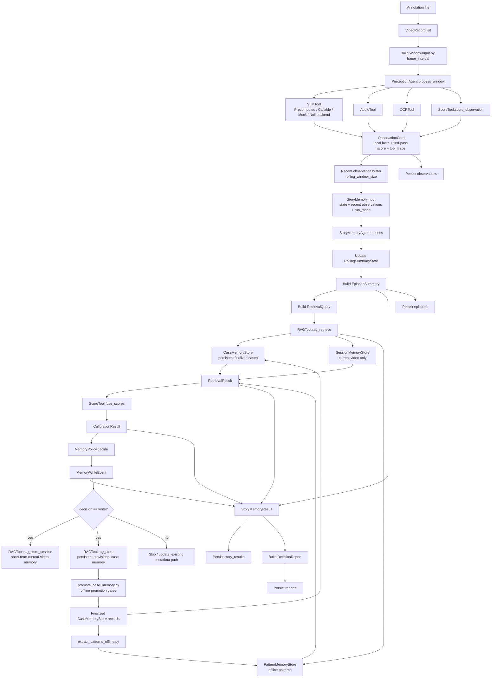

# Agentic VAD Workflow

## 1. Overview

This document summarizes the current end-to-end runtime flow of the Agentic VAD
prototype.

The current system is a local-first, lightweight multi-agent pipeline:

- `PerceptionAgent` handles local window-level observation and first-pass
  scoring.
- `StoryMemoryAgent` handles temporal context, retrieval, score calibration, and
  memory-write proposals.
- `MemoryPolicy` decides whether an episode should become a memory case.
- `RAGTool` merges finalized persistent case memory, optional current-video
  session memory, and offline pattern memory.
- The pipeline orchestrator handles dataset iteration, agent invocation, memory
  event execution, and artifact persistence.

The pipeline currently runs with precomputed captions or mock/callable VLM
backends. A real `VideoLLaMABackend` is planned but not yet implemented.

## 2. Runtime Diagram



## 3. Main Pipeline

Main file:

- `src/pipelines/run_agentic_vad.py`

The pipeline performs these steps:

1. Read the annotation file.
2. Convert annotation rows into `VideoRecord` objects.
3. Split each video into `WindowInput` objects using `frame_interval`.
4. Call `PerceptionAgent.process_window(...)` for each window.
5. Keep a recent observation buffer of size `rolling_window_size`.
6. Build `StoryMemoryInput`.
7. Call `StoryMemoryAgent.process(...)`.
8. Execute `MemoryWriteEvent` when the decision is `write`.
9. Persist per-video artifacts.

The pipeline should remain thin. It should not build `CaseMemoryRecord`
directly and should not implement anomaly reasoning or retrieval rules.

## 4. Perception Flow

Main file:

- `src/agents/perception_agent.py`

Input:

- `WindowInput`

Tools:

- `VLMTool`
- `AudioTool`
- `OCRTool`
- `ScoreTool`

Output:

- `ObservationCard`

`PerceptionAgent` captures tool traces for each tool call:

- `tool_name`
- `input_summary`
- `output_summary`
- `confidence`
- `latency_ms`
- `error`
- `artifact_refs`

If a tool fails, `PerceptionAgent` uses a low-information fallback output and
stores the exception string in `ToolCallRecord.error`. This keeps the pipeline
running while preserving the failure for debugging.

`ObservationCard` only contains local window-level evidence:

- caption
- entities
- actions
- scene context
- audio events
- OCR texts
- local scores
- uncertainty
- reason trace
- tool trace

It should not contain long-range story reasoning, RAG conclusions, or final
video-level decisions.

## 5. VLM Tool Flow

Main file:

- `src/tools/vlm_tool.py`

`VLMTool` exposes one stable interface:

```python
vlm_describe(window_input) -> dict
```

Current backends:

- `PrecomputedCaptionBackend`
- `CallableCaptionBackend`
- `MockVLMBackend`
- `NullVLMBackend`

The default pipeline path uses:

```python
VLMTool(captions_dir=config.captions_dir)
```

This reads:

```text
captions_dir/{video_id}.json
```

and maps caption text into:

- `vision_caption`
- `entities`
- `actions`
- `scene_context`
- `confidence`
- `backend_name`
- `artifact_refs`

The real `VideoLLaMABackend` is not implemented yet.

## 6. Story-Memory Flow

Main file:

- `src/agents/story_memory_agent.py`

Input:

- `StoryMemoryInput`

Output:

- `StoryMemoryResult`

`StoryMemoryAgent.process(...)` performs:

1. Update `RollingSummaryState`.
2. Build story text.
3. Build `RetrievalQuery`.
4. Retrieve related memory with `RAGTool`.
5. Compute story score.
6. Fuse local, story, and memory scores with `ScoreTool.fuse_scores`.
7. Compute disagreement and contradiction flags.
8. Ask `MemoryPolicy` for a `MemoryWriteEvent`.
9. Return `StoryMemoryResult`.

`StoryMemoryAgent.summarize_episode(...)` is retained for compatibility, but
new pipeline code should use `process(...)`.

## 7. Retrieval And Memory Flow

Main files:

- `src/tools/rag_tool.py`
- `src/memory/case_store.py`
- `src/memory/session_store.py`
- `src/memory/pattern_store.py`

`RAGTool` merges:

- persistent finalized case memory
- optional current-video session memory
- offline pattern memory

### CaseMemoryStore

Persistent storage:

- `case_memory.jsonl`
- optional Chroma index

Important behavior:

- Online memory writes are stored as `provisional=True`.
- Default retrieval uses only `provisional=False` finalized cases.
- `promote_case(case_id)` changes a case from provisional to finalized.

### SessionMemoryStore

Session memory is in-memory only. It is scoped by `video_id`.

Purpose:

- Let earlier provisional evidence in the same video help later windows.
- Avoid polluting cross-video long-term memory.

### PatternMemoryStore

Pattern memory is built offline from finalized case memory only.

## 8. Memory Write Flow

Main file:

- `src/memory/policy.py`

`MemoryPolicy.decide(...)` returns a `MemoryWriteEvent`.

Main decisions:

- `write`
- `skip`
- `update_existing`

Case types:

- `high_risk`
- `hard_negative`
- `ambiguous`
- `routine`

Important gates:

- `offline_eval` mode skips memory writes.
- high-risk cases require sufficient final score and low uncertainty.
- hard-negative cases capture local-high but final-low examples.
- duplicate cases are not inserted as new vectors.
- online writes are provisional.

If a write is accepted, pipeline executes:

```python
rag_tool.rag_store_session(case_record)
rag_tool.rag_store(case_record)
```

The first write helps the current video. The second persists the provisional
case for offline review.

## 9. Persisted Artifacts

For each video, the pipeline writes:

```text
output_dir/reports/{video_id}.json
output_dir/observations/{video_id}.json
output_dir/episodes/{video_id}.json
output_dir/story_results/{video_id}.json
```

Artifacts contain:

- `observations`: window-level local evidence and perception tool traces.
- `episodes`: story summaries and memory-adjusted episode scores.
- `story_results`: full story-memory agent result, including retrieval,
  calibration, memory event, contradiction flags, and story-level traces.
- `reports`: final video-level report and suspicious segments.

## 10. Offline Promotion Flow

Main files:

- `src/memory/promotion.py`
- `src/pipelines/promote_case_memory.py`

Offline promotion converts selected `provisional=True` cases into finalized
`provisional=False` cases.

Promotion supports:

- dry run
- case-id filtering
- high-risk gates
- hard-negative gates
- uncertainty gates
- evidence-tag gates
- JSON-style report output

Finalized cases become eligible for:

- long-term case retrieval
- pattern extraction

## 11. Pattern Extraction Flow

Main file:

- `src/pipelines/extract_patterns_offline.py`

This script reads finalized cases only:

```python
case_store.list_cases(provisional=False)
```

It groups cases by:

- label
- action sequence

Then it writes `PatternMemoryRecord` entries to:

```text
pattern_memory.jsonl
```

## 12. GPU Memory Safety Rules

Current code has low GPU memory risk because it does not load real GPU VLM/LLM
models yet.

Future real model backends must follow:

- Load heavy models once per backend instance.
- Do not load models inside every window-level call.
- Use `torch.inference_mode()` or `torch.no_grad()`.
- Convert tensors to CPU/Python values before returning.
- Never store GPU tensors in Pydantic schemas, memory stores, traces, or JSON
  artifacts.
- Keep `ToolCallRecord` lightweight.
- Provide `close()` or `unload()` for GPU-owning backends.
- Treat `torch.cuda.empty_cache()` as cleanup, not primary memory management.

## 13. Current Test Coverage

The test suite currently covers:

- schema defaults
- score tool
- VLM backends
- perception tool traces and error fallback
- story-memory agent contract
- memory policy
- session memory
- RAG result merging
- case memory retrieval
- promotion policy
- promotion pipeline utility
- pipeline report contract
- tiny mocked end-to-end pipeline run

Run:

```powershell
pytest -q
```

The test config uses a project-local pytest temp directory to avoid Windows
system temp permission issues.
