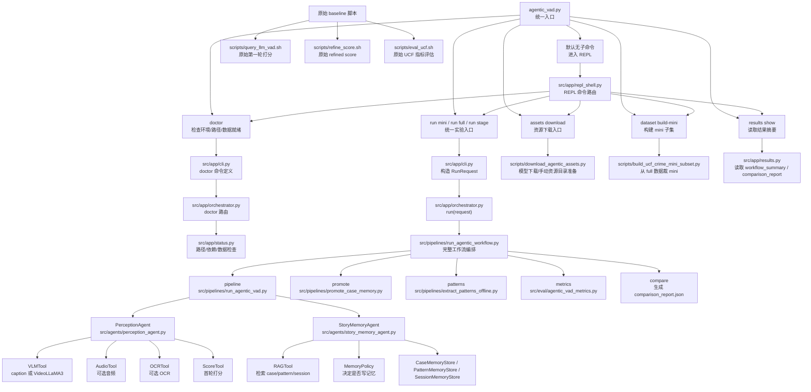

# Entrypoints And Script Map

下面这张图用于快速理解当前项目的统一入口、实验工作流、资源准备脚本和 baseline 评估脚本之间的关系。

## Quick Start

- `python agentic_vad.py`
  - 进入 REPL，适合交互式检查、资源准备和实验触发
- `python agentic_vad.py doctor ...`
  - 检查当前数据路径、依赖和输出目录是否就绪
- `python agentic_vad.py run mini ...`
  - 跑一轮 mini 实验
- `python agentic_vad.py run stage pipeline ...`
  - 只跑 pipeline，适合 smoke test
- `python agentic_vad.py results show`
  - 查看最近一次工作流和 compare 结果

