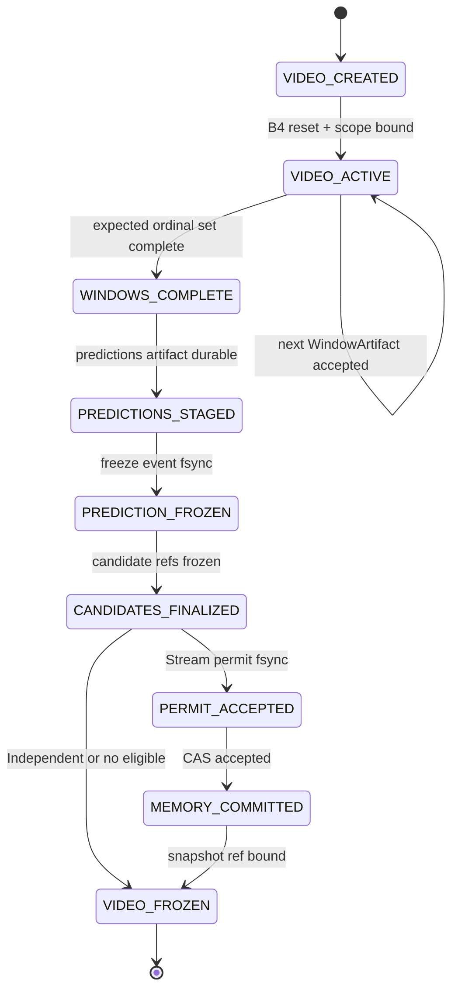
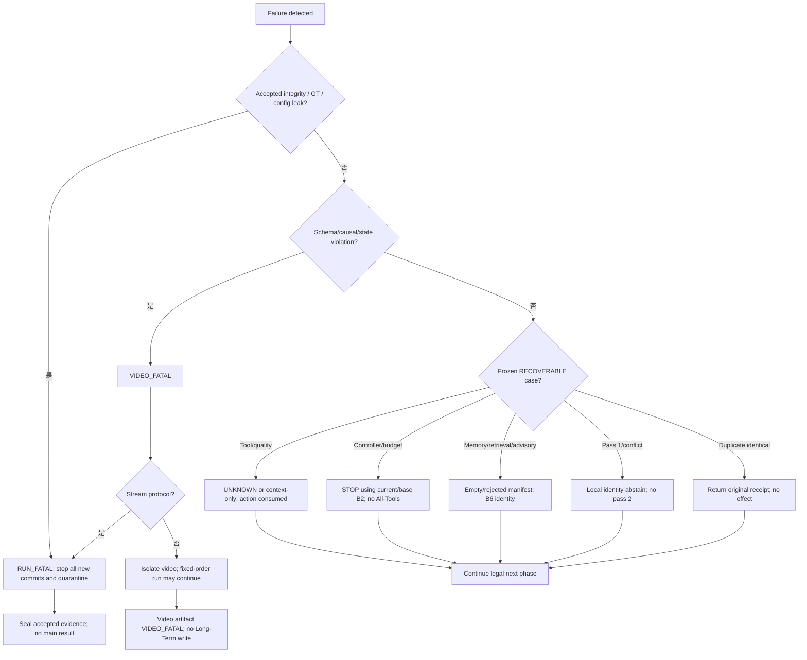
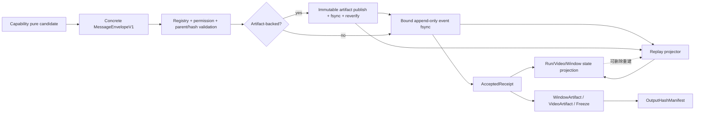

# Runtime Agents、状态所有权与确定性编排代码实现设计

> 文档编号：Implementation Design 02
> 状态：有条件通过；2026-07-18 已完成首轮架构评审修订，待高级架构师复核；不授权代码开发
> 前置设计：`docs/implementation_design/00_engineering_architecture_overview.md` 与 `01_schema_protocol_and_adapter_design.md`；历史批准保留，当前复审状态以各文档页首为准
> 规范基线：`docs/engineering_handoff/01_frozen_engineering_contracts.md` > `02_reference_algorithms.md` > `03_contract_test_matrix.md` > `04_theory_to_code_gap_analysis.md`
> 审计基线：`0afc8fd09a940f49f1c96ef51ddfcf13f3ddba9a`
> 测试 catalog：323 个具体 CT ID
> 本文范围：WP3-WP8；只描述 WP9 的视频边界调度，不替代 Document 03 的 Memory 事务设计

## 1. 执行结论

Schema v1 Runtime 固定实现为一个规范推理 OS 进程中的同步确定性状态机，进程拓扑即“单一规范推理进程 + 独立 Evaluator OS 进程”。Orchestrator、Controller、Evidence、Memory、Memory Assist 和 Decision 是显式构造注入的 capability object，不是自由互发消息的 actor，也不使用通用异步 Event Bus。Evaluator 仍只能由 outer launcher 在完整冻结校验后启动。

进程内直接函数调用只承载纯计算或构造候选对象；任何对下游可见的事实必须经过 concrete `MessageEnvelopeV1[T]`、closed registry、parent/hash/permission 验证、capability-bound writer 和 fsync acceptance。由此同时满足：

1. 单进程开发与调试效率；
2. B8 capability 的静态和运行时隔离；
3. 每个 logical slot 的幂等与 conflicting replay 检测；
4. 每窗口唯一 B6 committed tuple 和唯一 B4 state effect；
5. 由事件链恢复，而不是依赖 Python object、线程完成顺序或 UI progress；
6. 未来跨进程部署时保留相同 Schema、Port 和 acceptance 语义。

规范主线不调用 Legacy `ScoreTool`、`StoryMemoryAgent`、`MemoryPolicy`、`RetrievalResult` 或现有 pipeline fallback。Memory 不可用走 B6 identity；Controller 失败使用已有基础 B2；工具失败产生 UNKNOWN/FailureAudit；所有合法 fallback 都显式进入事件和 `WindowArtifactV1`。

## 2. 已批准输入、适用勘误与职责边界

### 2.1 前置设计冻结项

本文直接继承以下已批准结论，不重新比较：

- 同仓库 `src/tfavad/` 旁路 V1 与 Legacy 显式隔离；
- 单一规范推理进程 + 独立 Evaluator 进程；
- Python Protocol + 显式构造注入 + 最小配置切片；
- concrete typed envelope/event union，禁止 `Any` 和宽 EventStore；
- 文件原生事实源、串行规范提交、受控纯计算并行；
- 59 个公共 Schema v1 对象、canonical bytes、ID/hash/self-field 和 ArtifactRef 规则；
- accepted identity/content/parent/raw-artifact integrity conflict 在所有协议中为 `RUN_FATAL`；
- 323 个具体 Contract Test ID。

### 2.2 本文对旧严重度文字的唯一解释

`03_contract_test_matrix.md` 中 `CT-B8-M05/M06`、`CT-B4-M19` 等旧行仍写 VIDEO 或 Stream-upgrade。按已批准 Document 00/01：

- 对尚未 accepted 的普通 per-video schema、causal、state-version 错误，保留 `VIDEO_FATAL`，Stream 升级；
- 对同 logical key 的已接受不同 payload、已接受 parent/input/hash 冲突、第二个不同 B4 decision、已接受 raw artifact bytes 冲突，一律 `RUN_FATAL`；
- `DUPLICATE_IDENTICAL_MESSAGE`、Memory unavailable、advisory mismatch、合法 budget stop、pass 1 unavailable 保留冻结的 RECOVERABLE/identity/abstain 行为。

本文测试映射同时标注该覆盖规则，测试实现不得重新采用较弱严重度。

### 2.3 与 Document 03 的分界

本文冻结“何时允许”读取 Session/Long-Term、冻结 manifest、签发 permit 和调用 CAS；Document 03 冻结 case/snapshot/index 文件、Memory event 提交、锁/CAS、stale retry 和 crash repair。本文中的 `MemoryReadRuntimePort` 与 `LongTermWritePort` 是窄边界，不能被解释成数据库或 Store 句柄。

### 2.4 2026-07-18 运行接缝勘误

本表优先于本文历史批准文字和被列出的旧局部描述；它不增加公共 Schema 对象、producer enum 或 CT identity：

| 接缝 | 被替代的含糊实现 | 本文唯一实现规则 |
|---|---|---|
| Evidence facts | preflight/base packet/B2 candidate 可由直接 return 进入下游 | 每个下游 fact 都必须有 accepted receipt；RAW/CAPTION 经过 mandatory base Tool group；每 pass 显式接受 B2 base/step/final |
| B2 inputs | Evidence 用 packet ID 查内部 cache | `B2BuildCommand` 直接携带 accepted immutable packet values/receipts、interval、config hash、expected parents；禁止内部 cache |
| Memory read | `retrieve()` 直接返回 persisted manifest；bare manifest 解锁 payload | private draft → immutable publish → frozen event fsync → receipt；resolver 只接受 receipt-bound manifest并可返回显式 status |
| Episode lifecycle | bare B2/B4 object 推进 Episode | 只接受绑定 WindowArtifact、final B2、committed B4 receipts/refs/hashes/ordinal/parents 的 command |
| Commit order | `message_id` 或粗粒度 phase 代替因果顺序 | CommitKey 含 major phase、pass、pass stage、step、subphase；artifact-backed acceptance 永远 artifact-first/event-second |
| SCORE entries | 绕过 B1/B2/B3 后仍隐式进入 B5/B6/B4 | 当前规范 runtime 只实现 RAW/CAPTION/FROZEN_B2；SCORE/FROZEN_SCORE 仅 compatibility，V1 preflight fail closed |
| Writer role | internal MemoryAssist 成为新 producer；O 直接写 permit event | 公共 producer 仍只有五个；B6/B4 使用两个互斥 DECISION acceptor；Memory-scoped permit acceptor 独占 permit event write |
| Projection/tests | RunManifest revision path、`tests/v1/runtime`、157 全 direct | 单一 `run_manifest.json` projection；规范 tests 只在 `tests/v1/catalog`；152 direct + 5 joint |

### 2.5 SCORE/FROZEN_SCORE 最高优先级运行范围勘误

这是实施闭合，不重新定义理论数学：工程 handoff 与 Document 01 中把 `SCORE/FROZEN_SCORE` 列为可绕过 B1/B2/B3 的 Entry 行，只保留 enum/compatibility 身份，不再授权当前 normative V1 RunMachine。原因是当前没有 exact Score Entry Schema、score→B6 tuple 数学和 B4 physical-clock 输入；工程实现不得用 Legacy 0–10 或默认字段补齐。

因此当前唯一规则是：compatibility/Legacy adapter 可以满足 `CT-B3-023` 的“无 Tool action”隔离断言，但其输出不得成为 V1 parent、主结果或 replay claim；normative V1 composition 对这两个 entry 在实例化 RunMachine、event namespace 或任何 V1 artifact 前 fail closed。Document 01 Entry matrix、handoff `CT-B3-023` expectation 与 Document 04 executable catalog 必须在 G2 关闭前传播这一双边界且不改变 CT identity；传播前本节优先，G2 不得宣称通过。

同理，Document 03 对 Memory 内部持久化仍是权威，但任何旧签名若把未接受 `RetrievalManifest`/Episode candidate 暴露给 Orchestrator，必须先按本文 6.2/8.2 的 accepted wrapper/receipt 边界同步，才能 merge Composition Root。不得以“后续文档”覆盖本轮已修正的 runtime capability boundary。

## 3. 当前代码冲突与逐项迁移

| 当前证据 | 契约冲突 | V1 设计 | 迁移方式 | 验收 | Legacy |
|---|---|---|---|---|---|
| `src/core/config.py:22-53` 同时含 annotation、score threshold、prior、device、output、Memory | B0 配置物理隔离；B1/B2 禁止旧先验 | Composition Root 只收已验证 `InferenceConfigV1`，立即拆最小 slice | 旧对象不适配；CLI 无标签参数重新解析 | `CT-B0-006/007/015`、`CT-B8-P12` | 保留 |
| `src/data/video_record.py:5-41` 同对象含 inclusive frame 和 label | B0 无标签输入；规范半开微秒 | launcher 从无标签 input manifest 建 `WindowInputV1` | label record 仅 Evaluator；时间按 Document 01 Adapter | `CT-B0-003/007`、`CT-COM-005..009` | 保留 |
| `src/pipelines/run_agentic_vad.py:70-92` 枚举 inclusive frame 和任意 path | WindowInput/ArtifactRef/causal order | `WindowSourcePort` 只返回 manifest-bound `WindowInputV1` | 条件 LOSSLESS source adapter；不传旧 WindowInput | `CT-COM-005..009`、`CT-B8-M01` | 保留 |
| `src/agents/perception_agent.py:30-124` 固定调用 VLM/Audio/OCR/Score | B3 gap-driven、每 action 每 pass 至多一次 | base observation + B3 serial adaptive loop | backend 概念经两层 tool Adapter；Agent 整体隔离 | `CT-B3-001..023` | 保留 O0/O1 |
| `src/agents/perception_agent.py:37-90,147-155` failure 变默认 dict/数值 | B1 failure 不产生正负证据 | explicit execution/packet status、gate 0、FailureAudit | 删除 V1 数值 fallback；raw error redaction | `CT-B1-007/008/011`、`CT-CON-003` | 保留 |
| `src/core/schemas.py:62-77` ObservationCard 混合 fact、score、reason、trace | B1/B2 双层证据与 immutable packet | `EvidenceAtomV1` + 单一 `PacketAssessmentV1` + `B2OutputV1` | 整体 UNADAPTABLE；个别 raw fact 条件适配 | `CT-B2-001..007` | 保留 |
| `src/tools/score_tool.py:9-137` keyword 0-10、modality prior、retrieval blending | B2/E4、B6/F0-F4、B4/T0-T5 冻结 | Evidence/B6/B4 各自唯一数值模块 | V1 禁止导入；不做 0-10 映射 | `CT-B2-*`、`CT-B6-*`、`CT-B4-*` | 保留 |
| `src/agents/story_memory_agent.py:41-210` 同时持有 rolling risk、retrieval、fusion、write | B4/B5/B6/B8 所有权分离 | Memory、Memory Assist、Decision、Episode 四 capability | 整类 QUARANTINE_LEGACY，不改名复用 | `CT-B8-P05..P10` | 保留 |
| `src/agents/story_memory_agent.py:137-160` rolling story 构造 query | B5 CURRENT_WINDOW_ONLY observation key | Memory 从当前 final B2 构造 `RetrievalQueryV1` | rolling story 仅 Legacy report | `CT-B5-Q01/002/004` | 保留 |
| `src/memory/case_store.py:224-250` 同时返回 risk payload、rank score、confidence | top-k 前 payload firewall；B6 不读 similarity | 先 durable `RetrievalManifestV1`，后解锁 `AdvisoryBundleV1` | 旧 RetrievalResult 不进入 Port | `CT-B5-Q13..Q15`、`CT-B8-P08` | 保留 |
| `src/memory/policy.py:19-187` threshold、Hard Negative、final score 写策略 | 无标签 admission；predict-before-write | State-Delimited Candidate + frozen gates + permit | 整体 UNADAPTABLE | `CT-B5-A*`、`CT-B8-W*` | 保留 |
| `src/memory/case_store.py:78-101` 重写 JSONL/原地 promotion | append-only/event/snapshot/CAS | 本文禁止调用；Document 03 定义替代 | Legacy namespace 原样保留 | `CT-PER-*`、`CT-CON-*` | 保留 |
| `src/memory/case_store.py:122-155` Chroma 直接 upsert/delete | index 不是事实源 | V1 只通过 immutable snapshot-bound index bundle | Chroma 不进主参考路径 | `CT-PER-009/010` | 保留 |
| `src/memory/session_store.py:19-94` add 后即可被同视频检索 | 仅 closed Episode、later window 可见 | Session visibility 绑定 close event/cursor/visible ordinal | 旧 store 不适配 | `CT-B5-E05..E07` | 保留 |
| `src/pipelines/run_agentic_vad.py:321-327` 每窗口同时写 Session/Long-Term | freeze 前禁止 Long-Term | 窗口后只允许 closed Session publish；Long-Term 在视频 freeze 后 | 删除 V1 即时写调用 | `CT-B8-W01..W14` | 保留 |
| 当前无 B3/B4/B6 模块 | 冻结 G0-G3、F0-F4、T0-T5 | 新建独立 capability 与唯一 owner | 旁路新增 | `CT-B3-*`、`CT-B6-*`、`CT-B4-*` | 不适用 |
| 当前无 envelope/pass/event ledger | B8 immutable message/parent/exactly-once | closed message factory + acceptance ledger + bound writers | WP3 先行 | `CT-B8-M01..M09`、`CT-CON-*` | 不适用 |
| 当前无 PredictionFreeze/Permit/CAS | predict-before-write | Decision freeze、O permit、Memory CAS 窄 Port | WP9；本文件只冻结调用顺序 | `CT-B8-W01..W14` | 不适用 |
| `src/eval.py:65,94-181` Gaussian、标签、目标阈值 | B4 后无 Gaussian；Evaluator 独立 | inference 输出直接 B4 z/state；launcher 后启 Evaluator | 原模块仅 Legacy evaluator | `CT-B4-M16`、`CT-B0-008/009` | 保留 |
| `src/pipelines/run_agentic_workflow.py:23-76,129-303` 混合 inference、promotion、Pattern、metrics | B0、B7、B8 process/capability 隔离 | V1 inference 终止于 OutputHash freeze；外层 launcher 启 evaluator | 只复用 CLI/显示概念 | `CT-B8-P11/012`、`CT-ART-010` | 保留 |
| Pattern Memory 在 `src/agents/story_memory_agent.py:206-209` 影响分支 | B7/Pattern 不在 B5/B6 主线 | V1 registry 无 Pattern capability | Legacy/O1 only | `CT-B9-C07`、static import test | 保留 |

## 4. Runtime package 与文件落点

```text
src/tfavad/
  ports/
    runtime_acceptance.py          # MessageAcceptancePort、AcceptedReceipt
    runtime_capabilities.py        # 六 capability 的窄 Protocol
    tool_runtime.py                # Backend/Evidence Adapter Port
    bound_event_writers.py         # event type/subset-bound append Port
    memory_runtime.py              # read scope、manifest、episode、CAS 窄 Port
  runtime/
    commands.py                    # frozen、JSON-safe、非公共 wire command
    receipts.py                    # accepted/duplicate/failure receipt
    composition/
      inference_root.py            # 唯一完整 config reader
      capability_bindings.py       # config slice + minimum Port construction
      registries.py                # exact source/tool/action/capability bindings
    state_machine/
      run_machine.py
      video_machine.py
      window_machine.py
      transition_table.py
      protocol_scheduler.py
      commit_sequencer.py
    ledger/
      message_acceptor.py
      logical_slots.py
      parent_validator.py
      write_ahead.py
      replay_projector.py
      recovery.py
  capabilities/
    orchestrator/
      runtime.py
      window_runner.py
      video_runner.py
      prediction_freeze.py
    controller/
      service.py
      gap_projection.py
      requirement_activation.py
      selector.py
      budget.py
    evidence/
      service.py
      preflight.py
      b1_adapter.py
      b2/
        atom_validation.py
        channel_envelope.py
        family_fusion.py
        fact_conflict.py
        service.py
    memory/
      query_runtime.py             # Document 03 实现 store/index 细节
      episode_runtime.py
    memory_assist/
      service.py
      identity.py
      signed_mass.py
      bounded_fusion.py
      reobserve.py
    decision/
      service.py
      clock.py
      momentum.py
      band.py
      hysteresis.py
      b4_commit.py
  adapters/tools/
    registry.py
    backend_adapter.py
    evidence_adapter.py
  persistence/events/
    append_primitive.py
    bound_writers.py
```

`capabilities` 之间不互相 import concrete service。它们只依赖 `contracts/v1`、`canonical`、自身最小 config slice 和 `ports`。Orchestrator 可以持有各 capability Protocol，但不能导入其数值 helper。`runtime/state_machine` 只判断 accepted receipt、ID/hash、ordinal、enum 和 failure severity，不反序列化 B2/B6/B4 数值。

## 5. Composition Root 与 B8 capability 构造

### 5.1 构造顺序

```text
validated InferenceConfigV1 + ExperimentFreezeManifestV1
-> split capability-specific config slices
-> construct authorized roots/resolvers
-> construct one append primitive per authoritative event file
-> bind event-type and producer subsets into narrow writers
-> construct Backend/Evidence Adapters from closed registry
-> construct Evidence, Controller, Memory, internal MemoryAssist-B6, internal DecisionB4
-> bind disjoint B6-only and B4/freeze-only acceptors under public DECISION producer
-> construct Memory-scoped permit acceptor and LongTermWritePort
-> construct Orchestrator with only capability Protocols, narrow permit issue Port and receipts
-> replay accepted events into non-authoritative projections
-> start/resume deterministic RunMachine
```

没有 capability 收到完整 `InferenceConfigV1`、环境变量 reader、任意 root path、generic artifact resolver 或 generic event writer。每个 writer 在构造时绑定：run/Memory namespace、event file identity、allowed producer、allowed event type tuple、payload union、parent policy。

### 5.2 最小权限注入表

| Capability | 配置 slice | 注入 Port | 明确不注入 |
|---|---|---|---|
| Orchestrator | protocol/order/window/determinism IDs | WindowSource、acceptance receipts、六 capability Protocol、permit-issue Port、run/video artifact finalizer | 任意 event writer、label resolver、numeric helper、Memory store、backend |
| Controller | tool registry hash、fixed costs、window/video/run budgets | direction-free gap view、ToolPlan factory | full B2、Advisory、B4 state、actual latency feedback |
| Evidence | source/channel/parser/quality registry、B2 algorithm IDs | tool raw resolver、accepted packet values、preflight/B2-specific acceptor | packet cache、Memory read/write、B4 commit、label/metrics |
| Memory | readable-scope/retrieval/Episode slice | snapshot/session read、bound manifest/lifecycle writers | Controller、B4 writer、Evaluator、current candidate write before freeze |
| Memory Assist（内部） | B6 algorithm ID、k bound | accepted final B2、manifest-bound Advisory、DECISION/B6-only acceptor | 新 producer enum、retrieval backend、case reorder、B4 state/writer |
| Decision B4（内部） | B4 algorithm/time/CMP slice | accepted final B2/B6、video-state CAS、DECISION/B4+freeze-only acceptor | B6 acceptor、tool backend、Memory writer、Controller、Evaluator |
| Evaluator | 独立 `EvaluatorConfigV1` | evaluator-only resolver/writer | 上述全部 inference object graph |

### 5.3 Capability token

Python object capability 本身就是权限 token：只有 Composition Root 能构造 bound Port，constructor 不公开 root/path/store。运行时再校验 envelope `producer`、payload schema、event type、parent phase 和 allowed consumer。字符串 role、module 名或 type annotation 不能单独授权。

公共 `MessageEnvelopeV1.producer` 仍精确为 `ORCHESTRATOR | CONTROLLER | EVIDENCE | MEMORY | DECISION`。`MemoryAssist` 和 `DecisionB4` 只是进程内拆分：前者产生的 EvidenceRequest/B6 envelope 使用 `DECISION`，只能调用绑定 B6 payload/event tuple 的 acceptor；后者也使用 `DECISION`，但只能调用绑定 B4/PredictionFreeze tuple 的另一个 acceptor。Composition Root 不构造共享的宽 Decision writer，也不注册 `MEMORY_ASSIST` producer。

WritePermit 的逻辑签发者是 `ORCHESTRATOR`，但 Orchestrator 只能把 immutable permit command 交给 Memory-scoped permit acceptor。该 acceptor 独占 `WRITE_PERMIT_ISSUED` 的 Memory event append capability，验证并 fsync 后只返回 `AcceptedReceipt`；Orchestrator 再以该 receipt 调用 `LongTermWritePort`。Orchestrator 从不持有 Memory event writer/append target。

## 6. Runtime-private immutable commands 与 Port 签名

### 6.1 命令规则

`runtime/commands.py` 的 command 使用 frozen/slots dataclass，字段只允许 Schema v1、runtime-private immutable receipt/status、稳定 ID/hash、int64、enum 和 immutable tuple。它们是进程内最小权限视图，不是新增 Schema v1 wire object，不持久化、不独立生成 ID。若未来跨进程，必须先将对应 command 提升为新 exact transport Schema 并重新评审，不能直接 pickle。

关键命令精确为：

```text
AcceptedValue[T] = {
  value: T,
  receipt: AcceptedReceipt
}

AcceptedStatus = {
  status: MemoryReadStatus,
  receipt: AcceptedReceipt
}

BaseToolPlanCommand = {
  window: WindowInputV1,
  window_receipt: AcceptedReceipt,
  preflight: AcceptedValue[PreflightObservationV1],
  base_action_id: string,
  pass_id: 0,
  budget: BudgetViewV1,
  tool_registry_hash: sha256
}

ControllerStepCommand = {
  preflight_receipt: AcceptedReceipt,
  covered_fields: tuple[string,...],
  conflict_fields: tuple[string,...],
  conflict_atom_ids: tuple[string,...],
  evidence_request: AcceptedValue[EvidenceRequestV1] | null,
  budget: BudgetViewV1,
  used_action_ids: tuple[string,...],
  pass_id: 0 | 1,
  step_ordinal: int64,
  parent_b2_receipt: AcceptedReceipt
}

B2BuildCommand = {
  window: WindowInputV1,
  window_receipt: AcceptedReceipt,
  target_interval: TimeIntervalV1,
  pass_id: 0 | 1,
  slot: BASE | STEP | FINAL,
  step_ordinal: int64 | null,
  accepted_packets: tuple[AcceptedValue[EvidencePacketV1],...],
  inherited_packet_ids: tuple[string,...],
  supersession: tuple[(action_key,pass0_packet_id,pass1_packet_id,status),...],
  b2_config_hash: sha256,
  expected_parent_message_ids: tuple[string,...]
}

B6EvaluateCommand = {
  b2_output: AcceptedValue[B2OutputV1],
  manifest: AcceptedValue[RetrievalManifestV1],
  advisory: AcceptedValue[AdvisoryBundleV1] | AcceptedStatus,
  budget: BudgetViewV1,
  pass_count: 0 | 1
}

B4CommitCommand = {
  window: WindowInputV1,
  window_receipt: AcceptedReceipt,
  final_b2: AcceptedValue[B2OutputV1],
  final_b6: AcceptedValue[B6DecisionEvidenceV1],
  previous_b4_ref: ArtifactRefV1 | null,
  expected_state_version: int64
}

AcceptCommittedWindowCommand = {
  window_artifact: AcceptedValue[WindowArtifactV1],
  final_b2_ref: ArtifactRefV1,
  final_b2_payload_hash: sha256,
  final_b2_receipt: AcceptedReceipt,
  committed_b4_ref: ArtifactRefV1,
  committed_b4_payload_hash: sha256,
  committed_b4_receipt: AcceptedReceipt,
  window_ordinal: int64,
  expected_parent_message_ids: tuple[string,...],
  expected_parent_artifact_hashes: tuple[sha256,...]
}

IssueWritePermitCommand = {
  permit: WritePermitV1,
  prediction_freeze_receipt: AcceptedReceipt,
  candidate_set_hash: sha256,
  expected_memory_version: int64,
  expected_parent_message_ids: tuple[string,...]
}

FreezeVideoCommand = {
  video_id: string,
  expected_window_ids: tuple[string,...],
  ordered_b4_refs: tuple[ArtifactRefV1,...],
  ordered_window_refs: tuple[ArtifactRefV1,...],
  prediction_artifact_ref: ArtifactRefV1
}
```

`AcceptedValue/AcceptedStatus` 也是 runtime-private、deeply immutable、可显式序列化的结构，不进入公共 registry。每次消费都重算 value/status hash 并与 receipt 匹配；receipt 不是权限的字符串替代，仍只能交给构造时绑定的 Port。

`ControllerStepCommand` 不含 `q/d/e/u`、Memory direction、case `R/C/d`、rank、B4 `z/state` 或 label；这是 `CT-B8-P01/P02` 的结构证明。`supersession` status 只允许 `REPLACED | RETAIN_PASS0_AFTER_FAILURE | INHERITED`。`B2BuildCommand.step_ordinal` 仅在 `slot=STEP` 时非 null；accepted packet value/receipt、interval、config hash 与 expected parents 任一不一致即拒绝。Evidence 不读取 packet ID cache、Store 或任意 resolver。

### 6.2 核心 Protocol

```python
class MessageAcceptancePort(Protocol):
    def accept(self, envelope: MessageEnvelopeV1[ConcretePayload]) -> AcceptedReceipt: ...

class ControllerCapabilityPort(Protocol):
    def plan_base(self, command: BaseToolPlanCommand) -> ToolPlanV1: ...
    def plan(self, command: ControllerStepCommand) -> ToolPlanV1: ...

class EvidenceCapabilityPort(Protocol):
    def preflight(self, window: WindowInputV1) -> PreflightObservationV1: ...
    def execute_action(self, plan: ToolPlanV1, window: WindowInputV1) -> EvidencePacketV1: ...
    def build_b2(self, command: B2BuildCommand) -> B2OutputV1: ...

class MemoryReadRuntimePort(Protocol):
    def retrieve(
        self, query: RetrievalQueryV1, scope: ReadableScopeReceipt
    ) -> RetrievalManifestCandidate: ...
    def freeze_manifest(
        self, candidate: RetrievalManifestCandidate
    ) -> AcceptedValue[RetrievalManifestV1]: ...
    def resolve_advisory(
        self, command: ResolveFrozenManifestCommand
    ) -> AdvisoryBundleV1 | MemoryReadStatus: ...
    def accept_resolution(
        self,
        result: AdvisoryBundleV1 | MemoryReadStatus,
        manifest: AcceptedValue[RetrievalManifestV1],
    ) -> AcceptedValue[AdvisoryBundleV1] | AcceptedStatus: ...

class MemoryAssistCapabilityPort(Protocol):
    def evaluate(
        self, command: B6EvaluateCommand
    ) -> EvidenceRequestV1 | B6DecisionEvidenceV1: ...

class DecisionCapabilityPort(Protocol):
    def commit_b4(self, command: B4CommitCommand) -> B4DecisionV1: ...
    def freeze_video(self, command: FreezeVideoCommand) -> PredictionFreezeRecordV1: ...

class EpisodeLifecyclePort(Protocol):
    def accept_window(
        self, command: AcceptCommittedWindowCommand
    ) -> tuple[AcceptedReceipt, ...]: ...
    def close_video(
        self, command: CloseVideoEpisodesCommand
    ) -> tuple[AcceptedValue[CandidateCaseV1], ...]: ...

class PermitAcceptancePort(Protocol):
    def issue(self, command: IssueWritePermitCommand) -> AcceptedReceipt: ...
```

`AcceptedReceipt` 只含 `message_id,event_id,event_sequence,payload_hash,artifact_ref|null,duplicate_identical`。它不返回 connection、Store、Path、file handle 或 mutable payload。`MessageAcceptancePort` 的实际实例仍按 concrete payload/producer/phase 绑定，示例中的 generic 只表达 Protocol family，Composition Root 不构造 unparameterized acceptor。

`RetrievalManifestCandidate`、`MemoryReadStatus`、`ReadableScopeReceipt`、`ResolveFrozenManifestCommand` 与 `CloseVideoEpisodesCommand` 的精确持久化语义以 Document 03 为权威。`EpisodeLifecycleCandidate` 只存在于 Memory capability 内部；Memory 必须先完成 lifecycle artifact-first/event-second acceptance，Port 才返回 receipts/accepted Candidate values，不把未接受 candidate 交给 Orchestrator。本文只冻结调用时机和 accepted parent；不得在 runtime 包复制第二套 Memory 类型。

### 6.3 Tool Port

```python
class ToolBackendAdapterPort(Protocol):
    def invoke(self, plan: ToolPlanV1, window: WindowInputV1) -> ToolExecutionRecordV1: ...
    def recover(self, invocation_id: str) -> ToolExecutionRecordV1 | None: ...

class ToolEvidenceAdapterPort(Protocol):
    def adapt(
        self,
        plan: ToolPlanV1,
        execution: ToolExecutionRecordV1,
        window: WindowInputV1,
    ) -> EvidencePacketV1: ...
```

Backend Adapter 只发布 raw-output artifact、status、成本 provenance；Evidence Adapter 才能解析事实、质量和唯一 PacketAssessment。`recover(null)` 不授权重调，只使调用方产生 `TOOL_RESULT_INDETERMINATE`。

## 7. 数值状态与效果的唯一所有权

| 状态/效果 | 唯一写者 | 唯一输入来源 | 其他模块可见内容 | 禁止行为 | 权威记录 |
|---|---|---|---|---|---|
| run/video/window ordinal、phase | Orchestrator | input/order manifest + accepted receipts | stable IDs、phase enum | 读取/修改风险数值 | run/decision events + artifacts |
| requirement/gap/used actions | Controller | Preflight + direction-free B2 projection + request | ToolPlan/GapSnapshot | 读 d/e/z/advice/label | tool events |
| window/video/run budget | Controller；O 只验证并提交 debit | freeze cost table + accepted debit events | BudgetView | actual latency 改 fixed cost；重复 debit | `BUDGET_DEBIT` |
| raw tool result | Backend Adapter | accepted started invocation | ArtifactRef/status/audit cost | 直接产风险方向/B4/Memory | raw artifact + tool event |
| `Q_in/Q_src/r_j` | Evidence B1 | registered quality inputs | QualityAssessment | Controller/Memory 改写 | EvidencePacket/tool artifact |
| Atom/PacketAssessment | Evidence Adapter | raw artifact + parser/quality | immutable packet | atom 多票；失败造 normal/risk | EvidencePacket message/event |
| `q/d/kappa/e_local/u_local` | Evidence B2 | active accepted packets | B2；Controller 只获 direction-free projection | Memory/B6 覆盖 B2 | decision event + B2 artifact |
| readable scope/top-k/rank | Memory B5 | closed Session prefix + frozen snapshot + current B2 key | manifest；payload 后解锁 | Decision reorder；当前 candidate 可读 | decision/memory events |
| `e_commit/reliability_commit/d_commit/u_commit` | Memory Assist B6 | final B2 + bound ordered Advisory | one final tuple | 产生时序 state；回写 B2 | `B6_COMMIT_ACCEPTED` |
| `F/S/M/U/z/state`、clock coverage、state version | Decision B4 | final B2 physical coverage + final B6 + previous B4 | immutable B4Decision | B6/Memory/O 推进或重算 | `B4_DECISION_COMMITTED` |
| Hysteresis state/reason | Decision `hysteresis.py` | band predicates + previous state | state/reason only | 返回或改写 z/F/S/M/U | MomentumTrace/B4Decision |
| Episode open/close、Session publish | Memory Episode | accepted WindowArtifact + final B2 + committed B4 + ordinal/parent hashes | accepted lifecycle receipts、closed case refs | 以 bare B2/B4 推进；open/current Episode 可读 | memory events + lifecycle artifacts |
| PredictionFreeze | Decision finalizer；O 验证接受 | complete ordered B4 set | freeze ref/hash | 少窗口冻结；O 改 prediction | decision event/artifact |
| WritePermit/order authorization | Orchestrator 逻辑签发；Memory-scoped permit acceptor 独占持久化 | freeze receipt + protocol + candidate-set hash + expected Memory version | immutable permit receipt | O 持有 Memory writer；Independent permit；计算 reservoir | `WRITE_PERMIT_ISSUED` Memory event |
| Long-Term mutation/version | Memory writer | valid permit + snapshot/CAS | new event/snapshot ref | 无 permit、部分写、双写 | memory event + snapshot |
| label/metric/bootstrap | 独立 Evaluator | frozen output + evaluator-only annotation | evaluator artifacts | 返回 label/path/content 到 inference | evaluator allowlist roots |

状态所有权测试既检查 import/constructor，也做 capability injection：用伪 Port 主动尝试禁止调用，必须在业务函数执行前被拒绝且没有 accepted event。

## 8. Acceptance ledger 与单向状态机

### 8.1 Logical slot

每个候选消息先映射到：

```text
K_msg = (run_id,video_id,window_id,pass_id,producer,payload_type)
K_effect = (event_stream,event_type,idempotency_key)
```

ledger projection 的 slot state 只允许：

```text
ABSENT -> PREPARED -> ACCEPTED
                  \-> FAILED
```

它是从权威 event/artifact 重建的加速投影，不是事实源。`PREPARED` 表示 staging artifact 或 write-ahead prefix 存在但 terminal acceptance event 尚未 fsync；它不能成为下游 parent。

### 8.2 消息接受

```text
ACCEPT(envelope, bound_spec):
  verify exact schema/protocol and concrete payload registry
  verify producer/consumer/phase/event-family authorization
  recompute payload_hash,input_hash,message_id,K_msg
  if accepted K_msg exists:
      same payload hash -> return original receipt as duplicate-identical
      different hash -> RUN_FATAL CONFLICTING_REPLAY
  verify every parent is accepted and hash-bound
  canonical-encode payload and validate schema/hash/length/self-field exclusions
  if payload is artifact-backed:
      write canonical bytes to staging; fsync file
      atomically publish immutable final path without clobber; durably sync parent dir
      reopen final path and verify exact bytes/hash/length/schema
  append bound typed event and fsync
  return immutable AcceptedReceipt
```

artifact-backed fact 的唯一接受点仍是 typed event fsync，但该事件永远发生在 immutable artifact 完整发布并重验之后。artifact publish 后、event 前崩溃只留下未接受 orphan，可按 retention 回收；event 已 fsync 后若 projection/receipt 返回前崩溃，从 event 重建 receipt/projection，绝不追加第二 effect。accepted event 指向的 artifact 缺失或 hash/schema 不符是 `MEMORY_EVENT_SNAPSHOT_DIVERGENCE` 或对应已冻结 integrity `RUN_FATAL`，不得从候选、SQLite 或 UI 猜测修复。

`PreflightObservationV1` 也不是裸 return fact：Tool-family closed union 注册 concrete `PREFLIGHT_OBSERVATION_ACCEPTED` binding，`producer=EVIDENCE` 且只允许 preflight payload。它的 accepted receipt 是 base plan 的 parent；Entry-triggered base `ToolPlanV1` 仍由 `producer=CONTROLLER` 的 `plan_base` 产生。这不授权 generic Tool writer，也不新增公共 producer。

accepted parent/input/message/artifact conflict 使用 Document 01 的 `RUN_FATAL` 覆盖；普通未接受候选的 schema/phase 错误按 enclosing video scope 处置。数据库 ledger 只索引 event cursor/K_msg，删除后必须可从事件重建。

### 8.3 Tool write-ahead group

冻结事件类型保持三个独立行：`TOOL_PLAN_ACCEPTED`、`BUDGET_DEBIT`、`TOOL_INVOCATION_STARTED`。实现先在内存中构造三行 canonical bytes，在单一 Tool writer lock 下以连续 sequence 写入并 fsync；terminal `TOOL_INVOCATION_STARTED` 的 fsync 是该 group 对状态机可见的接受点。

```text
PREPARE_TOOL(plan):
  invocation_id = CONTENT_ID(run,window,pass,step,action,input_hash)
  validate budget_before - fixed_cost == budget_after
  append missing prefix/suffix of [PLAN,DEBIT,STARTED] exactly once
  fsync through STARTED
  only now allow backend invocation
```

崩溃留下完整前缀但无 STARTED 时，恢复器验证 plan/debit hash 和 sequence 后只补缺失 suffix；不得再次 debit。STARTED 之后才能调用 backend，因此该前缀不会对应一个已执行但未标识的外部调用。若 STARTED 已接受，恢复遵循第 21 节工具分支。

### 8.4 WindowMachine

```mermaid
stateDiagram-v2
    [*] --> CREATED
    CREATED --> PREFLIGHT_ACCEPTED: WindowInput + Preflight accepted
    CREATED --> PASS0_BASE_ACCEPTED: verified FROZEN_B2 + B2 base accepted
    PREFLIGHT_ACCEPTED --> PASS0_BASE_ACCEPTED: base PLAN/DEBIT/STARTED + raw/packet + B2 base
    PASS0_BASE_ACCEPTED --> PASS0_ACTIVE: adaptive phase begins
    PASS0_BASE_ACCEPTED --> PASS0_FINAL_B2_ACCEPTED: FROZEN_B2 bypass audit + B2 final
    PASS0_ACTIVE --> PASS0_ACTIVE: action packet + B2 step accepted
    PASS0_ACTIVE --> PASS0_FINAL_B2_ACCEPTED: STOP + B2 final accepted
    PASS0_FINAL_B2_ACCEPTED --> PASS0_MEMORY_READY: manifest accepted + advisory/status resolved
    PASS0_MEMORY_READY --> REOBSERVE_REQUEST_ACCEPTED: pass-0 EvidenceRequest accepted
    PASS0_MEMORY_READY --> FINAL_B6_ACCEPTED: no request; final B6 accepted
    REOBSERVE_REQUEST_ACCEPTED --> PASS1_BASE_ACCEPTED: inherited packet set + B2 base accepted
    PASS1_BASE_ACCEPTED --> PASS1_ACTIVE: adaptive phase begins
    PASS1_ACTIVE --> PASS1_ACTIVE: action packet + B2 step accepted
    PASS1_ACTIVE --> PASS1_FINAL_B2_ACCEPTED: STOP + B2 final accepted
    PASS1_FINAL_B2_ACCEPTED --> PASS1_MEMORY_READY: new manifest accepted + advisory/status resolved
    PASS1_MEMORY_READY --> FINAL_B6_ACCEPTED: final B6 accepted
    FINAL_B6_ACCEPTED --> B4_COMMITTED: unique B4 event fsync
    B4_COMMITTED --> WINDOW_FROZEN: WindowArtifact published
    WINDOW_FROZEN --> EPISODE_UPDATED: accepted WindowArtifact command
    EPISODE_UPDATED --> [*]
```



| Current | 必需 accepted parent | 合法 next | 禁止输入 | 失败 |
|---|---|---|---|---|
| CREATED/PREFLIGHT_ACCEPTED（RAW/CAPTION） | exact accepted WindowInput/preflight | mandatory base group | future/duplicate interval、隐藏 base 调用 | `INVALID_WINDOW_INTERVAL` 或 `CAUSAL_WINDOW_ORDER_VIOLATION` |
| CREATED（FROZEN_B2） | accepted WindowInput + manifest-bound verified B2 core | accepted pass-0 B2 base | preflight/ToolPlan/packet fabrication | config/schema/hash fail-closed |
| PASS0_BASE_ACCEPTED | entry mode + accepted B2 base | RAW/CAPTION adaptive phase；FROZEN_B2 audited final B2 | FROZEN_B2 进入 B3；RAW/CAPTION 绕过 STOP | schema/causal VIDEO；accepted conflict RUN |
| PASS0_ACTIVE | accepted previous step B2 + continuous step | action self-loop 或 STOP 后 final B2 | parallel adaptive parent、reused action | schema/causal VIDEO；accepted conflict RUN |
| PASS0_FINAL_B2_ACCEPTED/PASS0_MEMORY_READY | pass-0 final B2 + accepted manifest + advisory/status | request 或唯一 final B6 | payload before manifest、把 pending proposal 当 commit | scope fatal or explicit identity |
| REOBSERVE_REQUEST_ACCEPTED/PASS1_ACTIVE | direction-free request + pass-1 base/previous step B2 | action self-loop 或 STOP 后 final B2 | pass 2、direction request、stacked same-action vote | VIDEO；合法 unavailable RECOVERABLE |
| PASS1_FINAL_B2_ACCEPTED/PASS1_MEMORY_READY | pass-1 final B2 + accepted replacement manifest | unique final B6 | second request、复用 pass-0 manifest | VIDEO；accepted conflict RUN |
| FINAL_B6_ACCEPTED | exactly one final B2 + final B6 | B4_COMMITTED | pending proposal、second final B6 | accepted conflict RUN |
| B4_COMMITTED | exact previous state version | WINDOW_FROZEN | late packet、B2/B6 rebuild、Gaussian | VIDEO preaccept；accepted conflict RUN |
| WINDOW_FROZEN | accepted WindowArtifact + final B2/B4 refs/hashes/ordinal/parents | EPISODE_UPDATED | bare object、overwrite、B4 前 Episode update | RUN on accepted artifact conflict；Episode scope rule |

跳过 pass 1 只允许 `PASS0_MEMORY_READY -> FINAL_B6_ACCEPTED`。任何回退 transition、晚到 evidence 或第二次 B4 update 都不进入新分支。Episode/Session 更新只发生在 `WindowArtifactV1` 已接受之后；只有由 accepted close event 发布、且 `visible_from_window_ordinal` 已到达的 closed historical Episode 才可进入后续窗口 readable scope。

## 9. 每窗口完整 Sequence Diagram

```mermaid
sequenceDiagram
    participant O as Orchestrator
    participant E as Evidence B1/B2
    participant C as Controller B3
    participant T as Tool Backend Adapter
    participant L as Acceptance Ledger
    participant M as Memory B5
    participant A as Memory Assist B6
    participant D as Decision B4

    Note over O,L: RAW/CAPTION path; FROZEN_B2 uses the audited section 10.4 bypass
    O->>L: accept WindowInputV1
    O->>E: preflight(WindowInputV1)
    E-->>O: PreflightObservationV1 candidate
    O->>L: accept concrete preflight Tool-family event
    L-->>O: preflight receipt
    O->>C: plan_base(entry-triggered registered base action)
    C-->>O: mandatory base ToolPlanV1
    O->>L: base PLAN + DEBIT + STARTED write-ahead group
    L-->>O: accepted base-started receipt
    O->>E: execute_action(base plan,window)
    E->>T: invoke same base invocation_id
    T-->>E: raw ArtifactRef + ToolExecutionRecordV1
    E-->>O: base EvidencePacketV1 candidate
    O->>L: accept raw publish, completion/failure, packet
    O->>E: build_b2(BASE, accepted base packet values/receipts)
    E-->>O: base B2OutputV1 candidate
    O->>L: accept B2OutputV1:base for pass 0

    loop Pass 0 serial adaptive steps
        O->>C: direction-free ControllerStepCommand
        C-->>O: ToolPlanV1 action or STOP
        alt action selected
            O->>L: PLAN + DEBIT + STARTED write-ahead group
            L-->>O: accepted started receipt
            O->>E: execute_action(plan,window)
            E->>T: invoke same invocation_id
            T-->>E: ToolExecutionRecordV1 + raw ArtifactRef
            E-->>O: one EvidencePacketV1
            O->>L: accept completion/failure and packet
            O->>E: rebuild B2 from accepted active packets
            E-->>O: new B2OutputV1
            O->>L: accept B2OutputV1:step-NNN
        else STOP
            O->>L: accept STOP ToolPlan
        end
    end

    O->>E: build_b2(FINAL, latest accepted packet set)
    E-->>O: pass-0 B2OutputV1:final candidate
    O->>L: accept pass-0 B2OutputV1:final

    O->>M: retrieve(current-window observation-only query, readable scope)
    M-->>O: private RetrievalManifestCandidate
    O->>M: freeze_manifest(candidate)
    M->>L: publish manifest artifact, then event fsync
    M-->>O: accepted manifest value + receipt
    O->>M: resolve_advisory(receipt-bound manifest)
    M-->>O: AdvisoryBundleV1 or explicit MemoryReadStatus
    O->>M: accept_resolution(result,manifest)
    M-->>O: accepted bundle/status receipt
    O->>A: evaluate(pass-0 final B2,accepted manifest,resolution)

    alt B6 requests re-observation
        A-->>O: direction-free EvidenceRequestV1
        O->>L: accept request
        O->>E: build_b2(BASE, inherited accepted packets)
        E-->>O: pass-1 B2OutputV1:base candidate
        O->>L: accept pass-1 B2OutputV1:base
        loop Pass 1 serial adaptive steps
            O->>C: ControllerStepCommand(pass=1)
            C-->>O: ToolPlanV1 action or STOP
            alt action selected
                O->>L: PLAN + DEBIT + STARTED write-ahead group
                O->>E: execute authorized action
                E-->>O: replacement EvidencePacketV1 or explicit failure
                O->>L: accept raw/completion/packet
                O->>E: rebuild B2(STEP) with supersession map
                E-->>O: B2OutputV1:step-NNN
                O->>L: accept pass-1 B2 step
            else STOP
                O->>L: accept STOP ToolPlan
            end
        end
        O->>E: build_b2(FINAL,pass-1 active packets)
        E-->>O: pass-1 B2OutputV1:final candidate
        O->>L: accept pass-1 B2 final
        O->>M: retrieve then freeze pass-1 manifest artifact/event
        M-->>O: accepted manifest and accepted bundle/status
        O->>A: evaluate(pass-1 final B2,pass_count=1)
        A-->>O: final fused or local-abstain B6DecisionEvidenceV1
    else no re-observation
        A-->>O: final identity/fused B6DecisionEvidenceV1
    end

    O->>L: accept exactly one final B6 commit
    O->>D: commit_b4(final B2, final B6, expected version)
    D->>L: atomic B4 decision event/artifact/state CAS
    L-->>D: committed receipt
    D-->>O: one B4DecisionV1
    O->>L: publish then accept WindowArtifactV1
    L-->>O: accepted WindowArtifact receipt
    O->>M: accept_committed_window(receipt-bound command)
    M->>L: publish lifecycle artifacts, then append Episode/Session events
    M-->>O: accepted lifecycle receipts
```

图中 candidate return 都不是 accepted fact；只有 receipt 后才能成为下一个调用的 parent。Preflight 只接受 morphology/availability；base observation 必须来自注册的 mandatory base action，拥有独立 ToolPlan/debit/STARTED、raw artifact/hash、completion/packet provenance，不能成为无审计的隐藏模型调用。Memory 内部对 manifest/resolution/lifecycle 使用自己的窄 acceptor；图中的 `L` 表示共享 append primitive 后面的 capability-scoped binding，不表示 Orchestrator 持有通用 writer。

## 10. Pass 0、optional pass 1 与 active packet set

### 10.1 Pass 0

Pass 0 总存在。`RAW/CAPTION` 先接受 Preflight，再由 `plan_base` 生成 Entry-triggered 的注册 mandatory base action；它不经过 B3 gap selection，但必须经过与 adaptive action 相同的固定成本、ToolPlan/debit/STARTED、backend/raw、completion/failure、packet 接受链。接受 base packet 后构建/接受 `B2OutputV1:base`，B3 才能按 gap 逐步选择 adaptive action；每个 accepted action 后构建/接受一个 `B2OutputV1:step-NNN`，接受 STOP 后再构建/接受 `B2OutputV1:final`。

pass 0 的 `used_action_ids` 在 adaptive step 0 前已包含 mandatory base `action_id`，因此 B3 不能在同一 pass 再选它。只有 registry 明确冻结 `reobserve_allowed=true` 时，pass 1 才能把同一 action 当作普通 adaptive replacement 选择；它必须重新走 write-ahead/cost 链，不能建立第二个 “base action”。每个 pass 的 adaptive `step_ordinal` 从 0 连续；action success、failure、unavailable 都加入本 pass `used_action_ids`。STOP 也产生一个 accepted ToolPlan，冻结 stop reason 和最终 BudgetView。

freeze/config 必须按每个 `RAW/CAPTION` window 预留 mandatory base fixed cost，并在 RunMachine 创建前验证 window/video/run 三层最小预算可覆盖；不足为配置/入口 fail-closed，不能在运行时静默跳过 base。base backend 失败仍保留 debit/used action并形成显式 failure packet/unknown B2，而不是伪造正常 evidence。

### 10.2 Pass 1

仅 pass-0 B6 的 `EvidenceRequestV1` 可以建立 pass 1。Orchestrator 只路由，Controller 仍根据 capability、gap、used-in-pass 和 budget 决定是否执行；B6 不能指定工具或方向。

```text
active packets = inherited accepted pass0 packets
accept pass1 B2:base from that immutable inherited set
for each selected action_key/channel:
    successful pass1 -> replace pass0 numeric participation
    failed pass1 -> retain successful pass0 + record failure
    accept pass1 B2:step-NNN from the resulting active set
accept STOP
accept pass1 B2:final even when no pass1 action ran
rebuild retrieval -> accept manifest -> resolve/accept advisory status -> B6 once
if no pass-1 action accepted or conflict remains unresolved:
    final_B6 = exact IDENTITY_B6(ABSTAIN_UNRESOLVED_CONFLICT)
```

pass 1 成功 replacement 与 pass 0 packet 都留在 audit，但 final B2 只有一个同 channel vote。pass 1 未重调的 channel 继承 pass 0。supersession tuple 按 action key、packet ID 排序并绑定 derivation hash。

`pass_count=1` 后 B6 只能返回 final fused 或 local identity/abstain；不能返回第二个 request。状态机和 function return union 都没有 pass 2 表达能力。

### 10.3 Finality

每个实际建立的 pass 都接受恰好一个 `B2:base`、零个或多个连续 `B2:step-NNN` 和恰好一个 `B2:final`。每窗口用于规范 prediction 的 window-final 集合只接受：

- 一个 window-final `B2OutputV1` ref：无 pass 1 时为 pass-0 final，有 pass 1 时为 pass-1 final；
- 一个与该 window-final B2 绑定的 final durable `RetrievalManifestV1`；
- 零或一个 accepted AdvisoryBundle ref；
- 一个 final `B6DecisionEvidenceV1`；
- 一个 `B4DecisionV1`；
- 一个 `WindowArtifactV1`。

若建立 pass 1，pass-0 `B2:final`、manifest、pending B6 proposal/request、被替换 packet和所有早期 B2 继续作为中间 audit artifact，但不能进入 B4 parent 或规范 prediction。

### 10.4 Entry 支持边界

当前 V1 normative runtime 的 Entry mode 精确为 `RAW | CAPTION | FROZEN_B2`：

- `RAW/CAPTION` 只走第 9 节完整 evidence 链；CAPTION 仍是注册 base backend 的 raw input，不是免审计 packet。
- `FROZEN_B2` 只接受 manifest 注册、hash/schema/provenance 全验证的 immutable B2 core。Entry Adapter 从同一 core 确定性构造 pass-0 `B2:base` 与 `B2:final` 两个已注册 slot，数值/trace bytes 不变，写明 B1/B3 bypass audit；它不伪造 ToolPlan、packet 或 contribution，之后正常进入 retrieval/B6/B4。
- `SCORE/FROZEN_SCORE` 仅是 Legacy/compatibility identity。当前 `InferenceConfigV1` 若选择任一模式，必须在 RunMachine、run event namespace 和任何 V1 output 创建前以 `SCHEMA_VALIDATION_FAILED/RUN_FATAL` fail closed；不得导入旧 0–10 映射、补默认 reliability/direction/clock 或声称 V1 replay。

只有另行评审并冻结 exact Score Entry Schema、score→B6 tuple 数学、B4 physical-clock 输入、failure/replay protocol 和对应 CT 后，才可扩大该集合；本文不得由工程实现自行推断换算公式。

## 11. B1 工具适配与 write-ahead execution

### 11.1 Closed tool registry

每个 `ToolActionV1.action_id` 在 freeze 中绑定：backend adapter ID/version、Evidence Adapter ID/version、parser/normalizer/prompt/model identity、source family、channel ID、capability coverage、fixed positive cost、availability rule、batch config hash、raw media type。registry 不支持 entrypoint/plugin 动态扩展。

mandatory base action 使用同一 registry/write-ahead/成本审计，只是触发者是 Entry contract 而非 B3。Preflight 只读取 media morphology/availability，不读取模型方向、类别、B4、Memory 或标签。

registry 对 mandatory base action 还冻结 `entry_mode`、`is_mandatory_base=true`、`reobserve_allowed` 和固定 `action_id`。`plan_base` 只验证 Entry、preflight receipt、registry hash和预留 budget并产出该唯一 plan，不执行 gap ranking；B3 的普通 `plan` 方法不能生成 `is_mandatory_base=true` 的 pass-0 plan。

### 11.2 Execution state

```text
PLANNED
-> STARTED_ACCEPTED
-> RAW_PUBLISHED
-> COMPLETED_ACCEPTED | FAILURE_ACCEPTED | INDETERMINATE_ACCEPTED
-> PACKET_ACCEPTED
```

`ToolExecutionRecordV1` 的 success/raw artifact hash 接受后不可修改。backend 多视图/固定 queries 可以内部并行，但必须共享一个 invocation ID，输出一个 raw artifact bundle、一个 execution record 和一个 packet/channel vote；所有实际 token/latency/device cost 进入 audit，不改变 fixed cost 或当前/后续计划。

### 11.3 B1 适配结果

| Backend/quality 状态 | EvidencePacket | 风险贡献 | Failure/fallback |
|---|---|---|---|
| SUCCEEDED + 可审计 Q_in/Q_src | facts + exactly one PacketAssessment | `r=gate*Q_in*Q_src` | 无 |
| SUCCEEDED 但无有效 fact | EMPTY_VALID | 0，不是负方向 | `TOOL_EMPTY_VALID` audit status |
| FAILED | FAILED，assessment d=0/gate=0 | 0 | `TOOL_EXECUTION_FAILED` |
| UNAVAILABLE/NOT_APPLICABLE | 对应显式 status | 0 | `TOOL_UNAVAILABLE` 或合法 NA |
| STARTED 无可查询结果 | MISSING/UNKNOWN | 0 | `TOOL_RESULT_INDETERMINATE` |
| Q_in/Q_src 不可得 | UNVERIFIED_CONTEXT_ONLY | 0；可留 context | `QUALITY_INPUT/SOURCE_UNAVAILABLE` |
| LEGACY_CONSTANT experiment | 明确 policy/constant ID | baseline-only | 禁止 Memory candidate/主结果 claim |

普通背景事实 role 为 CONTEXT、direction=0；直接反证只有引用同一可疑解释和 counter atom 时才允许负方向。raw backend exception、任意路径或完整 tool text 不进入 FailureAudit details。

## 12. B3 Evidence-Gap Controller 与预算

### 12.1 Direction-free input projection

`controller/gap_projection.py` 是由 bound read Port 实现的字段 allowlist projector。它验证 parent B2 hash，只输出：covered field IDs、unknown field IDs、conflict field IDs、conflict atom IDs、packet/tool status 和 request capabilities。若序列化结果出现 `q,d,e,u,kappa,z,state,R,C,rank,label` 中任一禁止字段，构造即失败。

### 12.2 选择与停止

```text
priority(action) = (
  count(coverage intersect request_gaps),
  count(coverage intersect conflict_gaps),
  count(coverage intersect missing_gaps),
  -fixed_cost,
  -registry_ordinal
)
```

按统一 CMP/整数比较取 lexicographic maximum。priority 不加权、不学习、不使用 wall clock。无 gap 为 `STOP_GAPS_CLOSED`；无 legal action 区分 `STOP_NO_LEGAL_ACTION`、`STOP_BUDGET_WINDOW`、`STOP_BUDGET_VIDEO` 或 `STOP_BUDGET_RUN`。

### 12.3 Budget state

Controller 从 accepted `BUDGET_DEBIT` 重建 window/video/run 三层非负 int64 余额。计划 action 时三层都必须覆盖 fixed cost；Tool writer 再独立验证 before/after 并与 STARTED group 一起接受。duplicate-identical plan 返回旧 receipt，不再次扣减；failure/indeterminate 已消耗 action 和 fixed cost，不退款、不自动重调。

Controller 自身 crash 是 `CONTROLLER_FALLBACK`：接受 `STOP_CONTROLLER_FALLBACK`，丢弃本 pass adaptive B2 作为 final parent并回退到该 pass 已接受的 `B2:base`，随后从同一 active base packet set 构建/接受 `B2:final`，结束本 pass Controller phase；禁止再选择任何 action或调用全部工具。已接受 adaptive packet/B2 仍保留 audit/cost，不进入 window-final parent。只有 Controller 正常运行而某个 Tool action产生 accepted failure/unavailable 时，才允许它在下一连续 step 为同一 gap 选择另一个未使用合法 action。

### 12.4 有界性

每 pass 每 action 最多一次，registry size 固定，因此：

```text
steps_per_pass <= size(action_registry)
actions_per_window <= 2 * size(action_registry)
```

STOP plan、FailureAudit、BudgetView 和 used-action set 都进入结构精确 replay；实际耗时变化 100 倍也不得改变计划。

## 13. B2 EvidencePacket、Atom、PacketAssessment 与 family fusion

### 13.1 Pure service boundary

`EvidenceCapabilityPort.build_b2` 是 side-effect-free candidate builder；Orchestrator 使用 bound B2 acceptor 持久化。它不读 Memory、B4、标签、环境、wall clock、packet cache 或 Store/resolver。`B2BuildCommand.accepted_packets` 直接携带 deeply immutable packet values 与 receipts；Evidence 对每项重算 schema/hash并验证 receipt、interval、config、expected parents 和 supersession 后，才按 canonical packet ID 排序。active packet set 必须与这些显式 accepted values 完全一致，不能凭 packet ID 查询隐藏状态。

### 13.2 单票结构

一个 logical tool observation 可以含零个或多个 `EvidenceAtomV1`，但恰有一个 `PacketAssessmentV1`。Atom 是可审计事实，不独立投票；`JointAssessmentV1` 只解释该唯一 packet assessment。相同 packet/atom 复制不改变数值。

```text
BUILD_B2(active_packets, target_window):
  validate atom status/source/interval/quality and packet single vote
  group packets by channel_id
  per channel:
      partition target window by all clipped interval endpoints
      per segment take max positive and max negative packet mass
      ordered duration-weighted reduction -> one ModalityEvidence
  per source family:
      max across channels in VISUAL or AUDIO
  ordered Noisy-OR across exactly [VISUAL,AUDIO]
  compute directional conflict
  compute residual cross-family fact conflicts in canonical pair order
  derive q,d,kappa,e_local,u_local and trace
  assert closure/bounds
  return immutable B2OutputV1
```

Metadata/CONTEXT 不构成第三风险 family。B2 使用 clip 到目标窗口的区间；B4 clock 仍读取 packet 中原始 observed interval，两者不得共用一个被覆盖的时间字段。

### 13.3 Ordered reduction 与并行

不同 channel 的 endpoint partition 可以作为纯函数并行计算；结果按 channel ID hash 排序后，由单线程执行 family max、ordered product/sum、conflict pair reduction 和结构分支。任何多线程 reduction、unordered set iteration 或 BLAS 自然顺序都不能决定 B2 数值/trace。

### 13.4 接受断言

```text
one ModalityEvidence per (window,pass,channel)
q,d,kappa,e,u all in frozen domains
e == (A-N)*(1-kappa_fact) within CMP tolerance
u == 1-abs(e) within CMP tolerance
support/counter IDs trace to contributing PacketAssessment and valid RISK atoms
CONTEXT never appears as support/counter risk vote
```

越界不 clip；derivation 不一致或第二 accepted channel evidence 为 per-video schema/integrity failure，已接受同 slot 内容冲突则 RUN_FATAL。

## 14. B5 当前窗口 query、manifest freeze 与 payload unlock

### 14.1 Readable scope identity

Orchestrator 在窗口开始时取得 immutable `scope_id`，绑定：protocol、video/stream position、current window ordinal、Session event cursor、Long-Term snapshot ID/version/readable case-set hash。pass 1 复用同一 scope；当前窗口尚未 B4/close，因此不会因再观察而增加可读案例。

```text
Session readable:
  same video AND episode closed
  AND visible_from_window_ordinal <= current ordinal

Long-Term readable:
  protocol == ZS_STREAM_CAUSAL
  AND source stream_position < current position
  AND source PredictionFreeze verified
  AND case belongs to bound readable snapshot
```

Independent 的 Long-Term set 固定为空。当前视频 Candidate 不属于任何当前 scope。违反 cutoff 不是“过滤后继续”，而是 `EPISODE_CAUSALITY_VIOLATION`/stream fatal。

### 14.2 Observation-only query

Memory 只从当前 pass final B2 的 observed scene/entity/action/relation/text/time facts 和允许 embedding 构造 `RetrievalQueryV1`/`RetrievalKeyV1`。禁止 rolling story、B6/B4、case advice、future packet、default scene 或 label。无有效 atom 时产生 empty manifest，不发默认 query。

### 14.3 Durable gate

```text
query candidate
-> build all available view rankings against immutable scope
-> construct private RetrievalManifestCandidate/draft
-> canonicalize persisted=true RetrievalManifestV1
-> publish immutable manifest artifact and reverify bytes/hash/schema
-> append RETRIEVAL_MANIFEST_FROZEN and fsync
-> return receipt-bound accepted manifest
-> only then resolve AdvisoryPayload in manifest order
-> accept exact AdvisoryBundleV1 or MemoryReadStatus against manifest receipt
```

`MemoryReadRuntimePort.retrieve` 只返回 private candidate；只有 Memory-scoped `freeze_manifest` 能完成 artifact-first/event-second 接受并返回 `AcceptedValue[RetrievalManifestV1]`。ranker process/module 在 freeze 前不导入或反序列化 `AdvisoryPayloadV1`。`resolve_advisory` 只接收 receipt-bound manifest，返回 bundle 或显式 `MemoryReadStatus` candidate；`accept_resolution` 绑定同一 manifest receipt 后的 accepted wrapper 才可进入 B6。Decision 无 reorder Port；`AdvisoryBundleV1` 必须逐项绑定 case ID/rank/payload hash/manifest ID。

### 14.4 Runtime fallback

- 单 view 失败：`RETRIEVAL_VIEW_FAILED`，使用其余 view；
- reranker 任一 batch 失败：`RERANKER_FAILED`，完整回退 frozen RRF order；
- 所有 view 不可用：empty manifest，B6 identity；
- Memory read unavailable：empty manifest + `MEMORY_READ_UNAVAILABLE`；
- bundle/manifest mismatch：整包拒绝 + `ADVISORY_MANIFEST_MISMATCH`，不得混入部分 advice；
- 任何 fallback 禁止调用 Legacy RAG、`retrieval_confidence`、Score 或 Pattern Memory。

Dense/BM25/Temporal/RRF/reranker 和 index bundle 的具体实现属于 Document 03；本文只冻结调用与可见性边界。

## 15. B6 单一 committed tuple 与 re-observation

### 15.1 输入 firewall

Memory Assist 只接收 final B2、durable manifest 和 manifest-bound ordered Advisory cases。每个 case 对数值路径只暴露 `(rank,R,C,d)`；禁止 raw similarity/logit、RRF score、novelty、role、reservoir key/count、label、B4 state。manifest 顺序是只读，Decision 无选择/reorder 方法。

### 15.2 Outcome union

`MemoryAssistCapabilityPort.evaluate` 的 union 由 `pass_count` 收窄：

| pass_count | 合法 return | 非法 return |
|---:|---|---|
| 0 | final `B6DecisionEvidenceV1` 或一个 `EvidenceRequestV1` | 同时返回两者、提交 pending proposal |
| 1 | final `B6DecisionEvidenceV1` | EvidenceRequest/pass 2 |

一个 request 不是 B6 commit，不可成为 B4 parent。每窗口最终只追加一次 `B6_COMMIT_ACCEPTED`。

### 15.3 Identity 与 bounded fusion

```text
if Memory disabled/empty/unavailable/rejected:
  e_commit = e_local
  reliability_commit = q_local*(1-kappa_local)
  d_commit = d_local
  u_commit = 1-abs(e_local)
else:
  compute rank harmonic weights in manifest order
  compute signed memory mass from R*C*d
  gate fusion by local uncertainty
  assert abs(e_hat) <= reliability_hat and all bounds
```

Identity 必须逐字段等于 local B2 tuple，不能用旧 score blending 近似。Memory status 精确区分 DISABLED/EMPTY/UNAVAILABLE/REJECTED/ABSTAIN/FUSED。

### 15.4 Direction-free request

只有内部 memory disagreement 或 local-memory disagreement，且 proposal 未降低 uncertainty 时才推荐 re-observation。request 只含缺失 capability、conflict atom IDs、待核验 fact field、无方向 reason 和 budget view。Controller 永远看不到 `e_mem` sign 或“寻找支持/反对”的目标。

pass 0 request 未获 action、pass 1 replacement failure 或 pass 1 后仍冲突时：

```text
final_B6 = exact local identity tuple
memory_status = ABSTAIN_UNRESOLVED_CONFLICT
```

不得提交原 fused proposal，不得继续 pass 2。

### 15.5 Committed tuple contract

```text
e_commit = reliability_commit * d_commit
u_commit = 1 - abs(e_commit)
abs(e_commit) <= reliability_commit
reobserve_pass_count in {0,1}
```

`B6TraceV1` 可保留 pending proposal、case weights、conflict predicates和 request reason；B4 只接收 final tuple ref，不读历史 case 或 trace 中间量。

## 16. B4 exactly-once、连续 z 与 Hysteresis 隔离

### 16.1 Video-local state capsule

Decision capability 内部 `B4StateProjection` 由 committed B4 events 重建，字段固定为：

```text
state_version: int64
has_valid_observation: bool
F,S,M: binary64
scene_age_us: int64
completed_scene_durations_us: tuple[int64,...]
previous_original_coverage_by_channel: immutable map
state: NORMAL | SUSPICIOUS | ABNORMAL | RECOVERING
last_window_id: string | null
last_decision_ref: ArtifactRefV1 | null
```

新视频硬重置为 `version=0,F=S=M=0,scene_age=0,durations=(),state=NORMAL,has_valid=false`。Stream Long-Term Memory 不因该重置清空。projection 不是事实源，不提供 setter 给 O/B6/Memory。

### 16.2 两条输入通道

| B4 子步骤 | 唯一输入 | 明确禁止 |
|---|---|---|
| physical clock | final B2 的原始 observed coverage、WindowInput delta、previous coverage | case duration、Memory advice、clip 后重复覆盖 |
| Fast/Slow/Momentum | final B6 committed tuple、rho、previous F/S | raw similarity、旧 score、第二时序 state |
| continuous band | M、commit reliability/direction、F/S gap | label/metric/target threshold |
| Hysteresis | previous discrete state + band predicates | 修改 z/U/F/S/M/B6 |

Memory 可以影响 committed evidence，但不能伪装成新增物理观察时长。

### 16.3 计算拆分

```python
def build_clock(final_b2: B2OutputV1, previous: B4StateProjection) -> ClockCandidate: ...
def update_momentum(final_b6: B6DecisionEvidenceV1, clock: ClockCandidate,
                    previous: B4StateProjection) -> MomentumCandidate: ...
def classify_band(momentum: MomentumCandidate,
                  final_b6: B6DecisionEvidenceV1) -> BandPredicates: ...
def next_state(previous_state: RiskState,
               predicates: BandPredicates) -> tuple[RiskState, TransitionReason]: ...
```

`next_state` 的参数没有 z mutable reference，返回值也不含 z；`B4DecisionV1.z` 只由 `M` 计算一次。commit 前验证 Hysteresis 调用前后的 continuous trace hash 相同。

首个 `reliability>0` 的观察直接初始化 `F=S=e`。连续 missing 使用 `e=0,reliability=0` 衰减到未知，不生成 normal/negative evidence。`z=(M+1)/2` 是 `[0,1]` 排序信念，不是校准概率；band 不是统计置信区间。

### 16.4 Atomic B4 commit

```text
COMMIT_B4(command):
  require final B2/B6 accepted and hash-bound
  require expected_state_version == current projection version
  require expected version matches window ordinal contract
  require no accepted B4 for window
  compute clock/momentum/z/U/band/state as one candidate
  build MomentumTraceV1 and B4DecisionV1
  under video-state lock/CAS:
      revalidate version and empty logical slot
      publish decision artifact
      append B4_DECISION_COMMITTED and fsync
      advance projection to version+1
  return committed decision
```

同窗口同 decision hash 重投返回原 receipt，state version 不增加；不同 hash 的第二次 accepted attempt 为 `DUPLICATE_B4_DECISION_CONFLICT / RUN_FATAL`。B4 commit 后任何 EvidencePacket/B2/B6/clock candidate 都作为 late input 拒绝，不回滚窗口。

### 16.5 输出禁止后处理

规范 prediction 直接引用 `B4DecisionV1.z/state/interval/decision_hash`。Inference package 不导入 Gaussian、score smoother 或 threshold selector；Hysteresis enabled/disabled 对同一 continuous trace 的 z bytes/hash 必须相同，只有 discrete state/reason 可以变化。

## 17. 每视频 Sequence Diagram

```mermaid
sequenceDiagram
    participant O as Inference Orchestrator
    participant D as Decision
    participant M as Memory Episode
    participant PA as Memory Permit Acceptor
    participant W as LongTermWritePort
    participant L as Event Ledger
    participant P as Artifact Publisher
    participant X as Outer Launcher
    participant E as Evaluator Process

    O->>D: reset B4 video-local state to version 0
    O->>M: bind empty Session + protocol-readable snapshot
    loop Windows in canonical ordinal
        O->>O: RUN_WINDOW and accept WindowArtifact
        O->>M: accept_window(receipt-bound AcceptCommittedWindowCommand)
        M->>L: lifecycle artifacts first, then EPISODE/SESSION events
        L-->>O: accepted lifecycle receipts
    end

    O->>M: close open Salient/Reference at video end
    M->>L: final Episode/Candidate lifecycle events
    O->>P: publish ordered predictions and per-video artifact candidates
    O->>D: freeze_video(expected windows, ordered B4 refs)
    D->>L: PREDICTION_FROZEN
    L-->>O: accepted PredictionFreezeRecordV1
    O->>M: finalize current-video candidates from local B2 only

    alt ZS_STREAM_CAUSAL and eligible candidates
        O->>PA: issue(IssueWritePermitCommand after freeze)
        PA->>L: append WRITE_PERMIT_ISSUED and fsync
        PA-->>O: accepted permit receipt + expected Memory version
        O->>W: commit receipt-bound permit and candidate set
        W->>L: MEMORY_CAS_COMMITTED or REJECTED
        W-->>O: accepted Memory receipt/snapshot ref
    else Independent or no eligible candidate
        O->>L: NO_ELIGIBLE audit when applicable
        O->>O: assert no Long-Term permit/write
    end

    O->>M: expire Session index; preserve audit events
    O->>P: publish final VideoArtifactV1

    Note over O,X: After all videos: inference freezes OutputHashManifest and exits capability graph
    X->>X: verify PredictionFreeze + OutputHashManifest + Memory freeze
    X->>E: create independent Evaluator OS process
    E-->>X: evaluator-only artifact refs; no label payload to inference
```

视频 i 的 PredictionFreeze 之前，i 的 Candidate 不可进入 Long-Term readable scope。Stream 中视频 i+1 的 Memory-visible phase 必须等待 i 的 accepted CAS 后 snapshot；stateless raw prefetch 可以提前，但不能产生 evidence/plan/Memory/B4 parent。

## 18. VideoMachine 与 RunMachine

### 18.1 VideoMachine internal state



任意非终态可以进入 `VIDEO_FATAL` internal projection；Independent 将当前视频隔离并可按 fixed order 继续，Stream 立即产生 `STREAM_VIDEO_FATAL_UPGRADE`，RunMachine 停止全部后续视频和 Memory effect。`VideoArtifactV1.video_status` 仍只使用已冻结 `FROZEN | VIDEO_FATAL | QUARANTINED`。

### 18.2 PredictionFreeze precondition

```text
actual ordered window IDs == input manifest expected IDs
one WindowArtifact and one B4Decision per ordinal
B4 state versions exactly 0->1->...->N
every window/decision artifact hash verifies
predictions rows exactly bind interval,z,state,decision hash
no mutable/open window slot remains
```

任一不满足为 `PREDICTION_FREEZE_INCOMPLETE`，不签 permit。Decision 构造 freeze，Orchestrator 只验证 complete set/hash/durability，不修改 prediction。

### 18.3 RunMachine

Public `RunManifestV1.status` 不增加新 enum：

| Public status | Internal phase | 进入条件 | 可见效果 |
|---|---|---|---|
| CREATED | PREFLIGHT_PENDING/VALIDATED | freeze/config/hash/poison checks | immutable run identity |
| RUNNING | VIDEO_SCHEDULING/ACTIVE | preflight accepted | tool/decision/memory events |
| INFERENCE_FROZEN | OUTPUT_FREEZING/FROZEN | all eligible videos terminal；output hash complete | inference 不再提交 |
| EVALUATED | 不在 inference machine | accepted evaluator completion receipt 验证后，outer launcher 原子刷新同一个 `run_manifest.json` projection | evaluator artifacts only |
| FAILED | fatal terminal | failure policy 要求停止 | 封存已接受 artifacts |
| QUARANTINED | integrity/contract terminal | 结果不得发布 | audit-only |

RunMachine 从 accepted event 0 或合法 snapshot cursor 重建 first unfinished slot。同一 run resume 只能填补未接受 slot、复用已接受 artifact，不覆盖 frozen object。`run_manifest.json` 始终只是一个可从 accepted inference/evaluator receipts 重建的 projection；每次状态变化写临时文件、fsync、原子替换并同步目录，不创建 persisted revision 目录。Evaluator completion receipt 已接受而 projection 刷新前崩溃时，只重建/刷新该文件。改变实现、配置或 freeze 身份必须产生新 `run_id`，不能以“manifest revision”延续旧 run。

## 19. 三种 Protocol 的调度实现

| 维度 | ZS_INDEPENDENT_OFFLINE | ZS_INDEPENDENT_CAUSAL | ZS_STREAM_CAUSAL |
|---|---|---|---|
| video 初始 B4 | 每视频硬重置 | 每视频硬重置 | 每视频硬重置 |
| Session | closed prefix only | closed prefix only | closed prefix only |
| Long-Term read/write | 空/禁止 | 空/禁止 | earlier stream position / freeze 后 permit |
| video 并行 | 可；输出按 manifest position 归并 | 可；每视频 causal commit 串行 | Memory-visible commit 不可并行 |
| window tool compute | accepted plan 后可跨窗口执行无状态调用 | 可预取 raw media；窗口 acceptance 串行 | 只允许 stateless raw prefetch |
| B4/Episode/window freeze | 每视频 ordinal 串行 | 每视频 ordinal 串行 | stream position + video ordinal 串行 |
| fatal | 隔离视频；run 可继续但非完整主结果 | 同左 | 任一 VIDEO_FATAL 升 RUN_FATAL |
| Session end | expire | expire | expire |

Independent 并行 video 使用隔离的 B4/Session projection 和 logical slots；共享事件文件由 CommitSequencer 按 fixed video manifest position flush。并行结果必须等于固定顺序的独立串行运行。

Stream scheduler 在视频 i CAS accepted 前不创建视频 i+1 的 readable-scope token；因此即使媒体已预取，也不存在读取旧 snapshot 后继续提交的窗口。

## 20. 并发允许范围与 CommitSequencer

### 20.1 唯一提交键

```text
CommitKey = (
  stream_position_or_zero,
  video_manifest_position,
  window_ordinal_or_video_sentinel,
  major_phase_ordinal,
  pass_ordinal_or_minus_one,
  pass_stage_ordinal_or_minus_one,
  step_ordinal_or_minus_one,
  subphase_ordinal,
  message_id
)
```

所有数值字段是非负 int64，只有三个明确的非适用字段使用 `-1` sentinel。`VIDEO_OR_RUN_SENTINEL = INT64_MAX`：video-scoped phase 的 window 字段取该值，run-scoped phase 的 video/window 字段都取该值，从而排在所有合法 ordinal 后；合法 ordinal 必须 `< INT64_MAX`。`video_manifest_position` 使用输入 manifest ordinal，绝不按 `video_id` 字符串或完成时间排序。`message_id` 只在前八项完全相同时，且这些消息彼此无 parent/因果关系时作稳定冲突/重复 tie-break；存在 parent 关系就必须分配不同 closed subphase，不能用 hash 排序替代因果 ordinal。

`major_phase_ordinal` 关闭为：

| Ordinal | Phase | 必要边界 |
|---:|---|---|
| 10 | WINDOW_INPUT | accepted input/order |
| 20 | PREFLIGHT | concrete preflight acceptance |
| 30 | PASS0_EVIDENCE | base、adaptive、STOP、final B2 |
| 40 | PASS0_MEMORY_B6_PROPOSAL | manifest/resolution 与 request/final proposal |
| 50 | EVIDENCE_REQUEST | optional pass-1 request acceptance |
| 60 | PASS1_EVIDENCE | inherited base、adaptive、STOP、final B2 |
| 70 | PASS1_MEMORY_B6_PROPOSAL | replacement manifest/resolution/final proposal |
| 80 | FINAL_B6_COMMIT | 每窗口唯一 B6 accept |
| 90 | B4_COMMIT | 每窗口唯一 B4 effect |
| 100 | WINDOW_ARTIFACT | immutable WindowArtifact accept |
| 110 | EPISODE_SESSION | lifecycle accept/publish |
| 120 | PREDICTIONS | ordered prediction artifact |
| 130 | PREDICTION_FREEZE | freeze accept |
| 140 | CANDIDATE_FINALIZE | current-video candidate set |
| 150 | WRITE_PERMIT | Stream-only permit accept |
| 160 | MEMORY_CAS | whole-video Memory outcome |
| 170 | VIDEO_ARTIFACT | immutable video terminal artifact |
| 200 | OUTPUT_FREEZE | run OutputHashManifest |
| 210 | EVALUATOR_PROJECTION | outer-launcher evaluator receipt/projection |

pass evidence phase 内 `pass_stage_ordinal` 固定为 `0=BASE, 10=ADAPTIVE, 20=STOP, 30=FINAL_B2`；BASE/STOP/FINAL_B2 的 `step_ordinal=-1`，ADAPTIVE 从 0 连续。各 Tool stage 的 `subphase_ordinal` 固定为 `0=PLAN, 1=DEBIT, 2=STARTED, 3=RAW_ARTIFACT_PUBLISHED, 4=COMPLETION_OR_FAILURE, 5=PACKET, 6=B2`；Memory stage 固定为 `0=QUERY_DRAFT, 1=MANIFEST_ARTIFACT_PUBLISHED, 2=MANIFEST_EVENT_ACCEPTED, 3=RESOLUTION_ACCEPTED, 4=B6_PROPOSAL_OR_REQUEST`；Episode/Session stage 固定为 `0=EPISODE_OPEN, 10=EPISODE_APPEND, 20=EPISODE_CLOSE, 30=SESSION_PUBLISH`。其他 artifact-backed major phase 统一 `0=ARTIFACT_PUBLISHED, 1=ACCEPTANCE_EVENT, 2=PROJECTION_REFRESH`，Memory CAS 的内部 snapshot/event/pointer 细分继续由 Document 03 冻结，但其 acceptance event 必须落在 major 160 且先于 projection。多个同 subphase、互无 parent 的 peer message 保持相同 causal prefix，才允许使用 tuple 末尾的 `message_id` 作稳定 total-order tie-break；不适用的组合必须拒绝，不能临时分配 ordinal。

CommitSequencer 可以缓冲已完成 pure candidate或已发布但未接受的 immutable artifact，但只按上述 closed key 串行执行 artifact/event acceptance，并只向下游暴露 next expected accepted receipt。

### 20.2 Allowed/prohibited matrix

| 工作 | 并行 | 合并规则 | 禁止 |
|---|---|---|---|
| fixed media decode/prefetch | 是 | output artifact ID/hash 排序 | 提前成为 evidence parent |
| 单 ToolAction 固定多视图/queries | 是 | 一个 invocation/raw bundle/packet | 每 view 单独投票/计费 |
| 不同 accepted tool invocations | 协议允许时是 | completion buffered；commit key 决定可见顺序 | completion wall clock 决定 plan |
| B3 actions in one pass | 否 | 前一步 accepted B2 是下一步 parent | speculative next action commit |
| B2 per-channel pure map | 是 | channel hash 排序；ordered final reduction | unordered reduction |
| retrieval views/reranker batches | 是 | immutable scope；all-or-nothing rerank | 原地 index rebuild |
| B6 case term calculation | 可纯 map | manifest rank ordered sum | 改 rank/partial advice |
| B4 per-channel clock term | 可纯 map | channel ordered reduction；single state CAS | 并行 state update |
| B4/WindowArtifact | 否 | ordinal + state version | late rebuild |
| Independent videos | 是 | isolated state + manifest-position commit | shared mutable Session/B4 |
| Stream videos | 仅 stateless prefetch | previous CAS/snapshot gate | Memory-visible overlap |

`video_workers`、device assignments、batch config 和 backend determinism 写入 freeze/provenance；改变任一至少新 `run_id`。若 raw-output artifact hash 改变，它不是同一次 replay。可丢弃的 speculative pure result 必须绑定完整 input/config hash，并记录实际成本 audit；父版本不匹配时丢弃，不能强行提交。

### 20.3 禁止通用 async bus

不存在订阅任意 topic、动态 producer、best-effort state event 或 background consumer 修改规范状态。UI telemetry 可以异步批量/丢弃，但从只读 accepted-event projection 产生，不进入 parent chain、budget、resume 或 gate。

## 21. 失败、budget 与 fallback 传播



### 21.1 Exact fallback table

| Code/condition | Owner | Fallback | 不变量 |
|---|---|---|---|
| `TOOL_UNAVAILABLE` | Tool/Evidence | UNKNOWN，继续其他 legal action | 无风险票 |
| `TOOL_EXECUTION_FAILED` | Tool/Evidence | failure packet；同 pass 不重试 | debit/used 保留 |
| `TOOL_RESULT_INDETERMINATE` | recovery | UNKNOWN，不重新调用 | invocation ID 唯一 |
| `TOOL_EMPTY_VALID` | Evidence | EMPTY_VALID | 不产生 normal/negative |
| `QUALITY_INPUT/SOURCE_UNAVAILABLE` | Evidence | context-only/gate 0 | 不伪造常数 |
| `CONTROLLER_FALLBACK` | Controller | `STOP_CONTROLLER_FALLBACK` + 回退到本 pass accepted B2 base，再构建 final | 不 All-Tools；不再选 alternate action；adaptive B2 不进 final parent |
| `STOP_BUDGET_*` | Controller | 当前 B2 | 无隐藏调用/debit |
| `MEMORY_READ_UNAVAILABLE` | Memory/B6 | empty manifest + identity | 与显式 F0 数值相同 |
| `RETRIEVAL_VIEW_FAILED` | Memory | 剩余 views | availability trace 完整 |
| `RERANKER_FAILED` | Memory | complete RRF order | 不混排 partial rerank |
| `ADVISORY_MANIFEST_MISMATCH` | Memory/B6 | reject whole bundle + identity/abstain | 无部分 advice |
| `REOBSERVE_UNAVAILABLE` | B3/B6 | local identity abstain | 无 pass 2 |
| `UNRESOLVED_MEMORY_CONFLICT` | B6 | local identity abstain | 不提交 proposal |
| `DUPLICATE_IDENTICAL_MESSAGE` | ledger | original receipt | 无第二 effect/cost |

没有合法 fallback 的路径不得静默调用旧 Score、Retrieval、MemoryPolicy 或 Gaussian。

### 21.2 FailureAudit routing

FailureAudit 由失败所属 capability 的 bound writer 写入对应 event stream；其他流只引用 `failure_id`。details 使用 Document 01 allowlist，不含 raw exception、tool text、label、annotation path、环境值或 stack。无法完成 event fsync 时不产生 accepted failure/effect；恢复使用相同 logical identity 重试 append，不能假定失败已经提交。

## 22. Replay、crash recovery 与 late input

### 22.1 Resume algorithm

```text
RESUME_RUN(run_id):
  verify freeze/run manifest identity and exact versions
  verify each authoritative event stream through last complete LF
  verify event sequence, payload hash, parents and bound artifacts
  rebuild message/effect slot index
  rebuild run/video/window/B4/budget projections
  locate first expected non-accepted CommitKey
  recover prepared tool/artifact groups by their original identity
  resume only that slot or later pure computation
```

event 末尾不完整 bytes 截断到最后一个完整、hash-valid canonical LF；完整 accepted line 不删除、不改序。若合法 event/artifact 无法建立唯一 state，按 scope 使用 `MEMORY_EVENT_SNAPSHOT_DIVERGENCE` 或已冻结 integrity failure，不能用 UI/SQLite/pointer 猜测。

### 22.2 Crash-point matrix

| Crash point | Durable evidence | Resume | 禁止 |
|---|---|---|---|
| Tool group 前 | 无 accepted plan/debit/start | 以相同 slot 构造 group | 跳过 budget validation |
| PLAN/DEBIT prefix 后、STARTED 前 | prefix event lines | 验证并补 missing STARTED；不第二 debit | 调 backend before STARTED |
| STARTED 后、backend return 前 | invocation ID + debit | backend supports query 时同 ID 查询；否则 indeterminate | 新 invocation ID/自动 retry |
| raw artifact publish 后、completion 前 | content hash artifact + STARTED | 验证同 artifact，补 completion；无法证明则 indeterminate | 重新调用覆盖 raw bytes |
| packet/B2 candidate artifact 后、accept event 前 | orphan immutable artifact | 验证 input hash 后可复用或回收 | 当作 accepted parent |
| manifest artifact 后、event 前 | orphan immutable manifest | 以同 hash重验后接受或按 retention 回收 | 解锁 payload/当作 persisted |
| manifest event 后、bundle 前 | durable accepted manifest | 按 receipt-bound manifest 解锁 payload | rerank/reorder manifest |
| EvidenceRequest 后、pass1 action 前 | accepted request | 继续同 pass1 step/budget | 重新运行 pass0/B6 proposal |
| final B6 candidate 后、commit 前 | candidate artifact | 同 hash 重新 accept | 让 pending proposal进入 B4 |
| B4 candidate 后、commit 前 | no B4 event | 用同 expected state version重算/接受 | 先推进 projection |
| B4 event 后、WindowArtifact 前 | authoritative decision | 重建 projection并发布 WindowArtifact | 第二 B4 update |
| predictions artifact 后、freeze 前 | staged predictions | 验证 complete set并接受 freeze | permit/Memory write |
| freeze 后、permit/CAS 前 | accepted freeze | Independent close；Stream 从相同 candidates/version继续 | 重新预测/重抽 U |

Memory CAS 内部 snapshot/event/pointer crash 点由 Document 03 细化，并保持 accepted memory event fsync 是唯一逻辑提交点。

### 22.3 Late and duplicate input

- same key/same hash：返回原 receipt；不追加 event、不重复 cost/state；
- same key/different hash after accepted：`CONFLICTING_REPLAY/RUN_FATAL`；
- accepted B4 后收到 packet/B2/B6：`CT-CON-010` 所要求的 late rejection；
- future/out-of-order window：`CAUSAL_WINDOW_ORDER_VIOLATION`，不得缓存后稍后悄然接受；
- stale pure candidate：父 state/input/config hash 不匹配即丢弃，实际资源成本仍审计；
- fatal 后：禁止新规范提交，只允许只读验证、封存和 outer launcher 原子刷新/封存单一失败 `run_manifest.json` projection；禁止 revision 目录。

## 23. Message、event、artifact 与 projection 关系



| 对象 | 事实身份 | 可否重建 | 用途 |
|---|---|---|---|
| concrete envelope candidate | 否，直到 accepted | 是 | producer/parent/payload binding |
| canonical event line | 是 | 不由投影替代 | effect、order、failure、replay |
| immutable raw/B2/B4/window/video artifact | 是 | raw 不重算；派生 artifact可由父重放验证 | payload bytes/hash graph |
| logical slot index/SQLite row | 否 | 是 | 快速 duplicate/next-slot 查询 |
| Run/Video/Window/B4 Python projection | 否 | 是 | 当前执行状态 |
| UI progress/dashboard | 否 | 是，可丢弃 | 可观察性 |
| `WindowArtifactV1`/`VideoArtifactV1`/freeze/output manifest | 是 | 由权威父验证/再发布 | 交付和 Evaluator gate |

UI 只消费 accepted receipt projection。`src/runtime/progress.py` 的 Legacy mutable ProgressEvent 不进入规范 parent chain；V1 telemetry payload 即使丢失也不改变 budget、failure、resume、B4 或 gate。

## 24. Evaluator 进程边界

Inference RunMachine 完成 `INFERENCE_FROZEN` 后不直接 import、构造或启动 Evaluator。outer launcher 完整验证：

1. 每视频 `PredictionFreezeRecordV1`；
2. `OutputHashManifestV1` 全 entry bytes/length/hash/schema/root containment；
3. Memory snapshot/event cursor/hash freeze；
4. inference process 已无可提交 logical slot；
5. evaluator config poison/allowlist 和 process command。

只有验证全通过才创建 Evaluator OS process。Evaluator resolver 默认拒绝，只读 manifest 注册的 authorized roots；writer 只绑定 `evaluation/`、`metrics/`、`bootstrap/`、`comparison_tables/`。prediction、三事件流、Memory artifact 和 OutputHashManifest 以 before/after hash 证明未变。

Evaluator 的 label、annotation path/content、metric intermediate、exception 或 FailureAudit details 不得返回 inference。outer launcher 只接收 evaluator output ArtifactRefs、process exit status 和无标签 safe audit code；不把 evaluator Python exception object转交 inference runtime。

静态 import test 证明 inference package 不导入 evaluator/annotation/metric module；运行时 capability test 给 Evaluator 注入伪越权 writer/path，必须在 open/write 前拒绝。容器、ACL、受限用户仍只作部署强化。

## 25. Contract Test 精确映射

### 25.1 本文映射的 157 个 ID：152 direct + 5 joint

| Runtime 行为 | 精确 CT ID | 数量 | 责任 | 主要断言 |
|---|---|---:|---|---|
| B1 source family | `CT-B1-001..003` | 3 | Document 02 direct | VISUAL/AUDIO/CONTEXT 唯一映射 |
| B1 quality/failure | `CT-B1-004..009` | 6 | Document 02 direct | 可审计乘积、单调、missing gate 0、Legacy baseline 隔离 |
| B1 packet/direction | `CT-B1-010..013` | 4 | Document 02 direct | 多视图单票、failed d=0、背景 context、直接反证 lineage |
| B2 packet/atom | `CT-B2-001..007` | 7 | Document 02 direct | one PacketAssessment、duplicate identity、channel uniqueness |
| B2 time envelope | `CT-B2-008..011` | 4 | Document 02 direct | prose vector 008、endpoint partition、clip/clock 分离 |
| B2 family fusion | `CT-B2-012..018` | 7 | Document 02 direct | max/Noisy-OR、symmetry、flat fusion rejection |
| B2 conflict/closure | `CT-B2-019..026` | 8 | Document 02 direct | overlap/max conflict、closure、prose property 026 |
| B3 deterministic selection | `CT-B3-001..012` | 12 | Document 02 direct | requirements/gaps/lexicographic cost/tie/provenance |
| B3 failure/bounds | `CT-B3-013..017` | 5 | Document 02 direct | used action、Tool-failure alternate action、budget STOP、termination |
| B3 pass/entry | `CT-B3-018..023` | 6 | Document 02 direct | optional one pass、reuse per pass、crash STOP；CT-B3-023 仅 compatibility bypass，V1 按 2.5 fail closed |
| B6 identity/mass | `CT-B6-001..008` | 8 | Document 02 direct | local identity、rank mass、symmetry、input firewall |
| B6 fusion | `CT-B6-009..012` | 4 | Document 02 direct | prose vector 009、bounds/property |
| B6 re-observation | `CT-B6-013..022` | 10 | Document 02 direct | request predicate/shape、replacement、abstain、one B6/B4 |
| B4 clock | `CT-B4-C01..C08` | 8 | Document 02 direct | original coverage、Memory-time firewall、clock guard |
| B4 state | `CT-B4-M01..M19` | 19 | Document 02 direct | reset/missing/bounds/Hysteresis isolation/Gaussian/exactly-once |
| B8 permission | `CT-B8-P01..P13` | 13 | Document 02 direct | 每个禁止 capability 单元格 fail closed |
| B8 message | `CT-B8-M01..M09` | 9 | Document 02 direct | concrete binding、idempotency、parents、immutable/time exclusion |
| B8 video boundary core | `CT-B8-W01..W08`、`CT-B8-W14` | 9 | Document 02 direct | freeze/permit/no-write/Stream fatal 的运行时边界 |
| B8 Memory transaction seam | `CT-B8-W09..W13` | 5 | Document 02 + Document 03/WP9 joint | stale/replay/CAS/commit recovery |
| concurrency/recovery | `CT-CON-001..010` | 10 | Document 02 direct | write-ahead、crash、ordering、late evidence |

direct 算术为 `143 + 9 = 152`；加上 W09-W13 joint 5 项，本文运行时覆盖总数仍为 157，且不改变 323-ID catalog。`CT-B2-008`、`CT-B2-026`、`CT-B6-009` 是 323 catalog 中由 prose 提升为正式 collected ID 的运行时项目，必须获得标准 L/fixture/D/severity metadata，不能合并进相邻 test ID。

### 25.2 Boundary dependency tests

| 边界 | CT ID | 本文要求 |
|---|---|---|
| config/label/process | `CT-B0-001/002/006..010/013..015` | Composition Root、Evaluator、poison gate |
| current query/payload firewall | `CT-B5-E05..E07`、`CT-B5-Q01..Q15` | scope、manifest durability、B6 input |
| message/event replay | `CT-PER-001..008` | projection 可从 facts 重建 |
| artifact graph | `CT-ART-001..003/007/008/010/011` | window/video/output/Evaluator hash |
| paired identity/isolation | `CT-B9-P01/002/004/005/008` | Hysteresis z、B6 F0、frozen upstream |

Document 04 是唯一测试树/文件粒度权威；本文相关 CT 只能落入：

```text
tests/v1/catalog/test_ct_b1.py
tests/v1/catalog/test_ct_b2.py
tests/v1/catalog/test_ct_b3.py
tests/v1/catalog/test_ct_b4.py
tests/v1/catalog/test_ct_b6.py
tests/v1/catalog/test_ct_b8_permissions.py
tests/v1/catalog/test_ct_b8_messages.py
tests/v1/catalog/test_ct_b8_writes.py
tests/v1/catalog/test_ct_concurrency.py
```

每个 pytest parameter 的 collected ID 与 catalog ID 一一对应；property test 的最小反例另存 regression fixture，但不创造第二个 CT identity。现有 `tests/test_perception_agent.py`、`test_story_memory_agent.py`、`test_agentic_pipeline_contract.py`、`test_memory_policy.py` 继续属于 Legacy regression，不能计入 V1 ContractAudit。

## 26. 实施顺序与可并行开发 lane

```text
1. WP3 bound writers + ledger + receipt + replay projector
2. runtime commands/Ports + composition capability tests
3. WP4 tool registry/two adapters/write-ahead + B3
4. WP5 B2 pure numeric modules
5. WP6 identity B6 + B4 core/commit
6. WP7 Memory read/Episode Ports 接入
7. WP8 bounded B6 + optional pass 1 + final W0 integration
8. video freeze/permit orchestration 接 WP9 Port
9. full CT-B1/B2/B3/B4/B6/B8/CON replay gate
```

可以并行：B1 adapters、B2 numeric pure modules、B3 pure selector、B4 pure clock/momentum、B6 pure formulas、capability negative tests。必须串行合并：event payload registry、CommitKey/phase table、write-ahead group、final B6 slot、B4 state CAS、PredictionFreeze parent set。

多 agent 开发时，每个 lane 使用独立文件 owner；`runtime/commands.py`、`runtime/ledger/logical_slots.py`、`runtime/state_machine/transition_table.py`、bound writer registry 和 W0 integration 由单一 owner 合并。completion order 不决定 merge order，按上述依赖序列进入集成分支。

## 27. 显式非目标

本文不设计：

- Memory case core、snapshot、Reservoir、Dense/BM25/Temporal/RRF/reranker 的文件/索引实现；
- Memory CAS 锁、event-only commit、pointer/index repair 的完整 crash matrix；
- Evaluator metrics/bootstrap/report 数学；
- Legacy 退役；
- 通用 actor framework、消息中间件、DI framework、service mesh 或数据库 ORM；
- B7 自适应采样、Pattern Memory 主线、训练/微调/校准；
- B4 后 Gaussian、第二 temporal state、target-derived threshold；
- UI/TUI 状态所有权、基于 telemetry 的策略或部署级 ACL 作为验收前提。

## 28. Theory / Contract Check Record

| 检查块 | 本文设计证据 | 结果 |
|---|---|---|
| B0 | 无标签 Composition Root；Evaluator outer-launch；poison/config isolation | 对齐 |
| B1 | two-layer Adapter、write-ahead、quality/status/one packet vote | 对齐 |
| B2 | Atom/PacketAssessment 分离、channel envelope、two-family fusion、conflict closure | 对齐 |
| B3 | direction-free projection、lexicographic fixed cost、finite two-pass | 对齐；Entry 支持受 2.5 最高优先级勘误约束 |
| B4 | unique Decision owner、dual input channels、one CAS、Hysteresis z isolation | 对齐 |
| B5 runtime | current-window query、closed scope、durable manifest/payload gate | 对齐 |
| B6 | ordered R/C/d、identity/bounded fusion、one request、one final tuple | 对齐 |
| B7 | 无 runtime capability/import/config path | 对齐 |
| B8 | explicit capabilities、typed parent chain、bound writers、replay/exactly-once | 对齐 |
| B9 | direct B4 output、determinism tiers、frozen resource provenance | 对齐 |
| WP3 | ledger/failure/write-ahead/permissions | 对齐 |
| WP4 | B1/B3/adapters/budget | 对齐 |
| WP5 | B2 pure fusion/trace | 对齐 |
| WP6 | identity B6 + B4 core | 对齐 |
| WP7 boundary | Episode/read scope/manifest Ports | 对齐；存储细化归 Document 03 |
| WP8 | bounded B6/pass1/single B4 integration | 对齐 |
| WP9 boundary | freeze -> permit -> CAS schedule | 对齐；事务细化归 Document 03 |

本文没有引入第二个 B4 owner、第二次 B4 update、Memory-to-B2 回写、top-k 前 payload access、current-video Long-Term read/write、index 事实源、标签回流或旧机制静默 fallback。

## 29. 自审出口

本文提交评审前必须全部满足：

1. 与工程契约 MUST、算法 W0/X0-X4 和 323-ID catalog 一致；SCORE Entry 的已知上游冲突仅按 2.5 显式勘误处理，G2 在传播前保持开放；
2. 每窗口顺序完整，pass 0 必有、pass 1 至多一次、无 pass 2；
3. 59 个 Document 01 公共对象未被改字段或重新解释；
4. Orchestrator 不计算风险，Controller 不见方向，Evidence 不写状态/Memory；
5. Memory 不改 B2，B6 不推进 clock，B4 是唯一时序 state owner；
6. 每窗口 final B6=1、B4 effect=1、WindowArtifact=1；
7. Hysteresis 无法修改 z/F/S/M/U，B4 后无 Gaussian；
8. query 只来自当前窗口 observed B2，payload 只在 durable top-k 后解锁；
9. 当前视频 Candidate 在 prediction freeze 前不可读写 Long-Term；
10. tool write-ahead、budget、duplicate、crash、indeterminate 和 late evidence 均有确定处置；
11. RECOVERABLE fallback 无旧 Score/Retrieval/MemoryPolicy；
12. accepted integrity conflict 为 RUN_FATAL，普通 pre-accept scope 没有被错误升级；
13. Independent/Stream scheduler、并发、commit total order 和 determinism tier 明确；
14. event/artifact 是事实，projection/index/UI 可重建且不授权提交；
15. Evaluator 只能由 outer launcher 在三项 freeze 校验后启动；
16. 本文 157 个映射精确拆为 152 direct + W09-W13 五个 joint，且只引用 `tests/v1/catalog/`；
17. 当前代码 21 项冲突均有证据、迁移、测试和 Legacy 处置；
18. Markdown、Mermaid、table、fence、引用路径和行号合法；除页首明确的“待高级架构师复核”外无未决实现语义；
19. `src/`、`tests/` 和 Documents 00/01/03-05 未修改；
20. 四份 handoff、Document 00/01 和 B0-B9 回查无理论或契约降级。

本轮自审全部满足只表示“评审意见已完成文字传播”，不把本文自升格为最终通过，也不关闭 G1-G3。本文保持“有条件通过、待高级架构师复核”；Documents 03-05 已存在且本轮未修改，任何实现代码仍未获授权。

## 30. 历史批准与 2026-07-18 条件复审记录

### 30.1 历史批准

用户于 2026-07-17 明确确认当时版本通过，并授权开始下一份实现文档。该历史决定保留为 provenance；当前工程入口状态以后述条件复审为准。当时冻结：

1. 单一规范推理进程与独立 Evaluator OS 进程的运行拓扑；
2. Orchestrator、Controller、Evidence、Memory 与 public Decision 的唯一状态/副作用边界；Memory Assist/DecisionB4 仅是 public DECISION 下的内部互斥实现；
3. pass 0 必有、pass 1 至多一次、最终 B6 与 B4 各恰好一次的窗口顺序；
4. tool write-ahead、预算扣减、恢复、重复投递与冲突升级规则；
5. Independent/Stream 调度、规范提交串行与纯计算受控并行；
6. 157 个运行时 CT ID 的覆盖边界；现已精化为 152 direct + W09-W13 五个 joint；
7. Document 03 只能细化 Memory 持久化、检索、索引、CAS 与 replay，不得反向改变本文运行时所有权和提交顺序。

### 30.2 当前条件复审

高级架构师首轮复审结论为“有条件通过”。本文于 2026-07-18 接受并传播全部七组合理意见：Evidence-to-final-B2 receipt 链、Memory/Episode fact boundary、artifact-first acceptance/完整 CommitKey、SCORE 入口 fail-closed、Controller fallback 分流、public producer/WritePermit ownership，以及 RunManifest/CT 路径与 direct/joint 责任同步。

当前结论仍是“有条件通过，待高级架构师复核”，不是最终批准记录；不授权实现代码，不关闭 G1-G3，也不改变 G0-G4 的验收定义。后续若再修订，必须形成显式勘误并重新审查受影响 CT。
