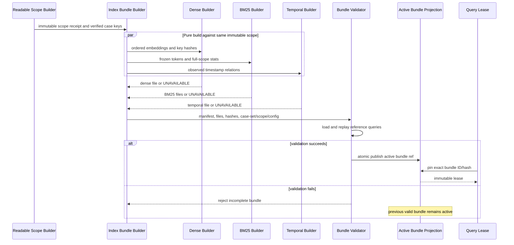
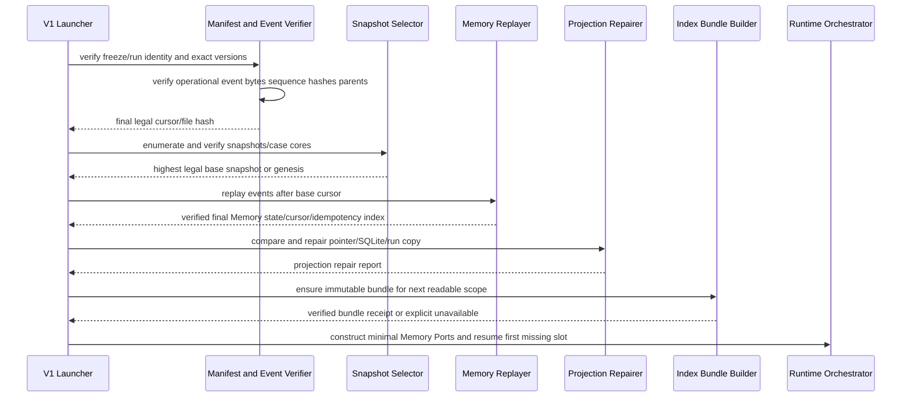

# Memory 持久化、检索、索引与 Replay 代码实现设计

> 文档编号：Implementation Design 03
> 状态：有条件通过；2026-07-18 已完成首轮架构评审修订，待高级架构师复核；不授权代码开发
> 前置设计：`00_engineering_architecture_overview.md`、`01_schema_protocol_and_adapter_design.md`、`02_runtime_agents_and_state_ownership_design.md`；历史批准保留，当前复审状态以各文档页首为准
> 规范基线：`docs/engineering_handoff/01_frozen_engineering_contracts.md` > `02_reference_algorithms.md` > `03_contract_test_matrix.md` > `04_theory_to_code_gap_analysis.md`
> 审计基线：`0afc8fd09a940f49f1c96ef51ddfcf13f3ddba9a`
> 测试 catalog：323 个具体 CT ID
> 本文范围：WP7、WP9、WP10 的 Memory/event/snapshot/index/replay 部分；不替代 Document 04 的迁移与测试组织设计

## 1. 执行结论

Schema v1 Memory 固定实现为文件原生、事件权威、单 namespace 规范写者的版本化系统。事实由 canonical append-only event、immutable case core、pre-CAS immutable lifecycle artifact、versioned snapshot 和 freeze/hash manifest 构成；post-CAS Candidate outcome 只由 accepted `MemoryWriteEventV1.CaseMutationV1.result` 权威表达。`current_snapshot.json`、SQLite、Dense/BM25/Temporal index、Candidate outcome view、进程内对象与 UI projection 均可删除重建。

Long-Term 写入只允许在 Stream 视频的 `PredictionFreezeRecordV1` 已接受、当前视频 Candidate 已冻结且 Orchestrator 签发匹配 `WritePermitV1` 后发生。提交顺序固定为：先在 staging 生成并发布 case core 与 candidate snapshot，再持 namespace 写锁重验 version/cursor/hash，随后 append+fsync accepted `MemoryWriteEventV1`。该 event fsync 是唯一逻辑提交点；pointer、catalog 和 index 切换均在其后，失败时由 replay 修复。

检索只读取一个 protocol-readable immutable snapshot 和与其严格绑定的 immutable index bundle。rank 前只能读取 observation-only `RetrievalKeyV1`；`RetrievalManifestV1` artifact 与 event durable 后，payload resolver 才可按 frozen top-k ID/hash 顺序解锁 `AdvisoryPayloadV1`。所有 view 不可用时返回 empty manifest，B6 使用 identity path。

本文不把 Portalocker、SQLite、Chroma、FAISS、BM25 文件、Temporal 文件或 pointer 当作 CAS 证明。Portalocker 只提供互斥；CAS 正确性只来自锁内 `memory_version + event_cursor + snapshot/candidate hash + permit/idempotency` 重验证。

## 2. 已批准输入、适用勘误与职责边界

### 2.1 继承的冻结决策

本文直接继承且不重新比较：

- 同仓库 `src/tfavad/` 旁路 Schema v1，Legacy Schema/config/Memory namespace/artifact/test entry 显式隔离；
- 单一规范推理进程与独立 Evaluator OS 进程；
- Python Protocol + 显式构造注入，不使用 DI framework；
- Port 只接收 V1 对象、稳定 ID 或 frozen command，不暴露任意路径、数据库连接或可变 store；
- file-native fact source + rebuildable database/index；
- normative commit serial、pure compute bounded-parallel；
- exact Dense/BM25/Temporal/RRF/frozen reranker 主检索，`K=512` 不使用 Chroma/FAISS；
- accepted identity/content/parent/raw-artifact conflict 统一为 `RUN_FATAL`；
- 当前视频不得 Long-Term self-read，PredictionFreeze 之前不得 Long-Term write；
- Legacy Memory 不原地升级、不与 V1 共写、不在 V1 失败时充当 fallback。

### 2.2 C-02 事务措辞勘误

`01_frozen_engineering_contracts.md` §10.2 与 `02_reference_algorithms.md` A3 中“event、snapshot、pointer 原子提交”的旧句，不是本文可选实现。用户批准的最高优先级语义为：

```text
publish immutable candidate snapshot
-> lock and revalidate
-> append + fsync accepted Memory event     # sole logical commit
-> repair/update pointer, catalog, indexes
```

因此：

- event 前崩溃：published snapshot 是 orphan，不是有效 Memory；
- event 后崩溃：Memory 已提交，必须依据 event 修复 after snapshot/pointer/index；
- pointer 或 SQLite 成功不能证明提交；
- 无 accepted event 的 snapshot 不进入 readable version，也不进入 output freeze；
- `CT-B8-W13` 的“before 或完整 after”在逻辑层解释为 event 未提交的 before，或 event 已提交且可重建的完整 after。

### 2.3 与前后文档的接口

| Authority | 本文必须服从 | 本文新增的实现细化 | 本文禁止改变 |
|---|---|---|---|
| Document 00 | package/root/import、event-only commit、index bundle | persistence 文件与类职责 | 宏观拓扑、Legacy 边界 |
| Document 01 | 59 public objects、hash/self-field、ArtifactRef/resolver | runtime-private commands、file projections | wire field、codec、ID、severity |
| Document 02 | per-window/video order、owner、freeze/permit/CAS schedule | Memory 内部 transaction/recovery | B4/B6 次数、runtime state order |
| Document 04 | migration/test suite | 只提供 CT owner map 和 fixtures | 36-file migration、pytest layout |

### 2.4 2026-07-18 最高优先级实现勘误

本表优先于本文历史批准文字及列出的上游旧条款；它不擅自增加公共 Schema 对象或 CT identity。跨文档传播必须在对应 Gate 关闭前完成：

| 接缝 | 旧含糊/冲突 | 本文唯一规则 | 必须传播到 |
|---|---|---|---|
| Candidate authority | ADMITTED/DISCARDED 同时由 lifecycle revision 与 CAS mutation 表达 | lifecycle 只到 pre-CAS ELIGIBLE/按 gate DISCARDED；post-CAS 四种 outcome 只认 `CaseMutationV1.result`，展示状态是 projection | Documents 01/04/05、handoff lifecycle 条款 |
| Runtime facts | bare query、lifecycle candidate、permit 进入下游 | receipt-bound private command；artifact-first/event-second；accepted receipt 后才更新 projection/消费 | Documents 02/05 |
| Independent shard | accepted per-video event shard 再归并单一 stream | shard 只存 non-authoritative prepared record；唯一 canonical stream 的 append+fsync 才 accepted | Documents 00/05 |
| Immutable publish | check-then-replace final path | OS-visible atomic create-if-absent/no-clobber；winner 永不覆盖 | Documents 01/04/05 publisher requirements |
| Failure registry | generic lock/repair/no-B2 audit | 精确 Memory code/severity/owner，以 §26 为准 | Documents 01/04/05 |
| Operational indexes/tests | flat/parallel目录 | 本文 bundle layout 是 operational Memory 权威；Document 04 `tests/v1/catalog/` 是唯一 CT 权威 | Documents 04/05 |

`AuditEventEnvelopeV1.event_sequence` 位于 canonical line bytes 且要求文件内从 0 连续；accepted line 又禁止改写。因此，当前 Schema v1 不支持“各 shard 独立 accepted 后无改写拼成一个连续 stream”。若未来需要真正并行的 stateful per-video acceptance，必须版本化 Event Envelope/stream manifest 并重新评审；当前实现不得临场选择重编号或多事实源。

## 3. 当前代码冲突与逐项迁移

| 当前证据 | 契约冲突 | V1 设计 | 迁移方式 | 验收 | Legacy |
|---|---|---|---|---|---|
| `src/memory/case_store.py:28-37` 绑定 `case_memory.jsonl` 与 Chroma root | namespace/schema/config 混用 | `V1MemoryNamespaceLayout` 只绑定 V1 authorized root | 旧 root 不适配 | `CT-ART-006`、static root test | 保留 |
| `src/memory/case_store.py:66-81` 读取后整体 `w` 重写 JSONL | append-only event/case immutability | canonical event append + content-addressed case file | 整段 REPLACE | `CT-PER-001..004` | 保留 |
| `src/memory/case_store.py:83-88` add 覆盖相同 ID | accepted identity conflict 必须 fail | immutable case publish、same hash idempotent、different hash fatal | REPLACE | `CT-PER-003/004` | 保留 |
| `src/memory/case_store.py:90-104` `model_copy` 原地 promotion | Candidate append-only revision | lifecycle revision file/event hash chain | UNADAPTABLE | `CT-B5-K07..K09` | 保留 |
| `src/memory/case_store.py:114-133` Chroma upsert risk payload | index 不是事实源；rank 前 payload firewall | RetrievalKey-only immutable bundle | backend 仅 Legacy/non-normative | `CT-B5-Q13..Q15` | 保留 |
| `src/memory/case_store.py:135-155` 删除并原地重建 active collection | 查询期间不得破坏 active index | build/validate/publish new bundle，lease 切换 | REPLACE | `CT-B5-Q17`、`CT-PER-009/010` | 保留 |
| `src/memory/case_store.py:157-224` rolling story、双查询、ad-hoc blending | CURRENT_WINDOW_ONLY、RRF/frozen reranker | exact S0-S6 pipeline | 整体 UNADAPTABLE | `CT-B5-Q01..Q12` | 保留 |
| `src/memory/case_store.py:167-222` ranking 时构造 risk-bearing `RetrievedCase` | top-k 前不得读 payload | rank row 只含 key hash/rank/audit score | REPLACE | `CT-B5-Q13..Q15` | 保留 |
| `src/memory/session_store.py:19-31` add 后立即可读 | Episode close/visible ordinal 缺失 | event-derived closed-prefix Session projection | 容器概念 ADAPT，语义 REPLACE | `CT-B5-E05..E07` | 保留 |
| `src/memory/session_store.py:44-84` 同视频全部记录检索 | current/open/future Episode 可自读 | cutoff filter + visibility proof | REPLACE | `CT-B5-E05/006` | 保留 |
| `src/memory/embedding_builder.py:9-56` 模型失败静默 hash embedding | dense availability/model identity 被伪造 | frozen embedding Adapter；失败为 null/unavailable | fallback 仅 Legacy | `CT-B5-E09/A06/Q03` | 保留 |
| `src/tools/rag_tool.py:11-53` 合并 Session/Long-Term score与 payload | snapshot/scope/rank order不受控 | `MemoryRetrievalPort` + bundle resolver | 整类 QUARANTINE_LEGACY | `CT-B5-Q01..Q17` | 保留 |
| `src/tools/rag_tool.py:29-35` Pattern 注入主检索 | B7 不在主线 | V1 无 Pattern reader | 不适配 | `CT-B9-C07` boundary | 保留 |
| `src/memory/policy.py:19-187` 标签/分数/相似度 admission | 无标签 gates、local B2-only core | M0-M5 + A0-A2 pure capability | 整类 UNADAPTABLE | `CT-B5-K/A/R` | 保留 |
| `src/memory/promotion.py:16-62` 阈值 promotion | lifecycle revision/Reservoir 冲突 | 无 promotion step；ELIGIBLE 后一次 permit competition | 不适配 | `CT-B5-K08`、`CT-B8-W*` | 保留 |
| `src/memory/pattern_store.py:9-43` whole-file Pattern JSONL | V1 mainline 无 Pattern namespace | Legacy/B7 extension only | QUARANTINE_LEGACY | static import test | 保留 |
| `src/pipelines/run_agentic_vad.py:321-327` 每窗口 Session + persistent 双写 | predict-before-write、自我检索、partial write | close Session event；视频 freeze 后 Stream CAS | 删除 V1 双写调用 | `CT-B8-W01..W14` | 保留 |
| 当前无 version/cursor/snapshot/lock/replay/catalog bundle | WP7/WP9/WP10 ABSENT | `src/tfavad/persistence/*` 旁路新建 | NEW | `CT-PER-*`、`CT-ART-*` | 不适用 |

上述旧对象只能按 Document 01 的 LOSSLESS / LOSSY_BASELINE_ONLY / UNADAPTABLE registry 接入。`CaseMemoryRecord`、`RetrievalResult`、MemoryPolicy result 和 promotion result 均不能通过补字段变成 V1。

## 4. Runtime package 与文件落点

```text
src/tfavad/
  capabilities/memory/
    episode_builder.py            # M0 state-delimited pure transition
    reference_medoid.py           # M1 ordered cosine medoid
    episode_summary.py            # M2 local-B2-only R/d/u/C
    retrieval_key_builder.py      # M3 observation-only key/SER
    candidate_builder.py          # M4 scope wrapper/revision 0
    admission.py                  # M5 hard gates, A0/A1
    reservoir.py                  # portable U, log-key, A2
    retrieval_pipeline.py         # S0-S6 coordinator; no filesystem handle
    dense_view.py                 # ordered dot
    bm25_view.py                  # frozen tokenizer/IDF/avgdl
    temporal_view.py              # observed Allen triples
    rrf.py                        # rank fusion
    reranker.py                   # frozen batch adapter + all-or-nothing fallback
  ports/
    memory_episode.py             # B4/B2 accepted refs -> Episode commands
    memory_read.py                # snapshot/scope/query/manifest/bundle Ports
    memory_write.py               # candidate/freeze/permit/CAS Ports
    memory_persistence.py         # narrow artifact/event/snapshot commands
    index_bundle.py               # build/pin/resolve/release commands
  persistence/events/
    canonical_jsonl.py            # strict LF append/read/verify
    bound_memory_writer.py        # event-type/payload-scope-bound writer
    event_cursor.py               # sequence/cursor/file hash verification
  persistence/artifacts/
    staging.py                    # same-FS staging lease
    publisher.py                  # canonical bytes/hash/fsync/atomic publish
    directory_sync.py             # platform-specific directory durability adapter
    orphan_registry.py            # uncommitted published-object projection
  persistence/memory/
    namespace_layout.py           # authorized V1 paths only
    namespace_lock.py             # Portalocker mutex adapter
    case_core_store.py            # immutable content-addressed core
    candidate_store.py            # immutable lifecycle revisions
    snapshot_builder.py           # MemorySnapshot candidate
    cas_coordinator.py            # lock/revalidate/event commit
    replay.py                     # P1 state transition
    recovery.py                   # snapshot selection/projection repair
    orphan_gc.py                  # reference-safe orphan cleanup
  persistence/indexes/
    bundle_schema.py              # private bundle manifest
    key_projection.py             # case core -> key-only rebuildable projection
    builder.py                    # parallel immutable build orchestration
    validator.py                  # case-set/scope/algorithm/hash checks
    switch.py                     # atomic active-bundle projection switch
    lease.py                      # query pin/refcount projection
  persistence/catalog/
    sqlite_schema.py              # rebuildable tables/DDL identity
    projector.py                  # event/snapshot -> rows
    rebuild.py                    # delete/recreate/verify
  runtime/launcher/
    memory_repair.py              # startup repair before inference composition
```

所有文件名是本阶段的代码落点，不新增 wire object。`bundle_schema.py`、command、receipt、lease token 都是 runtime-private frozen JSON-safe struct；若未来跨进程公开，必须创建新 reviewed Schema 版本。

### 4.1 禁止导入

| 包 | 禁止导入 |
|---|---|
| `capabilities/memory` | `pathlib.Path` resolver、sqlite3、portalocker、Chroma/FAISS、Legacy store/policy/RAG |
| `persistence/memory` | Legacy schema、B4/B6 math、Evaluator、annotation/metrics |
| `persistence/indexes` | AdvisoryPayload reader、Memory writer、current pointer authority |
| `persistence/catalog` | commit/permit issuer、B4/B6、authoritative event mutation |
| Legacy | V1 Memory writer、V1 namespace lock、V1 current pointer |

## 5. Composition Root 与最小配置切片

### 5.1 配置切片

```text
MemoryLayoutConfigSlice = {
  namespace_root_id,
  run_output_root_id,
  schema_version,
  protocol_version,
  memory_namespace,
  local_filesystem_required: true
}

ReservoirConfigSlice = {
  capacity_K,
  guarantee_per_role,
  seed,
  rng_algorithm: "TFAVAD-RESERVOIR-U-V1"
}

RetrievalConfigSlice = {
  k_ret,
  B_ret_rule: "MIN_3K_READABLE_V1",
  c_rrf: 60,
  dense_algorithm_id,
  embedding_model_id,
  embedding_model_hash,
  bm25_algorithm_id,
  tokenizer_id,
  normalization_config_hash,
  stopword_hash,
  temporal_algorithm_id,
  reranker_model_and_tokenizer_versions,
  reranker_truncation_id,
  reranker_batch_size
}

MemoryDurabilityConfigSlice = {
  event_fsync: true,
  artifact_fsync: true,
  atomic_publish_policy_id,
  directory_sync_policy_id,
  lock_timeout_ms,
  tail_repair_policy_id,
  orphan_retention_policy_id
}
```

`MemoryCapability` 只收到 Reservoir/Retrieval 数值切片和窄 read/write Ports；`NamespaceCasCoordinator` 只收到 layout/durability、bound event writer、artifact store、hash verifier 和 projection repair Ports。任何组件都不接收完整 `InferenceConfigV1`。

主参考配置固定 `capacity_K=512`、`k_ret=5`、`B_ret=15`、`c_rrf=60`、`reservoir_seed=0`；`B_ret` 运行时仍取 `min(3*k_ret,readable_case_count)`。其他 K/k/seed 只允许来自预注册 sensitivity config，并产生相应 freeze/run identity，不得由结果回填主配置。

### 5.2 关键 Protocol

以下 command/receipt 均是 runtime-private、frozen、deeply immutable、JSON-safe 结构；不进入 59 个公共 wire object registry。`AcceptedValue[T]` 与 `AcceptedReceipt` 的字段和消费重验规则直接复用修订后的 Document 02，不复制第二套定义：

```text
AcceptRetrievalQueryCommand = {
  query: RetrievalQueryV1,
  final_b2_receipt: AcceptedReceipt,
  readable_scope: ReadableScopeReceipt,
  pinned_bundle: PinnedIndexBundleView,
  expected_query_hash: sha256,
  expected_parent_message_ids: tuple[string,...]
}

RetrieveMemoryCommand = {
  accepted_query: AcceptedValue[RetrievalQueryV1],
  readable_scope: ReadableScopeReceipt,
  pinned_bundle: PinnedIndexBundleView,
  expected_scope_hash: sha256,
  expected_bundle_manifest_hash: sha256
}

FreezeRetrievalManifestCommand = {
  candidate: RetrievalManifestCandidate,
  accepted_query: AcceptedValue[RetrievalQueryV1],
  readable_scope: ReadableScopeReceipt,
  pinned_bundle: PinnedIndexBundleView
}

AcceptCommittedWindowCommand = {
  window_artifact: AcceptedValue[WindowArtifactV1],
  final_b2_ref: ArtifactRefV1,
  final_b2_payload_hash: sha256,
  final_b2_receipt: AcceptedReceipt,
  committed_b4_ref: ArtifactRefV1,
  committed_b4_payload_hash: sha256,
  committed_b4_receipt: AcceptedReceipt,
  window_ordinal: int64,
  expected_parent_message_ids: tuple[string,...],
  expected_parent_artifact_hashes: tuple[sha256,...]
}

IssueWritePermitCommand = {
  permit: WritePermitV1,
  prediction_freeze_receipt: AcceptedReceipt,
  frozen_candidate_set_hash: sha256,
  expected_memory_version: int64,
  expected_event_cursor: int64,
  expected_snapshot_hash: sha256,
  expected_parent_message_ids: tuple[string,...]
}

CommitWritePermitCommand = {
  prediction_freeze: AcceptedValue[PredictionFreezeRecordV1],
  permit: AcceptedValue[WritePermitV1],
  frozen_candidates: tuple[AcceptedValue[CandidateCaseV1],...],
  expected_namespace_manifest_hash: sha256,
  expected_event_cursor: int64,
  expected_last_event_hash: sha256,
  expected_snapshot_ref: ArtifactRefV1,
  expected_snapshot_hash: sha256,
  expected_memory_version: int64,
  reservoir_config_hash: sha256,
  algorithm_version_set_hash: sha256,
  candidate_input_hash: sha256,
  transaction_logical_slot: string,
  idempotency_key: string
}
```

构造器必须逐字段重算并证明同一 parent；任何 bare public object、Path、Store、index object 或 receipt string 都不能替代 accepted wrapper。

```python
class EpisodeMemoryPort(Protocol):
    def accept_committed_window(
        self, command: AcceptCommittedWindowCommand
    ) -> tuple[AcceptedReceipt, ...]: ...

    def close_video(
        self, command: CloseVideoEpisodesCommand
    ) -> tuple[AcceptedValue[CandidateCaseV1], ...]: ...

class MemoryReadPort(Protocol):
    def bind_readable_scope(
        self, command: BindReadableScopeCommand
    ) -> ReadableScopeReceipt: ...

    def accept_query(
        self, command: AcceptRetrievalQueryCommand
    ) -> AcceptedValue[RetrievalQueryV1]: ...

    def retrieve(self, command: RetrieveMemoryCommand) -> RetrievalManifestCandidate: ...

    def freeze_manifest(
        self, command: FreezeRetrievalManifestCommand
    ) -> AcceptedValue[RetrievalManifestV1]: ...

    def resolve_advisory(
        self, command: ResolveFrozenManifestCommand
    ) -> AdvisoryBundleV1 | MemoryReadStatus: ...

    def accept_resolution(
        self,
        result: AdvisoryBundleV1 | MemoryReadStatus,
        manifest: AcceptedValue[RetrievalManifestV1],
    ) -> AcceptedValue[AdvisoryBundleV1] | AcceptedStatus: ...

class PermitAcceptancePort(Protocol):
    def issue(
        self, command: IssueWritePermitCommand
    ) -> AcceptedValue[WritePermitV1]: ...

class LongTermMemoryWritePort(Protocol):
    def commit_permit(
        self, command: CommitWritePermitCommand
    ) -> MemoryCommitReceipt: ...

class MemorySnapshotReadPort(Protocol):
    def load_verified(
        self, command: LoadSnapshotCommand
    ) -> VerifiedMemorySnapshot: ...

class IndexBundlePort(Protocol):
    def ensure_bundle(
        self, command: EnsureIndexBundleCommand
    ) -> IndexBundleReceipt: ...

    def pin_bundle(
        self, command: PinIndexBundleCommand
    ) -> PinnedIndexBundleView: ...
```

Port 返回值不含连接、Path、file handle、mutable map、index object 或 backend exception。`PinnedIndexBundleView` 是只读 serializable handle ID + bundle manifest hash；实际文件访问由 authorized index resolver 完成。

`RETRIEVAL_QUERY_ACCEPTED` 作为 concrete Decision-event binding 注册，payload 为现有 `RetrievalQueryV1`，`producer=MEMORY`，parents 绑定 final B2/scope/bundle；它不新增公共对象或 producer。Memory-scoped query/manifest/resolution/lifecycle/permit acceptor 都是互斥的 event-type/payload-family binding，不存在通用 Memory writer。Orchestrator 是 WritePermit 的逻辑签发者，但只持有 `PermitAcceptancePort`；accepted permit receipt 返回后才能调用 `LongTermMemoryWritePort`。

所有 Episode/Candidate/query/manifest/resolution artifact-backed 状态推进统一为：

```text
private candidate
-> canonical encode/hash/length/schema/parent verify
-> immutable no-clobber artifact publish + durability verify
-> bound acceptor append typed event + fsync
-> AcceptedReceipt
-> projection update / downstream use
```

artifact publish 后、event 前崩溃只产生 orphan；event 已 fsync 后、receipt/projection 前崩溃从 canonical event 重建 receipt/projection。Memory capability 内部可以生成 `EpisodeLifecycleCandidate`，但它永不跨 Port；调用方只看到 accepted receipts/values。

## 6. 事实源、projection 与单写者

### 6.1 权威层次

| 类别 | 对象 | 权威性 | 可否删除重建 |
|---|---|---|---|
| Event fact | canonical `memory_events.jsonl` accepted line | 逻辑状态最高权威 | 否 |
| Immutable core | Episodic case core、pre-CAS Candidate lifecycle revision | 内容与 pre-CAS lineage 权威 | 否 |
| CAS outcome | accepted `MemoryWriteEventV1.CaseMutationV1.result` | post-CAS Candidate/Resident outcome 唯一权威 | 否 |
| Snapshot | `MemorySnapshotV1` version file | 已验证 checkpoint | 否，旧版保留 |
| Freeze/hash | Prediction/Run/Output/Memory manifests | scope 与交付完整性权威 | 否 |
| Pointer | `current_snapshot.json` | convenience projection | 是 |
| Catalog | `catalog.sqlite3` | query/diagnostic projection | 是 |
| Index | immutable Dense/BM25/Temporal bundle | retrieval projection | 是 |
| Session index | current-video closed-prefix projection | ephemeral projection | 是，视频结束必须失效 |
| UI/cache | status/count/lease cache | 非规范 | 是 |

### 6.2 一个 canonical accepted Memory event byte stream

一个 `memory_namespace` 在一个 run 内只有一个 `BoundMemoryEventWriter`、一个 accepted append target 和一条连续 `event_sequence`。运行时 primary 位于 operational Memory root：

```text
data/agentic_memory/v1/<protocol>/<run_id>/events/memory_events.jsonl
```

Inference freeze 时，在停止该 namespace 的新 event append 并验证完整 file hash/cursor 后，publisher 将相同 bytes 作为 immutable run artifact 发布到：

```text
data/agentic_outputs/v1/<protocol>/<run_id>/events/memory_events.jsonl
```

run copy 不是第二个 append target；其 byte length/hash 必须与 operational primary 完全一致。`memory_events/manifest.json` 引用 run copy；任何 per-video projection 只从该 frozen stream 生成且没有 writer capability。

如果 run/operational event hash 不一致，`OutputHashManifestV1` 不得冻结，Evaluator 不得启动。修复只能从验证过的 primary 重新发布 run copy，不能双向合并。

### 6.3 Independent prepared shard 与确定性 materialization

Document 00 的 “per-video event shard” 在当前 Event Envelope 下唯一合法实现是 non-authoritative prepared shard，不是第二个 accepted event log。物理路径固定为：

```text
data/agentic_memory/v1/<protocol>/<run_id>/staging/
  independent_event_shards/
    <video_manifest_position:08d>-<video_id_hash>/
      shard_manifest.json
      prepared_memory_events.jsonl
      merge_projection.json
```

`shard_manifest.json` 绑定 protocol/run/freeze/config/environment hash、video ID/manifest position、expected input/window set、prepared file hash/length/count。`PreparedMemoryEvent` 是 runtime-private immutable record，字段关闭为：

```text
shard_id
video_id / video_manifest_position
shard_local_sequence          # 从 0 连续
event_id                      # 按 Document 01 tuple 预计算；不含 event_sequence
event_type / producer / idempotency_key
parent_event_ids / parent_message_ids / parent_receipt_set_hash
payload / payload_hash
memory_version_before/after   # Independent lifecycle event 必须均为 null
created_at_utc                # audit-only，prepare 时冻结
prepared_record_hash
```

规则如下：

1. Independent shard 只允许 version-effect 0 的 Episode/Session/Candidate prepared event；Independent 永远不能准备 Permit/CAS event。
2. shard-local parent 必须引用较小 local sequence 的 prepared `event_id`；外部 parent 必须携带已接受 receipt，或在 materialize 时仍无法验证则拒绝。不同 Independent video 之间禁止 event parent。
3. `prepared_memory_events.jsonl` 可以由 pure/isolated work 生成、验证、丢弃和重建；它没有 `AuditEventEnvelopeV1.event_sequence`，不产生 AcceptedReceipt，不能推进 Session/Episode projection、构造 query parent 或进入 output hash。
4. 唯一 `IndependentMemoryEventSequencer` 按 `video_manifest_position` 升序，再按 `shard_local_sequence` 升序处理。它重验 shard/parents/config，为 next global cursor 只构造一次 public `AuditEventEnvelopeV1`，canonical encode 后 append+fsync operational `memory_events.jsonl`；该 fsync 才是 accepted。
5. materialization 不是复制/拼接/改写 accepted shard bytes。最终 file bytes 是按上述顺序首次生成的 canonical envelope lines，file length/hash 为这些原始 line bytes 的 SHA-256；freeze 后 exact-copy 到 run root。
6. `merge_projection.json` 只缓存 `(shard_id,local_sequence,prepared_record_hash)->AcceptedReceipt`，可从 global stream 重建。global event 已接受而 projection 未写时，resume 返回原 receipt；prepared same ID/hash 重投幂等，same logical key different payload/hash 为 `CONFLICTING_REPLAY/RUN_FATAL`。
7. crash 留下完整 global accepted prefix 时从 next missing local sequence 继续；只有 prepared record、无 global event 时仍未接受；global event 合法而 shard 丢失时，以 global stream 为事实，不反向重建第二份 accepted shard。

因此 Independent 仍可并行完成无状态 tool/index/numeric preparation，但任何会建立 accepted parent 的规范 Memory 提交按固定 video position 串行。若产品要求 stateful videos 独立 accepted 后再合并，必须先版本化 Event Envelope/sequence contract；WP7/WP10 不得用重编号、重复 `event_sequence=0` 或 manifest-of-shards 临场替代。

## 7. Namespace layout、路径与锁

### 7.1 Operational layout

```text
data/agentic_memory/
  v1/
    <protocol>/
      <run_id>/
        namespace_manifest.json
        locks/
          writer.lock
        events/
          memory_events.jsonl
        staging/
          <transaction_id>/
          independent_event_shards/
            <video_position>-<video_id_hash>/
              shard_manifest.json
              prepared_memory_events.jsonl
              merge_projection.json
        cases/
          <case_id>.json
        candidates/
          <candidate_id>/
            core.json
            lifecycle-000000.json
            lifecycle-000001.json
        snapshots/
          <memory_version>-<snapshot_id>.json
        indexes/
          bundles/
            <bundle_id>/
              bundle_manifest.json
              dense.bin
              bm25/
              temporal.json
          active_bundle.json
        catalog/
          catalog.sqlite3
        current_snapshot.json
        repair/
          last_repair_report.json
        gc/
          orphan_report.json
```

所有 URI 对 run artifact 保持 `/` 分隔相对形式；OS path 只存在 resolver/persistence adapter 内。case/candidate/snapshot/bundle ID 必须先通过 Schema/hash registry 验证，禁止把外部字符串直接拼接到路径。

本节 `indexes/bundles/<bundle_id>/{bundle_manifest.json,dense.bin,bm25/,temporal.json}` + `indexes/active_bundle.json` 是 operational V1 Memory 的唯一权威布局。Document 04 的 `indexes/{dense,sparse,temporal}/` 旧行不得实现为第二套目录；它必须改为引用本节 bundle root。run artifact 只按 OutputHashManifest 注册 refs 发布实际使用 bundle，不复制 mutable active pointer authority。

### 7.2 Root 与 reparse 防护

Memory layout resolver 必须：

1. 由 `namespace_root_id` 解析批准 root，不接受调用方 Path；
2. Windows 上大小写不敏感比较 canonical root；
3. 逐段拒绝 symlink、junction、mount point 与其他 reparse point 越界；
4. publish 前后重新验证父目录 identity；
5. 拒绝绝对路径、UNC、盘符、反斜杠 URI、`.`、`..`、ADS 与 NUL；
6. staging/final 必须在同一已批准本地 filesystem/volume；
7. NFS、SMB、远程共享和多主机 writer 不进入主线能力声明。

### 7.3 Namespace writer lock

锁文件使用非截断模式打开，Composition Root 为每个 namespace 构造唯一 exclusive lock adapter。Portalocker 的职责只有：同一 OS 可见文件系统上的进程互斥与 timeout。锁内仍必须读取并验证：

```text
current accepted event cursor
current committed memory_version
last committed event hash
permit ID/payload hash/idempotency key
candidate input hash/lifecycle hashes
published snapshot ID/hash/before version
```

锁超时不会自动变成 stale CAS 成功；它产生明确 failure/audit，调用方可在同一 frozen input 上重新获取锁。禁止 `mode="w"` 打开锁文件，因为该模式可能在获得锁前截断。

官方实现依据：[Portalocker Lock/open/fsync 文档](https://portalocker.readthedocs.io/en/latest/portalocker.html)、[Python sqlite3 transaction control](https://docs.python.org/3/library/sqlite3.html#transaction-control)。这些库 API 只支撑 adapter 行为，不高于项目 golden vectors、event protocol 与 CT。

## 8. Memory event stream 与 logical slots

### 8.1 Event family

`memory_events.jsonl` 使用 Document 01 的 concrete `AuditEventEnvelopeV1[Payload]` closed registry。Memory writer facade 在构造时绑定 producer、event type 与 payload schema，允许集合精确为：

| Event type | Payload | Logical slot | Long-Term version effect |
|---|---|---|---:|
| `EPISODE_OPENED` / `EPISODE_CLOSED` | Episode lifecycle payload/ref | `(video,window,episode,event-kind)` | 0 |
| `SESSION_CASE_PUBLISHED` / `SESSION_CASE_EXPIRED` | `SessionCasePublishV1`/expiry audit | `(video,candidate,session-kind)` | 0 |
| `CANDIDATE_QUARANTINED` / `CANDIDATE_ELIGIBLE` / `CANDIDATE_DISCARDED` | pre-CAS `CandidateLifecycleRecordV1`；DISCARDED 仅指 gate discard | `(candidate,revision)` | 0 |
| `NO_ELIGIBLE_CANDIDATES` | frozen candidate-set audit | `(video,no-eligible)` | 0 |
| `WRITE_PERMIT_ISSUED` | `WritePermitV1` | `(video,permit)` | 0 |
| `MEMORY_CAS_COMMITTED` | `MemoryWriteEventV1` | `(permit,committed)` | +1 |
| `MEMORY_CAS_REJECTED` | FailureAudit/ref | `(permit,attempt-hash)` | 0 |

PredictionFreeze 的 authoritative payload 仍由 Document 02 的 Decision event owner 写；Memory-scoped permit acceptor 独占 `WRITE_PERMIT_ISSUED` append，event 通过 parent event/message hash 引用 freeze receipt，不复制第二个 freeze payload authority。Orchestrator 不获得 Memory writer。projection repair 只生成 hash-bound repair report artifact/RunManifest projection，不新增 Memory event type。

### 8.2 Append primitive

```text
APPEND_MEMORY_EVENT(envelope):
  verify exact schema/producer/event-family/payload registry
  verify canonical parents precede or are valid external accepted parents
  lock append file
  scan/verify last complete line and expected next sequence
  if logical key already accepted with same payload hash: return original receipt
  if logical key already accepted with different payload hash: RUN_FATAL
  bytes = canonical_json(envelope) + LF
  append bytes
  flush file buffer
  fsync file descriptor
  verify new cursor/line hash
  return AcceptedReceipt(cursor,event_id,file_prefix_hash)
```

一个 accepted line 永不修改、重排或覆盖。只有文件末尾不构成完整 LF-terminated canonical event 的 torn tail 可在恢复时截到最后一个验证通过的 byte offset；完整但 hash/sequence/parent 错误的中间或末行均不可自动删除。

## 9. Episode Builder 与 Session 可见性

### 9.1 Builder state

```text
EpisodeBuilderProjection = {
  video_id,
  next_window_ordinal,
  active_salient_id_or_null,
  active_reference_id_or_null,
  accepted_window_refs,
  last_b4_state,
  last_event_cursor
}
```

projection 从 accepted Window/B4/Episode events 重建，不是事实源。`accept_committed_window` 同时验证 final B2 ref、B4 ref、ordinal 和 parent hash；它不能读取 B6 advice、Long-Term payload、label 或 metric。

### 9.2 State-delimited transition

```mermaid
stateDiagram-v2
    [*] --> NO_WINDOW
    NO_WINDOW --> REFERENCE_OPEN: first state NORMAL
    NO_WINDOW --> SALIENT_OPEN: first state non-NORMAL
    REFERENCE_OPEN --> REFERENCE_OPEN: next NORMAL
    REFERENCE_OPEN --> SALIENT_OPEN: close Reference at t-1; open Salient at t with pre-context
    SALIENT_OPEN --> SALIENT_OPEN: next non-NORMAL
    SALIENT_OPEN --> REFERENCE_OPEN: include post-context t; close Salient; open Reference at t
    REFERENCE_OPEN --> VIDEO_CLOSED: close REFERENCE_INTERVAL_END
    SALIENT_OPEN --> VIDEO_CLOSED: close TRUNCATED_BY_VIDEO_END
    VIDEO_CLOSED --> [*]
```

Salient core 是最大连续 non-NORMAL state interval，加至多一个进入前 NORMAL 和一个返回后 NORMAL context。Reference 是最大连续 NORMAL interval；一个 interval 只生成一个 case，事实 key 取冻结 embedding 的 semantic medoid，数值 summary 使用整个 interval。context overlap 只复用已提交 window ref，不产生第二次 B4 effect。

全视频无 VALID observed B2 atom 时，close event 仍可审计，但不生成 retrievable Episode/Candidate，并写 RECOVERABLE FailureAudit。

### 9.3 Session publish

Session scope case 只在 Episode close event accepted、覆盖的 B4 prefix 已提交后构造。`visible_from_window_ordinal` 固定为：

```text
max(episode_member_window_ordinals) + 1
```

query 的 `window_ordinal` 必须满足：

```text
same video
AND publish event cursor <= query protocol cutoff cursor
AND visible_from_window_ordinal <= query window ordinal
AND episode closed
AND candidate scope == SESSION
```

Session projection 的 key 为 `(video_id,candidate_id,visible_from_ordinal,publish_cursor)`，视频结束追加 expiry audit 后整个 mutable projection 删除。case/lifecycle/event artifact 可保留审计，但任何后续视频 readable scope 都必须排除 `memory_scope=SESSION`。

## 10. Candidate immutable core 与 lifecycle revisions

### 10.1 Scope wrapper construction

Episode close 后分别按需要构造 scope wrapper：

```text
SESSION wrapper:
  prediction_freeze_hash = null
  memory_scope = SESSION

LONG_TERM wrapper:
  require matching accepted PredictionFreezeRecordV1
  prediction_freeze_hash = exact freeze hash
  memory_scope = LONG_TERM
```

两者可以共享 `observation_summary_hash`，但 case/candidate/provenance hash 均不同。禁止把 Session artifact rename、copy-with-same-ID 或 lifecycle update 成 Long-Term。

### 10.2 Immutable file rules

```text
candidates/<candidate_id>/core.json
candidates/<candidate_id>/lifecycle-<revision:06d>.json
```

- core file 只允许 create-if-absent；existing same hash 返回原 receipt，different bytes 为 accepted integrity conflict；
- revision 0 固定 `QUARANTINED_CANDIDATE`；
- revision n 的 `previous_lifecycle_hash` 必须等于 n-1；
- revision number 连续，不允许跳号、覆盖或分叉；
- core hash、candidate ID、source Episode/window/atom refs 在全部 revision 不变；
- authoritative lifecycle 只允许 pre-CAS `QUARANTINED_CANDIDATE -> ELIGIBLE | DISCARDED`；其中本文语义名 `DISCARDED_BY_GATE` 精确表示 public `lifecycle_state=DISCARDED` 且 `discard_reason` 属于 closed gate-reason registry，不能表示 CAS competition outcome；
- pre-CAS lifecycle artifact no-clobber publish 后，只有对应 Memory event fsync 才 accepted；孤立 revision artifact 不推进 projection；
- `ELIGIBLE` 是最后一个可写 lifecycle revision。CAS 后不得生成 authoritative lifecycle revision、不得追加 `CANDIDATE_ADMITTED` 或用 `CANDIDATE_DISCARDED` 重述竞争结果；
- post-CAS 唯一权威是 accepted `MEMORY_CAS_COMMITTED` 中每个 `CaseMutationV1.result`，关闭为 `ADMITTED | DISCARDED | DUPLICATE_MERGED | EVICTED_BY_COMPETITION`；
- recovery/UI 可以从 mutation event 构造 `CandidateOutcomeProjection`，字段必须标记 `projection=true` 并绑定 source event ID/hash/cursor；它不是 lifecycle artifact、不能成为 CAS/retrieval parent；
- same mutation replay 只返回原 Memory commit receipt，不增加 lifecycle revision、occurrence、eviction 或 version。

本节是对 frozen contract §6.14 “每次推进至 ADMITTED/DISCARDED 都追加 lifecycle revision”的显式高优先级勘误：该旧要求会与 `CaseMutationV1.result` 形成双事实源，并且 closed Memory event registry 没有 post-CAS admitted event。Document 01 的对象用途/状态图、Document 04 的 K/A/W fixtures 和 Document 05 WP7/WP9 状态表必须在 G3 前同步；传播前不得把展示 projection 序列化成 `CandidateLifecycleRecordV1`。

### 10.3 Local-B2-only derivation proof

Candidate builder 保存 `CandidateDerivationAudit` private artifact：

```text
source_episode_event_hash
ordered_source_window_ids
ordered_final_b2_hashes
source_atom_id_set_hash
retrieved_case_id_audit_set_hash
summary_algorithm_id
retrieval_key_algorithm_id
forbidden_parent_scan_hash
```

supporting/counter atom IDs 必须是 source atom set 子集，并与 source-video retrieval result case IDs 不相交。q/d/u/R/C 逐字段从 ordered local B2 replay 重算并与 core 比较；B6/B4/retrieval payload hash 只允许出现在 forbidden-parent scan 的审计输入，不能是 derivation parent。

## 11. 无标签 admission gates

### 11.1 Gate evaluator

```text
G_protocol:
  SESSION   = closed Episode + committed immutable B4 prefix + no GT visible
  LONG_TERM = complete matching PredictionFreeze accepted + no GT visible

G_provenance:
  source/video/time/model/prompt/artifact hashes all verify

G_observation:
  at least one VALID current-video B2 atom AND q_case > 0

G_write_firewall:
  source IDs subset current-video B2 atom IDs
  q/d/u/R/C replay from local B2
  no retrieved payload/advice/direction/count parent

G = G_protocol * G_provenance * G_observation * G_write_firewall
```

Gate evaluator 输出四个 0/1、各自 reason code 和 proof artifact hash。它不接收 annotation resolver、Evaluator config、Legacy Memory、final metric、case label 或 threshold。任何 gate=0 时追加唯一的 pre-CAS `DISCARDED_BY_GATE` lifecycle revision（public state `DISCARDED` + registered gate reason），`novelty/weight/U/key/log_key` 保持 null 或按 Schema 允许的 zero result，且不占 Reservoir slot。

### 11.2 Episode 数值与 key

Episode summary 按 `(start_us,end_us,window_id)` 排序，以物理时长权重 ordered reduction：

```text
r_t = q_local_t * (1-kappa_local_t)
e_t = r_t * d_local_t
q_case = ordered_sum(lambda_t * r_t)
d_case = ordered_sum(lambda_t * e_t) / q_case, if q_case > 0 else 0
u_case = 1 - q_case * abs(d_case)
C = abs(ordered_sum(lambda_t*e_t)) /
    (ordered_sum(lambda_t*abs(e_t)) + 2^-52), if directional mass > 0 else 0
R = q_case
```

禁止再乘 `u_case` 或 C 形成 R。Salient RetrievalKey 使用 available embedding 的 ordered weighted sum 后 L2 normalize；Reference key 使用 M1 medoid。任一 embedding unavailable 只排除该 vector；全部 unavailable 时 embedding=null，Long-Term novelty/weight=0，Session 仍可使用 sparse/temporal view。

## 12. Duplicate、portable Reservoir U 与容量

### 12.1 Exact duplicate

```text
duplicate :=
  canonical_serialization_hash equal
  AND vector_hash equal
```

两边 embedding 都为 null 时 vector 条件视为相等。处理规则：

- 相同 source provenance hash replay：no-op；
- 不同已冻结视频 independent occurrence：occurrence count +1，并追加 provenance hash；
- 同非零方向符号：agreement audit +1；相反非零符号：conflict audit +1；
- resident facts、R、C、d、role、key/log-key、region 不变；
- occurrence effect 的 logical slot 为 `(resident_case_id, source_provenance_hash)`，同 slot exactly once。

### 12.2 Novelty 与 weight

```text
if candidate embedding is null: nu=0
else if resident has no non-null embedding: nu=1
else nu = min_j((1 - ordered_dot(phi_candidate,phi_j))/2)

W = G * R * nu
```

novelty 只看当前 committed resident snapshot，不维护 shadow history；time recency、retrieval frequency、role、direction、Advice、B6 conflict 均不进入 W。

### 12.3 Portable U

```text
digest = SHA256(ENCODE_TUPLE([
  "TFAVAD-RESERVOIR-U-V1",
  int64_big_endian(seed),
  candidate_id
]))
raw52 = uint64_big_endian(digest[0:8]) >> 12
U = (raw52 + 0.5) / 2^52
reservoir_log_key = ln(U) / W
reservoir_key = exp(reservoir_log_key)   # audit only; may underflow to 0
```

U 只在第一次生成 ELIGIBLE revision 时计算并持久化；stale retry、crash replay、permit replay、duplicate merge 不重抽。normative competition 使用 finite `reservoir_log_key`，排序为 CMP 降序、case ID bytewise 升序。

Golden vector：

```text
seed=0, candidate_id="cand_test"
digest=64c3b65378b1da935b621a328a79245704a27b06c5b17fb8c321d12d8c5f4660
raw52=1772667845184285
U=0.39361133134725124
raw52=0 -> U=1.1102230246251565e-16
raw52=2^52-1 -> U=0.99999999999999989
```

### 12.4 Role-stratified elastic capacity

```text
b = floor(K/2)
G_salient   = top min(b, salient_count) by (log_key desc,case_id asc)
G_reference = top min(b, reference_count) by same order
L = K - size(G_salient) - size(G_reference)
overflow = top min(L,remainder_count) by same order
selected = G_salient union G_reference union overflow
```

`K=0` 表示 Long-Term disabled；role-stratified mainline 要求 `K>=2`，`K=1` preflight 为 RUN_FATAL config invalid。单一角色可借用全部 K；另一角色到达后先建立自己的 guarantee。奇数额外槽进入 shared overflow；未满不复制 case。

## 13. PredictionFreeze、WritePermit 与 CAS command

### 13.1 Precondition chain

`CommitWritePermitCommand` 只含第 5.2 节定义的 receipt-bound 字段，展开后的必要事实为：

```text
accepted PredictionFreezeRecordV1 value/ref/hash/receipt
accepted WritePermitV1 value/hash/receipt from Memory-scoped permit acceptor
ordered accepted CandidateCaseV1 values/refs/hashes/receipts
expected operational namespace manifest hash
expected last accepted event cursor/hash
expected MemorySnapshotV1 ref/hash/version
ReservoirConfigSlice hash
algorithm version-set hash + candidate_input_hash
transaction logical slot/idempotency key
```

bare `WritePermitV1` 即使字段/hash 正确也必须拒绝；CAS writer 逐项验证 permit receipt 指向本 namespace 的 accepted `WRITE_PERMIT_ISSUED` event，并验证该 event 的 external parent 是 exact PredictionFreeze receipt。Orchestrator 只能构造 permit candidate、调用 `PermitAcceptancePort.issue`、接收 accepted wrapper，再提交 command；它从不调用 Memory append primitive。

Memory writer 首先拒绝：

- protocol 不是 `ZS_STREAM_CAUSAL`；
- freeze、permit、video/run/protocol/prediction hash 不一致；
- permitted candidate IDs 不等于 sorted frozen Candidate allowlist；
- 任一 Candidate 的 latest accepted pre-CAS lifecycle state 不是 `ELIGIBLE`、scope 非 LONG_TERM 或 freeze hash 不匹配；
- permit 已 accepted 且 payload hash 不同；
- GT/config/Legacy namespace 标记出现。

Independent 协议在 Port 构造时根本不获得 Long-Term writer；即使伪造 command 送到 adapter，仍以 `UNAUTHORIZED_LONG_TERM_WRITE/RUN_FATAL` 拒绝，不创建空 permit。

### 13.2 Candidate input hash

```text
candidate_input_hash = HASH_TUPLE([
  prediction_freeze_hash,
  permit_payload_hash,
  sorted(candidate_id, core_hash, final_pre_cas_lifecycle_hash),
  reservoir_config_hash,
  algorithm_version_set_hash
])
```

Snapshot candidate、MemoryWriteEvent 和 recovery transaction record 必须绑定同一 hash。stale replacement permit 改变 before snapshot/version/permit ID，但 candidate core/lifecycle/U hashes 与 prediction freeze hash不变。

## 14. 唯一逻辑提交协议

### 14.1 提交 Sequence Diagram

```mermaid
sequenceDiagram
    participant O as Orchestrator
    participant A as Memory-scoped Permit Acceptor
    participant M as Memory CAS Coordinator
    participant S as Staging Artifact Store
    participant L as Namespace Writer Lock
    participant E as Authoritative Memory Event Log
    participant P as Pointer Catalog Index Projections

    O->>A: IssueWritePermitCommand
    A->>E: append WRITE_PERMIT_ISSUED and fsync
    E-->>A: accepted permit receipt
    A-->>O: AcceptedValue WritePermitV1
    O->>M: receipt-bound CommitWritePermitCommand
    M->>M: verify freeze permit candidates scope hashes
    M->>S: stage missing case cores and snapshot candidate
    S->>S: canonical encode hash fsync validate
    S->>S: atomic publish immutable files
    S-->>M: published refs and hashes, not committed
    M->>L: acquire exclusive namespace lock
    L-->>M: lock receipt
    M->>E: read and verify last cursor/version/idempotency
    M->>M: revalidate permit, candidates, snapshot and mutation result
    alt permit already committed with same payload
        M-->>O: original committed receipt
    else version/cursor/hash stale
        M-->>O: STALE_MEMORY_VERSION, no event append
    else validation succeeds
        M->>E: append canonical accepted MemoryWriteEvent
        E->>E: flush and fsync
        E-->>M: accepted cursor and event hash
        Note over E: sole logical commit point
        M->>P: publish current pointer once; project SQLite; mark index ensure state
        P-->>M: projection current or repair-required
        M-->>O: committed receipt
    end
    M->>L: release lock
```

### 14.2 Staging/publish rules

每个 transaction 的 staging directory 名由 transaction ID 构造，不含调用方 path。发布步骤：

1. canonical encode 到同一批准 filesystem/volume 内的 exclusive temp file；
2. flush + file fsync；close 后从 disk bytes 重算 byte length/hash/schema；
3. resolver 在 publish 紧邻前重验 root、parent identity、symlink/junction/reparse 防护；
4. 调用 `NoClobberPublisherPort.create_if_absent(temp_ref,final_identity,expected_hash)`；平台 adapter 必须以 OS-visible atomic no-replace directory-entry primitive 发布完整已 fsync 文件，不能执行 check-then-replace；
5. 不存在：恰有一个 writer 原子创建 final name；已存在：publisher 不写 final bytes，以 no-follow verified reader 重验现有 length/hash/schema；
6. existing hash 相同：幂等复用 winner；hash 不同：保留 winner，返回 `ARTIFACT_HASH_MISMATCH/RUN_FATAL`；禁止 `os.replace`、replace-existing rename、delete-then-rename 或覆盖写；
7. 成功创建/复用后按冻结 directory durability policy 同步 parent directory，再重开 final identity 验证 exact bytes/hash；
8. 删除 temp name只能清理未引用 link/file；输出 verified ArtifactRef，不输出 Path。

Windows/Linux 主参考 adapter 都必须通过同一 capability contract：仅支持本地、同 volume、能证明 atomic create-if-absent 的 filesystem；可使用平台 no-replace hard-link/directory-entry primitive，但 API 名不是事实源。若 filesystem/adapter不能在 preflight fault probe 中证明 no-clobber，V1 namespace 以 `SCHEMA_VALIDATION_FAILED/RUN_FATAL` 拒绝启动，不能降级为 replace。object-scoped mutex 可减少竞争但不能代替原子 no-replace 证明。

必须在 `CT-PER-003/004`、`CT-CON-004/005` 与 `CT-ART-006/007` 的既有 fixture 中增加：same-hash 双 writer、different-hash 双 writer、winner publish 后 loser crash、directory durability crash、Windows junction/reparse race。断言始终是 final bytes 等于唯一 winner、loser 从未覆盖、same hash 至多一个逻辑 artifact、different hash `RUN_FATAL`；不增加 CT identity。

case core 必须在 snapshot 前发布；snapshot 引用的全部 case core hash 必须存在且验证。snapshot publication 不更新 current pointer。

### 14.3 锁内重验证

锁内从 event stream 计算，不从 pointer/SQLite 推断：

```text
current_cursor == command.expected_cursor
current_version == permit.memory_version_before
current_snapshot_id == permit.memory_snapshot_id_before
last_committed_event_hash == expected hash
published snapshot.before_version == current_version
published snapshot.version == current_version + 1
snapshot.event_cursor == next accepted CAS event cursor
snapshot.case_set_hash/reservoir_state_hash == recomputed mutation result
candidate_input_hash == recomputed frozen inputs
```

由于 snapshot 在 event 前生成，它可以预填 expected next cursor；event append 前必须验证当前 sequence 使该 cursor 恰好成立。任何并发 append 使 expected cursor 失效并走 stale/rebuild，不修改已发布 orphan snapshot。

### 14.4 Event commit 与 projection receipts

`MemoryCommitReceipt` 区分：

```text
COMMITTED_PROJECTIONS_CURRENT
COMMITTED_PROJECTIONS_REPAIR_REQUIRED
DUPLICATE_IDENTICAL_COMMITTED
STALE_REJECTED
FATAL_REJECTED
```

前三种的逻辑 Memory after-version 相同。pointer/index/catalog 失败不得把 COMMITTED 降为 rejected，也不得 append compensating rollback event；它们只产生 repair-required projection audit。

namespace writer lock 内禁止执行 embedding、BM25、Temporal 或 reranker build。event commit 后先释放规范写锁，再由 index builder 针对 committed immutable snapshot 构建/验证 bundle；Stream 的下一视频 Memory-visible phase 在 bundle ready 或显式 Memory-unavailable fallback 前不得开始。active bundle switch 使用独立短 projection lock 和 expected source scope hash，不改变 Memory version。

## 15. Crash-point matrix

| Crash point | Durable state | 逻辑 Memory | Recovery | 禁止 |
|---|---|---|---|---|
| staging file 写一半 | temp bytes | before | 删除/隔离 temp | 当作 core/snapshot |
| temp fsync 后、hash verify 前 | temp bytes | before | 重验或回收 | 猜 schema/hash |
| case core publish 后、snapshot 前 | immutable orphan core | before | reuse by same hash or GC | 加入 readable set |
| snapshot publish 前 | core + temp snapshot | before | rebuild snapshot | 更新 pointer |
| snapshot publish 后、lock 前 | orphan snapshot | before | transaction revalidate/reuse or GC | 把 version 视为 committed |
| lock 后、revalidate 前 | published orphan + lock | before | 重验 event-derived state | 信 pointer/SQLite |
| revalidate stale | orphan snapshot | before | reject permit；same candidates/U against latest snapshot | append stale event as commit |
| event append bytes 未形成完整 LF | torn tail | before | 截到 last valid byte，same identity retry | 保留半行/跳 sequence |
| complete event bytes 但 fsync 未确认、重启后不存在 | no accepted line | before | same identity retry | 假定 committed |
| event fsync 后、receipt 前 | accepted event | after | replay detects permit and returns original receipt | 第二 version/occurrence/eviction |
| event 后、pointer 前 | accepted event + after snapshot | after | rebuild/publish pointer | rollback event |
| pointer 后、SQLite 前 | event + snapshot + pointer | after | rebuild SQLite/index | 以 catalog 缺失判 before |
| SQLite 后、index switch 前 | event + snapshot + catalog | after | ensure/validate bundle then switch | query mutable partial bundle |
| bundle build 中 | incomplete private bundle | after | delete/rebuild incomplete bundle | expose active ref |
| active bundle switch 后、old lease release 前 | two immutable bundles | after | keep old until leases release | mutate/delete pinned old bundle |
| run event copy publish 中 | operational frozen primary + temp copy | after | republish exact bytes | 合并两份日志 |

中间完整 event 行 hash/sequence/parent 损坏不属于 torn-tail repair；若无法从更早合法 snapshot + event prefix 得到唯一 state，则 `MEMORY_EVENT_SNAPSHOT_DIVERGENCE/RUN_FATAL` 并隔离 namespace。

## 16. Snapshot 构建、选择与 replay

### 16.1 Snapshot candidate

`MemorySnapshotV1.cases` 按 case ID 升序；三个 region ID list 按 `(reservoir_log_key desc,case_id asc)`。Builder 必须断言：

```text
0 <= case_count <= K
guarantee_per_role == floor(K/2)
each case appears exactly once
region lists disjoint and union equals case set
every case core exists and hash verifies
admitted_memory_version <= snapshot version
snapshot case_set_hash equals canonical ordered case records
reservoir_state_hash includes seed/algorithm/K/regions/keys
```

Snapshot `event_cursor` 是即将产生该 version 的 accepted CAS event cursor；只有 event 存在且 payload 指向该 snapshot 时，它才是 legal committed snapshot。

### 16.2 Highest legal snapshot

```text
SELECT_BASE_SNAPSHOT(namespace,event_stream):
  enumerate snapshot files by parsed version/id, never filesystem order
  verify exact schema/hash/case files/region invariants
  require event at snapshot.event_cursor commits matching after ID/version/hash
  require no two different snapshots are committed for one version
  choose highest version whose full chain is legal
  if none and event stream has no CAS: use empty version 0 genesis
  if ambiguity exists: RUN_FATAL
```

`current_snapshot.json` 只提供 fast candidate；validator 必须按相同步骤验证，失败后扫描 legal snapshots/events。禁止选择“mtime 最新”或 SQLite max(version)。

### 16.3 Replay transition

```text
REPLAY_MEMORY(base_snapshot,events):
  state = immutable base snapshot state
  for event after base cursor in sequence:
    verify canonical bytes/hash/parents/idempotency
    if Session/lifecycle/audit: update only corresponding projection
    if rejected/duplicate audit: no Long-Term effect
    if CAS committed:
      require before_version == state.version
      require after_version == before_version + 1
      require permit not already applied
      apply mutations in recorded canonical order
      verify occurrence and eviction exactly once
      verify after case_set/reservoir/snapshot hashes
      state = after
  return verified state and final cursor
```

若 committed event 的 after snapshot 文件缺失但所有 immutable before cases、candidate cores、mutations 和 hashes 足以唯一重建，recovery 必须重建相同 canonical snapshot bytes/ID；如果无法生成相同 hash，fatal，不能生成“近似 after”。

## 17. Pointer、SQLite、repair 与 orphan GC

### 17.1 `current_snapshot.json`

private projection shape：

```text
{
  memory_namespace,
  memory_version,
  snapshot_id,
  snapshot_hash,
  event_cursor,
  committed_event_id,
  committed_event_hash
}
```

pointer 使用 temp + fsync + atomic replace 发布。读取者仍验证 target snapshot/event；pointer 自身不授权 readable scope 或 write permit。

### 17.2 SQLite catalog

SQLite tables 只存 projection：namespace state、snapshot rows、case-to-core refs、candidate latest lifecycle、event idempotency index、bundle refs、repair generation。每行必须包含 source event cursor/hash 或 snapshot ID/hash。Projector 使用 explicit transaction，所有 value parameter binding；connection 不跨 capability Port，也不多线程共享 writer。

`catalog.sqlite3` 删除后可由 event/snapshot/case 全量重建。catalog schema version/hash 写入 private catalog manifest；不匹配时删除重建，而不是 migration 后声称同一 projection identity。SQLite commit failure只产生 repair-required，不影响 accepted Memory version。

### 17.3 Orphan GC

GC 只能删除满足全部条件的 immutable object：

```text
not referenced by any accepted event
not referenced by any legal snapshot
not referenced by freeze/output/run manifest
not referenced by active transaction lease
not referenced by pinned index bundle
older than frozen orphan retention boundary
hash/path verifies inside authorized namespace root
```

GC 先生成 deterministic candidate report，按 object ID 排序，再在 namespace maintenance lock 下重验引用后删除。accepted case core、legal snapshot、event、manifest 永不由 orphan GC 删除。删除 index 不需要 Memory write permit，但必须等待 bundle lease 归零。

## 18. 三项安全性质的构造性证明

### 18.1 当前视频不自我检索（no current-video self-retrieval）

对视频 `v_i` 的窗口 ordinal `t` 定义：

```text
LT_readable(v_i) =
  Independent: empty
  Stream: cases in snapshot committed after v_(i-1) and before v_i starts

SESSION_readable(v_i,t) = {
  c | c.video_id=v_i
      AND c.publish accepted
      AND c.visible_from_ordinal <= t
      AND c.episode_max_ordinal < t
      AND c.scope=SESSION
}

READABLE(v_i,t) = LT_readable(v_i) union SESSION_readable(v_i,t)
```

构造时执行四个断言：

1. 视频开始生成 `ReadableVideoBaseReceipt`，Stream 绑定前一视频 accepted CAS after snapshot，Independent 绑定 empty genesis；视频内不更新 Long-Term base；
2. Session publish 的 `visible_from=max_episode_ordinal+1`，故包含当前窗口的 Episode 永远不在当前窗口 readable set；
3. query command 的 current window ID/ordinal 与每个 readable case provenance interval 做非自包含验证；
4. Candidate derivation source atom set 与 retrieved case IDs/source atom IDs 做 disjoint proof。

任何断言失败为 `EPISODE_CAUSALITY_VIOLATION`；Independent 隔离视频，Stream 升级 RUN_FATAL。测试不依赖 wall time，只检查 accepted cursor、ordinal 和 parent hash。

### 18.2 Predict-before-write

Long-Term accepted event parent chain 必须包含：

```text
all ordered B4 decision hashes
-> persisted predictions artifact hash
-> accepted PredictionFreezeRecord hash
-> finalized LONG_TERM Candidate lifecycle hashes
-> accepted WritePermit hash
-> MemoryWriteEvent hash
```

writer registry 在缺任一 parent 时无法构造 `CommitWritePermitCommand`。Memory event 的 sequence/parent 验证证明写入晚于 freeze；`issued_at_utc` 只审计，不用于证明顺序。current video 的 Long-Term case 只有 CAS event accepted 后才存在于 next version，因此该视频所有 prediction bytes 已先冻结。

### 18.3 同一 permit 不重复写入

三个独立层共同证明 exactly once：

1. `permit_id` 和 `MemoryWriteEventV1.idempotency_key` 由 frozen tuple 构造；
2. namespace lock 内从 authoritative event stream 重建 `permit_id -> committed event/snapshot` index；
3. same permit/same payload 返回原 event/snapshot receipt，same permit/different payload 为 RUN_FATAL。

U 在 Candidate lifecycle 中持久化，mutation 顺序和 duplicate occurrence slot 均固定。即使 crash 发生在 event fsync 后 receipt 前，replay 首先看到已 committed permit，因而不再次增加 version、occurrence、eviction 或 region effect。

## 19. Readable scope 与 immutable index bundle

### 19.1 Scope receipt

每个视频开始和每次 Session visible set 变化时构造 runtime-private `ReadableScopeReceipt`：

```text
video_id
valid_from_window_ordinal
long_term_snapshot_id/hash/version
long_term_event_cursor
ordered_visible_session_case_ids/hashes
session_publish_event_cursors
protocol_cutoff
ordered_readable_case_ids
case_set_hash
readable_scope_hash
```

`readable_scope_hash` 由全部字段（排除自身）canonical hash。窗口 query 的 parent envelope 必须引用该 receipt；公共 `RetrievalQueryV1` 仍使用已冻结字段，不新增 wire 字段。pass 1 复用同一个 scope receipt，不因当前窗口新 evidence 改变可读案例集合。

### 19.2 Bundle manifest

private `IndexBundleManifest` 固定：

```text
bundle_id
schema/protocol/algorithm version set
long_term_snapshot_id/hash/version
readable_scope_hash
case_set_hash
ordered_case_ids
retrieval_key_hashes
key_projection_ref/hash
embedding model/dimension/hash policy
BM25 tokenizer/normalization/stopword/k1/b config hashes
temporal relation algorithm ID
view file refs/hashes/build statuses
build worker/batch provenance
created_from_event_cursor
bundle_manifest_hash
```

同一 `readable_scope_hash + algorithm/config hashes` 唯一映射一个 bundle ID。Session 可见集合只在 close publish 后改变，因此相邻窗口可以复用同 bundle；不得让 query 动态向 active bundle 增量 upsert。

`key_projection` 是从 verified case core 提取的 rebuildable immutable projection，只含 case ID、完整 `RetrievalKeyV1`、RetrievalKey hash、AdvisoryPayload hash 和 source case-core hash；不含 payload bytes、R/C/d/role/priority。独立 `CaseKeyProjectionBuilder` 持有一次性 full-core read Port，ranker/index view builders 只收到已验证的 key projection Port，因此 ranking capability 在构造上无法打开 full case core。

### 19.3 Build and switch sequence



`par` 只表示纯构建；manifest finalization 与 active-ref switch 串行。一个或多个 view 合法 unavailable 仍可发布 bundle；文件/hash不一致、scope/case-set错误或 reference query不一致使整个 bundle invalid。

### 19.4 Query lease

query 在 rank 开始前 pin `bundle_id + bundle_manifest_hash + readable_scope_hash`。lease 期间：

- active pointer 改变不影响该 query；
- bundle 文件只读且禁止 replace/delete；
- manifest freeze 绑定同 bundle hash；
- query 完成/失败后释放 lease；
- crash 后 stale lease 由进程 lease generation 清理，不改变 bundle bytes；
- old bundle 只有在无 lease、无 manifest/run ref 且 GC policy 允许时可删。

## 20. Exact Dense、BM25 与 Temporal 实现

全部 view 与 reranker 共用唯一 case total-order suffix：先按冻结数值 `CMP`，数值相等再按 `RetrievalKey hash` raw bytes 升序，仍相等再按 `case_id` normalized UTF-8 bytes 升序。`case_id` 只完成全序，不进入 score；不得使用文件枚举、SQLite rowid、dict/set 顺序或 completion time。

### 20.1 Dense ordered dot

Dense file 以 `(RetrievalKey hash bytes, case_id UTF-8 bytes)` 升序保存 case ID、dimension、model/hash、normalized vector hash 与 binary64 values。score 实现不得直接调用多线程 BLAS `dot/@`：

```text
ORDERED_DOT(q,d):
  require same frozen dimension/model identity
  acc = binary64(0)
  for i in 0..dimension-1:
    acc = binary64(acc + binary64(q[i] * d[i]))
  require finite acc
  return acc
```

只对 query/case embedding 均非 null 的案例评分。排序为 project `CMP(score desc)`、RetrievalKey hash raw bytes升序、case ID UTF-8 bytes升序，取 `B_ret`。query embedding null 时 Dense unavailable；不得补零 vector、返回默认 similarity 或调用 Legacy fallback embedding。

### 20.2 BM25 full-scope build

Tokenizer 输入只来自 RetrievalKey 的 entities/actions/relations/scene/audio/OCR canonical fields。bundle 固定：Unicode normalization、case normalization、token boundary、stopword list、dedup policy、tokenizer version/hash。

```text
N = readable case count
df(term) = case documents containing term
idf(term) = ln(1 + (N-df+0.5)/(df+0.5))
k1 = 1.2
b = 0.75
avgdl = ordered_sum(document lengths) / N

BM25(q,d) = ordered_sum over unique normalized query terms:
  idf(term) *
  f(term,d)*(k1+1) /
  (f(term,d)+k1*(1-b+b*dl/avgdl))
```

主参考 binary64 evaluation order 关闭为：

```text
BM25_SCORE(query_terms,document):
  require N > 0
  total_dl = binary64(0)
  for case in (RetrievalKey hash,case_id) ascending full readable scope:
      total_dl = binary64(total_dl + binary64(dl(case)))
  avgdl = binary64(total_dl / binary64(N))
  require finite avgdl and CMP(avgdl,0) == +1

  acc = binary64(0)
  for term in unique(query_terms) sorted by normalized UTF-8 bytes:
      tf = int64(f(term,document))
      df_t = int64(df(term))
      idf_num = binary64(binary64(N-df_t) + binary64(0.5))
      idf_den = binary64(binary64(df_t) + binary64(0.5))
      idf_ratio = binary64(idf_num / idf_den)
      idf = LN_BINARY64(binary64(binary64(1) + idf_ratio))
      dl_ratio = binary64(binary64(dl(document)) / avgdl)
      length_norm = binary64(binary64(1-b) + binary64(b * dl_ratio))
      denominator = binary64(binary64(tf) + binary64(k1 * length_norm))
      numerator = binary64(binary64(tf) * binary64(k1 + binary64(1)))
      fraction = binary64(numerator / denominator)
      term_score = binary64(idf * fraction)
      acc = binary64(acc + term_score)
  require finite acc
  return acc
```

`LN_BINARY64` 的 runtime/算法版本与包文件 hash进入 freeze/environment provenance并由 golden vectors 约束；不得使用 unordered/vectorized reduction。query unique terms 按 normalized UTF-8 bytes 排序，document postings 按 `(RetrievalKey hash,case_id)` 排序；query term frequency 不额外加权。`N=0` 或 `avgdl=0` 时 view unavailable。未来 snapshot/case 不得污染当前 bundle 的 N/df/avgdl。排序为 CMP score降序、RetrievalKey hash升序、case ID升序。

SQLite FTS、第三方 BM25 package 或 cached global IDF 可作为非规范探索，但主参考结果必须由上述 bundle bytes/reference implementation产生。

### 20.3 Temporal observed Allen view

case/query temporal triple 只允许：

```text
(left_fact_key, Allen relation, right_fact_key, source atom timestamp refs)
```

relation 由 observed half-open microsecond intervals 推导；缺 timestamp 不猜测。triples canonical sort/dedup，query set empty 时 Temporal unavailable。

```text
coverage = size(query_triples intersect case_triples) / size(query_triples)
```

case 的额外后续 triple 不受罚。排序为 CMP coverage降序、RetrievalKey hash升序、case ID升序。

### 20.4 View failure

| Failure | Status | 继续方式 |
|---|---|---|
| query embedding null | Dense UNAVAILABLE | sparse/temporal |
| one view file corrupt/hash mismatch | bundle invalid | 不查询该 bundle；重建或 Memory unavailable |
| algorithm runtime failure after valid bundle pin | `RETRIEVAL_VIEW_FAILED` | 从 remaining valid views继续 |
| all views unavailable/failed | empty manifest | B6 identity |
| case-set/scope mismatch | VIDEO_FATAL integrity | 不用 previous/wider scope 偷跑 |

## 21. RRF、frozen reranker 与 Manifest freeze

### 21.1 RRF

```text
B_ret = min(3*k_ret, readable_case_count)
c = 60
VIEW_ORDER = [DENSE, SPARSE_BM25, TEMPORAL]
candidates = union of available view top-B_ret IDs, canonicalized by (RetrievalKey hash,case_id)
rrf(case) = binary64 ordered sum of 1/(60+rank_view(case))
            by VIEW_ORDER, skipping unavailable/non-containing views
order = CMP(rrf desc), RetrievalKey hash asc, case_id UTF-8 bytes asc
```

rank 从 1 开始；unavailable/failed view 不贡献正负分。每项 `1/(60+rank)` 和每次 acc 加法都显式 round to binary64；不能按 available-view discovery/completion顺序归约。每个 view rank、RRF score 只写 `RankingCandidateAuditV1`，不进入 B6 payload。

### 21.2 Frozen reranker

reranker 输入严格为：

```text
SER(current-window observation-only query)
SER(candidate RetrievalKey)
```

model/tokenizer/weights/runtime/device/truncation/max length/batch size/ordered candidate batching 全部绑定 freeze provenance。禁止读取 AdvisoryPayload、role、R/C/d、novelty、reservoir key、retrieval count。

所有 batch 完成且 raw-output artifact hash 验证后，排序为 logit CMP降序、RRF CMP降序、RetrievalKey hash升序、case ID UTF-8 bytes升序。任一 batch 失败或缺 output，整个 reranker stage 标记 `RERANKER_FAILED`，丢弃全部 partial logits，恢复完整 RRF total order。

### 21.3 RetrievalManifest acceptance

```text
build query and rank candidates under pinned bundle
-> construct private RetrievalManifestDraft
-> materialize canonical RetrievalManifestV1 bytes with persisted=true
-> publish immutable artifact, still unaccepted
-> append RETRIEVAL_MANIFEST_FROZEN decision event + fsync
-> accepted receipt makes the persisted=true assertion authoritative
-> only then call payload resolver
```

`persisted` 字段从不原地翻转；event 前的 published artifact 与 Memory transaction 的 orphan snapshot 相同，只是未接受 immutable candidate。manifest parent chain 绑定 query hash、scope receipt hash、bundle manifest hash、snapshot/version/cutoff 和 ranking raw artifacts。若全部 view unavailable，仍发布 ordered_top_k empty 的 manifest，`fallback_reason` 精确记录原因。

## 22. Top-k firewall 与 B6 可读边界

### 22.1 Rank-side capability

ranker resolver 只能打开 pinned bundle 内的 key-only projection：

```text
case_id
RetrievalKeyV1 bytes/hash
embedding vector bytes/hash
observed temporal triples
AdvisoryPayload hash only, never payload bytes
readable scope/bundle metadata
```

它无法取得 `AdvisoryPayloadV1`、Provenance direction fields、MemoryCase occurrence audits 或 Candidate lifecycle priority。此限制由不同 root capability/resolver allowlist 实现，不能只靠“代码不访问”。

### 22.2 Payload unlock

Resolver 接受 durable manifest receipt 后，对每个 ordered top-k item：

1. 从 manifest 取 exact case ID 与 payload hash；
2. 从 verified case core 读取 payload，不信 catalog/index copy；
3. recompute AdvisoryPayload hash；
4. 验证 case ID、rank、payload hash、provenance hash 和 frozen manifest hash；
5. 按 manifest 顺序构造 `AdvisoryCaseV1`；
6. 全部成功才发布 `AdvisoryBundleV1`。

任一项失败拒绝整个 bundle；不得返回合法子集或重排。B6 收到的字段只限 `rank,R,C,d,supporting/counter atom IDs,payload/provenance refs`。以下永不进入 B6 input：

```text
Dense/BM25/Temporal raw scores
RRF score
reranker logit
role
novelty/W/U/reservoir key/log-key/region
retrieval/occurrence/agreement/conflict counts
case state path except audit-only trace inaccessible to fusion math
```

## 23. Protocol-specific visibility and scheduling

| 行为 | Offline Independent | Causal Independent | Stream Causal |
|---|---|---|---|
| Long-Term video base | empty genesis | empty genesis | previous stream position accepted after snapshot |
| closed Session later-window read | yes | yes | yes |
| active/current/future Episode read | no | no | no |
| pass 1 scope change | no | no | no |
| current video Long-Term permit | no | no | after PredictionFreeze and eligible candidates |
| video-end Session projection | expire/delete | expire/delete | expire/delete |
| next video scope construction | independent empty | independent empty | only after previous CAS receipt |
| cross-video Memory preparation | prepared shard 可并行 | prepared shard 可并行 | 仅 stateless prefetch |
| canonical Memory event acceptance | fixed video position 串行 | fixed video position 串行 | stream position 串行 |

Independent Offline 可以预计算 future-window tool outputs，但 Session publish/B4/Episode/query commit 仍按 ordinal。Independent videos 可以并行形成隔离 pure result 与第 6.3 节 prepared Memory shard；任何 accepted parent/effect 由单一 sequencer 按 input manifest position materialize 到 canonical stream，不能让 shard-local completion order决定事实。Stream 不使用 prepared Memory shard，只允许 media/raw stateless prefetch；scope、query、manifest、B6/B4、freeze、permit、CAS 与 next-video base 严格按 stream position。

## 24. Operational Memory 与 run artifact hash 对齐

### 24.1 Freeze inventory

Inference freeze 前生成 `MemoryDeliveryManifest` private artifact，逐项列出：

```text
operational namespace manifest hash
operational frozen memory event cursor/file hash/byte length
run memory event copy ref/hash/byte length
final committed snapshot ref/hash/version
all run-referenced case core refs/hashes
all candidate core/final lifecycle refs/hashes
active readable index bundle IDs/hashes used by manifests
pointer/catalog/index projection repair status
Independent prepared-shard merge-complete projection hash, if applicable
```

OutputHashManifest 仍使用 Document 01 的 exact public shape；上述 private manifest 作为其 registered entry，不能修改 public fields。

### 24.2 Alignment rules

- operational event primary bytes == run `events/memory_events.jsonl` bytes；
- run `memory/memory_snapshot.json` 是 final snapshot exact copy/ref，hash 等于 operational versioned snapshot；
- run `memory/snapshots/`、`memory/cases/` 只发布实际被 run/freeze 引用的 immutable objects；
- `memory_events/manifest.json` 精确引用 run authoritative copy，不引用 writable projection；
- index bundle可以列入 provenance/output hash，但不因缺失阻止从 facts replay；
- pointer/SQLite 不进入事实完整性证明；若交付则标记 projection 并绑定 source cursor/hash；
- prepared shard/merge projection 不进入事实完整性证明；freeze 只验证其每个 record 已映射到 exact canonical accepted receipt，随后可回收；
- Evaluator gate 验证 Memory event/snapshot/case hashes，但无 Memory writer，不能修复或修改它们。

operational/run 对齐失败时 inference 不能进入 `INFERENCE_FROZEN`。修复只允许从 verified operational facts 重新发布 run immutable artifacts；若 operational event chain 本身不合法，则 namespace/run quarantine。

## 25. Startup recovery 与恢复状态机

### 25.1 Recovery sequence



Recovery 在 Composition Root 创建 inference capabilities 前完成。任何 UI state、catalog row、active pointer 或 existing index 只能作为加速 hint，验证失败即丢弃。

### 25.2 Recovery modes

| Mode | Condition | Allowed action | Result |
|---|---|---|---|
| CLEAN_OPEN | event/snapshot/projections一致 | verify and bind | resume/runtime start |
| TAIL_REPAIR | final non-LF/incomplete bytes only | truncate to last valid offset, same slot retry | explicit repair audit |
| PROJECTION_REPAIR | event/snapshot legal，pointer/catalog/index stale | rebuild projections | same committed version |
| ORPHAN_PRESENT | published object has no accepted reference | retain/reuse/GC by policy | not readable |
| STALE_TRANSACTION | before version/cursor changed | reject and recompute competition with same candidates/U | replacement permit |
| PREPARED_SHARD_PENDING | validated prepared records lack canonical receipts | resume video-position materialization from first missing local sequence | no accepted effect until global fsync |
| DIVERGENT | no unique legal event/snapshot state | isolate namespace | RUN_FATAL |

### 25.3 Run resume interaction

Memory recovery 输出 final committed cursor/version/snapshot receipt 给 Document 02 的 `RESUME_RUN`。Runtime slot ledger 再决定：

- accepted retrieval manifest：pin recorded bundle or rebuild identical bundle，禁止 rerank/reorder；
- accepted PredictionFreeze but no permit：Independent close；Stream use same frozen candidates/current version；
- accepted permit but no Memory event：执行锁内 revalidation；
- accepted Memory event but VideoArtifact missing：读取 original receipt/snapshot，补 VideoArtifact；
- accepted event + missing projections：先 repair，再开始 next Memory-visible slot；
- Independent prepared shard：按 `(video_manifest_position,shard_local_sequence)` 对照 global accepted prefix，same hash补 materialization，different hash `CONFLICTING_REPLAY`；
- fatal namespace：禁止 future video/prediction/evaluation main result。

## 26. Failure mapping 与封闭 fallback

| Condition | Code/severity | Owner/writer | Exact handling | 禁止 fallback |
|---|---|---|---|---|
| one retrieval view fails | `RETRIEVAL_VIEW_FAILED/RECOVERABLE` | Memory Retrieval acceptor | remaining views in frozen order | Legacy dense/default similarity |
| reranker batch fails | `RERANKER_FAILED/RECOVERABLE` | Memory Retrieval acceptor | full RRF order | partial rerank mix |
| Memory read/bundle unavailable | `MEMORY_READ_UNAVAILABLE/RECOVERABLE` | Memory Read/IndexBundle Port | empty manifest，B6 identity | old Retrieval/Score |
| advisory hash/order mismatch | `ADVISORY_MANIFEST_MISMATCH/RECOVERABLE` | Memory resolution acceptor | reject whole bundle | legal subset |
| namespace lock timeout before append | `MEMORY_LOCK_TIMEOUT/RECOVERABLE` | NamespaceCasCoordinator bound failure writer | no accepted effect；same frozen command may retry under fixed policy | claim stale/success、new permit/U |
| stale before version/cursor | `STALE_MEMORY_VERSION/RECOVERABLE` | NamespaceCasCoordinator | replacement permit，same freeze/candidates/U | rerun prediction/redraw U |
| pointer/catalog/index update fails after event | `MEMORY_PROJECTION_REPAIR_FAILED/RECOVERABLE` | ProjectionRepairer bound failure writer | preserve committed receipt；retry/rebuild from event；optional index may become unavailable | rollback/second CAS/compensation event |
| no valid B2 atoms for Episode | `EPISODE_NO_VALID_B2/RECOVERABLE` | EpisodeMemory acceptor | accept failure audit only；no Candidate/lifecycle artifact | synthetic normal/reference fact |
| active/future Episode read | `EPISODE_CAUSALITY_VIOLATION/VIDEO_FATAL` | ReadableScope/MemoryRead acceptor | stop video; Stream upgrade | cache and accept later |
| pre-accept case/snapshot schema/domain invalid | `SCHEMA_VALIDATION_FAILED/VIDEO_FATAL` | Memory artifact acceptor | reject candidate/transaction before fact | patch/default fields |
| pre-accept case/snapshot bytes/hash invalid | `ARTIFACT_HASH_MISMATCH/VIDEO_FATAL` | Memory artifact acceptor | reject candidate/transaction before fact | patch in place |
| immutable final identity already has different hash | `ARTIFACT_HASH_MISMATCH/RUN_FATAL` | NoClobberPublisherPort | preserve existing winner；quarantine run/namespace | replace/delete winner |
| accepted event/logical key different payload | `CONFLICTING_REPLAY/RUN_FATAL` | BoundMemoryEventWriter | preserve accepted line；quarantine | downgrade to VIDEO_FATAL |
| unauthorized/Independent Long-Term write or bare permit | `UNAUTHORIZED_LONG_TERM_WRITE/RUN_FATAL` | Permit/CAS acceptor | reject with no effect | empty permit |
| event/snapshot no unique state | `MEMORY_EVENT_SNAPSHOT_DIVERGENCE/RUN_FATAL` | Recovery verifier | isolate namespace | pointer/mtime guess |
| GT/annotation content enters Memory | `GROUND_TRUTH_ACCESS_VIOLATION/RUN_FATAL` | detecting Memory capability | stop and quarantine | redact then continue |
| Legacy/V1 namespace alias | `SCHEMA_VALIDATION_FAILED/RUN_FATAL` | Composition Root preflight | reject before namespace construction | auto-migrate |

`MEMORY_LOCK_TIMEOUT`、`MEMORY_PROJECTION_REPAIR_FAILED`、`EPISODE_NO_VALID_B2` 是本轮显式 failure-registry amendment：只增加精确 code registry，不改变公共 `FailureAuditV1` shape。Documents 01/04/05 必须在对应 G1/G3/G4 Gate 前同步 code、severity、owner 和 fixtures；禁止以 generic details string 替代。

任一 accepted Memory event 无法 fsync 时没有 accepted effect；retry 必须使用同 logical identity。Fatal 后只允许 read-only verify、seal artifacts，以及 outer launcher依据 accepted failure receipt 原子刷新/封存唯一 `run_manifest.json` projection；不得创建 failure manifest revision directory，不允许 GC、repair write 或新 projection 伪装成功。

## 27. CT catalog 精确映射

### 27.1 本文映射的 109 个具体 ID

| Family | Exact IDs | 数量 | 本文断言 | Ownership |
|---|---|---:|---|---|
| Episode boundary | `CT-B5-E01..E09` | 9 | M0/medoid/Session close-visible-expire | direct |
| Episode numeric | `CT-B5-N01..N05` | 5 | M2 local-B2-only R/d/u/C | direct |
| Key/firewall | `CT-B5-K01..K09` | 9 | observation key、scope wrapper、immutable revision | direct |
| Admission | `CT-B5-A01..A10` | 10 | gates/novelty/U/log-key | direct |
| Reservoir | `CT-B5-R01..R12` | 12 | K/role/overflow/duplicate/full-top equivalence | direct |
| Retrieval | `CT-B5-Q01..Q17` | 17 | current query/views/RRF/rerank/manifest/firewall/rebuild | direct |
| Freeze/permit/CAS | `CT-B8-W01..W14` | 14 | parent chain、version、crash、same permit | joint with Document 02 |
| Concurrency/recovery | `CT-CON-001..010` | 10 | Memory-relevant order/append; tool/B3 remains Document 02 | boundary/joint |
| Persistence/replay | `CT-PER-001..012` | 12 | event/snapshot/index/Session/pointer replay | direct; PER-005 joint runtime |
| Artifact | `CT-ART-001..011` | 11 | stable paths/hash graph/run-operational alignment/temp | boundary with Document 04 |

合计：

```text
B5 62 + B8-W 14 + CON 10 + PER 12 + ART 11 = 109
```

`CT-B5-N01` 是 prose-defined numeric vector，仍是 323 catalog 中独立 collected ID，不得合并进 N02。所有 range 展开后必须逐 ID 注册；`CT-B5-*` 不能作为 pytest test ID。

### 27.2 CT implementation targets

| IDs | Target files | Required fixture/probe |
|---|---|---|
| E01-E09 | `tests/v1/catalog/test_ct_b5_episode.py` | state paths、ordinals、medoid、no-atom |
| N01-N05 | `tests/v1/catalog/test_ct_b5_numeric.py` | exact vector、sign symmetry、B6/B4 poison |
| K01-K09 | `tests/v1/catalog/test_ct_b5_key_firewall.py` | forbidden fields/parents、pre/post-CAS authority、projection tamper |
| A01-A10 | `tests/v1/catalog/test_ct_b5_admission.py` | gate discard、dot endpoints、portable digest、tiny W |
| R01-R12 | `tests/v1/catalog/test_ct_b5_reservoir.py` | K 0/1/4/5、borrow/reclaim、DUPLICATE_MERGED |
| Q01-Q17 | `tests/v1/catalog/test_ct_b5_retrieval.py` | exact BM25、total ties、failed views/batch、early payload |
| W01-W14 | `tests/v1/catalog/test_ct_b8_writes.py` | accepted permit、stale race、x100 replay、crash injection |
| PER-001..012 | `tests/v1/catalog/test_ct_persistence.py` | tail/mid-chain、snapshot fallback、pointer divergence、no-clobber |
| ART memory subset | `tests/v1/catalog/test_ct_artifacts.py` | Windows temp/reparse、root escape、run/operational hash equality |
| CON joint | `tests/v1/catalog/test_ct_concurrency.py` | prepared shard/global append、dual publisher、Stream schedules |

Document 04 是唯一 test tree/file-granularity authority；本文不得声明第二套规范目录，也不授权创建测试文件。上述 module 名必须与 Document 04 保持一致；Document 04 不能改变本文 ID、fixture invariant、determinism 或 severity。

### 27.3 Determinism

| Output | Level |
|---|---|
| event sequence/bytes、IDs/hashes、Episode membership、lifecycle、case set/region、versions、top-k IDs/order/fallback | STRUCTURAL_EXACT |
| Episode numeric、dot/BM25/Temporal/RRF/logit audit、U/log-key under frozen runtime | NUMERIC_EQUIVALENT；portable U structural vector exact |
| fresh embedding/reranker hardware raw output | PROVENANCE_ONLY；changed raw hash means new run/revision |
| accepted artifact replay | STRUCTURAL_EXACT；不得重新调用 model |

## 28. 当前 Legacy tests 的处置边界

| Existing test | 现有断言 | Document 04 disposition input |
|---|---|---|
| `tests/test_case_store.py` | story/risk-bearing case retrieval | QUARANTINE_LEGACY |
| `tests/test_session_memory_store.py` | immediate same-video read/clear | QUARANTINE_LEGACY；container smoke only |
| `tests/test_rag_tool.py` | Session/Persistent payload score merge | QUARANTINE_LEGACY |
| `tests/test_memory_policy.py` | 0-10 risk/Hard Negative/duplicate threshold | QUARANTINE_LEGACY |
| `tests/test_memory_promotion.py` | provisional score-based promotion | QUARANTINE_LEGACY |
| `tests/test_promote_case_memory_pipeline.py` | in-place promotion workflow | QUARANTINE_LEGACY |

Legacy pass 不证明任一 CT-B5/B8/PER/ART；这些文件不得改名后继续断言旧语义。可复用的 test helper 只限无状态 temp-root/fixture mechanics，且必须生成新的 Schema v1 object/hash。

## 29. 实施依赖与可并行开发 lane

### 29.1 Dependency order

```text
1. Document 01 codec/hash/ArtifactRef/event registry available
2. bound Memory event writer + verified append/tail reader
3. staging/canonical publisher + namespace layout/lock
4. M0-M5 Episode/Session/Candidate pure capability
5. portable U + A0-A2 Reservoir pure capability
6. immutable case/lifecycle/snapshot stores
7. P0/P1 event verifier and Memory replay
8. readable scope + exact view/index bundle builder
9. S0-S6 retrieval/manifest/payload resolver
10. PredictionFreeze/permit/CAS coordinator
11. pointer/catalog/index repair + orphan GC
12. run Memory delivery manifest/hash alignment
13. full B5/B8-W/PER/CON/ART gates
```

CAS coordinator 不能在 steps 2-7 前实现“临时数据库版”；retrieval 不能在 scope/bundle/hash 完成前用 Chroma 替代；GC 不能在 accepted-reference scanner 完成前删除文件。

### 29.2 Parallel lanes

| Lane | Can run in parallel after dependency | Exclusive ownership |
|---|---|---|
| Episode lane | step 1 | M0-M5 pure algorithms/fixtures |
| Reservoir lane | step 1 | portable U/A0-A2/golden vectors |
| Durability lane | step 1 | append/publish/lock/tail semantics |
| Index lane | steps 4-6 shapes frozen | view file formats/bundle validator |
| Retrieval lane | bundle interface frozen | S0-S6/payload resolver |
| Recovery lane | event/snapshot format frozen | replay/repair/orphan scanner |
| Integration lane | steps 2-11 | freeze/permit/CAS/run hash graph |

以下文件/registries 必须单一 owner 串行合并：canonical event line format、Memory event closed registry、snapshot self-field/hash vectors、portable U golden vectors、private bundle identity、CAS commit-state enum。并行 agent 不得同时修改这些共享契约。

### 29.3 Gate progression

| Gate | Memory exit |
|---|---|
| G1 | codec/event/artifact/namespace isolation/append tests |
| G2 | Episode/Candidate/Reservoir/retrieval pure L0 tests |
| G3 | full per-video freeze/permit/CAS/stale/replay integration |
| G4 | artifact hash graph、delete/rebuild、crash injection、Evaluator gate |

Legacy 在 G4 通过前保留；G0-G4 全部通过后才能另行制定退役计划，退役不属于本文。

## 30. 显式非目标

本文不设计或授权：

- 修改 Document 01 public wire fields、canonical codec、version 或 severity enum；
- 修改 Document 02 B2/B6/B4 顺序、次数、state ownership 或 scheduler；
- 把 SQLite/Chroma/FAISS/BM25/Temporal/pointer 变成 truth source；
- 为 NFS/SMB、multi-host writer、distributed lock 或 remote object-store rename 宣称主线正确性；
- 在线增量修改 active index、query期间重建 pinned bundle；
- time-decay、hit-count retention、label-based admission、Hard Negative、Pattern Memory/B7；
- 用 Legacy score/retrieval/policy/fallback 填补 view/Memory failure；
- 从旧 `case_memory.jsonl` 原地升级 V1 Memory 或双写两个 namespace；
- 创建 Document 04、测试实现、source code、database migration 或 Legacy retirement plan。

## 31. Theory / Contract Check

| Contract block | Implementation closure | Result |
|---|---|---|
| B0 | config/root/GT/Legacy namespace isolation | aligned |
| B1/B2 | case source only accepted local B2 atoms | aligned |
| B3 | Memory/index work does not spend hidden tool budget | aligned |
| B4 | committed state only delimits Episode; Memory cannot alter clock/z | aligned |
| B5 | M0-M5/A0-A2/S0-S6 exact implementation | aligned |
| B6 | payload fields and identity fallback strictly bounded | aligned |
| B7 | no Pattern capability in mainline | aligned |
| B8 | freeze/permit/CAS, bound writer, exactly-once, process permissions | aligned |
| B9 | K/k/B/c/seed/resource provenance and no target tuning | aligned |
| WP7 | Episode/Session/Candidate/Reservoir/retrieval/firewall | corrected design complete；待复核/传播 |
| WP9 | accepted permit/stale/whole-video commit/no-clobber | corrected design complete；待复核/传播 |
| WP10 | canonical stream/prepared shard/hash/replay/index repair | corrected design complete；待复核/传播 |

本文没有让 current/open Episode 可读，没有让 current video Candidate 进入自己的 Long-Term base，没有让 payload 参与 rank，没有让 stale retry 重抽 U，没有让 pointer/SQLite证明 commit，也没有让 post-event crash rollback accepted Memory。

## 32. 自审出口

本文提交评审前必须全部满足：

1. Document 02 当前修订状态已核对；本文未改变其 runtime owner/order，只同步其 receipt-bound Memory boundary；
2. 18 项当前代码冲突均有 live evidence、迁移、CT 与 Legacy disposition；
3. State-Delimited Episode、Session close/visibility/expiry 与 Reference medoid 完整；
4. Candidate core immutable、pre-CAS revision append-only；post-CAS 四种 outcome 只认 CaseMutation result，projection 不伪装 lifecycle；
5. hard gates、R/nu/W、portable U、log(U)/W、role guarantee/shared overflow 精确；
6. current-window query 与 readable scope 构造上证明无当前视频 Long-Term self-read；
7. Dense ordered dot、完整 BM25 1.2/0.75 binary64 公式、observed Allen、fixed-view RRF 60、case-ID total tie、all-or-nothing reranker 精确；
8. manifest durable 前 payload resolver 无 capability，bundle mismatch whole reject；
9. PredictionFreeze -> accepted Candidate -> Memory-scoped accepted WritePermit -> receipt-bound CAS parent chain证明 predict-before-write；
10. same permit replay 不增 version/occurrence/eviction、不重抽 U；
11. event fsync 是唯一逻辑提交点，snapshot-before-event orphan 与 event-after-pointer repair 分离；
12. event/snapshot/case 是事实，pointer/SQLite/index/UI 可删除重建；
13. crash matrix覆盖 prepared shard、staging、no-clobber race、lock、event、pointer、catalog、index、run copy；
14. replay 只选择 event-bound legal snapshot，不按 mtime/pointer/catalog 猜状态；
15. active bundle immutable/pinned，完整 build/validate 后才原子切换；
16. operational/run Memory bytes/hash 对齐，Evaluator 无 writer；
17. 109 个 B5/B8-W/CON/PER/ART ID range 数量闭合且每个存在于 323 catalog，落点只在 `tests/v1/catalog/`；
18. Portalocker/SQLite 只承担 mutex/projection，不承担 CAS/truth；
19. failure code/severity/owner 对 lock、repair、no-B2、pre-accept、accepted conflict 均精确；
20. Markdown、Mermaid、table、fence、引用路径/行号合法；除页首“待高级架构师复核”和明确的跨文档传播项外无未决实现语义；
21. `src/`、`tests/` 与 Documents 00-02/04-05 未修改。

本轮自审通过只表示评审意见已完成文字传播，不把本文自升格为最终通过，不关闭 G1-G4，也不授权代码开发。Document 04/05 已存在且本轮未修改；本文保持“有条件通过、待高级架构师复核”。

## 33. 历史批准与 2026-07-18 条件复审记录

### 33.1 历史批准

用户于 2026-07-17 明确确认当时版本通过，并授权开始下一份实现文档。该决定保留为 provenance；当前工程入口状态以后述条件复审为准。当时冻结：

1. 文件原生事实源、单 namespace 规范写者、accepted Memory event append+fsync 唯一逻辑提交点；
2. immutable case core/snapshot/index bundle 与 pointer、SQLite、各类索引仅为可重建 projection 的边界；
3. PredictionFreeze -> Candidate -> WritePermit -> whole-video CAS 的 predict-before-write 与 exactly-once 父链；
4. Dense ordered dot、snapshot-bound BM25、observed-time Allen、RRF 与 all-or-nothing reranker 的主参考实现；
5. Session/Episode/Candidate/Long-Term lifecycle、current-video self-retrieval 禁止与 Legacy namespace 隔离；Candidate post-CAS authority 现按本轮勘误精化；
6. crash recovery、stale competition、same-permit replay、orphan snapshot 回收和 post-commit projection repair 语义；
7. 109 个 B5/B8-W/CON/PER/ART CT ID 的直接或联合验收边界；
8. Document 04 只能细化 Legacy/V1 测试迁移、artifact hash graph、Evaluator gate、B9 报告与发布审计，不得反向改变本文 Memory 事实、提交、检索或 replay 契约。

### 33.2 当前条件复审

高级架构师首轮复审结论为“有条件通过，不得暂作 WP7/WP9/WP10 唯一实现依据”。本文于 2026-07-18 接受并传播全部合理意见：Candidate 双权威消除、receipt-bound Memory Ports、Independent prepared-shard/单 stream 串行接受、no-clobber publisher、完整 BM25/total order、精确 failure mapping、唯一 index/test/RunManifest authority，以及 CAS pointer 图去重。

当前结论仍是“有条件通过，待高级架构师复核”，不是最终批准；G1-G4 保持开放，不授权代码开发。Documents 00/01/02/04/05 与 handoff 中列明的旧接口/状态/path 传播必须在对应 Gate 前完成；后续任何语义修订仍需显式勘误和受影响 CT 复审。
