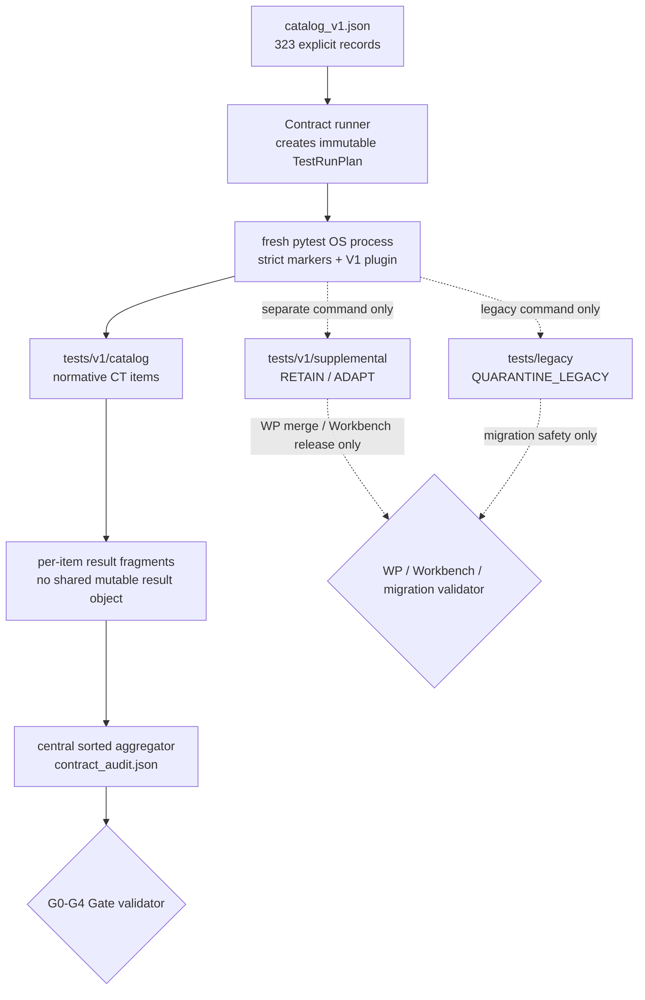
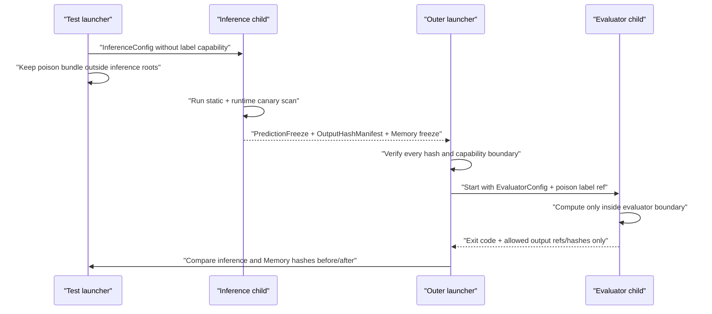

# Legacy 迁移、Artifact 图与 Contract Test 代码实现设计

> 文档编号：Implementation Design 04
> 状态：有条件通过；2026-07-18 已完成首轮架构评审修订，待高级架构师复核；不授权代码开发
> 前置设计：`00_engineering_architecture_overview.md`、`01_schema_protocol_and_adapter_design.md`、`02_runtime_agents_and_state_ownership_design.md`、`03_memory_persistence_retrieval_and_replay_design.md` 的最新修订版；其二次复核与跨文档勘误传播仍是对应 Gate 前置条件
> 规范基线：`docs/engineering_handoff/01_frozen_engineering_contracts.md` > `02_reference_algorithms.md` > `03_contract_test_matrix.md` > `04_theory_to_code_gap_analysis.md`
> 审计基线：`0afc8fd09a940f49f1c96ef51ddfcf13f3ddba9a`
> 测试 catalog：323 个具体 CT ID；318 是已关闭的上游旧计数
> 本文范围：WP0、WP10、WP11、WP12 的迁移、测试 harness、artifact graph、Evaluator gate、B9 报告与发布审计；不替代 Document 05 的工作包排期

## 1. 执行结论

Schema v1 验收不在现有 36 个平铺测试文件上增加 marker 或改几个断言完成，而是在逻辑旁路建立三类互不冒充的测试入口：

1. `tests/v1/catalog/`：323 个具体 `CT-*` identity 的唯一规范落点；只有这里的结果可进入 `ContractAuditV1`；
2. `tests/v1/supplemental/`：RETAIN/ADAPT 后的设备、进度、CLI/TUI、只读 projection 与 backend fixture 回归；可阻断相关工作包，但不得冒充 CT；
3. `tests/legacy/`：7 个 `QUARANTINE_LEGACY` 旧语义回归，仅服务 O0/O1、原型回归和迁移对照；默认 V1 gate 不收集、不写 `contract_audit.json`。

323 项 catalog 由一个显式、版本化、可 canonical hash 的 registry 驱动。每个具体 CT ID 恰好对应一个 pytest collected item、一个结果记录和一个 audit row；不存在 family wildcard 伪测试，也不因 asset 缺失而从 catalog 消失。`BLOCKED_ASSET` 是合法审计状态但不是 PASS，mandatory 项被阻断时对应 gate 不得通过。

规范 product run 继续使用稳定文件原生事实源。Inference freeze 后由 outer launcher 完整验证 `PredictionFreeze + OutputHashManifest + Memory freeze`，随后才启动独立 Evaluator OS 进程。单个 product run 的 Evaluator 只发布 `evaluation/` 与 immutable `metrics/` row fragments；跨 product run 的 bootstrap、A-F 六表与协议分栏属于独立 B9 Campaign root。Contract Tests 又属于独立 Audit Campaign root。三个 root 只能以已验证 ArtifactRef/hash 单向引用，任何 campaign 都不得回写 product run。

## 2. 权威顺序与不可反向修改边界

本文只把既有理论、Schema、runtime、Memory 与 test matrix 变成可执行组织，不重新定义任何公共对象或算法。

| Authority | 本文只允许细化 | 本文禁止改变 |
|---|---|---|
| Document 00 | suite namespace、G0-G4 gate、WP 验收组织 | V1 旁路、Legacy 隔离、进程拓扑、323 catalog |
| Document 01 | registry/artifact/audit fixture、resolver 测试 | public Schema、canonical codec、ArtifactRef、version/severity |
| Document 02 | runtime fault harness、static/capability tests | owner、窗口顺序、exactly-once、Evaluator launcher gate |
| Document 03 | crash/replay/CAS/index fixtures | event-only commit、Memory lifecycle、检索算法、namespace |
| Handoff 03 | pytest file/fixture/marker/runner 落点 | 每个 CT 的输入、断言、D、failure expectation |
| Handoff 04 | 36-file 迁移与工作包阻断关系 | 把 Legacy pass 当成 V1 gap closure |

冲突时遵循已冻结勘误：

- catalog 精确为 323：318 个 table-defined ID 加 5 个 prose-defined ID；
- accepted Memory event append+fsync 是唯一逻辑提交点；
- accepted identity/content/parent/raw-artifact 冲突在所有协议中都是 `RUN_FATAL`；
- attachment 中“318 个 CT”只保留为需求来源记录，不进入实现计数。

### 2.1 2026-07-18 高优先级评审勘误

| 主题 | 本文唯一实现解释 | 必须传播到 |
|---|---|---|
| ContractAudit identity | `ContractAuditV1.run_id` 在 Contract Test 域表示独立 `audit_campaign_id`；`freeze_manifest_hash` 表示 immutable runtime-private `AuditRunPlan.plan_hash`，不表示任一 product freeze | Documents 01/05，G1/G4 前 |
| B9 ownership | product run 只产生冻结 evaluation/metric row fragments；bootstrap、A-E 与 post-audit Table F 位于独立 B9 Campaign root | Documents 01/05，G4 前 |
| Table F dependency | item result fragments -> `ContractAuditV1` -> Table F projection；Table F 绝不进入同一 ContractAudit 的 hash/input graph | Documents 01/05，G4 前 |
| fixture mutation | 活动 Audit Campaign 只能发布 `candidate_counterexample`；源 regression corpus 只由独立人工批准 promotion 更新，并强制生成新 fixture manifest 与下一份 AuditRunPlan | Document 05，G1/G4 前 |
| evaluator artifacts | inference artifact read 与 evaluator/campaign artifact publish 是两个互不替代的 capability | Documents 01/05，G1/G4 前 |
| Gate evidence | G0-G4 的测试证据只来自规范 ContractAudit；Supplemental 只阻断 WP merge/Workbench 发布，Legacy 只阻断迁移安全 | Documents 00/05，各 Gate 前 |
| mini claim | `NO_RESEARCH_CLAIM` 从 frozen mini config identity 推导，只写 evaluator report metadata/UI projection；不得给 public ExperimentFreeze/RunManifest 偷加字段 | Documents 01/05，G4 前 |
| Hypothesis pin | 官方 PyPI 于 2026-07-10 已发布 6.156.6；保留 `hypothesis==6.156.6`，并冻结实际 distribution 与 installed package-file hashes | environment/provenance fixtures |
| Memory indexes | operational layout 服从 Document 03 的 immutable bundle + active pointer，不保留 flat index tree | Document 05，G3/G4 前 |
| RunManifest | 每个 product run 只有稳定 `run_manifest.json` projection；重跑产生新 run/campaign identity，不创建 revision directory | Documents 01/05，各 Gate 前 |

## 3. Live baseline 证据与迁移结论

当前基线证明测试旁路必须新建，而不是原地宣称合规。

| Live evidence | 当前事实 | V1 处置 |
|---|---|---|
| `pytest.ini:1-4` | 只配置 flat `tests`、basetemp；无 marker/plugin/gate | 改为显式 V1/Legacy 命令；注册严格 marker |
| `requirements.txt:160` | `pytest==8.3.5`；无 Hypothesis | test-only 增加冻结的 `hypothesis==6.156.6`；记录实际 distribution filename/PyPI SHA-256、installed package-file hash 与 runtime/ABI/platform provenance |
| 36 个 `tests/test_*.py` | 102 个 syntax-level `test_*` function；无 CT ID | 按第 7 节逐文件迁移，不批量改名冒充 CT；102 不等于 catalog item 数 |
| tests 全目录扫描 | 无 `contract_audit`、`BLOCKED_ASSET`、`NO_RESEARCH_CLAIM`、PredictionFreeze、Hypothesis | registry/plugin/audit writer 全部为 V1 side-path 新建 |
| `src/app/models.py:27-63` | status/request 同时持有 annotation、normal label、inference 配置 | 保留为 Legacy；V1 launcher 使用物理分离 config |
| `src/app/orchestrator.py:65-107` | annotation 等直接传给同进程 workflow | V1 workbench 只构造 inference request 或 evaluator request，不能合并 |
| `src/pipelines/run_agentic_workflow.py:129-200,248-301` | pipeline、metrics、comparison 同一调用面并写 ad-hoc 文件 | V1 inference 先退出 capability graph；outer launcher 后启 Evaluator |
| `src/eval/agentic_vad_metrics.py:55-108` | evaluator primitive 直接接收 label paths | 只在独立 Evaluator Adapter 内复用 metric primitive |
| `src/app/status.py:150-166` | 递归选择“最新” comparison 文件 | V1 只读显式 run root，经 RunManifest/audit/protocol 验证 |
| `src/app/results.py:9-25` | 固定读取 root 下两份旧文件 | Adapter 读取稳定 B9 paths，不猜测、不择优 |

现有文件和用户生成 artifact 不由迁移脚本删除或覆盖。WP0 先建立新目录、命令与 namespace；随后逐文件切换。G4 前 Legacy 仍可显式运行。

## 4. 测试进程与目录拓扑



目标目录固定为：

```text
tests/
  v1/
    plugin.py
    conftest.py
    catalog/
      catalog_v1.json
      test_ct_com.py
      test_ct_b0.py
      test_ct_b1.py
      test_ct_b2.py
      test_ct_b3.py
      test_ct_b4.py
      test_ct_b5_episode.py
      test_ct_b5_numeric.py
      test_ct_b5_key_firewall.py
      test_ct_b5_admission.py
      test_ct_b5_reservoir.py
      test_ct_b5_retrieval.py
      test_ct_b6.py
      test_ct_b8_permissions.py
      test_ct_b8_messages.py
      test_ct_b8_writes.py
      test_ct_concurrency.py
      test_ct_persistence.py
      test_ct_artifacts.py
      test_ct_b9_config.py
      test_ct_b9_paired.py
      test_ct_b9_order.py
      test_ct_b9_statistics.py
    fixtures/
      canonical/
      datasets/
      events/
      memory/
      poison/
      raw_outputs/
      regression/
    harness/
      assertions.py
      asset_gate.py
      audit_writer.py
      fault_plan.py
      plan.py
      registry.py
      result_fragments.py
    supplemental/
      adapters/
      evaluator/
      projections/
      workbench/
  legacy/
    conftest.py
    memory/
    pipeline/
scripts/
  run_contract_tests.py
  promote_contract_counterexample.py
```

`tests/v1/catalog/catalog_v1.json` 是 executable registry 的唯一源文件；Python loader 只能 strict decode/validate 它，不能在 import 时从 Markdown、文件名、pytest discovery 或 plugin entrypoint 动态补记录。其 canonical hash、Python/pytest/Hypothesis 版本与包文件 hash进入 TestRunPlan 和环境 provenance。

## 5. Suite 隔离规则

### 5.1 四重隔离

| Boundary | Schema v1 | Legacy | 验证方式 |
|---|---|---|---|
| Config | `InferenceConfigV1` / `EvaluatorConfigV1` slice | 旧 `RunRequest` | import test + constructor negative test |
| Artifact root | `data/agentic_outputs/v1/...` | 明确 `legacy/` root 或旧 root | resolver containment + before/after hash |
| Memory namespace | `data/agentic_memory/v1/...` | 旧 JSON/Chroma root | writer root type + namespace lock test |
| Test entry/report | `tests/v1/catalog` / ContractAuditV1 | `tests/legacy` /普通 pytest report | command path + collection audit |

禁止：

- root `python -m pytest` 在未声明 suite 时混收两者；
- Legacy fixture 导入 `tests/v1/catalog` 或 V1 catalog 导入 `src.memory`、旧 Score/RAG/Policy；
- Legacy test node 出现在 `ContractAuditV1.tests`；
- 同一个 fixture 同时持有 V1 writer 与 Legacy writer；
- RETAIN/ADAPT supplemental test 复制 CT ID marker；
- 一个 V1 failure 在同一 run 内回退执行 Legacy assertion。

迁移后的 root `pytest.ini` 默认 `testpaths` 只指向 `tests/v1/supplemental` 并启用 strict markers，因此 `python -m pytest` 是快速 supplemental regression，不生成 ContractAudit。规范 CT 只能经 `scripts/run_contract_tests.py` 进入，Legacy 只能通过显式 `tests/legacy -m legacy` 进入；任何命令都不会隐式混收三类 suite。

### 5.2 静态和运行时证明

静态 import test 扫描 AST/import graph，至少断言：

- `tests/v1/catalog` 不 import `tests.legacy`、`src.memory`、`src.tools.score_tool`、旧 RAG/Policy/Promotion；
- `src.tfavad` 不 import `tests` 或 Legacy source；
- Evaluator package 不 import inference writer、Memory writer、Tool/Decision event writer；
- inference package 不 import annotation loader、metric/bootstrap/report implementation。

运行时 capability test 为每个 Composition Root 注入 canary Port：未授权调用立即记录 capability ID 并失败。标签 poison、writer canary、path escape、Windows 大小写别名、junction/reparse point 和嵌套配置对象均必须覆盖。

## 6. 四类迁移处置的精确定义

| Disposition | 可保留内容 | 必须改变 | 完成条件 |
|---|---|---|---|
| `RETAIN` | 不含理论语义的断言与 fixture | import/target 可切到 shared/workbench adapter；移入 supplemental | 原断言仍成立，且无 CT ID/Legacy writer |
| `ADAPT` | 测试意图、stub、UI interaction | Schema、config slice、path、process/capability、expected artifact | 新 V1 supplemental test 通过；对应 CT 仍独立通过 |
| `REPLACE` | 无可执行旧断言；只保留迁移记录/git history | 由明确 CT module/range替代 | 对应 CT 全通过后旧文件退出 runnable collection |
| `QUARANTINE_LEGACY` | 旧 prototype/O0/O1 行为 | 移入 `tests/legacy`，加 `legacy` marker和独立 roots | 显式 Legacy 命令通过；默认 V1 collection 为 0 |

RETAIN/ADAPT 不是 V1 contract proof；REPLACE 也不表示删除旧产品代码；QUARANTINE pass 不能关闭任何 G1-G4 条件。

## 7. 36 个现有测试文件的具体迁移

下表覆盖 live baseline 全部 36 文件，数量闭合为 RETAIN 10、ADAPT 14、REPLACE 5、QUARANTINE_LEGACY 7。

| Current file | 处置 | Target / replacement | CT relation | Gate effect |
|---|---|---|---|---|
| `test_agentic_pipeline_contract.py` | REPLACE | `test_ct_b4.py`, `test_ct_b6.py`, `test_ct_b8_writes.py`, `test_ct_concurrency.py` | W0、B4 commit、freeze/permit/CAS | G2/G3 blocking |
| `test_agentic_vad_metrics.py` | ADAPT | `supplemental/evaluator/test_metric_adapter.py` | CT-B0-008/009、CT-ART-010、CT-B9-S01..S15 独立 | WP11 blocking |
| `test_agentic_workflow_runner.py` | ADAPT | `supplemental/workbench/test_v1_workflow_runner.py` | CT-ART-001..011 独立 | WP10/WP12 blocking |
| `test_calibration.py` | QUARANTINE_LEGACY | `legacy/pipeline/test_legacy_calibration.py` | 旧 retrieval confidence；V1 用 CT-B6-* | Legacy only |
| `test_case_store.py` | QUARANTINE_LEGACY | `legacy/memory/test_legacy_case_store.py` | V1 用 CT-B5-*、CT-PER-* | Legacy only |
| `test_memory_policy.py` | QUARANTINE_LEGACY | `legacy/memory/test_legacy_memory_policy.py` | V1 用 CT-B5-K/A/R* | Legacy only |
| `test_memory_promotion.py` | QUARANTINE_LEGACY | `legacy/memory/test_legacy_promotion.py` | V1 无 threshold promotion | Legacy only |
| `test_orchestrator_progress.py` | ADAPT | `supplemental/projections/test_progress_projection.py` | event ledger CT-CON-* 独立 | WP12 blocking |
| `test_perception_agent.py` | REPLACE | `test_ct_b1.py`, `test_ct_b3.py`, `test_ct_concurrency.py` | tool plan/failure/write-ahead | G2 blocking |
| `test_promote_case_memory_pipeline.py` | QUARANTINE_LEGACY | `legacy/pipeline/test_legacy_promotion_pipeline.py` | V1 用 permit/CAS | Legacy only |
| `test_rag_tool.py` | REPLACE | B5 key/firewall/retrieval modules | CT-B5-K01..K09/Q01..Q17 | G3 blocking |
| `test_repl_parser.py` | RETAIN | `supplemental/workbench/test_repl_parser.py` | 无 CT | WP12 blocking |
| `test_repl_renderer.py` | ADAPT | `supplemental/workbench/test_repl_renderer.py` | B9 report validator独立 | WP12 blocking |
| `test_repl_shell.py` | ADAPT | `supplemental/workbench/test_repl_shell.py` | config/process isolation独立 | WP12 blocking |
| `test_run_monitor.py` | RETAIN | `supplemental/projections/test_run_monitor.py` | projection非事实源 | WP12 blocking |
| `test_runtime_device.py` | RETAIN | `supplemental/adapters/test_runtime_device.py` | CT-B1 provenance独立 | WP4 blocking |
| `test_schemas.py` | REPLACE | `test_ct_com.py` | CT-COM-001..019 | G1 blocking |
| `test_score_tool.py` | QUARANTINE_LEGACY | `legacy/pipeline/test_legacy_score_tool.py` | O0/O1 only | Legacy only |
| `test_session_memory_store.py` | REPLACE | B5 Episode/retrieval + persistence modules | CT-B5-E*/Q*、CT-PER-011 | G3 blocking |
| `test_story_memory_agent.py` | QUARANTINE_LEGACY | `legacy/memory/test_legacy_story_memory_agent.py` | rolling story/policy prototype | Legacy only |
| `test_textual_home_state.py` | ADAPT | `supplemental/workbench/test_textual_home_state.py` | readiness tiers独立 | WP12 blocking |
| `test_textual_refresh.py` | RETAIN | `supplemental/workbench/test_textual_refresh.py` | 无 CT | WP12 blocking |
| `test_textual_sections.py` | RETAIN | `supplemental/workbench/test_textual_sections.py` | 无 CT | WP12 blocking |
| `test_tui_actions.py` | ADAPT | `supplemental/workbench/test_tui_actions.py` | config/protocol identity独立 | WP12 blocking |
| `test_tui_async_run.py` | RETAIN | `supplemental/workbench/test_tui_async_run.py` | 注入 V1 runner Port | WP12 blocking |
| `test_tui_auto_refresh.py` | RETAIN | `supplemental/workbench/test_tui_auto_refresh.py` | 无 CT | WP12 blocking |
| `test_tui_background_run.py` | RETAIN | `supplemental/workbench/test_tui_background_run.py` | 注入 V1 runner Port | WP12 blocking |
| `test_tui_launcher.py` | RETAIN | `supplemental/workbench/test_tui_launcher.py` | Legacy/V1 command explicit | WP12 blocking |
| `test_tui_live_poll.py` | RETAIN | `supplemental/projections/test_tui_live_poll.py` | 只读 projection | WP12 blocking |
| `test_tui_monitor_bridge.py` | ADAPT | `supplemental/projections/test_monitor_bridge.py` | 无写 capability | WP12 blocking |
| `test_tui_run_control.py` | ADAPT | `supplemental/workbench/test_tui_run_control.py` | no-label config slice | WP12 blocking |
| `test_tui_run_execute.py` | ADAPT | `supplemental/workbench/test_tui_run_execute.py` | stable run root/audit status | WP12 blocking |
| `test_unified_app_entry.py` | ADAPT | `supplemental/workbench/test_app_entry.py` | explicit v1/legacy/evaluate commands | WP12 blocking |
| `test_unified_dashboard.py` | ADAPT | `supplemental/workbench/test_dashboard.py` | smoke/contract/experiment readiness | WP12 blocking |
| `test_unified_status_and_results.py` | ADAPT | `supplemental/workbench/test_status_results.py` | manifest/audit/protocol reader | WP12 blocking |
| `test_vlm_tool.py` | ADAPT | `supplemental/adapters/test_vlm_backend_adapter.py` | CT-COM time、CT-B1 provenance独立 | WP4 blocking |

迁移顺序固定为：先复制/建立目标 fixture 与新 assertion，运行新入口；RETAIN/ADAPT 新测试通过后停止收集旧 flat 文件；REPLACE 对应 CT 通过后停止收集旧文件；QUARANTINE 先移动并证明 root/marker 隔离。禁止“大移动后再补测试”。

## 8. 323-ID catalog 的更正与闭合

### 8.1 数量来源

Handoff test matrix 有 318 个唯一 Markdown 表格 ID，但其中没有把以下五个可执行 prose ID计入表格行：

`CT-COM-016`、`CT-B2-008`、`CT-B2-026`、`CT-B5-N01`、`CT-B6-009`。

另有 `CT-COM-017..019` 三个 compact vector 行缺标准 level/fixture/D/severity metadata。registry 必须把这八项全部规范化，不改变断言。最终 family 与 level 双重求和均为 323：

| Family | Count | Level split | Primary WP |
|---|---:|---|---|
| CT-COM | 19 | L0 19 | WP1 |
| CT-B0 | 15 | L0 6 / L2 7 / L3 2 | WP2 |
| CT-B1 | 13 | L1 13 | WP4 |
| CT-B2 | 26 | L0 26 | WP5 |
| CT-B3 | 23 | L0 20 / L1 3 | WP4 |
| CT-B4 | 27 | L0 26 / L3 1 | WP6 |
| CT-B5 | 62 | L0 61 / L1 1 | WP7 |
| CT-B6 | 22 | L0 19 / L1 3 | WP8 |
| CT-B8 | 36 | L0 36 | WP3/WP9 |
| CT-CON | 10 | L0 6 / L1 4 | WP3/WP9 |
| CT-PER | 12 | L0 12 | WP10 |
| CT-ART | 11 | L2 11 | WP10 |
| CT-B9 | 47 | L0 36 / L3 9 / L4 2 | WP11 |
| **Total** | **323** | **L0 267 / L1 24 / L2 18 / L3 12 / L4 2** | WP1-WP11 |

### 8.2 非标准行与勘误 metadata

以下记录在首个 `tfavad.contract-tests/1.0.0` registry 中显式补齐，属于已批准 catalog 的规范化，不是运行时推断：

| Test ID | Level | Fixture | Determinism | Expected failure | Required assertion |
|---|---|---|---|---|---|
| CT-COM-016 | L0 | canonical JSON golden bytes | STRUCTURAL_EXACT | NONE | 三个 vector bytes/SHA-256 与 key reorder精确 |
| CT-COM-017 | L0 | CMP tolerance vector | STRUCTURAL_EXACT | NONE | `CMP(0.5,0.5+5e-13)=0` |
| CT-COM-018 | L0 | CMP non-tie vector | STRUCTURAL_EXACT | NONE | `CMP(0.5,0.5+1e-8)=-1` |
| CT-COM-019 | L0 | ranking tie vector | STRUCTURAL_EXACT | NONE | tolerance tie按 hash升序 |
| CT-B2-008 | L0 | hand-computed time envelope | NUMERIC_EQUIVALENT | NONE | segment order/IDs结构精确，`P_m=.46,N_m=0,q_m=.46,d_m=1`数值一致 |
| CT-B2-026 | L0 | B2 property corpus | NUMERIC_EQUIVALENT | NONE | 10,000合法组合的bounds/closure/symmetry |
| CT-B5-N01 | L0 | B5 hand numeric vector | NUMERIC_EQUIVALENT | NONE | `q_case=.55,d_case=.2/.55,u_case=.8,directional_mass=.4,C=.2/(.4+2^-52)`，且 R不再乘u/C |
| CT-B6-009 | L0 | B6 hand fusion vector | NUMERIC_EQUIVALENT | NONE | `e_hat=.37,r_hat=.44,d_hat=.37/.44,u_hat=.63` 且 `abs(e_hat)<=r_hat` |

accepted identity/content/parent/raw-artifact conflict 的 severity 同时按已批准 C-03 勘误固化：`CT-B8-M05`、`CT-B8-M06`、`CT-PER-002`、`CT-PER-004` 在所有 protocol 的 registry expected failure 均为 `RUN_FATAL`。不得保留旧的 Independent `VIDEO_FATAL` 分支。

### 8.3 Registry record

每个 `ContractTestSpec` 的 test-only wire record 固定包含：

```text
test_id
contract_version
level
determinism
expected_failure
fixture_ids[]
pytest_module
pytest_case
work_packages[]
blocking_gates[]
asset_requirement_ids[]
applicability_rule_id
assertion_spec_ids[]
```

它不复制 target labels、绝对路径或 fixture payload。`catalog_hash` 是 323 个 record 按 test ID 排序后 canonical serialization 的 SHA-256。任何 ID、metadata、assertion spec、level 或 gate 变化需要新的 `contract_version`，不能在相同 `tfavad.contract-tests/1.0.0` 下热改。

## 9. pytest collection 与 audit bijection

### 9.1 一对一规则

每个 catalog module 使用显式 parameter record，pytest parameter ID 精确等于 CT ID。规范 node 形态为：

```text
tests/v1/catalog/test_ct_b5_retrieval.py::test_contract_case[CT-B5-Q13]
```

collection hook 在任何 test body 运行前完成：

1. 验证 registry canonical hash 与 TestRunPlan；
2. 验证 323 个 registry ID 唯一、排序和 family/level count；
3. 验证每个 selected node 恰好有一个 `ct_id`、一个 level、一个 determinism；
4. 验证 node parameter ID 与 registry `test_id` 相同；
5. 拒绝未知 ID、重复 ID、family wildcard ID、supplemental/Legacy 的 CT marker；
6. 对 full catalog plan 验证 collected set 精确等于 323；
7. 对 partial plan 验证 selected set 精确等于 plan，不允许把 partial audit 当 release audit。

pytest 官方文档确认 parameter case 有独立 node ID、自定义 marker 应显式注册，collection/report hook 可读取和验证 items；本设计按当前 `pytest==8.3.5` 只使用公开扩展点，不 import `_pytest` 私有实现。[pytest 8.3 markers and node IDs](https://docs.pytest.org/en/8.3.x/example/markers.html)；[pytest hook API](https://docs.pytest.org/en/8.3.x/how-to/writing_hook_functions.html)

### 9.2 Marker registry

必须注册且启用 `--strict-markers`：

```text
contract_case
contract_l0
contract_l1
integration_mini
frozen_artifact
full_protocol
requires_gpu
requires_model_asset
requires_dataset_asset
fault_serial
v1_supplemental
legacy
```

一个 CT 只能有一个 level marker；asset marker 可多选；`legacy` 与任何 contract marker 互斥。`pytest.skip`、`xfail`、`xpass` 不是 `ContractAuditV1` 终态，规范 catalog test 作者不得直接调用它们。

## 10. 323 项到 pytest module 的精确落点

| Module | Exact IDs | Count | Fixture / input focus | Expected focus | WP / blocking |
|---|---|---:|---|---|---|
| `test_ct_com.py` | CT-COM-001..019 | 19 | raw JSON、Schema objects、time/hash vectors | exact reject/canonical/CMP | WP1 / G1 |
| `test_ct_b0.py` | CT-B0-001..015 | 15 | protocol configs、GT poison、freeze | isolation/causal/gate | WP2 / G1 |
| `test_ct_b1.py` | CT-B1-001..013 | 13 | stub backend/raw outputs | source/quality/failure | WP4 / G2 |
| `test_ct_b2.py` | CT-B2-001..026 | 26 | packets/atoms/time/family vectors | bounded fusion/conflict | WP5 / G2 |
| `test_ct_b3.py` | CT-B3-001..023 | 23 | registry/gaps/budgets | deterministic finite plan | WP4 / G2 |
| `test_ct_b4.py` | CT-B4-001..027 | 27 | frozen sequences/state versions | clock/state/exactly once | WP6 / G2 |
| `test_ct_b5_episode.py` | CT-B5-E01..E09 | 9 | committed B4 sequences | Episode/session visibility | WP7 / G3 |
| `test_ct_b5_numeric.py` | CT-B5-N01..N05 | 5 | hand vectors | medoid/R/C/d/u exact | WP7 / G3 |
| `test_ct_b5_key_firewall.py` | CT-B5-K01..K09 | 9 | candidate parents/keys | observation-only/no labels | WP7 / G3 |
| `test_ct_b5_admission.py` | CT-B5-A01..A10 | 10 | gates/novelty/duplicate | immutable lifecycle | WP7 / G3 |
| `test_ct_b5_reservoir.py` | CT-B5-R01..R12 | 12 | U/log-key/role streams | capacity/order/idempotency | WP7 / G3 |
| `test_ct_b5_retrieval.py` | CT-B5-Q01..Q17 | 17 | fixed view ranks/failures | ordered top-k/firewall | WP7 / G3 |
| `test_ct_b6.py` | CT-B6-001..022 | 22 | local/advice/pass1 tuples | F0/bounds/one B4 | WP8 / G3 |
| `test_ct_b8_permissions.py` | CT-B8-P01..P13 | 13 | capability canaries | deny unauthorized roles | WP3 / G1 |
| `test_ct_b8_messages.py` | CT-B8-M01..M09 | 9 | envelope/parent/replay | identity/exactly-once | WP3 / G1 |
| `test_ct_b8_writes.py` | CT-B8-W01..W14 | 14 | freeze/permit/CAS | predict-before-write | WP9 / G3 |
| `test_ct_concurrency.py` | CT-CON-001..010 | 10 | schedules/crash/duplicates | deterministic effects | WP3/WP9 / G1,G3 |
| `test_ct_persistence.py` | CT-PER-001..012 | 12 | events/snapshots/index deletion | replay/repair/tamper | WP10 / G4 |
| `test_ct_artifacts.py` | CT-ART-001..011 | 11 | mini stable run root | hash graph/allowlist | WP10 / G4 |
| `test_ct_b9_config.py` | CT-B9-C01..C12 | 12 | config/mechanism registries | unique/frozen settings | WP11 / G4 |
| `test_ct_b9_paired.py` | CT-B9-P01..P08 | 8 | frozen paired artifacts | invariant/delta parents | WP11 / G4 |
| `test_ct_b9_order.py` | CT-B9-O01..O12 | 12 | order/seed/perturb manifests | no selection/leakage | WP11 / G4 |
| `test_ct_b9_statistics.py` | CT-B9-S01..S15 | 15 | metric/bootstrap/report registry | protocol-separated A-F | WP11 / G4 |

表中 range 是文档展示压缩；`catalog_v1.json` 必须逐 ID 列出 323 条，loader 不提供 range expansion API。

## 11. L0-L4 执行入口与 TestRunPlan

### 11.1 对外命令

`scripts/run_contract_tests.py` 先验证环境/registry/asset manifest，生成 immutable `TestRunPlan`，再用 `sys.executable` 启动新的 pytest OS 进程；不在已 import heavy runtime 的当前进程调用 pytest。

```text
# 全部 L0
python scripts/run_contract_tests.py --through L0 --audit-root-id V1_AUDITS

# 全部 L0+L1
python scripts/run_contract_tests.py --through L1 --audit-root-id V1_AUDITS

# mini L0-L2
python scripts/run_contract_tests.py --through L2 --audit-root-id V1_AUDITS --asset-manifest-ref <ref>

# frozen L0-L3
python scripts/run_contract_tests.py --through L3 --audit-root-id V1_AUDITS --asset-manifest-ref <ref>

# full L0-L4
python scripts/run_contract_tests.py --through L4 --audit-root-id V1_AUDITS --asset-manifest-ref <ref>

# 单个具体 ID
python scripts/run_contract_tests.py --test-id CT-B5-Q13 --audit-root-id V1_AUDITS

# Supplemental，不产生 ContractAudit
python -m pytest tests/v1/supplemental -m v1_supplemental --strict-markers

# Legacy，只产生普通 Legacy test report
python -m pytest tests/legacy -m legacy --strict-markers
```

`--through Lx` 总是包含从 L0 到 Lx；不能解释为“只跑 Lx”。单 ID/partial plan 可用于开发诊断，但其 audit 没有 release eligibility。

### 11.2 TestRunPlan private artifact

`AuditRunPlan` 是 runtime-private、deeply immutable、canonical JSON-safe artifact，不进入公共 V1 object registry。字段关闭为：

```text
AuditRunPlan = {
  audit_campaign_id,
  schema_version / protocol_version / contract_version,
  catalog_ref / catalog_hash / selected_test_ids / required_levels / suite,
  fixture_manifest_ref / fixture_manifest_hash,
  asset_readiness_manifest_ref / asset_readiness_manifest_hash,
  environment_manifest_ref / environment_hash,
  hypothesis_profile / hypothesis_seed,
  worker_shard_plan,
  authorized_input_root_ids / authorized_output_root_id,
  product_artifact_inputs: tuple[ArtifactRefV1,...],
  item_specs: tuple[{test_id,item_run_id,item_plan_hash,fixture_hashes,required_asset_ids},...],
  creation_nonce,
  plan_hash,
  created_at_utc
}
```

`item_specs` 按 test ID 升序；每个 `item_run_id = HASH_TUPLE(audit_campaign_id,test_id,item_plan_hash)`，不能等于或冒充 product `run_id`。`plan_hash` 覆盖除自身、`audit_campaign_id`、`created_at_utc` 外的全部字段并包含 creation nonce；`audit_campaign_id = HASH_TUPLE("contract-audit-campaign/v1",plan_hash)`。Plan 发布后只读；变更任何绑定项产生新 plan/hash/campaign ID，原 campaign 永不续写。

公共字段解释固定为：

```text
ContractAuditV1.run_id == AuditRunPlan.audit_campaign_id
ContractAuditV1.freeze_manifest_hash == AuditRunPlan.plan_hash
ContractAuditV1 version tuple == AuditRunPlan version tuple
```

这是一项对 frozen Contract §7.9 “same run”的显式高优先级勘误：这里的 `run` 是 Contract Audit Campaign，不是任一 protocol/dataset product run。每个 item fragment 必须绑定 `audit_campaign_id + plan_hash + test_id + item_run_id + item_plan_hash`；顶层 Audit 只引用同一 plan 中全部 selected item terminal results。CLI 只接受已注册 root ID，不接受物理 `--run-root` path；resume 必须显式给出既存 campaign ID 并重验 exact plan bytes。

## 12. Fixture 体系

### 12.1 十个规范 fixture family

| Fixture | Canonical contents | Consumers | Forbidden dependency |
|---|---|---|---|
| `FX-EMPTY` | Memory v0、空三事件流、合法 freeze/run manifest | COM/B0/B8/PER | live Legacy store |
| `FX-WINDOW-3` | 3 个递增 integer-us half-open windows、aux frame/FPS | COM/B2/B4 | float seconds authority |
| `FX-B2-PACKETS` | positive/negative/context/missing/overlap packets | B1/B2/B6 | labels/history |
| `FX-B3-REGISTRY` | 4 capability/cost/order actions | B3/CON | measured target accuracy |
| `FX-B4-SEQUENCES` | normal/spike/sustained/missing/recovery/counter | B4/B5/B9 | Memory advice in source facts |
| `FX-CASES-10` | 10 observation-only cases、two roles、conflict、duplicate | B5/B6 | payload pre-rank access |
| `FX-STREAM-3` | fixed 3-video order、2-3 windows each | B0/B5/B8/B9 | target-selected order |
| `FX-EVENT-CRASH` | tool-started、B4-precommit、Memory CAS points | CON/PER | wall-time scheduling |
| `FX-LEGACY` | frozen old Observation/Case/Retrieval/Calibration bytes | Adapter/Legacy | direct V1 acceptance |
| `FX-GT-POISON` | conspicuous content/path/env/nested sentinels | B0/B8/ART | inference root mount |

每个 fixture 由 canonical manifest 列出 schema/version、relative URI、byte length、SHA-256、builder version。测试获取 verified bytes或 V1 object，不获取任意 `Path`、DB connection、mutable store 或可逃逸 resolver。

### 12.2 每测试隔离

- 每个 item 使用新的 `item_run_id`、campaign item root、Memory namespace、event sequences、RNG scope和 environment map；它们不能与 product run ID/root混用；
- Stream 默认从 v0 empty snapshot 启动；只有 replay/restore test 可以加载显式前态；
- temp root 必须位于 TestRunPlan 授权 root，Windows 大小写别名和 reparse point 检查与生产 resolver相同；
- global RNG、process env、SQLite、Chroma/FAISS、BM25/Temporal bundle、Hypothesis cache不得跨 item 共享；
- failure 时保留 artifact refs；PASS 后 derived indexes可删，但 authoritative events/snapshots/cases不得被清理逻辑误删；
- fixture builder 不读取 annotation；GT poison builder只服务 Evaluator boundary test。

## 13. Property-Based 与变形测试

### 13.1 冻结 Hypothesis 环境

主线 test-only 依赖精确为 `hypothesis==6.156.6`。2026-07-18 对官方 PyPI JSON 的核验确认 6.156.6 已于 2026-07-10 发布且是当前版本；“6.156.6 尚不存在”的评审事实不成立，因此不得基于该理由降级到 6.156.4。[Hypothesis PyPI](https://pypi.org/project/hypothesis/)

environment manifest 还必须记录 Python runtime/ABI/platform、pytest/Hypothesis/插件版本、实际安装 distribution filename 与其 PyPI SHA-256、安装后 package-file hashes；不能仅凭版本字符串声称环境相同。规范 profile 使用公开 API 注册/加载，固定：

```text
profile_name = tfavad_contract_v1
hypothesis_seed = 0
database = None
deadline = None
derandomize = false          # explicit seed is the authority
suppress_health_check = ()   # no hidden suppression
print_blob = true            # diagnostic only, never durable authority
```

`max_examples` 由每个 family test spec 显式设置，不能由本地环境变量降低。Hypothesis 官方文档确认 profile 必须 register 后 load，`--hypothesis-profile`/`--hypothesis-seed` 是公开入口，example database和 `@reproduce_failure` blob不提供跨版本的 correctness authority。[Hypothesis settings](https://hypothesis.readthedocs.io/en/latest/tutorial/settings.html)；[replaying failures](https://hypothesis.readthedocs.io/en/latest/tutorial/replaying-failures.html)

### 13.2 最低样本与 strategy 边界

| Property family | Minimum | Generated input | Properties | CT owner / gate |
|---|---:|---|---|---|
| B2 bounds/symmetry | 10,000 | legal P/N/Q、families、overlap/conflict | bounded、closure、direction symmetry、missing identity | CT-B2-026 + adjacent B2 / G2 |
| B3 controller | 5,000 | finite registries、gaps、cost/budgets | lexicographic determinism、finite termination、no repeat | CT-B3-* / G2 |
| B5 reservoir | 2,000 streams | K=0/2/3/4/5/128、roles、portable U/keys | capacity、role guarantee、single-pass equivalence | CT-B5-R* / G3 |
| B5 retrieval | 2,000 queries | view availability、rank lists、ties、failures | RRF/order/firewall/rerank fallback | CT-B5-Q* / G3 |
| B6 fusion | 10,000 | bounded local/memory tuples | identity、bounds、direction symmetry、abstain | CT-B6-009/012 + family / G3 |
| B4 recurrence | 10,000 sequences | e/r/d/rho/delta/missing | bounds、clock/state invariants、z isolation | CT-B4-* / G2 |
| Replay/concurrency | 1,000 schedules | duplicate/reorder/crash/commit outcomes | same accepted state and effect counts | CT-CON/PER / G1,G4 |

Strategies only construct inputs inside the declared domain except tests whose purpose is validation rejection. Floats use explicit finite bounds and `allow_nan=False/allow_infinity=False`; NaN/Infinity rejection is covered by dedicated raw-boundary examples, not silently filtered from invalid-input tests.

### 13.3 Counterexample durability

Hypothesis shrink output先写当前 Audit Campaign 的 test-only staging，转换为 public V1/canonical candidate 并验证后，只能 no-clobber 发布到：

```text
data/agentic_outputs/v1/audit_campaigns/<audit_campaign_id>/
  candidate_counterexamples/<family>/<candidate_sha256>.json
```

candidate metadata 记录 CT ID、item run ID、AuditRunPlan hash、Hypothesis/Python/distribution hash、seed、strategy ID、minimal canonical input hash和首次 failure fragment ref。活动 pytest child、plugin、aggregator与当前 campaign 都没有 `tests/v1/fixtures/regression/` writer capability；当前 fixture manifest/hash与 TestRunPlan bytes保持不变。

只有独立、人工确认的命令可以 promotion：

```text
python scripts/promote_contract_counterexample.py \
  --audit-campaign-id <id> \
  --candidate-ref <registered-ref> \
  --approval-ref <review-record-ref>
```

该命令在 campaign 结束后重验 candidate/ref/approval，使用 no-clobber 写入 `tests/v1/fixtures/regression/<family>/<fixture_sha256>.json`，原子更新 version-controlled regression index，生成新的 fixture manifest/hash。promotion 不改变原 Audit；所有消费新 corpus 的执行必须创建下一份 AuditRunPlan 与新 audit campaign ID。不得依赖 `.hypothesis/` database、不可移植 blob或删除“不利”反例来恢复通过。

## 14. 故障注入架构

### 14.1 FaultPlan

所有故障由 test-only immutable `FaultPlan` 注入到 Adapter/Port 边界，不在 domain algorithm 中增加 `if testing`。record 包含：

```text
fault_plan_id
fault_point
occurrence
mode
expected_durable_before[]
expected_absent_before[]
resume_policy
expected_failure_code
```

`mode` 只允许 `RETURN_FAILURE | RAISE_BEFORE_EFFECT | RAISE_AFTER_EFFECT | CHILD_PROCESS_CRASH | CORRUPT_BYTES | DENY_CAPABILITY`。真实 durability test 在子进程中使用 abrupt termination；纯算法 test 使用受控异常。测试结果不依赖 sleep、mtime或线程完成先后。

### 14.2 注入点与预期

| Fault point | Fixture/action | Expected durable result | CT IDs | WP / release |
|---|---|---|---|---|
| before Tool STARTED fsync | tool command | no charge/effect; same logical slot may retry | CON-001, B8-M* | WP3 / G1 |
| after STARTED before backend result | non-queryable backend | one debit; `TOOL_RESULT_INDETERMINATE`; no recall | CON-002..004 | WP3 / G1 |
| raw artifact staging/publish | completed backend | unpublished temp ignored; accepted hash never guessed | CON/ART-007 | WP3/WP10 / G1,G4 |
| before B4 commit | final B6 ready | no decision/state advance | CON-005 | WP6 / G2 |
| after B4 event acceptance | decision artifact/pointer lag | one B4 effect; projection repaired | CON-006/PER | WP6/WP10 / G2,G4 |
| case core staging | Memory CAS | no accepted event; temp garbage | PER-001/007 | WP9/WP10 / G4 |
| snapshot publish before event | Memory CAS | orphan snapshot; Memory version unchanged | B8-W/CON/PER | WP9/WP10 / G3,G4 |
| lock acquire/revalidate | stale writer | no event; recompute competition only | B8-W10/W11, CON | WP9 / G3 |
| accepted Memory event fsync | same permit | sole commit boundary; torn tail only legal truncation case | PER-001..004 | WP9/WP10 / G4 |
| after event before pointer | committed state | pointer repaired from event chain | PER-006/012 | WP10 / G4 |
| after pointer before SQLite | committed state | catalog deleted/rebuilt | PER-006/012 | WP10 / G4 |
| index build/switch | immutable snapshot | old complete bundle remains or new complete bundle switches | PER-009/010 | WP10 / G4 |
| output manifest byte tamper | frozen run | evaluator launch denied | ART-007/010 | WP10/WP11 / G4 |
| evaluator forbidden write | evaluator child | deny; inference/Memory hashes identical | B0-009, ART-010 | WP2/WP11 / G1,G4 |
| Stream VIDEO_FATAL | video i | run stops; no i+1 commits | B0/CON | WP2/WP3 / G1 |

## 15. Replay test design

### 15.1 Event replay matrix

| Category | Fixture / input | Expected result | CT IDs | Blocking |
|---|---|---|---|---|
| canonical stream | complete event 0..n | fields/effects/hash/cursors exact | PER-005 | G4 |
| snapshot cursor replay | legal snapshot + suffix | equals event-0 replay | PER-006 | G4 |
| corrupted latest snapshot | previous legal snapshot + events | same final state | PER-007 | G4 |
| ambiguous snapshot/events | two non-equivalent legal candidates | `MEMORY_EVENT_SNAPSHOT_DIVERGENCE/RUN_FATAL` | PER-008 | G4 |
| deleted indexes | snapshot/cases only | rebuild all views; same top-k/fallback | PER-009/010 | G4 |
| expired Session | full Memory event history | future readable scope excludes Session, audit remains | PER-011 | G4 |
| pointer divergence | bad current pointer | ignore as authority; repair or fatal if facts ambiguous | PER-012 | G4 |
| duplicate identical key | same payload/hash x100 | one logical effect | PER-003, B8-M04 | G1/G4 |
| duplicate conflicting key | different payload/parent/hash | universal RUN_FATAL, no second effect | PER-004, B8-M05/M06 | G1/G4 |

Replay assertions比较 canonical fields、accepted event identities、state versions、effect counts、artifact hashes和 top-k manifest；不比较 wall clock、PID、duration、temp filename。Fresh backend invocation 只比较允许的 numeric/provenance tier，已接受 raw-output artifact replay 必须 `STRUCTURAL_EXACT`。

### 15.2 Run resume

对每个 Window/Video/Memory phase建立 crash fixture。恢复流程验证三事件流、合法 snapshot和 OutputHashManifest，定位第一个未冻结 logical slot。已经接受的 Tool/B4/permit/CAS不再次执行；STARTED 且不可查询的外部 tool不静默重调；Stream 不跳过 fatal video构造不同历史。

## 16. CAS competition test design

CAS 测试验证 storage contract 的防御性，不改变“单一规范推理进程、规范提交串行”的生产拓扑。

### 16.1 固定竞争场景

1. 从同一个 `before_version/snapshot/cursor` 构造两个已冻结 candidate batch；
2. 为每个 batch派生固定 candidate IDs、U、W、log keys和 permit hash；
3. 两个 test client在独立子进程抵达同一 namespace lock；
4. scheduler fixture显式规定唯一 commit order，不用 timing决定赢家；
5. 第一个 client通过 revalidation并 append accepted event；
6. 第二个 client检测 stale version，释放锁，以同 candidate/U对新 snapshot重算 reservoir competition；
7. 第二次 revalidation后提交或产生确定 discard mutation；
8. 从 event 0 replay，验证最终 snapshot与串行 reference model一致。

### 16.2 必须断言

- Portalocker只提供互斥；version/cursor/snapshot/candidate hashes决定 CAS；
- same permit 1/2/100 次只产生一个 accepted logical effect和一个 version increment；
- stale retry不重跑视频、不改 Candidate core、不重抽 U、不改变 occurrence已有计数；
- thread/process completion order不改变 event total order；
- K=0、K=1、role guarantee边界、duplicate merge和全 discard batch都有 reference outcome；
- event accepted 后 pointer/catalog/index failure不能 rollback 或签补偿 event；
- 冲突 payload/parent/hash不成为普通 stale retry。

主要映射为 `CT-B8-W01..W14`、`CT-CON-007..010`、`CT-PER-001..008`，G3 验证写入因果，G4 验证 crash/replay 可复现。

## 17. Ground-truth poison test design

### 17.1 Poison surfaces

`FX-GT-POISON` 生成相同 sentinel 的多种编码：文件内容、文件名、目录名、绝对路径、相对路径、环境变量值、Windows 大小写变量名、8.3/路径别名、nested dict/list/model、exception message、`repr`、annotation class string和 metric key。Inference authorized roots完全不挂载 label bundle。

### 17.2 执行流程



必须扫描 inference messages、三个 event streams、raw/normalized artifacts、FailureAudit details、logs、exceptions、return values、dependency traces、progress projection和 output paths。任何 sentinel、annotation/label object、path或 metric content 出现在 inference side即 FAIL/RUN_FATAL。Evaluator 返回 launcher的控制面只含 exit status、safe failure code和 allowlisted output ArtifactRefs/hashes，不含 label/path/content。

映射：`CT-B0-006..009/015`、`CT-B8-P12/P13`、`CT-ART-007/010/011`。这些是 G1/G4 release blocker，不能以容器/ACL未部署为理由跳过；主线使用 process/capability/resolver证明。

## 18. `contract_audit.json` 生成

### 18.1 结果捕获

规范 test body通过 `contract_case` assertion collector执行 `check/equal/numeric/rejects/artifact`，每次调用增加 `assertion_count`并附 safe assertion spec ID。catalog test不得用裸 `assert` 绕过计数；harness 自测可以使用普通 pytest assertion但不进入 ContractAudit。

plugin通过公开 `pytest_runtest_logreport(report: TestReport)` 为 setup/call/teardown 每阶段接收 `TestReport`，立即写 content-addressed phase fragment；只读取 public `nodeid/when/outcome/passed/failed/skipped/duration/longrepr` 边界，并在持久化前把 longrepr 归约为 closed safe spec ID/hash，禁止原文、绝对路径、label/annotation/metric 内容进入 fragment。中央 aggregator只在 pytest child结束后运行：

1. 读取 TestRunPlan和 registry；
2. 验证每个 selected ID 的 phase/process fragments 可按第 18.2 节归约为恰好一个 terminal item fragment；
3. 将 pytest outcome映射为 PASS/FAIL/BLOCKED_ASSET/NOT_APPLICABLE；
4. 展开 determinism全名，验证 expected/observed failure；
5. fixture hashes去重升序、artifact refs canonical排序；
6. tests按 test ID升序；
7. 重算 summary和 completeness；
8. strict validate `ContractAuditV1`；
9. staging write、flush、fsync、hash verify、atomic publish；
10. gate validator读取发布后的 bytes，不读取内存对象或终端文本。

pytest 的 public collection、runtest report与 logreport hooks提供所需边界；不解析彩色控制台输出，不依赖私有 report字段。[pytest reporting hooks](https://docs.pytest.org/en/stable/reference/reference.html#test-running-runtest-hooks)

### 18.2 Phase fragment 与唯一终态归约

phase 固定全序为 `SETUP=0 < CALL=1 < TEARDOWN=2`。每个 fragment 绑定 `audit_campaign_id/plan_hash/test_id/item_run_id/item_plan_hash/nodeid/phase/outcome/report_hash`；同 phase 同 hash 重投幂等复用，不同 hash 或第二个不同 outcome 使整个 Audit invalid。pytest child 的外层 launcher 在 wait 完成后另写 runtime-private immutable `PytestProcessExitFragment`，绑定 process attempt ID、assigned item IDs、last durable fragment hash、exit code 与 normal/abnormal enum；它不是伪造的 `TestReport`。

允许的正常 phase shape 与唯一归约如下：

| Durable phase shape | Terminal result | 说明 |
|---|---|---|
| setup PASS -> call PASS -> teardown PASS | PASS | 三阶段缺一不可 |
| setup PASS -> call FAIL -> teardown PASS | FAIL | teardown success 不能覆盖 call failure |
| setup PASS -> call PASS/FAIL -> teardown FAIL | FAIL | teardown failure 必须保留；若 call 也失败则按 CALL、TEARDOWN 顺序记录两个 safe spec IDs |
| setup FAIL -> no call -> teardown PASS/FAIL | FAIL | setup failure 不要求 call；teardown failure仍附加 |
| setup exact `AssetBlocked` -> no call -> teardown PASS | BLOCKED_ASSET | marker/requirement/readiness 三方精确匹配；否则 FAIL/invalid |
| setup registered inapplicability -> no call -> teardown PASS | NOT_APPLICABLE | 只接受 catalog 中的 closed applicability rule |
| 任一 phase direct skip/xfail/xpass | invalid audit | 不映射成 terminal PASS/N/A |

若 process abnormal exit，parent 对该 process 中 active 或尚未产生合法 terminal shape 的 assigned items 发布 `ItemProcessTerminationFragment`；reducer为每个受影响 item产生唯一 `FAIL` terminal fragment，`observed_failure_code=null`，details 只含 closed `HARNESS_PROCESS_TERMINATED` spec ID、process attempt hash与已持久化 phase hashes。它不得补造缺失 setup/call/teardown。normal exit 却缺 phase、存在非法 phase shape，或 fragment 缺失且无匹配 termination fragment，说明 harness 自身不完整，整份 Audit invalid/RUN_FATAL，不发布 `ContractAuditV1`。

聚合器先按 `(test_id,phase_order)` 稳定归约，再按 test ID 生成 terminal rows；wall time、worker completion order和 log arrival order都不能决定结果。该规则覆盖 call 失败/teardown 成功、call 成功/teardown 失败、setup 失败无 call，以及子进程崩溃。

### 18.3 Outcome mapping

| Harness outcome | Audit status | Gate meaning |
|---|---|---|
| assertion全部通过且 expected failure精确发生/未发生 | PASS | 可计入 gate |
| assertion、setup、teardown、unexpected exception、wrong severity/code | FAIL | 阻断 |
| registered mandatory asset在 preflight不可用 | BLOCKED_ASSET | 非 PASS；阻断需要该 asset的 gate |
| registry applicability rule证明本 protocol/entry不适用 | NOT_APPLICABLE | 保留 ID和理由；不得用于规避 mandatory |
| pytest skip/xfail/xpass or missing result | invalid audit | aggregator FAIL/RUN_FATAL |

### 18.4 Summary 与发布条件

主线 gate要求：

```text
accepted_protocol_violations = 0
duplicate_tool_charges = 0
duplicate_b4_updates = 0
duplicate_memory_writes = 0
replay_field_match_rate = 1
trace_completeness = 1
fail = 0
missing_mandatory_ids = 0
blocked_mandatory_ids = 0
```

后两项由 gate validator从 registry + audit推导，不向已冻结 public `ContractAuditV1.summary` 增字段。Partial audit只能证明 plan内诊断，不可满足 release completeness。

`details` 只允许 safe spec IDs、redacted hashes、shard ID、asset requirement ID和有限枚举；禁止 raw exception、stack、绝对路径、环境值、tool text、label/annotation/metric内容。

### 18.5 Gate 与 Supplemental evidence

G0-G4 Gate validator 的唯一测试输入是发布后重新读取并 canonical/hash/schema/completeness验证通过的 `ContractAuditV1`；每个 Gate 只消费 registry预注册的 exact CT IDs/levels与 AuditRunPlan binding。Supplemental/Legacy普通 pytest report、UI截图、terminal log或 WP checklist 不能作为 Gate parent、不能补一条 Audit row，也不能把 BLOCKED/FAIL改成 PASS。

Supplemental PASS 可以是对应 WP merge、adapter/workbench/UI发布的前置条件；Supplemental FAIL只阻断这些 owner scope。Legacy report只阻断 Legacy-touching migration safety。即使 Supplemental/Legacy全部 PASS，只要规范 ContractAudit缺失、partial、FAIL或 mandatory BLOCKED，对应 G0-G4仍保持 OPEN。反之，Gate通过也不自动豁免明确要求的 WP/Workbench Supplemental acceptance。

## 19. `BLOCKED_ASSET` 处理

### 19.1 Asset readiness manifest

runner在 pytest前生成 immutable readiness manifest：每个 registered asset requirement只记录 logical asset ID、required level、expected hash/size/model identity、availability、verified artifact ref或 safe reason enum。它不把标签路径交给 inference test。

### 19.2 不允许 silent skip

catalog item始终被收集。若其注册 asset不可用，`asset_gate` fixture抛出 project-owned `AssetBlocked`；plugin只在 marker、requirement ID和 readiness manifest三者完全匹配时映射为 `BLOCKED_ASSET`。测试作者不能直接 `pytest.skip`，也不能用 `importorskip`、xfail或 collection deselection隐藏缺失。

| Run level | Asset policy |
|---|---|
| L0 | 无外部 asset；任何 BLOCKED 都是 harness FAIL |
| L1 | 使用冻结小 artifact/stub；正常 CI 不应 BLOCKED |
| L2 | mini dataset/model按 plan；缺失可生成诊断 audit，但 G4/experiment-ready 不通过 |
| L3 | frozen artifact manifest mandatory；缺失阻断 paired experiment gate |
| L4 | full benchmark/model mandatory；任一 mandatory BLOCKED 阻断正式发布 |

mini smoke即使技术完成也只产生 `NO_RESEARCH_CLAIM`；asset blocked不能伪装为“剩余测试 N/A”。

## 20. Stable run root

V1 run root精确为：

```text
data/agentic_outputs/v1/<protocol>/<run_id>/
  freeze_manifest.json
  run_manifest.json
  output_hash_manifest.json
  events/
    tool_events.jsonl
    decision_events.jsonl
    memory_events.jsonl
  memory_events/
    manifest.json
    per_video/                    # optional immutable projection
  windows/
    <video_id>/<window_id>/
      window.json
      b2_output.json
      retrieval_manifest.json
      b6_output.json
      b4_decision.json
  videos/
    <video_id>/
      video.json
      predictions.json
      prediction_freeze_record.json
      episodes/
      candidates/
  predictions/
    manifest.json
    <video_id>.json
  memory/
    memory_snapshot.json
    snapshots/
    cases/
  tool_traces/
  cost_report.json
  evaluation/
    evaluator_config.json
  metrics/
    fragments/                  # immutable per-product-run rows only
```

适用规范目录不得改名或省略；不适用内容以 manifest的 applicability表示，不用创建伪造数据文件。Legacy `workflow_summary.json`、`comparison_report.json`、`scores/` 可在 Legacy root 或显式 adapter projection中保留，不能覆盖上述文件。

Operational Memory仍位于：

```text
data/agentic_memory/v1/<protocol>/<run_id>/
  events/memory_events.jsonl
  snapshots/
  cases/
  indexes/
    bundles/<bundle_id>/
      bundle_manifest.json
      dense.bin
      bm25/
      temporal.json
    active_bundle.json
  current_snapshot.json
```

该 index layout 完全服从 Document 03；flat `indexes/{dense,sparse,temporal}` 不再是合法替代。run copy/ref与 operational authoritative facts必须 byte length/hash一致；run root不能成为第二个 Memory append target。

Contract Audit Campaign 的唯一稳定 root 为：

```text
data/agentic_outputs/v1/audit_campaigns/<audit_campaign_id>/
  audit_run_plan.json
  environment_manifest.json
  asset_readiness_manifest.json
  items/<test_id>/<item_run_id>/
    phase_fragments/
    process_exit_fragment.json
  terminal_fragments/<test_id>.json
  candidate_counterexamples/<family>/<candidate_sha256>.json
  contract_audit.json
  gate_projections/
```

B9 跨运行 Campaign 的唯一稳定 root 为：

```text
data/agentic_outputs/v1/b9_campaigns/<b9_campaign_id>/
  b9_campaign_manifest.json
  bootstrap/<dataset_id>/<pair_id>/
  comparison_tables/
    table_A_offline.json
    table_B_causal_stream.json
    table_C_mechanisms.json
    table_D_robustness.json
    table_E_accuracy_cost.json
    table_F_contract_audit.json     # post-audit projection
  report_manifest.json
```

`audit_campaigns` 与 `b9_campaigns` 是 reserved literal segments，永远不能解析为 protocol enum。Audit/B9 campaign root 都不是 product run root、Memory namespace或第二个 inference fact source；campaign manifest只能绑定已发布 ref/hash，禁止以目录扫描或“latest”选择输入。

## 21. Artifact hash graph

```mermaid
flowchart LR
    IN["Registered input artifacts\nmedia / captions / frozen score / B2"]
    EF["ExperimentFreezeManifest\nconfig + models + seeds + planned IDs"]
    TE["Tool events + raw outputs"]
    DE["Decision events\nB2 / manifest / B6 / B4 / freeze"]
    PR["Frozen predictions"]
    ME["Memory events"]
    MS["Immutable Memory snapshot / cases"]
    OH["OutputHashManifest\ncomplete inference closure"]
    RM["RunManifest\nrefs freeze + outputs + environment"]
    LG{"Outer launcher gate"}
    EC["EvaluatorConfig\nannotation ref only here"]
    EV["per-product evaluation"]
    MF["immutable metric row fragments"]
    BC["B9CampaignManifest\nfrozen product refs"]
    BS["paired bootstrap"]
    AE["comparison tables A-E"]
    AP["AuditRunPlan\ncatalog + fixture + item plan"]
    RF["phase/process -> terminal fragments"]
    CA["ContractAudit\nAudit Campaign fact"]
    TF["Table F\npost-audit projection"]

    IN --> EF
    EF --> TE --> DE --> PR
    DE --> ME --> MS
    EF --> OH
    TE --> OH
    DE --> OH
    PR --> OH
    ME --> OH
    MS --> OH
    OH --> RM --> LG
    LG --> EC --> EV --> MF
    MF --> BC --> BS --> AE
    AP --> RF --> CA
    AE -. "artifact-under-test refs" .-> RF
    CA --> TF
    AE --> TF
    BC --> TF
```



Hash graph必须无环：OutputHashManifest不列自己，RunManifest引用其 hash/ref；Evaluator outputs不回写 inference closure；B9 Campaign manifest绑定一个或多个 frozen product RunManifest/OutputHash/metric fragment refs；AuditRunPlan绑定 item inputs，terminal fragments再生成 ContractAudit。Table F 只能读取已经发布的 ContractAudit，不能成为该 Audit 的 `artifact_refs`、plan hash、terminal fragment或 summary 输入。任何 downstream variant回写 frozen upstream byte都会改变 hash、要求新 product run/B9 campaign/Audit campaign identity，并使原 paired comparison或 Gate evidence失效。

### 21.1 Owner 与 mutation policy

| Artifact family | Sole writer | Freeze point | Post-freeze reader |
|---|---|---|---|
| Experiment freeze | experiment registrar | first target prediction前 | launcher/runtime/Evaluator validator |
| Tool/raw | Tool writer/backend adapter | invocation completion | Evidence/replay/audit |
| Decision/prediction | bound decision writer | window/video freeze | Memory/launcher/Evaluator |
| Memory events/snapshot | bound Memory writer | event commit/run freeze | retrieval/replay/launcher |
| OutputHashManifest | inference finalizer | inference graph exit | outer launcher/Evaluator resolver |
| Product evaluation/metric fragments | product-bound Evaluator publisher | evaluator completion | B9 campaign/report/audit tests |
| AuditRunPlan/item fragments | contract runner/plugin/outer test launcher | plan publish/phase or process exit | aggregator only |
| ContractAudit | test harness aggregator | all planned item terminal | G0-G4 gate/UI/Table F renderer |
| B9CampaignManifest | B9 campaign registrar | first campaign output前 | campaign resolver/publishers/report |
| Bootstrap/A-E | B9 campaign publishers | each target no-clobber publish | audit tests/report/Table F renderer |
| Table F | post-audit report renderer | exact ContractAudit ref verified后 | UI/report only；never Audit input |

## 22. Artifact Resolver 与 Evaluator allowlist

### 22.1 `InferenceArtifactResolver`：只读、manifest-bound

`InferenceArtifactResolver` 输入只含 `ArtifactRefV1`、authorized root ID、`OutputHashManifestV1` ref/hash和expected schema；不接受任意 path，也不提供 publish/delete/list capability。open前后均验证：

- relative URI已在 OutputHashManifest注册且唯一；
- 拒绝 absolute path、drive/UNC别名、`..`、empty component；
- real path仍在 authorized root；
- 每一层无 symlink、junction或Windows reparse越界；
- Windows环境变量/路径比较大小写不敏感；
- byte length、SHA-256、schema/version全部匹配；
- open handle的最终对象与检查对象一致，防止检查后替换。

该 Resolver 只解析已存在 inference/Memory facts；“URI 未注册”永远拒绝，不能用它创建 metric/bootstrap/report。

### 22.2 `EvaluatorArtifactPublisher`：预注册目标、no-clobber

`EvaluatorArtifactPublisher` 是独立 write-only capability。构造时绑定 exact product/B9 campaign、authorized output root ID、immutable output plan receipt与 closed target registry；command 只含 `target_id`、canonical candidate bytes/hash/schema、exact parent refs/hashes，不能携带任意 path/root/URI。publisher从 output plan查出唯一 relative URI，并执行同 Document 03 的 atomic create-if-absent/no-clobber：不存在则发布；相同 hash幂等复用；不同 hash保留 winner并 RUN_FATAL。

```text
InferenceArtifactResolver.resolve(ResolveRegisteredInferenceArtifact) -> VerifiedArtifactBytes
EvaluatorArtifactPublisher.publish(PublishPlannedEvaluatorArtifact) -> ArtifactRefV1
```

两个 command/return 都是 runtime-private immutable DTO；不新增 public `*V1` object。Publisher 不能读取 inference bytes、修改 plan或列举 root；Resolver 不能写任何 artifact。product-bound publisher只获 `evaluation/metrics` targets，B9-bound publisher只获 `bootstrap/comparison_tables A-E` targets，post-audit renderer实例只获 Table F target并要求 exact accepted ContractAudit ref。

### 22.3 Evaluator capabilities

| Bound scope | Read capability | Publish capability |
|---|---|---|
| product Evaluator | manifest-bound predictions/Memory + Evaluator-only annotation resolver | current product root `evaluation/`、`metrics/` planned targets only |
| B9 Campaign | exact frozen product metric/manifest refs listed by B9CampaignManifest | current B9 root `bootstrap/`、A-E planned targets only |
| post-audit renderer | accepted ContractAudit ref + B9 manifest/A-E refs | current B9 root Table F planned target only |
| Contract Test harness | AuditRunPlan/fixture/item refs | Audit root fragments/candidates/ContractAudit via harness-scoped publishers；不是 Evaluator writer |

Evaluator/B9 renderer禁止写 predictions、events、memory、tool traces、freeze/output/run manifests、contract audit或其他 product/campaign root。outer launcher在子进程前后 hash全部 inference/Memory refs；任何变更为 RUN_FATAL。Evaluator不向 inference capability返回 labels、annotation path/content、metric target值或 exception object。

## 23. B9 config registry

### 23.1 B9 Campaign identity

`B9CampaignManifest` 是 runtime-private immutable artifact，不是 product `ExperimentFreezeManifestV1` 或 `RunManifestV1`。字段关闭为：

```text
B9CampaignManifest = {
  b9_campaign_id,
  schema_version / protocol_version / contract_version,
  dataset_manifest_refs,
  product_inputs: tuple[{
    protocol, entry_type, config_id, repeat_id, run_id,
    freeze_manifest_ref, run_manifest_ref, output_hash_manifest_ref,
    metric_fragment_refs
  },...],
  config_registry_ref / mechanism_registry_ref / comparison_registry_ref,
  bootstrap_algorithm_id / bootstrap_config,
  output_target_registry,
  expected_audit_campaign_id / expected_audit_plan_hash,
  environment_manifest_ref / environment_hash,
  creation_nonce,
  manifest_hash,
  created_at_utc
}
```

`product_inputs` 按 `(dataset,protocol,config_id,repeat_id,run_id)` 的 canonical bytes 升序且不可重复；每个输入必须已达到所需 product freeze/evaluation状态并逐 ref 重验。`manifest_hash` 覆盖除自身、campaign ID与 audit time外的全部字段；`b9_campaign_id = HASH_TUPLE("b9-campaign/v1",manifest_hash)`。Campaign 只能读取这些 frozen inputs，不能启动/续写/修复 product run；输入集合、算法、registry、环境或预期 Audit Campaign 任一变化都创建新 manifest/hash/campaign ID。

### 23.2 十个主配置

| ID | Protocol | Mechanism identity | Memory lifecycle | Output post-process | Primary comparison |
|---|---|---|---|---|---|
| O0 | ZS-Independent-Offline | original VLM caption + LLM initial score | no V1 Memory | author Gaussian sigma=10 | original start |
| O1 | ZS-Independent-Offline | original complete IntraTR | no V1 Memory | author Gaussian sigma=10 | strong original baseline |
| I0 | ZS-Independent-Offline | B2 Visual-only, fixed visual tools | none | author Gaussian sigma=10 | structured evidence bridge |
| I1 | ZS-Independent-Offline | B2 full multimodal, Fixed All-Tools | none | author Gaussian sigma=10 | I1-I0 multimodal |
| I2 | ZS-Independent-Offline | B2 + B3 gap controller | none | author Gaussian sigma=10 | I2-I1 Agentic accuracy/cost |
| I3 | ZS-Independent-Offline | B2+B3+B4 | none | direct B4, no Gaussian | I3-I2 sticky belief |
| I4 | ZS-Independent-Offline | B2+B3+B4+B5/B6 Session | per-video Session only | direct B4 | I4-I3 session effect |
| C0 | ZS-Independent-Causal | causal I3 | none | direct B4 | causal baseline |
| C1 | ZS-Independent-Causal | causal I4 | per-video Session only | direct B4 | C1-C0 causal session |
| S0 | ZS-Stream-Causal | same upstream inputs and B1/B2/B3 tool results as matched C1 | cross-video Long-Term | direct B4；B5/B6/B4/prediction may differ | S0-C1 sole cross-video effect |

O0/O1 可由显式 Legacy Adapter产生 baseline artifacts，但仍不能写 V1 Memory或与 V1 config/root 混合。每个 ID 绑定唯一 protocol、Entry、prompt/model/tool versions、sampling、budget、B4、Memory、reranker、order/reservoir/model seeds和 planned comparisons；一个 JSON config不能靠 runtime flag伪装成多个 ID。

S0 的 “same upstream/tool” 只证明 matched C1/S0 使用相同视频输入、窗口/Pass 计划，以及 B1 raw-output、B2、B3 action/result hashes相同。S0 可读取此前已关闭视频的 Long-Term Memory，故 B5 retrieval、B6、final B4、Episode/Candidate/CAS与 predictions允许且预期可能不同；任何 test 不得断言 S0/C1 final prediction numerical identity。

### 23.3 Mechanism 与 sensitivity registry

- mechanism IDs精确覆盖 `E0-E6`、`G0-G3`、`T0-T7`、`W0-W5`、`R0-R5`、`F0-F4`，每个唯一；
- main Memory固定 `K=512,k_ret=5,B_ret=15,c_RRF=60,reservoir_seed=0`；
- sensitivity仅预注册 K `{0,128,512,2048}`、k `{1,3,5,10}`；完整报告，不选优回填 main；
- main prompt是 Generic-Prompt；Dataset-Definition-Prompt只进分离 compatibility table；
- B7 mainline disabled；启用必须新 extension ID/version；
- order seeds 0-4，各自空 Memory；reservoir seeds 0-4只在 main order，禁止 5x5选择；
- nondeterministic backend如已在 freeze预注册，主配置重复3次并全部报告；不能运行到满意为止。

Registry validation由 `CT-B9-C01..C12`、`O01..O06/O10/O12`执行。product freeze后修改任何 registry/config字段必须发布新的 ExperimentFreeze artifact并产生新 product run ID；B9 Campaign发布后修改输入/registry则产生新 B9CampaignManifest与 campaign ID。每个 product root仍只有一个稳定 `run_manifest.json` projection；禁止创建 manifest revision/current directory。

## 24. Paired bootstrap 与统计 artifact

### 24.1 Independent paired bootstrap

固定设置：

```text
unit = video
n_bootstrap = 10000
seed = 0
confidence = 0.95
ci_method = percentile_linear_type7
```

对每个 dataset/pair，先按 canonical video ID order生成一个 `bootstrap_sample_manifest`：第 b 行是有放回采样的 video ordinal向量。pair两侧使用完全相同的 10,000 行；每行把抽中视频的 frozen frame predictions/labels按 manifest定义拼接，再计算 ROC/PR和 paired delta。禁止独立按 frame抽样。

每个 sample delta 用 reference metric 的 ordered binary64实现计算并要求 finite；按 `(delta CMP asc, bootstrap_ordinal asc)` 排序为 `x[0..9999]`。双侧 percentile CI 固定 Hyndman-Fan type 7 / NumPy `method="linear"` 等价规则：

```text
quantile(p):
  h = binary64((B - 1) * p)          # B = 10000
  j = floor(h)
  g = binary64(h - j)
  if j == B - 1: return x[j]
  return binary64(x[j] + binary64(g * binary64(x[j + 1] - x[j])))

CI95 = [quantile(binary64(0.025)), quantile(binary64(0.975))]
```

不使用 BCa/studentized CI，不调用可能改变 reduction/order 的并行统计实现。`FLOOR_BINARY64`、quantile algorithm version、Python/runtime/package-file hashes进入 B9 Campaign provenance与 golden vectors。输出至少包含：pair config IDs/hashes、dataset manifest hash、ordered video IDs hash、sample manifest hash、metric algorithm version、每侧 point estimate、10,000 paired deltas、exact CI method/version和result hash。若 pair任一侧 video set/order不一致，整组拒绝，不做交集补齐。

### 24.2 Stream statistics

S0主顺序单列；固定5个 order seeds报告 mean、population standard deviation、minimum、maximum并保留最差顺序。值按 order seed `0..4` 升序归约，固定 `ddof=0`：

```text
mean = binary64(ordered_sum(x_i, seed asc) / binary64(5))
sq_i = binary64(binary64(x_i - mean) * binary64(x_i - mean))
variance = binary64(ordered_sum(sq_i, seed asc) / binary64(5))
standard_deviation = SQRT_BINARY64(variance)
```

`SQRT_BINARY64` runtime/algorithm/package hashes进入 provenance与 golden vectors；不得使用 sample standard deviation (`ddof=1`)、unordered/vectorized reduction或 backend default。`S0-C1` 必须使用相同视频和相同 order manifest；reservoir seed sensitivity单独成表。Stream不把视频当 i.i.d. frame做普通 bootstrap，也不从 order/reservoir 5x5中选择最佳组合。

`CT-B9-S04/S05/S06` 和 `P06` 是发布阻断项。clean metric=0时鲁棒性只报告 absolute delta，不做除零 retention。

## 25. Protocol-separated reports

### 25.1 稳定报告 paths

```text
data/agentic_outputs/v1/<protocol>/<run_id>/
  metrics/fragments/<dataset_id>/<config_id>/<repeat_id>/metrics.json

data/agentic_outputs/v1/b9_campaigns/<b9_campaign_id>/
  bootstrap/<dataset_id>/<pair_id>/sample_manifest.json
  bootstrap/<dataset_id>/<pair_id>/paired_results.json
  comparison_tables/table_A_offline.json
  comparison_tables/table_B_causal_stream.json
  comparison_tables/table_C_mechanisms.json
  comparison_tables/table_D_robustness.json
  comparison_tables/table_E_accuracy_cost.json
  comparison_tables/table_F_contract_audit.json
```

Renderer可另产 Markdown/CSV，但 JSON与其 hashes是事实；display file不能反向成为 metric source。

### 25.2 A-F 六表

| Table | Contents | Data scope | Required separation |
|---|---|---|---|
| A | O0/O1/I0-I4 Offline ladder | all benchmarks | Entry/Prompt/repeat |
| B | C0/C1/S0 Causal/Stream | all benchmarks | protocol/order/Memory initial state |
| C | B2/B3/B4/B5/B6 mechanisms | UCF-Crime + XD-Violence | frozen upstream refs |
| D | modality/tool/Memory robustness | UCF-Crime + XD-Violence | perturbation manifest |
| E | Accuracy/Cost/Pareto + Memory cost | main + B3/B5 variants | no target-weighted scalar |
| F | permission/replay/exactly-once | all protocol contract tests | audit/catalog/environment hash |

任何 row必须携带 protocol、Entry、config ID/hash、Prompt hash、future permission、Memory initial snapshot/hash、order/reservoir/model seed、dataset hash和run ID。不同值只能分栏，不能聚合成“all protocols”。负增益、worst order、failure/UNKNOWN/abstain/fallback counts原样报告；报告 validator拒绝自动 retune或挑最好 repeat。

A-E 可以作为 Audit Campaign 中 B9 tests 的已冻结 artifact-under-test refs。Table F 必须在 exact `ContractAuditV1` 成功发布并验证后由独立 post-audit renderer生成；它引用 Audit ref/hash与适用 A-E/B9 manifest refs，但不得出现在生成该 Audit 的 AuditRunPlan、item fragment、`ContractAuditV1.tests[*].artifact_refs` 或 summary 中。Table F 发布失败不改写 ContractAudit，只使 B9 report/Workbench projection incomplete。

## 26. Mini 的 `NO_RESEARCH_CLAIM`

public `ExperimentFreezeManifestV1` 与 `RunManifestV1` 均没有 `claim_status`，本文禁止向其扩字段。`MiniClaimProjectionPolicy` 是 runtime-private closed registry：它从已验证 freeze/config identity 中的 registered mini dataset/config class推导 `NO_RESEARCH_CLAIM`，而不是读取 metric值或让调用者传入自由字符串。该值只允许写入 Evaluator report metadata（含 metrics report）与 UI/readiness projection。它允许验证：

- end-to-end process/capability path；
- artifact tree/hash closure；
- crash/replay/index rebuild；
- Evaluator allowlist和 metric plumbing；
- runtime/cost smoke。

它禁止用于：模块准确率贡献、跨视频 Memory增益、benchmark排序、显著性、主表或论文结论。即使 L2全部 PASS、metric数值看起来改善，也不能升级 claim。只有 frozen benchmark assets、对应 L3/L4和完整 audit通过后，按 B9 registry生成正式报告。

`CT-B9-C10` 直接断言：public freeze/RunManifest没有额外字段、mini config identity必然推导该 metadata、非 mini identity不能伪造它。WP12 dashboard/status必须区分：

```text
SMOKE_READY
CONTRACT_READY
EXPERIMENT_READY
NO_RESEARCH_CLAIM
LEGACY
```

这些是展示/ready状态，不新增 protocol enum。

## 27. CI 与本地执行策略

### 27.1 CI lanes

| Lane | Trigger | Command semantics | Assets | Blocking scope |
|---|---|---|---|---|
| catalog-lint | every change | registry 323/bijection/schema/import graph | none | all PRs |
| v1-l0-windows | every V1 PR | through L0, seed 0 | none | G1+ |
| v1-l0-linux | every V1 PR | same frozen environment/profile | none | portability evidence |
| v1-l1-adapters | adapter/source PR | through L1 | frozen tiny artifacts/stubs | G2+ |
| v1-supplemental | workbench/adapter PR | supplemental only | stubs | relevant WP |
| legacy-regression | Legacy-touching PR | explicit legacy command | Legacy fixtures | G0 / migration safety |
| mini-l2 | nightly/manual asset runner | through L2 | mini/model as registered | G4 smoke, no claim |
| frozen-l3 | scheduled/release candidate | through L3 | frozen artifacts | paired experiment readiness |
| full-l4 | explicit release gate | through L4 | full benchmark/model | G4 research release |

所有 lane保存 TestRunPlan、environment manifest、result fragments、contract audit和失败 fixture refs。CI shard只允许按 registry预声明的 static shard plan并行；每个 shard使用独立 roots，最终 aggregator按 test ID合并。fault_serial、CAS、process isolation和同 namespace tests必须串行。并发不改变规范 item input、event order或audit order。

### 27.2 本地策略

开发者优先运行单 CT ID或相关 through level；准备 merge时运行受影响 family + gate最低集合。无 asset机器仍可完整运行 L0/L1和 supplemental；不能把 L2-L4缺失显示为 pass。Windows temp cleanup失败可使用独立 `--basetemp`，但必须在 TestRunPlan中解析为授权 root，不能绕过 reparse/alias检查。

### 27.3 变更到最小 gate

| Changed surface | Mandatory tests |
|---|---|
| public Schema/time/hash/canonical | all COM + registry lint + affected consumers |
| tool adapter/quality/failure | all B1/B3 + tool CON + supplemental adapter |
| B2/B4/B6 math/order | full owning family + paired invariants |
| Memory/retrieval/CAS | all B5 + B8-W + Memory CON/PER |
| artifact/replay/resolver | ART + PER + poison + tamper |
| Evaluator/metric/bootstrap/report | B0 gate + ART-010/011 + all B9 |
| CLI/TUI/status/results | supplemental workbench + negative capability/import tests |

## 28. Required test specifications

本表把“类别、fixture、输入、预期、CT、WP、是否阻断发布”落实为实现任务；它补充而不替代 Handoff 03 每个 ID 的逐行断言。

| Category | Fixture | Input/action | Expected result | Exact CT | WP | Release blocker |
|---|---|---|---|---|---|---|
| Schema/version | FX-EMPTY + object registry | minimum/remove/unknown version | strict accept/reject, exact code | CT-COM-001..015 | WP1 | G1 yes |
| Canonical/CMP | golden bytes/vectors | strings/floats/int64/order/ties | byte/hash/order exact | CT-COM-016..019 | WP1 | G1 yes |
| Protocol/config poison | FX-GT-POISON | labels/aliases/nested config | inference construction denied | CT-B0-001/006/007/012/015 | WP2 | G1 yes |
| Evaluator gate | frozen/unfrozen run | launch before/after full verification | pre denied; post allowlist only | CT-B0-008/009 | WP2/WP11 | G1/G4 yes |
| Tool adapter | FX-B2-PACKETS + stub raw | success/empty/failure/unverified | family/quality/gate exact | CT-B1-001..013 | WP4 | G2 yes |
| Evidence algebra | FX-B2-PACKETS/WINDOW-3 | duplicate/overlap/conflict/property | bounded deterministic B2 | CT-B2-001..026 | WP5 | G2 yes |
| Controller | FX-B3-REGISTRY | gaps/budgets/failures/pass limits | lexicographic finite plan | CT-B3-001..023 | WP4 | G2 yes |
| B4 state | FX-B4-SEQUENCES | init/update/missing/duplicate | one state advance, exact z/state | CT-B4-001..027 | WP6 | G2 yes |
| Episode/session | FX-B4-SEQUENCES/STREAM-3 | open/close/read/expire | past closed prefix only | CT-B5-E01..E09 | WP7 | G3 yes |
| Memory key/firewall | FX-CASES-10/GT poison | forbidden parents/payload pre-read | construction/read denied | CT-B5-K01..K09; CT-B5-Q13..Q15 | WP7 | G3 yes |
| Admission/reservoir | FX-CASES-10 | gates/duplicates/U/K/roles | exact lifecycle/capacity/order | CT-B5-A01..A10; CT-B5-R01..R12 | WP7 | G3 yes |
| Hybrid retrieval | fixed view ranks/logits | view loss/ties/rerank batch fail | exact RRF or full fallback | CT-B5-Q01..Q17 | WP7 | G3 yes |
| B6/optional pass | B2 + top-k advice | F0/conflict/reobserve/failure | bounded tuple, one final B4 | CT-B6-001..022 | WP8 | G3 yes |
| Capability/message | canary Ports/envelopes | forbidden role/parent/duplicate | deny or one effect | CT-B8-P01..P13; CT-B8-M01..M09 | WP3 | G1 yes |
| Freeze/permit/write | FX-STREAM-3 | incomplete freeze/wrong protocol/stale | predict-before-write/CAS exact | CT-B8-W01..W14 | WP9 | G3 yes |
| Concurrency/crash | FX-EVENT-CRASH/FaultPlan | schedules/crash points | same accepted state/effects | CT-CON-001..010 | WP3/WP9 | G1/G3 yes |
| Replay/index | event/snapshot corpus | duplicate/corrupt/delete/rebuild | exact replay or fatal divergence | CT-PER-001..012 | WP10 | G4 yes |
| Stable artifacts | mini run/hash tamper | build tree/change one byte/forbidden write | closure detects; allowlist holds | CT-ART-001..011 | WP10/WP11 | G4 yes |
| B9 config/pairs | config/frozen artifact registry | ten configs/mechanisms/pairs | unique identities/same upstream | CT-B9-C01..C12; CT-B9-P01..P08 | WP11 | G4 yes |
| B9 order/statistics | order/perturb/bootstrap manifests | seeds/robustness/reports | no selection; video-paired A-F | CT-B9-O01..O12; CT-B9-S01..S15 | WP11 | G4 yes |

## 29. Current-code conflict migration map

| Conflict | Live evidence | Target owner | Test that closes it | Legacy disposition |
|---|---|---|---|---|
| flat mixed collection | `pytest.ini:1-4` | WP0 test topology | catalog lint + negative collection | old command deprecated |
| no CT/audit/plugin | tests scan ABSENT | WP1/WP10 harness | 323 bijection + ART-001 | n/a |
| no Hypothesis dependency | `requirements.txt:160` | WP1 test env | environment provenance | n/a |
| label fields in run request | `src/app/models.py:27-63` | WP2 config adapters | CT-B0-006/007 | old request Legacy |
| orchestrator forwards labels | `src/app/orchestrator.py:65-107` | WP2/WP12 | CT-B0 gate + supplemental | old orchestrator Legacy |
| metrics in inference workflow | `src/pipelines/run_agentic_workflow.py:248-301` | WP2/WP11 | CT-B0-008/009, CT-ART-010 | old workflow Legacy |
| evaluator opens arbitrary paths | `src/eval/agentic_vad_metrics.py:55-108` | WP11 resolver/adapter | poison/path/allowlist | primitive Adapter only |
| ad-hoc output writes | `src/pipelines/run_agentic_workflow.py:294-301` | WP10 artifact graph | CT-ART-001..008 | old files Legacy/projection |
| results choose latest by sort | `src/app/status.py:150-166` | WP12 read-only projection | supplemental status/results | old discovery Legacy |
| results trust filename presence | `src/app/results.py:9-25` | WP12 manifest reader | supplemental + CT-ART-007 | old loader Legacy |
| old schema defaults tests | `tests/test_schemas.py` | WP1 | COM-001..019 | REPLACE |
| score/calibration/policy tests | seven quarantine files | WP0 Legacy suite | negative import + Legacy report isolation | QUARANTINE |
| old RAG/session assertions | `test_rag_tool.py`, `test_session_memory_store.py` | WP7 | B5 E/K/Q/PER | REPLACE |
| no claim/readiness tiers | tests scan ABSENT | WP11/WP12 | B9-C10 + supplemental UI | old UI Legacy |

## 30. WP/Gate delivery boundary

| WP | Document 04 deliverable | Direct tests | Exit evidence |
|---|---|---|---|
| WP0 | V1/Legacy test/config/artifact/Memory isolation; 36-file manifest | catalog isolation CT + migration Supplemental | G0 ContractAudit subset；Supplemental仅WP merge |
| WP1 | registry, plugin, canonical fixtures, Hypothesis profile | COM + catalog lint | G1 audit subset |
| WP2 | poison fixtures, outer launcher/Evaluator gate | B0 + B8-P poison | G1 capability/hash proof |
| WP3 | event/crash harness and result fragments | B8-P/M + CON tool | G1 exactly-once audit |
| WP4 | stub backend/adapted fixture suite | B1+B3 + supplemental adapters | G2只读 owning CT Audit；Supplemental为WP4 merge evidence |
| WP5 | B2 strategies/golden/property corpus | B2 | G2 numeric closure |
| WP6 | B4 sequence/reference fixtures | B4 | G2 state closure |
| WP7 | Episode/Memory/retrieval fixtures | B5 | G3 Memory closure |
| WP8 | B6 paired/pass fixtures | B6 | G3 W0 closure |
| WP9 | freeze/permit/CAS competition harness | B8-W + CON Memory | G3 causality proof |
| WP10 | stable tree/hash graph/replay/audit writer | ART+PER | G4 artifact/replay proof |
| WP11 | evaluator/B9 registry/bootstrap/A-F | B9 + allowlist | G4 full protocol audit |
| WP12 | RETAIN/ADAPT workbench tests/readiness | supplemental + catalog capability negatives | G4只读 catalog ContractAudit；Supplemental为Workbench/UI release proof |

Document 05可以为这些交付物安排 owner、依赖、批次和 merge gates，但不能改变测试 identity、输入/断言、artifact path或 gate含义。

## 31. 多 agent 实现时的并行边界

未来获准开发后，可以并行的独立 lanes：

- 36-file Legacy/supplemental迁移；
- B1/B2/B3/B4/B6 pure fixture和 test modules；
- B5 Episode、Reservoir、Retrieval不同 module；
- Evaluator metric primitive、bootstrap、report renderer；
- UI/status只读 projection tests；
- Linux/Windows CI definitions。

必须单一 owner串行合并：

- `catalog_v1.json`、contract version和 323 completeness；
- pytest plugin outcome mapping与 ContractAudit aggregator；
- canonical fixture manifest/golden vectors；
- TestRunPlan、asset readiness和 gate validator；
- stable run root registry、OutputHashManifest closure；
- B9 config/mechanism/report registry；
- fault point enum和 CAS reference schedule。

agent completion order不能决定 registry/event/test merge order。每个 lane只修改其分配文件；共享 registry由 owner在依赖 tests通过后串行接入。本文不启动 agent或代码开发。

## 32. 失败、诊断与 release policy

- Contract FAIL保留原 audit/artifacts；修复后新 audit run，不覆盖失败记录；
- implementation bug保留原失败 product run/Audit/B9 campaign；修复后以新 code/environment identity创建新的 product freeze/TestRunPlan/B9CampaignManifest和相应新 run/campaign ID，并说明重跑范围；每个新 product root仍只原子刷新唯一 `run_manifest.json` projection，禁止 revision directory；
- 性能较差不是 implementation bug，不允许据此修改 Prompt/K/k/seed/order/tool threshold/dataset；
- Stream任一 VIDEO_FATAL升级 RUN_FATAL，后续视频不得写新事实；
- CI infrastructure failure与 Contract FAIL分栏；前者不生成虚假 PASS或 N/A；
- test harness自身 schema/hash/completeness failure使整份 audit invalid；
- audit duration、PID、worker、wall time只用于诊断，不参与算法 identity或 paired result；
- Legacy regression failure阻断受影响 Legacy/migration lane，但不能被写成 V1 CT FAIL或 PASS。

## 33. 显式非目标

本文不设计或授权：

- 修改任一 public V1 schema、canonical rule、算法、failure severity或 Memory commit语义；
- 把现有 102 个 syntax-level `test_*` function直接改名成 323 个 CT；
- 用 test matrix Markdown运行时生成测试；
- 用 pytest skip/xfail、asset autodetect或 partial audit冒充完整 gate；
- 让 Legacy/supplemental test写入 ContractAudit；
- 让 Evaluator在 inference进程内执行或由 inference capability启动；
- 把 SQLite、report table、UI、pytest cache或 Hypothesis database变成事实源；
- 容器、ACL、受限用户作为主线验收前提；它们只可部署强化；
- mini结果、L2 smoke或 Legacy baseline形成研究结论；
- 根据性能自动选择 seed/order/K/k/prompt/tool budget；
- G0-G4前删除 Legacy，或在本阶段制定 Legacy退役计划；
- 创建 Document 05、修改 `src/`/`tests/`、运行 full experiment或实现 CI。

## 34. Theory / Contract Check

| Contract block | Implementation closure | Result |
|---|---|---|
| B0 | protocol/config/label/process/root isolation + poison | aligned |
| B1 | Adapter fixtures/failure/provenance and L1 gate | aligned |
| B2 | exact vectors + 10k property + regression corpus | aligned |
| B3 | finite deterministic controller property | aligned |
| B4 | state sequences/exactly-once/crash/paired invariant | aligned |
| B5 | Episode/admission/reservoir/retrieval/firewall/replay | aligned |
| B6 | F0/bounds/pass1/one B4 property | aligned |
| B7 | no mainline config/capability; extension only | aligned |
| B8 | capability/message/write/CAS/poison/fault tests | aligned |
| B9 | ten configs, sensitivity, video bootstrap, A-F reports | aligned |
| WP0-WP12 | exact suite/artifact/test/gate deliverables | aligned |
| Legacy boundary | 7 quarantine files, separate command/root/report | aligned |

本文没有把 318 当成最终 catalog，没有让 missing asset消失，没有让 pytest terminal text成为 audit，没有让 model fresh invocation伪装成 artifact replay，没有让 mini进入主表，也没有让 report renderer回写 metric事实。

## 35. 自审出口

本文提交评审前必须全部满足：

1. Document 03最新条件修订版的 Memory event-only commit、immutable bundle、retrieval/replay与 no-clobber语义未改变；其二次复核仍开放；
2. 36 个 live test文件逐项出现且处置计数 10/14/5/7精确；
3. tests/v1 catalog、supplemental、legacy三入口的 config/root/report/import隔离明确；
4. 323 catalog由 318 table + 5 prose闭合，family总和与 level总和均为323；
5. `CT-COM-016`、`B2-008/026`、`B5-N01`、`B6-009`保持独立 collected identity；
6. COM-017..019补齐 metadata，不改变 vector断言；
7. 每个 selected CT恰好一个 pytest item、独立 item run和 terminal audit row，family wildcard/duplicate/missing拒绝；
8. L0-L4和单ID/Legacy/supplemental命令语义无歧义；
9. 10类规范 fixture及每测试 root/Memory/RNG/env/index隔离完整；
10. property最低样本、seed0、profile、campaign-local candidate与人工 promotion 后的新 regression manifest精确；
11. fault points覆盖 Tool、B4、Memory staging/event/pointer/catalog/index与Evaluator；
12. replay覆盖 event0、snapshot suffix、corruption、index delete、pointer divergence；
13. CAS competition证明 mutex非CAS、stale same-U和same-permit exactly once；
14. GT poison覆盖内容/path/env/alias/nested/log/exception/return并双向隔离；
15. ContractAudit的 Campaign/plan/item identity关闭，setup/call/teardown/process fragments按固定顺序归约后 strict validate、fsync/atomic publish；
16. BLOCKED_ASSET不等于 PASS/SKIP/N/A，mandatory blocked阻断 gate；
17. product/Audit/B9三个 stable roots与 operational Memory、authoritative/derived界限精确；
18. artifact hash graph无环，Table F为 post-audit projection，OutputHashManifest complete，downstream不能回写 upstream；
19. inference read resolver与 evaluator/campaign publisher分权，所有 publisher只写当前 plan scope，before/after inference/Memory hashes相同；
20. O0/O1/I0-I4/C0/C1/S0 config、Gaussian和Memory身份精确；
21. paired bootstrap按视频10000/seed0/95%、type-7 linear percentile CI且 pair共享 sample IDs；
22. Stream order/reservoir seed分离，五 order使用 ordered binary64 population SD (`ddof=0`)，不做5x5选优；
23. A-E属于 B9 Campaign，Table F只在 ContractAudit后生成；protocol/Entry/Prompt/future/Memory分栏和负结果原样报告；
24. mini由 config identity推导 NO_RESEARCH_CLAIM，只写 report/UI metadata，不给 public manifest加字段；
25. CI/local lane、asset policy、partial/full audit eligibility明确；
26. required test specification表含类别、fixture、输入、预期、CT、WP、阻断；
27. pytest/Hypothesis只依赖公开 API，官方文档链接有效；
28. current-code conflict均有 live evidence、target owner、test closure和Legacy处置；
29. Markdown、Mermaid、table、fence、path/line引用合法，无占位标记或开放项；
30. `src/`、`tests/`和已存在的 Document 05均未修改。

本轮自审通过只表示评审意见已完成文字传播，不把本文自升格为最终通过，不关闭 G0-G4，也不授权实现代码。Document 05 已存在且本轮未修改；本文保持“有条件通过、待高级架构师复核”。

## 36. 历史批准与 2026-07-18 条件复审记录

用户于 2026-07-17 明确确认本文通过，并授权开始下一份实现文档。由此冻结：

1. `tests/v1/catalog`、`tests/v1/supplemental`、`tests/legacy` 的三入口隔离与默认 collection 语义；
2. 36 个 live test 文件的 10 RETAIN / 14 ADAPT / 5 REPLACE / 7 QUARANTINE_LEGACY 逐文件处置；
3. 323 个具体 CT identity、L0-L4 分布、pytest collection 与 ContractAudit 一对一关系；
4. fixture、property、fault injection、replay、CAS competition、ground-truth poison 与 BLOCKED_ASSET 语义；
5. stable run root、artifact hash graph、OutputHashManifest、Evaluator resolver/write allowlist；
6. O0/O1/I0-I4/C0/C1/S0 registry、video-level paired bootstrap、A-F reports 与 mini `NO_RESEARCH_CLAIM`；
7. CI/local gate、partial/full audit eligibility、并行测试 shard 与串行 fault/CAS 边界；
8. Document 05 只能安排 WP0-WP12 的依赖、交付、集成、风险与验收，不得反向改变本文测试 identity、artifact path、Evaluator gate 或发布语义。

本文批准不授权实现代码；任何后续修订必须形成显式勘误并重新通过受影响 CT 与 Gate 审查。

高级架构师首轮复审结论为“有条件通过，暂时不能作为唯一开发依据冻结”。本文于 2026-07-18 接受并传播全部合理意见：Audit Campaign identity、B9 Campaign ownership、Table-F 单向依赖、immutable counterexample promotion、resolver/publisher分权、Gate/Supplemental边界、mini claim schema保护，以及完整 bootstrap/Stream/phase reduction。关于 Hypothesis 6.156.6 不存在的事实主张经官方 PyPI 核验为错误，因此保留真实可安装的 6.156.6 pin并加强 distribution provenance，而未降级版本。

当前结论仍是“有条件通过，待高级架构师复核”，不是最终批准；G0-G4保持开放，不授权代码开发。Documents 01/03/05 中列明的旧 Audit identity、Memory path、ContractAudit/B9 ownership与 Gate/WP文字必须在对应 Gate 前完成传播；后续任何公共 Schema变化仍需正式 version bump与受影响 CT复审。
