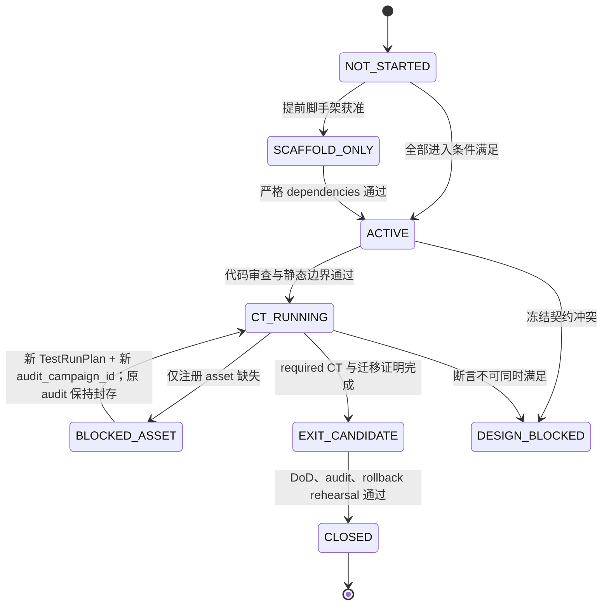
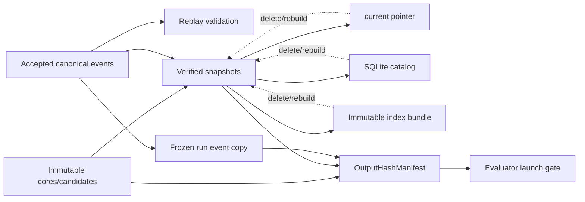
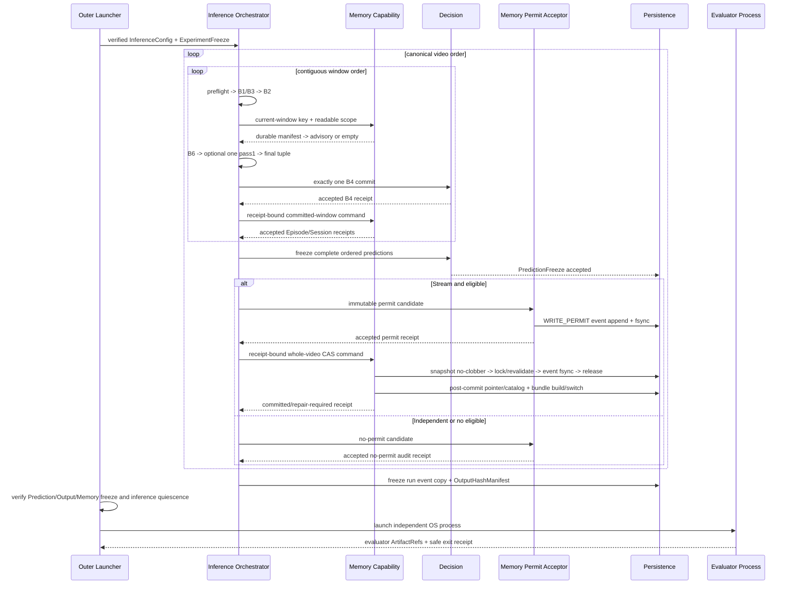

# WP0-WP12 工作包执行、集成与验收计划

> 文档编号：Implementation Design 05
> 状态：`DESIGN_BLOCKED`（2026-07-18）；执行骨架有条件通过，冻结资格未通过，不授权 WP0-WP12 代码开发
> 前置基线：Document 00-04 均为已修正、待高级架构师二次审核的候选文本；本文只绑定下列精确 SHA-256，不宣称其已重冻结
> 本文范围：工作包依赖、代码落点、接口接缝、迁移顺序、Gate、风险、回滚、性能验证与最终集成；不创建实现任务单，不修改 `src/` 或 `tests/`

## 1. 执行结论

实施采用一条可审计的退出主链：

```text
WP0 -> WP1 -> WP2 -> WP3 -> WP4 -> WP5 -> WP6
                                  |      |      |
                                  +------+------+-> WP7 -> WP8 -> WP9 -> WP10 -> WP11 -> WP12
```

该图表达“工作包可合并且可参与 Gate 关闭”的严格依赖，不否定受控的提前脚手架：WP3 可在 WP1 完成后预建 runtime-private command、ledger fixture 和窄 Port 空壳，但必须等 WP2 的物理进程隔离、config poison 与 resolver 边界通过后才能接入 Composition Root；WP12 可在 WP10 后预建只读 projection 和 shell adapter，但必须等 WP11 的 Evaluator/B9 artifact 语义冻结后才能形成 G4 用户入口。

五个 Gate 固定为：G0 关闭 WP0，G1 关闭 WP1-WP3，G2 关闭 WP4-WP6，G3 关闭 WP7-WP9，G4 关闭 WP10-WP12 与适用 L4。提前脚手架不产生规范 run、不改变事实源、不获得公共 merge 权、不关闭 Gate。为打破审计器自举循环，WP0 只可形成 runtime-private `IsolationBootstrapRecord` 并到达 `BOOTSTRAP_EXIT_ACCEPTED`；WP1 的最小审计内核是唯一 bootstrap 例外，它据此发布首个规范 `ContractAuditV1`、Gate evidence 与 WP closure record，随后才关闭 WP0/G0。该例外不允许 WP1 的 Schema 之外能力或 WP2 提前合并。

实现期间始终保持以下不可让步边界：

- V1 是同仓库中的逻辑旁路新路径，不复制整个仓库；Legacy Schema、配置、Memory namespace、artifact root 和测试入口显式隔离。
- V1 与 Legacy 禁止双写同一 Memory；禁止原地升级旧 Memory；旧对象只按 `LOSSLESS`、`LOSSY_BASELINE_ONLY`、`UNADAPTABLE` 接入。
- 规范推理是单一进程；Evaluator 是 outer launcher 在完整 freeze 验证后启动的独立 OS 进程。
- 文件中的 canonical event、immutable artifact、case core 和 snapshot 是事实；SQLite、Dense/BM25/Temporal bundle、UI projection 都可重建。
- 规范 commit 串行；纯计算可受控并行。改变 worker/device/batch 配置至少产生新 `run_id`，raw-output hash 改变则不是同一次 replay。
- V1 主线失败时不得静默回退旧 Score、Retrieval、MemoryPolicy、hash embedding、partial rerank 或旧 Memory。
- Legacy 在 G4 通过前不得删除；G4 后只能另立退役计划，退役不属于本文。

## 2. 权威来源与变更控制

| 权威 | 本文继承 | 本文不能改变 |
|---|---|---|
| Document 00 | 旁路拓扑、根目录、WP/Gate、进程与事务总原则 | G0-G4 语义、Legacy 生命周期、event-only Memory commit |
| Document 01 | 59 个 Schema v1 对象、canonical codec、ID/hash/self-field、config 与 Adapter | wire 字段、版本、severity、323 catalog identity |
| Document 02 | capability owner、per-window/per-video 顺序、消息 ledger、B1-B6/B8 runtime | B4/B6 次数、write-ahead、freeze/permit 顺序、failure fallback |
| Document 03 | Episode/Session/Candidate、Memory CAS、snapshot/index/replay/retrieval | 事实源、Reservoir、主检索、payload firewall、crash recovery |
| Document 04 | 36-file 迁移、suite、323 CT、L0-L4、artifact/B9/CI | 测试 ID、稳定路径、Evaluator allowlist、发布审计 |

当前修订集绑定如下；任一 byte 变化都必须重新计算本表并重新执行 00-05 二次总审核：

| 文档 | 当前 SHA-256 | 当前资格 |
|---|---|---|
| Document 00 | `f0d838334bee96e2c123cd3e4495369111cfd0e45eea1d6be471bb3d72cac3b1` | 已修正候选；待二次审核 |
| Document 01 | `b3320abeffb0847fb0466fd857bce8c8118fd33f25aa841ffa503accefe39bc1` | 已修正候选；待二次审核 |
| Document 02 | `ac1bc47d3f879aea80ce9195efd84285fa53961fa9ed452d6c36d0e6f1885df0` | 已修正候选；待二次审核 |
| Document 03 | `046625d5d868566c12de0d35952240a9314342141609ec1eaf5b69595b4bd221` | 已修正候选；待二次审核 |
| Document 04 | `902ad980a43f19b820ef34bc2ae2ed42e12b7503584c0555c584f548aa5be371` | 已修正候选；待二次审核 |

因此本文当前即处于 `DESIGN_BLOCKED`，不是实现授权。若后续实现发现已重冻结设计内部不一致，对应工作包也进入 `DESIGN_BLOCKED`，只允许产出带具体证据的设计勘误提案；不得在代码中任选一种语义、补默认字段或以 feature flag 隐藏分歧。任何改变 canonical bytes、accepted output、算法 identity、worker/device/batch 或 freeze 内容的修正必须创建准确命名的新 run/freeze/attempt artifact；改变运行 identity 的修正必须使用新 `run_id`。禁止笼统创建“manifest revision”目录；`run_manifest.json` 始终只是单一可原子刷新的 projection。

## 3. 依赖、Gate 与状态模型

### 3.1 严格依赖 DAG

```mermaid
flowchart LR
    W0["WP0\n旁路与隔离"] --> B0["BOOTSTRAP_EXIT_ACCEPTED\nprivate isolation record"]
    B0 --> W1A["WP1-A\n最小审计内核"]
    W1A --> G0["G0 LEGACY_ISOLATED\nContractAudit + Gate evidence"]
    G0 --> W1["WP1-B\nSchema 与确定性完成"]
    W1 --> W2["WP2\n进程/配置/Resolver 隔离"]
    W2 --> W3["WP3\n消息、Ledger、Failure"]
    W1 -. "仅脚手架" .-> W3
    W3 --> G1["G1 STRUCTURAL_CORE"]
    G1 --> W4["WP4\nB1 Adapter + B3"]
    W4 --> W5["WP5\nB2 Evidence"]
    W5 --> W6["WP6\nB4 Identity Path"]
    W6 --> G2["G2 LOCAL_FULL"]
    W3 --> W7["WP7\nB5 Memory/Retrieval"]
    W5 --> W7
    W6 --> W7
    W7 --> W8["WP8\nB6 + Optional Pass"]
    W8 --> W9["WP9\nFreeze/Permit/CAS"]
    W9 --> G3["G3 CAUSAL_FULL"]
    G3 --> W10["WP10\nRecovery/Artifact Graph"]
    W10 --> W11["WP11\nEvaluator/B9"]
    W11 --> W12["WP12\nWorkbench"]
    W10 -. "只读脚手架" .-> W12
    W12 --> G4["G4 REPRODUCIBLE_EXPERIMENT"]
```



### 3.2 工作包生命周期

每个工作包只允许以下规范状态；看板显示是该状态的只读 projection，不是事实源。



`FAILED` 是 test/audit 结果，不是可以跳过的工作包状态；修复后回到同一工作包的 `ACTIVE` 或 `CT_RUNNING`。`BLOCKED_ASSET` 不等于 PASS，也不能关闭要求该 level 的 Gate；原 Audit Campaign 与 `AuditRunPlan` 保持 immutable，资产补齐后以相同 selected CT IDs、更新后的 readiness hash 创建新 `AuditRunPlan` 和新 `audit_campaign_id`。`CLOSED` 只能由规范 audit artifact 证明，不能由 UI checkbox、Supplemental 或 Legacy regression 证明。

### 3.3 Gate 条件

| Gate | 必须关闭的 WP | 最低证据 | 允许的能力 | 明确禁止 |
|---|---|---|---|---|
| G0 `LEGACY_ISOLATED` | WP0 | WP0 private bootstrap record 经 WP1 audit kernel 重验后形成的规范 ContractAudit、root/import/config/writer/test negative proofs、迁移 inventory | 显式 V1/Legacy 空入口与独立 roots | V1 机制声称、Legacy 删除、共享 Memory writer |
| G1 `STRUCTURAL_CORE` | WP1-WP3 | `CT-COM-*`、`CT-B0-*`、`CT-B8-P/M*`、适用 `CT-CON-*` | 构造无标签规范 runtime、接受/重放结构事件 | 工具、B2/B4、Memory 或 Evaluator 结果声称 |
| G2 `LOCAL_FULL` | WP4-WP6 | `CT-B1-*`、`CT-B2-*`、`CT-B3-*`、`CT-B4-*` | 无 Memory 的 I0-I3 local path | B5/B6 Memory 增益、跨视频写 |
| G3 `CAUSAL_FULL` | WP7-WP9 | `CT-B5-*`、`CT-B6-*`、`CT-B8-W*`、Memory `CT-CON-*` | C0/C1/S0 causal smoke 与 freeze 后 Stream CAS | 研究结论、未冻结写、Independent write |
| G4 `REPRODUCIBLE_EXPERIMENT` | WP10-WP12 + 适用 L4 | `CT-PER-*`、`CT-ART-*`、`CT-B9-*`、完整 `ContractAuditV1`；Supplemental 不进入 Gate | 执行冻结 B9 与 A-F 报告 | 自动退役 Legacy、以 smoke/blocked/Supplemental 伪装 release pass |

## 4. 所有工作包共用的执行契约

### 4.1 公共接口边界

所有公开 Port：

- 只接受 Schema v1 对象、稳定 ID 或 runtime-private frozen JSON-safe command；
- 只返回 Schema v1 对象、稳定 ID 或 frozen serializable receipt/status；
- 不返回 `Path`、数据库连接、file handle、mutable Store、index object、exception object 或任意内部状态句柄；
- 由 Composition Root 显式构造注入；capability 只收到最小配置切片和最小权限 Port；
- event writer 在构造时绑定 namespace、producer、event family、payload union 和 parent policy，不存在 `write(any_event)`；
- 当前为进程内 Python `Protocol`，但形状必须保留未来跨进程序列化可能。

本文的接口代码块是签名级设计，不是可直接复制的完整实现。

#### 4.1.1 类型处置表

本文旧稿曾出现 93 个词法上的 `*V1` 名称。处置必须在编码前关闭，不能由工程师据后缀推断公共 wire Schema：

| 分类 | 精确闭集 | 处置 |
|---|---|---|
| 已冻结公共 Schema v1（26 个本文实际使用项） | `AdvisoryBundleV1`、`ArtifactRefV1`、`AuditEventEnvelopeV1`、`B2OutputV1`、`B4DecisionV1`、`B6DecisionEvidenceV1`、`CandidateCaseV1`、`CaseMutationV1`、`ContractAuditV1`、`EvaluatorConfigV1`、`EvidencePacketV1`、`EvidenceRequestV1`、`ExperimentFreezeManifestV1`、`InferenceConfigV1`、`LegacyAdapterReportV1`、`MemoryWriteEventV1`、`MessageEnvelopeV1`、`OutputHashManifestV1`、`PredictionFreezeRecordV1`、`RetrievalManifestV1`、`RetrievalQueryV1`、`RunManifestV1`、`ToolExecutionRecordV1`、`ToolPlanV1`、`WindowInputV1`、`WritePermitV1` | 只可按 Document 01 的 exact registry 使用；本文不得增删字段 |
| runtime-private immutable command（此前误加 V1 尾缀的 39 个名称） | `AcceptCommittedWindowCommand`、`AppendDecisionEventCommand`、`AppendMemoryEventCommand`、`AppendToolEventCommand`、`BindReadableScopeCommand`、`CloseVideoEpisodesCommand`、`CommitB4Command`、`CommitWritePermitCommand`、`ComputePairedBootstrapCommand`、`ControllerStepCommand`、`DecodePayloadCommand`、`EncodePayloadCommand`、`EnsureIndexBundleCommand`、`EvaluateB6Command`、`EvaluateFrozenRunCommand`、`EvaluateIdentityB6Command`、`ExecuteToolActionCommand`、`FreezeVideoPredictionsCommand`、`FuseB2Command`、`InspectLegacySourceCommand`、`IssueWritePermitCommand`、`LaunchEvaluatorCommand`、`LaunchInferenceCommand`、`LegacyAdaptCommand`、`NormalizeToolOutputCommand`、`PinIndexBundleCommand`、`PublishArtifactCommand`、`PublishContractAuditCommand`、`ReadArtifactCommand`、`ReadFrozenOutputCommand`、`ReadRunStatusCommand`、`RecoverNamespaceCommand`、`RenderComparisonReportsCommand`、`RequestReobservationCommand`、`ResolveFrozenManifestCommand`、`SelectRuntimeCommand`、`StartEvaluationCommand`、`StartLegacyRunCommand`、`StartV1RunCommand` | 删除尾缀；deeply immutable、JSON-safe、最小字段；由 owning capability/Document 02-04 定义，不注册为公共 payload |
| runtime-private immutable receipt/value/status（此前误加 V1 尾缀的 24 个名称） | `AcceptedEventReceipt`、`AcceptedReceipt`、`BootstrapReceipt`、`CanonicalPayloadBytes`、`ConcretePayload`、`EpisodeLifecycleCandidate`、`EvaluationReceipt`、`EvaluatorProcessReceipt`、`IndexBundleReceipt`、`InferenceProcessReceipt`、`LedgerRecoveryReceipt`、`LegacyAdaptResult`、`MemoryAssistResult`、`MemoryCommitReceipt`、`MemoryReadStatus`、`NoPermitReceipt`、`NoRequestReceipt`、`PinnedIndexBundleView`、`ReadableScopeReceipt`、`RecoveryReceipt`、`ReportBundleReceipt`、`RetrievalManifestCandidate`、`RuntimeSelectionReceipt`、`VerifiedArtifactBytes` | 删除尾缀；只返回不可变值、稳定 ID/hash/ref/status，不返回 Path、writer、connection、handle 或 mutable Store |
| 非规范 UI projection / 本地 opaque handle（此前误加 V1 尾缀的 5 个名称） | `EvaluationProcessHandle`、`LegacyRunHandle`、`RunHandle`、`ResultSummaryProjection`、`RunStatusProjection` | 删除尾缀；不得持久化为规范事实、不得跨进程传输、不得进入 canonical registry/hash parent |

`TargetV1` 只是 `LegacyAdapterPort[TargetV1]` 的泛型类型参数，不是第 60 个公共对象。经上述处置，本轮不新增任何公共 Schema；将来若某个 runtime-private 对象确需持久化或跨进程传输，必须正式升级 Schema/registry/CT 后才可实施。

### 4.2 审计引导、Gate 与关闭记录

WP0 的 bootstrap evidence 不是 `ContractAuditV1`，也不能关闭 G0。唯一顺序为：

```text
WP0 private probes
-> no-clobber publish IsolationBootstrapRecord
-> BOOTSTRAP_EXIT_ACCEPTED
-> WP1 minimal AuditRunPlan/catalog/plugin/terminal reducer
-> harness aggregator publishes ContractAuditV1
-> GateValidator validates exact selected CT/result/dependency hashes
-> GateEvidenceRecord + WPClosureRecord
-> WP0 CLOSED / G0 closed
```

WP1 最小审计内核必须实现：immutable `AuditRunPlan` loader、323-ID catalog loader、fresh-process pytest plugin、setup/call/teardown/child-crash terminal-fragment reducer、测试 harness 独占的 `ContractAuditV1` publisher、`GateValidator` 与 `WPClosureWriter`。归约规则固定为：setup 失败则 item 终态 FAILED 且不要求 call；call 失败即 FAILED，即使 teardown 成功；teardown 失败将此前 PASS 升为 FAILED；子进程无合法 terminal fragment 为 FAILED/INCOMPLETE，绝不推断 PASS。WP10 只扩展完整 323 项、recovery/artifact graph 的最终聚合，不再首次实现这些组件。

`WPClosureRecord` 与 `GateEvidenceRecord` 是 runtime-private immutable audit DTO，不加 `V1`、不进入公共 registry。`WPClosureRecord` 至少绑定 `audit_campaign_id`、`wp_id`、`closure_attempt_id`、Document 00-05 hashes、dependency closure refs/hashes、selected CT IDs/hash、`ContractAuditV1` ref/hash、规范 artifact refs/hashes、rollback rehearsal hash、Supplemental refs（只作 merge 条件）、terminal status 与 record hash。`GateEvidenceRecord` 至少绑定 gate ID、required WP closure refs/hashes、exact ContractAudit ref/hash、catalog/plan hashes、validator version 与 PASS/BLOCKED；任何开放设计项都强制 BLOCKED。

唯一 writer 与路径固定为：测试 item 只写 result fragments；test-harness aggregator 独占 `contract_audit.json`；`GateValidator` 独占 gate evidence；`WPClosureWriter` 独占 closure record。稳定路径为：

```text
data/agentic_outputs/v1/audit_campaigns/<audit_campaign_id>/
  audit_run_plan.json
  result_fragments/
  contract_audit.json
  gate_evidence/g<0-4>.json
  wp_closures/wp<00-12>/wp_closure_record.json
```

每个文件使用 immutable create-if-absent/no-clobber；同路径同 hash 幂等复用，不同 hash 保留原文件并使 campaign FAILED。Gate validator 只读已发布 bytes，不修补测试结果。Supplemental 可阻断 WP merge/Workbench 发布，但不得进入 `ContractAuditV1` 或关闭 G0-G4。

### 4.3 共用 DoD

一个 WP 只有同时满足以下条件才可 `CLOSED`：

1. 严格 dependencies 的 audit hash 已绑定；
2. Proposed Components 的所有 owner 文件有唯一归属，无跨 lane 隐性修改；
3. public/runtime-private interfaces 与冻结 registry 对齐；
4. required CT 全部出现且状态合法；mandatory asset 缺失不得显示 PASS；
5. static import test 与 runtime capability canary 覆盖新增边界；
6. authoritative artifact/event 经过 canonical hash、fsync、atomic publish 或规范 append；
7. failure code、severity、fallback 与 Document 01-03 完全一致；
8. Legacy migration disposition 与 Document 04 的 36-file manifest 一致；
9. crash/rollback rehearsal 不覆盖 accepted fact，不删除用户数据；
10. `src/`、`tests/` 的实际 diff 只含该 WP 授权文件；
11. environment、依赖、Python runtime、package-file hash、worker/device/batch 写入 provenance；
12. 由唯一 `WPClosureWriter` 在上述稳定路径产出 `WPClosureRecord`，包含输入 hashes、CT result refs、artifact refs、known non-blocking operational observations；不含开放设计项。

### 4.4 共用失败与回滚原则

- accepted identity/content/parent/raw-artifact 冲突：`RUN_FATAL`，封存 run，不用 Legacy 继续。
- 普通 pre-accept per-video schema/causal/state 错误：`VIDEO_FATAL`；Stream 按冻结规则升级。
- 注册的 tool/view/reranker/Memory unavailable：只走规定的 UNKNOWN、remaining views、full RRF、empty manifest、B6 identity/abstain。
- 回滚只撤销未 accepted 的 staging、projection 或构造绑定；accepted event/artifact 不就地改写。
- 数据结构变更靠新版本、side-by-side artifact 或 replay projection；禁止 downgrade accepted V1 bytes。
- 显式 Legacy run 是独立产品路径，不是 V1 rollback mechanism。

### 4.5 规范入口与稳定根目录

| 用途 | 规范入口或根 | 约束 |
|---|---|---|
| V1 inference | `python -m src.tfavad.cli infer` | 只加载 `InferenceConfigV1` 与无标签 artifact manifest |
| V1 evaluation | `python -m src.tfavad.evaluator.cli evaluate` | 只由 outer launcher 在 freeze verification 后创建 OS process |
| V1 product run | `data/agentic_outputs/v1/{protocol}/{run_id}/` | inference frozen artifacts；Evaluator 只可发布该 run 的 `evaluation/`、`metrics/` 片段，禁止拥有跨 run 比较 |
| V1 operational Memory | `data/agentic_memory/v1/{protocol}/{run_id}/` | 一个namespace一个canonical Memory event append target |
| Bootstrap isolation | `data/agentic_outputs/v1/bootstrap_isolation/{bootstrap_id}/` | 仅 WP0 private `IsolationBootstrapRecord`；不是 ContractAudit/Gate PASS |
| Audit Campaign | `data/agentic_outputs/v1/audit_campaigns/{audit_campaign_id}/` | `AuditRunPlan`、item fragments、唯一 `contract_audit.json`、Gate/WP closure evidence |
| B9 Campaign | `data/agentic_outputs/v1/b9_campaigns/{b9_campaign_id}/` | 独立 Campaign manifest 绑定 frozen product runs；拥有 `bootstrap/` 与 `comparison_tables/`，只读参与 run |
| V1 contract tests | `tests/v1/catalog/` | 323-ID规范catalog；由专用runner进入 |
| V1 supplemental | `tests/v1/supplemental/` | 不写ContractAudit PASS |
| Legacy tests | `tests/legacy/` | 只由显式Legacy命令/marker进入 |

Legacy output、Memory、config与test roots不得解析到上述V1 roots或其子目录；V1 resolver也不得把Legacy root注册为写入目标。

## 5. WP0——旁路基线、namespace 与 Legacy 隔离

### 5.1 执行契约

| 字段 | 冻结内容 |
|---|---|
| Objective | 建立可导入、可启动但尚无机制语义的 `src/tfavad/` V1 旁路，以及 V1/Legacy 在 Schema、config、Memory、artifact、tests、CLI mode 上的可证明隔离。 |
| In Scope | package skeleton；显式 `v1`/`legacy` mode；V1 与 Legacy root constructors；import deny rules；36-file migration manifest 基座；独立 pytest entry；无状态 `shared_infra` allowlist。 |
| Out of Scope | Schema v1 具体字段、canonical codec、inference mechanism、Memory 数据迁移、Legacy 删除、运行实验。 |
| Dependencies | 无。仓库当前 baseline 与本文件第 2 节绑定的 Document 00-04 hashes 是输入。 |
| Inputs | 当前 repository tree；Legacy entry/root/test inventory；Document 04 的 10/14/5/7 处置表。 |
| Outputs | runtime-private `IsolationBootstrapRecord`、`RuntimeSelectionReceipt`；授权 roots manifest；import boundary report；migration inventory；`BOOTSTRAP_EXIT_ACCEPTED`。不输出公共 Schema 或 G0 PASS。 |
| Proposed Components | 新建 `src/tfavad/__init__.py`、`src/tfavad/cli/`、`src/tfavad/runtime/launcher/` skeleton、`src/shared_infra/` allowlist；修改 root CLI 仅作显式 dispatch；建立 `tests/v1/`、`tests/legacy/`、`tests/v1/supplemental/` topology 与 runner skeleton。 |
| Public Interfaces | 仅 bootstrap-private `select_runtime(SelectRuntimeCommand) -> RuntimeSelectionReceipt` 与 `inspect_legacy_source(InspectLegacySourceCommand) -> IsolationBootstrapRecord`；二者都不接收任意 path。公共 `LegacyAdapterReportV1` 留给 WP1。 |
| State Transitions | repository baseline `MIXED_LEGACY_ONLY -> V1_SIDE_PATH_PRESENT -> FOUR_WAY_ISOLATED -> BOOTSTRAP_EXIT_ACCEPTED`；WP0 此时仍是 `EXIT_CANDIDATE`，由 WP1 audit kernel 重验并发布规范 ContractAudit/Gate evidence 后才 `CLOSED`/关闭 G0。 |
| Persistence Effects | 只创建空目录规则、manifest 和 audit artifact；不得写 V1 Memory event，不得复制 Legacy data，不得改写现有 output。 |
| Data Migration | 不迁移数据；只登记 Legacy source/root/test 的 disposition 与 hashes。任何 Legacy object conversion 留给 WP1 Adapter。 |
| Failure Semantics | root alias、writer alias、隐式 mode、跨 suite collection 或 forbidden import 为 G0 blocking；若 alias 已触及 accepted data，按 integrity `RUN_FATAL` 处理对应试运行。 |
| Required CT Tests | WP0 先以固定 probe registry 生成 bootstrap negative results；WP1 建立审计内核后在 fresh process 重跑 G0 namespace/import/config/writer negatives并写规范 fragments；Document 04 catalog lint；Legacy regression 显式入口；不把 Legacy pass 写入 V1 ContractAudit。 |
| Migration Notes | `src/app/cli.py`、REPL/TUI 只允许保留外壳；旧 `src/core/*`、`src/memory/*`、Score/RAG/Policy 仍在 Legacy namespace。 |
| Acceptance Criteria | 所有 V1 root 与 Legacy root 经 normalized/casefold/reparse 检查后不相交；默认 V1 collection 收不到 Legacy；V1 import graph 不包含 Legacy core；bootstrap record 可由 WP1 确定性重验。只有 WP1 发布的规范 ContractAudit/Gate evidence 可关闭 G0。 |
| Rollback/Recovery | 删除未发布 skeleton/projection 或撤销 root dispatch binding；不删除 Legacy 文件与用户 data。已发布 bootstrap/audit 保持 immutable；修订使用新 `bootstrap_id` 或新 `audit_campaign_id`，不得建立含糊的 revision 目录。 |
| Risks | Windows junction/reparse alias；CLI 自动探测旧 mode；共享 progress/store 形成隐性状态通道；测试移动导致断言丢失。 |

### 5.2 接口与所有权

```python
class RuntimeSelectorPort(Protocol):
    def select(
        self, command: SelectRuntimeCommand
    ) -> RuntimeSelectionReceipt: ...

class LegacyInventoryPort(Protocol):
    def inspect(
        self, command: InspectLegacySourceCommand
    ) -> IsolationBootstrapRecord: ...
```

`SelectRuntimeCommand` 只含显式 mode、validated bootstrap-config artifact ref、authorized root IDs 与 expected version set。没有“如果 V1 失败则 legacy”的枚举。`IsolationBootstrapRecord` 不带 `V1`，不宣称 59-object registry 已存在，也不把 Legacy source 适配成公共对象。`src/shared_infra` 只允许纯 path lexical normalization、device string parsing、terminal formatting primitive；任何 module 一旦持有 writer、cache、progress state 或理论字段即不得共享。

## 6. WP1——确定性原语、Schema v1 与 Legacy Adapter

### 6.1 执行契约

| 字段 | 冻结内容 |
|---|---|
| Objective | 落地 59 个公共 Schema v1 对象、closed registries、project canonical codec、stable ID/hash/time/CMP 与三类 Legacy Adapter。 |
| In Scope | `contracts/v1`、`canonical`、Schema/config/event registries、raw JSON duplicate-key boundary、golden vectors、ArtifactRef shape、Legacy classification/report。 |
| Out of Scope | runtime phase order、文件 resolver 实现、工具调用、Memory transaction、Evaluator 运算。 |
| Dependencies | WP0 `BOOTSTRAP_EXIT_ACCEPTED`。WP1-A 只实现最小 audit kernel并重验 WP0；其规范 ContractAudit/Gate evidence 关闭 WP0/G0 后，WP1-B 才完成其余 Schema/Adapter scope。 |
| Inputs | WP0 immutable bootstrap record；Document 01 exact object catalog；canonical golden vectors；dependency/version freeze；Legacy object inventory；Document 04 AuditRunPlan/catalog contract。 |
| Outputs | 最小 TestRunPlan/AuditRunPlan loader、catalog loader、pytest plugin、terminal-fragment reducer、ContractAudit publisher、Gate validator、WP closure writer；exact decoders/encoders；stable IDs；closed payload/event/config registry；Adapter reports；G1 structural inputs。 |
| Proposed Components | 新建 `src/tfavad/contracts/v1/{constants,base,enums,scalar,time,artifact,config,envelope,tools,evidence,retrieval_key,advisory,cases,retrieval,decision,memory_txn,failure,manifests,events,contract_audit,legacy_report,registry}.py`；`src/tfavad/canonical/{raw_json,encoder,primitives,compare,tuple_codec,hashing,self_fields,ids,time_conversion}.py`；`src/tfavad/adapters/legacy/`；`tests/v1/runner/{plan_loader,catalog_loader,pytest_plugin,terminal_reducer,audit_aggregator,gate_validator,wp_closure_writer}.py`。 |
| Public Interfaces | `decode_v1(payload_type, raw) -> V1Payload`；`canonical_bytes(payload) -> bytes`；`content_id(domain, payload) -> StableId`；`LegacyAdapterPort.inspect(command) -> LegacyAdaptResult[T]`；test harness独占 ContractAudit publisher，Gate validator/closure writer使用 private commands。 |
| State Transitions | raw bytes `UNTRUSTED -> DUPLICATE_AWARE_DECODED -> EXACT_TYPE_VALIDATED -> CANONICALIZED -> ACCEPTED_IMMUTABLE`；任何失败不产生半对象。 |
| Persistence Effects | golden vector artifacts、registry manifest、Adapter report；本 WP 不 append runtime/Memory event。 |
| Data Migration | 只允许 registered source artifact -> isolated legacy DTO -> classification -> exact target validator。仅 `LOSSLESS+ACCEPTED` 可产生 V1 target；旧 Memory 整体不可迁移。 |
| Failure Semantics | unknown version、duplicate key、NaN/Inf、lone surrogate、int64 overflow、bool-as-int、hash/self-field mismatch 均 fail closed；accepted hash conflict 为 `RUN_FATAL`。 |
| Required CT Tests | 先以 WP1-A 重跑/聚合 G0 negative probes；再执行 `CT-COM-001..019`、catalog/registry/golden-vector tests、Legacy firewall、相关 `CT-B0` config shape 与 `CT-PER/ART` codec boundary tests。每个 item 的 setup/call/teardown/child-crash 终态归约唯一。 |
| Migration Notes | `src/core/schemas.py` 与 `src/core/config.py` 不作为基类；禁止 alias/default/from_attributes 伪适配。`ToolCallRecord` baseline-only，`ObservationCard` 整体 unadaptable，`CaseMemoryRecord` 对 V1 Memory unadaptable。 |
| Acceptance Criteria | 59/59 concrete objects 与 closed registry bijection；golden bytes/hash/ID exact；all self-field tables 按 `schema_version+payload_type` 注册；环境 provenance 完整。 |
| Rollback/Recovery | 未 accepted registry revision 可撤销；已发布 schema/codec identity 不原地改，修订须新 schema/protocol/contract 或 algorithm identity。 |
| Risks | Python `bool` 被当 `int`；完整 object 误交 RFC8785 触发 UTF-16 key order；私有 API import；普通 dict 丢失 duplicate key；golden vector 被实现反向修改。 |

### 6.2 接口与内部顺序

```python
class SchemaCodecPort(Protocol):
    def decode(
        self, command: DecodePayloadCommand
    ) -> ConcretePayload: ...

    def encode(
        self, command: EncodePayloadCommand
    ) -> CanonicalPayloadBytes: ...

class LegacyAdapterPort(Protocol[TargetV1]):
    def inspect(
        self, command: LegacyAdaptCommand
    ) -> LegacyAdaptResult[TargetV1]: ...

class ContractAuditPublisherPort(Protocol):
    def publish(
        self, command: PublishContractAuditCommand
    ) -> ArtifactRefV1: ...

class GateValidatorPort(Protocol):
    def validate(self, command: ValidateGateCommand) -> GateEvidenceRecord: ...

class WPClosureWriterPort(Protocol):
    def publish(self, command: PublishWPClosureCommand) -> WPClosureRecord: ...
```

内部实现顺序固定为：constants/scalar/enums/base；raw JSON 与 primitive golden；CMP/time/hash/self-fields/IDs；Artifact/config；59 objects；closed registries；failure/resolver command shapes；Legacy Adapters；CT。`constants.py`、`base.py`、canonical codec、self-field registry、public registry 与 golden vectors 各自单一 owner，不能由并行 lane 同时修改。

## 7. WP2——推理/评估物理隔离、freeze 与 Artifact Resolver

### 7.1 执行契约

| 字段 | 冻结内容 |
|---|---|
| Objective | 在任何推理 capability 构造前阻断 label/config/path poison，并建立 outer launcher 控制的单 inference 进程与独立 Evaluator OS 进程边界。 |
| In Scope | inference/evaluator config loaders；Windows case-insensitive nested poison scan；authorized-root resolver；ExperimentFreeze；normative Entry preflight；process command；Evaluator launch gate；read resolver/write publisher capability split。 |
| Out of Scope | evaluator metric/B9 计算、runtime message ledger、tool/evidence/decision、Memory CAS。 |
| Dependencies | WP1 `CLOSED`；WP0 roots 已验证。 |
| Inputs | `InferenceConfigV1`、`EvaluatorConfigV1`、registered artifact manifests、environment manifest、exact version set。 |
| Outputs | `ExperimentFreezeManifestV1`；runtime-private Inference/Evaluator process receipts；Evaluator launch permit/denial；resolver verification receipts；publisher target-plan validation；process-isolation audit。 |
| Proposed Components | `src/tfavad/config/{inference_loader,evaluator_loader,poison_scan,slices}.py`；`src/tfavad/ports/artifact_resolver.py`；`src/tfavad/runtime/launcher/{outer_launcher,process_command,freeze_verifier}.py`；Evaluator root skeleton。 |
| Public Interfaces | `freeze_experiment(command) -> ExperimentFreezeManifestV1`；`launch_inference(command) -> InferenceProcessReceipt`；`launch_evaluator(command) -> EvaluatorProcessReceipt`；Inference/Evaluator read resolver 使用不同 private command；Evaluator publisher 只接受 Campaign 预注册相对目标。 |
| State Transitions | `CONFIG_UNTRUSTED -> CONFIG_SPLIT_VALIDATED -> EXPERIMENT_FROZEN -> INFERENCE_ALLOWED`；Evaluator 为 `DENIED -> FREEZE_SET_VERIFIED -> PROCESS_ALLOWED`，不能由 inference 触发。 |
| Persistence Effects | freeze/environment/process manifests；resolver 只读；本 WP 的 Evaluator writer skeleton 尚不写 metrics。 |
| Data Migration | 旧 `PipelineConfig` 不转换；CLI 重新采集无标签 inference 参数与独立 evaluator 参数。旧 annotation record 只进入 evaluator config root。 |
| Failure Semantics | 规范 Entry 只允许 `RAW \| CAPTION \| FROZEN_B2`；`SCORE \| FROZEN_SCORE` 在创建 RunMachine、event namespace、`run_id` root 或任何 V1 artifact 前以 `SCHEMA_VALIDATION_FAILED/RUN_FATAL` fail closed。label/annotation/metric alias、path escape、absolute/`..`、symlink/junction/reparse escape、freeze/hash mismatch 为 prelaunch denial；config/GT leak 为 `RUN_FATAL`。 |
| Required CT Tests | `CT-B0-001..015`；`CT-B8-P11/P12`；Evaluator gate `CT-B0-008/009`；path/casefold/nested poison capability negatives。 |
| Migration Notes | `src/app/models.py:27-63` 与 `src/app/orchestrator.py:65-107` 的混合 request 留在 Legacy；`src/pipelines/run_agentic_workflow.py:248-301` 的同进程 metrics 不进入 V1。 |
| Acceptance Criteria | inference process object graph无 annotation/label/eval capability；Evaluator 只有完整三 freeze 后可启动；resolver default deny；publisher 不能读取任意 path且只能 no-clobber 发布 planned targets；before/after forbidden artifact hashes一致；SCORE 两种 compatibility identity 无 V1 side effect。 |
| Rollback/Recovery | prelaunch failure不创建 process；inference 已启动但 freeze identity不一致时终止，并由 outer launcher依据 accepted failure原子刷新唯一 `run_manifest.json` projection；绝不创建 failure revision目录或改用 Legacy 同 run 继续。 |
| Risks | Windows environment key大小写别名；nested object藏 label path；junction越界；launcher把 evaluator exception/label内容回传 inference。 |

### 7.2 接口接缝

```python
class InferenceArtifactResolverPort(Protocol):
    def read_verified(
        self, command: ReadArtifactCommand
    ) -> VerifiedArtifactBytes: ...

class EvaluatorArtifactResolverPort(Protocol):
    def read_verified(
        self, command: ReadFrozenOutputCommand
    ) -> VerifiedArtifactBytes: ...

class EvaluatorArtifactPublisherPort(Protocol):
    def publish(self, command: PublishPlannedEvaluatorArtifactCommand) -> ArtifactRefV1: ...

class OuterLauncherPort(Protocol):
    def launch_inference(
        self, command: LaunchInferenceCommand
    ) -> InferenceProcessReceipt: ...

    def launch_evaluator(
        self, command: LaunchEvaluatorCommand
    ) -> EvaluatorProcessReceipt: ...
```

`launch_evaluator` command 只含 verified freeze IDs/hashes、evaluator config artifact ref 与 process policy ID；不含 inference capability handle。outer launcher 只从 Evaluator 接收 output ArtifactRefs、exit status 与 safe audit code。

## 8. WP3——消息、capability-scoped writers、ledger 与 failure

### 8.1 执行契约

| 字段 | 冻结内容 |
|---|---|
| Objective | 建立 concrete typed message/event acceptance、logical slot idempotency、write-ahead、parent/hash validation、串行 commit sequencer、replay projection 与封闭 failure routing。 |
| In Scope | narrow Ports；runtime-private commands/receipts；Run/Video/Window state machine skeleton；bound Tool/Decision/Memory writers；ledger/recovery；FailureAudit redaction。 |
| Out of Scope | B1-B6 数值语义、真实 tool backend、Memory CAS 文件事务、Evaluator。 |
| Dependencies | 严格依赖 WP1+WP2 `CLOSED`。WP1 后只允许不接 Composition Root 的脚手架。 |
| Inputs | closed payload/event registry；minimal config slices；verified roots/freeze；concrete envelope/event commands。 |
| Outputs | accepted/duplicate/failure receipts；canonical event lines；replay projections；exact CommitKey registry；G1 permission/message/concurrency audit。 |
| Proposed Components | `src/tfavad/ports/{runtime_acceptance,runtime_capabilities,bound_event_writers}.py`；`runtime/{commands,receipts}`；`runtime/state_machine/{run_machine,video_machine,window_machine,transition_table,protocol_scheduler,commit_sequencer}.py`；`runtime/ledger/{message_acceptor,logical_slots,parent_validator,write_ahead,replay_projector,recovery}.py`；`persistence/events/{append_primitive,bound_writers}.py`。 |
| Public Interfaces | `MessageAcceptancePort.accept(envelope) -> AcceptedReceipt`；Tool/Decision/Memory writer 各自窄 append；`recover_ledger(command) -> LedgerRecoveryReceipt`。 |
| State Transitions | message slot `MISSING -> STARTED_ACCEPTED -> COMPLETED\|FAILURE\|INDETERMINATE_ACCEPTED -> EFFECT_ACCEPTED`；duplicate-identical不转移；conflicting replay封存 run。 |
| Persistence Effects | append-only canonical runtime events 与 immutable failure fragments；state/UI 仅从 accepted facts投影。 |
| Data Migration | Legacy ProgressEvent、generic store/event不迁移；旧运行只由 Legacy runner读取。可复用底层 append/fsync primitive，但 writer binding 全新。 |
| Failure Semantics | same logical key/same hash 返回原 receipt；same key/different hash、accepted parent/input/raw hash冲突 `RUN_FATAL`；late evidence 按 phase 拒绝且无 effect。 |
| Required CT Tests | `CT-B8-P01..P13`、`CT-B8-M01..M09`、tool/ledger相关 `CT-CON-001..010` 子集、`CT-ART-001/003` boundary。 |
| Migration Notes | 当前无 envelope/pass/event ledger，属于旁路 NEW；`src/runtime/progress.py` 只能做非规范 projection，不能进入 parent chain。 |
| Acceptance Criteria | 无宽 EventStore；每个 event type/producer 唯一 writer；所有 artifact-backed acceptance 都是 immutable artifact no-clobber publish/durability verify 在前、bound event append+fsync 在后；crash replay产生相同 accepted effects；static import与runtime canary双向证明最小权限。 |
| Rollback/Recovery | 仅截断最后一条未完成非 LF tail；accepted line不删；projection可全删重放；write-ahead STARTED 后按 frozen recovery产生一次 completion/failure/indeterminate。 |
| Risks | generic writer权限扩散；并发 completion顺序污染 ID；wall-clock进入 identity；failure details泄露 raw text/path/label；state machine读取数值 payload重新决策。 |

### 8.2 接口与串行 owner

```python
class MessageAcceptancePort(Protocol):
    def accept(
        self, envelope: MessageEnvelopeV1[ConcretePayload]
    ) -> AcceptedReceipt: ...

class ToolEventWriterPort(Protocol):
    def append(
        self, command: AppendToolEventCommand
    ) -> AcceptedEventReceipt: ...

class DecisionEventWriterPort(Protocol):
    def append(
        self, command: AppendDecisionEventCommand
    ) -> AcceptedEventReceipt: ...

class MemoryEventWriterPort(Protocol):
    def append(
        self, command: AppendMemoryEventCommand
    ) -> AcceptedEventReceipt: ...
```

三个 writer 可共享无状态 canonical append primitive，但不能共享“允许事件集合”。`runtime/commands.py`、`logical_slots.py`、`transition_table.py`、writer binding registry 和 commit sequencer 是单一 owner 串行合并区。

`CommitKey` 不得简化，精确为：

```text
(
  stream_position_or_zero,
  video_manifest_position,
  window_ordinal_or_video_sentinel,
  major_phase_ordinal,
  pass_ordinal_or_minus_one,
  pass_stage_ordinal_or_minus_one,
  step_ordinal_or_minus_one,
  subphase_ordinal,
  message_id
)
```

major phase 固定为 `10 WINDOW_INPUT, 20 PREFLIGHT, 30 PASS0_EVIDENCE, 40 PASS0_MEMORY_B6_PROPOSAL, 50 EVIDENCE_REQUEST, 60 PASS1_EVIDENCE, 70 PASS1_MEMORY_B6_PROPOSAL, 80 FINAL_B6_COMMIT, 90 B4_COMMIT, 100 WINDOW_ARTIFACT, 110 EPISODE_SESSION, 120 PREDICTIONS, 130 PREDICTION_FREEZE, 140 CANDIDATE_FINALIZE, 150 WRITE_PERMIT, 160 MEMORY_CAS, 170 VIDEO_ARTIFACT, 200 OUTPUT_FREEZE, 210 EVALUATOR_PROJECTION`。pass stage 固定为 `0 BASE, 10 ADAPTIVE, 20 STOP, 30 FINAL_B2`；Tool、Memory、Episode/Session subphase 完整 ordinal 以 Document 02 §20.1 为唯一权威。只有前三个明确不适用字段可为 `-1`；video/run sentinel 为 `INT64_MAX`。任何 artifact-backed slot 都遵循 `ARTIFACT_PUBLISHED -> ACCEPTANCE_EVENT -> PROJECTION_REFRESH`，不得用 `message_id` 排序替代 parent 因果顺序。

规范 reference scheduler 使用 `video_workers=1`。若 frozen Independent 配置允许纯计算并行，WP3 只生成隔离、non-authoritative prepared records；accepted effect 仍由单一 sequencer按 `(video_manifest_position, shard_local_sequence)` materialize。Memory prepared shard 的物理/重放语义由 WP7/WP10继承 Document 03 §6.3；Stream 不使用 prepared Memory shard。

## 9. WP4——B1 Tool Adapter 与 B3 Controller

### 9.1 执行契约

| 字段 | 冻结内容 |
|---|---|
| Objective | 把可复用工具后端封装为 raw-output Backend Adapter，再由 Evidence Adapter 产生一包一票的 B1 packet；实现 direction-free、finite、budgeted B3 action selection。 |
| In Scope | closed tool/action/source registry；device binding；raw artifact provenance；ToolPlan/write-ahead/invocation；quality/failure mapping；B3 gap/requirement/cost/tie/budget/STOP。 |
| Out of Scope | B2 融合、B4 state、Memory、旧 score/calibration fallback、训练/在线学习。 |
| Dependencies | WP3 `CLOSED`；WP1 contracts 与 WP2 process/config boundary 已通过 G1。 |
| Inputs | `WindowInputV1`、base/preflight observations、minimal tool/controller config slices、tool registry、bound Tool writer、authorized resolver。 |
| Outputs | `ToolPlanV1`、`ToolExecutionRecordV1`、raw ArtifactRef、`EvidencePacketV1` 或 explicit failure；B3 STOP receipt。 |
| Proposed Components | `src/tfavad/adapters/tools/{registry,backend_adapter,evidence_adapter}.py`；`capabilities/evidence/{preflight,b1_adapter}.py`；`capabilities/controller/{service,gap_projection,requirement_activation,selector,budget}.py`。Legacy `src/tools/vlm_tool.py`、Audio/OCR mechanics 仅经 Backend Adapter 复用。 |
| Public Interfaces | `ControllerPort.plan(command) -> ToolPlanV1`；`ToolExecutionPort.execute(command) -> ToolExecutionRecordV1`；`EvidenceIngressPort.normalize(command) -> EvidencePacketV1`。 |
| State Transitions | action `PLANNED -> DEBITED -> STARTED_ACCEPTED -> RAW_PUBLISHED -> COMPLETED\|FAILURE\|INDETERMINATE -> PACKET_ACCEPTED`；失败 action仍消耗已冻结 action slot。 |
| Persistence Effects | raw-output artifact、tool event、packet artifact/event；worker/device/batch、backend/model/prompt/version/hash 全入 provenance。 |
| Data Migration | backend mechanics 条件 ADAPT；旧 confidence、summary、fallback score 不迁入 packet quality。无法证明 lineage 的 raw output 为 baseline-only 或 unadaptable。 |
| Failure Semantics | backend/Tool action失败产生 explicit failure packet/record，direction contribution为 0；正常 Controller 可在下一连续 step 选择尚未使用的合法 action。Controller 自身 crash 单独产生 `CONTROLLER_FALLBACK` 与 accepted `STOP_CONTROLLER_FALLBACK`，丢弃本 pass adaptive B2作为 final parent，回到该 pass accepted `B2:base` 构建 final，且不得再选 action或 All-Tools。budget exhausted 产生 STOP；不调用旧 Score、不合成 normal。 |
| Required CT Tests | `CT-B1-001..013`、`CT-B3-001..023`、相关 `CT-CON` write-ahead/crash、supplemental adapter/device tests。 |
| Migration Notes | `src/agents/perception_agent.py` 的旧 agent branching 与 score-oriented summaries 不复用；`src/tools/*` 只留 backend mechanics，V1 adapter重新解释 raw bytes。 |
| Acceptance Criteria | source family唯一；quality product可审计且 missing gate=0；一 raw invocation至多一个 packet vote；B3 在 frozen order/budget内终止且不看风险方向。 |
| Rollback/Recovery | 未 accepted raw staging可回收；STARTED accepted 后恢复为相同 invocation completion/failure/indeterminate，不重选 action；accepted packet不覆盖。 |
| Risks | backend静默 fallback；多视图重复投票；设备在 heavy import后才绑定；并行 tool completion改变规范 acceptance order；B3 gap隐含 direction。 |

### 9.2 接口与并发边界

```python
class ControllerPort(Protocol):
    def plan(
        self, command: ControllerStepCommand
    ) -> ToolPlanV1: ...

class ToolExecutionPort(Protocol):
    def execute(
        self, command: ExecuteToolActionCommand
    ) -> ToolExecutionRecordV1: ...

class EvidenceIngressPort(Protocol):
    def normalize(
        self, command: NormalizeToolOutputCommand
    ) -> EvidencePacketV1: ...
```

backend compute 可按冻结 `video_workers`、device assignment 和 batch policy 并行；结果只能由 commit sequencer 按 exact `CommitKey` 接受。raw artifact hash 改变时创建新 `run_id`，不以同一 replay接受，也不创建含糊的 revision目录。

## 10. WP5——B2 Evidence Algebra

### 10.1 执行契约

| 字段 | 冻结内容 |
|---|---|
| Objective | 将 accepted active packets 通过 E0-E4 的 ordered、bounded、可证明 algebra 构造唯一 B2Output，不引入 Memory、label、旧 score 或状态先验。 |
| In Scope | atom validation；channel envelope；family fusion；overlap/conflict；supersession map；time partition；ordered numeric audit；pure property/reference implementation。 |
| Out of Scope | tool selection、retrieval、B6、B4、persistence transaction、model执行。 |
| Dependencies | WP4 `CLOSED`；WP3 acceptance receipts 与 WP1 CMP/canonical primitives可用。 |
| Inputs | 当前 window/pass 已 accepted 的 active `EvidencePacketV1` 集、packet order、time interval、supersession map、B2 config slice。 |
| Outputs | 一个 `B2OutputV1` candidate、numeric audit、parent packet IDs/hashes；由 WP3 ledger 接受后成为规范 parent。 |
| Proposed Components | `src/tfavad/capabilities/evidence/b2/{atom_validation,channel_envelope,family_fusion,fact_conflict,service}.py`；reference-vector fixture owner在 `tests/v1` 实现阶段建立。 |
| Public Interfaces | `EvidenceFusionPort.fuse(command) -> B2OutputV1`；command 只含 accepted packet refs/values、interval、config hash、expected parent set。 |
| State Transitions | 每个实际建立的 pass 精确接受一个 `B2:base`、零个或多个从 0 连续的 `B2:step-NNN`、一个 `B2:final`；pass1成功通过 supersession生成新 active set，不改写 pass0。window-final 只引用最后实际 pass 的 final。 |
| Persistence Effects | B2 artifact/event与numeric trace；不写 Memory、不建 index、不更新 B4 state。 |
| Data Migration | 旧 `ObservationCard` 0-10 score、uncertainty、reason、aggregate confidence 不适配；仅 raw provenance完整的个别 observed fact 可在 WP4形成新 packet。 |
| Failure Semantics | invalid/duplicate/conflicting atom按 exact CT 拒绝或记录 conflict；无合法 atom形成冻结的 missing/unknown语义，不合成默认事实；Controller crash 后回到该 pass accepted base并仍接受唯一 final；缺 base/final、非连续 step 或 accepted parent冲突为规范 failure，identity conflict 为 `RUN_FATAL`。 |
| Required CT Tests | `CT-B2-001..026`，包括 prose-defined `CT-B2-008`、`CT-B2-026`；numeric/property vectors 与最小反例保存。 |
| Migration Notes | 当前无 B2 module，旁路 NEW；旧 Perception/Story summaries只保留 Legacy。 |
| Acceptance Criteria | 固定 packet集合与顺序在冻结 runtime上得到 exact/numeric-equivalent输出；值域有界；family与time fusion不扁平化；正负号对称；parents完整。 |
| Rollback/Recovery | pure compute可重算；未 accepted candidate丢弃；accepted B2按同 input hash重放，不调用 tool、不重新决定 active packets。 |
| Risks | unordered dict/set reduction；多线程 BLAS/NumPy改变累加序；flat fusion破坏family权重；pass1覆盖pass0事实而非append+supersede。 |

### 10.2 接口与确定性

```python
class EvidenceFusionPort(Protocol):
    def fuse(
        self, command: FuseB2Command
    ) -> B2OutputV1: ...
```

纯数值模块可由独立 lane 并行开发，但 `service.py` 只按 frozen comparator/order 调用。任何并行 reduction 必须先生成有序 partials，再由单线程 reference reducer合并；若优化路径不能证明与 reference 允许的 determinism tier一致，主路径使用 reference实现。

## 11. WP6——B4 Identity Path 与唯一 Decision Commit

### 11.1 执行契约

| 字段 | 冻结内容 |
|---|---|
| Objective | 在无 Memory 时建立 B6 identity/local tuple 到唯一 B4 commit 的完整路径，实现 local clock、momentum、band、Hysteresis 与每视频严格版本序列。 |
| In Scope | identity B6；B4 clock/momentum/band/state transition；video reset；state CAS；one-decision-per-window；prediction artifact candidate。 |
| Out of Scope | Memory advice融合、optional pass1、long-term write、Evaluator、Gaussian后处理。 |
| Dependencies | WP5 `CLOSED`；WP3 decision writer/state machine；WP1 decision schemas。 |
| Inputs | final accepted local B2、identity B6 tuple、previous accepted B4 state projection/version、window identity/config hashes。 |
| Outputs | exactly one `B4DecisionV1`、decision event/artifact、new B4 state projection/version；video预测序列的元素。 |
| Proposed Components | `src/tfavad/capabilities/memory_assist/identity.py`；`capabilities/decision/{service,clock,momentum,band,hysteresis,b4_commit}.py`；video reset wiring。 |
| Public Interfaces | `IdentityAssistPort.evaluate(command) -> B6DecisionEvidenceV1`；`DecisionPort.commit(command) -> B4DecisionV1`。 |
| State Transitions | video B4 version `0 -> 1 -> ... -> N`；window `FINAL_EVIDENCE_FROZEN -> B4_COMMITTED -> WINDOW_FROZEN`；第二个不同 decision永不合法。 |
| Persistence Effects | decision event、B4 artifact、state projection；projection可由 event重建；不写 Session/Long-Term Memory。 |
| Data Migration | 旧 calibration/score threshold/Gaussian不迁入；Legacy prediction可作为 O0/O1 baseline artifact，不能作为 B4 parent。 |
| Failure Semantics | stale state version在 acceptance前按封闭规则重取同 parents；same slot same hash幂等；same slot different decision `RUN_FATAL`；普通 state invariant错误 `VIDEO_FATAL`，Stream升级。 |
| Required CT Tests | `CT-B4-C01..C08`、`CT-B4-M01..M19` 共27；相关 `CT-B6-001` identity与 `CT-CON` exactly-once。 |
| Migration Notes | `src/eval.py:65` 与 `src/eval.py:94-181` 的 Gaussian/threshold/labels只留 Legacy evaluator；V1输出直接使用 B4 z/state。 |
| Acceptance Criteria | 每窗口唯一 B4；Hysteresis只读 z而不被 B6方向绕过；video开始reset version 0；缺 Memory时B6 identity且输出可重放。 |
| Rollback/Recovery | accepted decision不能回滚；artifact缺失时从 accepted event/parents再发布相同 bytes；projection丢失时重放；未 accepted state candidate丢弃。 |
| Risks | B6或UI形成第二 decision owner；Gaussian隐性后处理；state singleton跨视频泄漏；B4 event/artifact/state非同一 logical slot。 |

### 11.2 接口与状态函数

```python
class IdentityAssistPort(Protocol):
    def evaluate(
        self, command: EvaluateIdentityB6Command
    ) -> B6DecisionEvidenceV1: ...

class DecisionPort(Protocol):
    def commit(
        self, command: CommitB4Command
    ) -> B4DecisionV1: ...
```

内部 pure functions 保持 `build_clock -> update_momentum -> classify_band -> next_state` 固定顺序。`DecisionPort` 不收 Memory store，只收最终 B2/B6 accepted refs、expected state version 与最小 B4 config slice。

## 12. WP7——B5 Episode、Memory Admission 与主检索

### 12.1 执行契约

| 字段 | 冻结内容 |
|---|---|
| Objective | 实现 current-video causal Session、immutable Candidate/core、label-free admission/Reservoir、snapshot-bound Dense/BM25/Temporal/RRF/rerank 和 manifest-before-payload firewall。 |
| In Scope | M0-M5、A0-A2；Episode close/Session visibility；RetrievalKey；readable scope；K=512 role reservoir；index bundle build/pin；S0-S6；Advisory unlock。 |
| Out of Scope | optional pass1/B6 numeric融合、PredictionFreeze后写入、CAS commit、recovery/artifact总图、Chroma/FAISS主实现。 |
| Dependencies | WP3+WP5+WP6 `CLOSED`；G2成立。 |
| Inputs | accepted local B2/B4；protocol/order；verified prior snapshot；current-window observation-only atoms；retrieval/reservoir config slices。 |
| Outputs | accepted Episode lifecycle receipts；closed-prefix Session projection；accepted CandidateCase/Core/pre-CAS Lifecycle values；accepted `RetrievalQueryV1`、`RetrievalManifestV1` 或 empty manifest；accepted Advisory/status resolution。 |
| Proposed Components | `capabilities/memory/{episode_builder,reference_medoid,episode_summary,retrieval_key_builder,candidate_builder,admission,reservoir,retrieval_pipeline,dense_view,bm25_view,temporal_view,rrf,reranker}.py`；`ports/{memory_episode,memory_read,index_bundle}.py`；immutable index bundle read/build skeleton。 |
| Public Interfaces | `EpisodeMemoryPort.accept_committed_window/close_video`；`MemoryReadPort.bind_readable_scope/retrieve/resolve_advisory`；`IndexBundlePort.ensure_bundle/pin_bundle`。 |
| State Transitions | Episode `NO_WINDOW -> REFERENCE_OPEN\|SALIENT_OPEN -> CLOSED -> SESSION_PUBLISHED -> EXPIRED`；authoritative pre-CAS lifecycle 只允许 `QUARANTINED_CANDIDATE -> ELIGIBLE \| DISCARDED_BY_GATE`；post-CAS 不再追加 lifecycle revision，唯一结果由 `MemoryWriteEventV1.CaseMutationV1.result` 的 `ADMITTED \| DISCARDED \| DUPLICATE_MERGED \| EVICTED_BY_COMPETITION` 表达；manifest `CANDIDATE -> ARTIFACT_PUBLISHED -> EVENT_FSYNCED -> PAYLOAD_UNLOCKED`。 |
| Persistence Effects | Episode/Candidate/Session events；immutable case/key/pre-CAS lifecycle/index bundle artifacts；durable query/manifest/resolution events。每次推进都先 no-clobber 发布 immutable artifact，再由 bound Memory acceptor append+fsync，receipt 后才更新 projection/下游消费。Session index、Candidate outcome view与active-bundle pointer是projection。 |
| Data Migration | 旧 CaseMemory/Retrieval/Policy/Promotion/Pattern均不适配；旧 Chroma/case_memory只做read-only inventory。旧 embedding backend仅作为 frozen Adapter，失败不得hash fallback。 |
| Failure Semantics | 单view失败用remaining views；reranker任一batch失败用完整RRF；全view不可用输出empty manifest；bundle/advisory mismatch拒整包；B6后续identity。无有效 B2 Episode 为 `EPISODE_NO_VALID_B2/RECOVERABLE`，owner 为 EpisodeMemory acceptor，只接受 failure audit且不伪造 Candidate/lifecycle。 |
| Required CT Tests | `CT-B5-E01..E09`、`N01..N05`、`K01..K09`、`A01..A10`、`R01..R12`、`Q01..Q17` 共62；相关 `CT-PER-009/010` 与 Memory `CT-CON` boundary。 |
| Migration Notes | `src/memory/case_store.py:28-224`、`src/memory/session_store.py:19-84`、`src/tools/rag_tool.py:11-53`、`src/memory/policy.py:19-187` 全部是语义 REPLACE/Legacy quarantine。 |
| Acceptance Criteria | 当前视频不自检索；只读已关闭过去 Episode；top-k前无risk/payload；Dense ordered dot；BM25/Temporal绑定scope；每个 view与RRF均按 `CMP(score desc), RetrievalKey hash raw bytes asc, case_id UTF-8 bytes asc` 构成全序；view reduction 固定 Dense/BM25/Temporal；bundle完整验证后才原子切换。 |
| Rollback/Recovery | index build失败丢弃未激活bundle；旧bundle lease继续服务；manifest未fsync不得unlock；accepted manifest重放固定order，不rerank；Session投影可重建并在video末失效。 |
| Risks | payload提前进入rank；BLAS改变dot累加；BM25统计跨snapshot；Temporal使用推测而非observed时间；active index原地重建；Reservoir U重抽。 |

### 12.2 关键接口

```python
class EpisodeMemoryPort(Protocol):
    def accept_committed_window(
        self, command: AcceptCommittedWindowCommand
    ) -> tuple[AcceptedReceipt, ...]: ...

    def close_video(
        self, command: CloseVideoEpisodesCommand
    ) -> tuple[AcceptedValue[CandidateCaseV1], ...]: ...

class MemoryReadPort(Protocol):
    def bind_readable_scope(
        self, command: BindReadableScopeCommand
    ) -> ReadableScopeReceipt: ...

    def accept_query(
        self, command: AcceptRetrievalQueryCommand
    ) -> AcceptedValue[RetrievalQueryV1]: ...

    def retrieve(
        self, command: RetrieveMemoryCommand
    ) -> RetrievalManifestCandidate: ...

    def freeze_manifest(
        self, command: FreezeRetrievalManifestCommand
    ) -> AcceptedValue[RetrievalManifestV1]: ...

    def resolve_advisory(
        self, command: ResolveFrozenManifestCommand
    ) -> AdvisoryBundleV1 | MemoryReadStatus: ...

    def accept_resolution(
        self,
        result: AdvisoryBundleV1 | MemoryReadStatus,
        manifest: AcceptedValue[RetrievalManifestV1],
    ) -> AcceptedValue[AdvisoryBundleV1] | AcceptedStatus: ...

class IndexBundlePort(Protocol):
    def ensure_bundle(
        self, command: EnsureIndexBundleCommand
    ) -> IndexBundleReceipt: ...

    def pin_bundle(
        self, command: PinIndexBundleCommand
    ) -> PinnedIndexBundleView: ...
```

`AcceptRetrievalQueryCommand` 必须同时绑定 final B2 accepted receipt、`ReadableScopeReceipt`、`PinnedIndexBundleView`、query hash 与 parent IDs；`RetrieveMemoryCommand` 再绑定 accepted query、同一 scope/bundle hashes。Episode/query/manifest/resolution Port 不返回任何未接受 lifecycle candidate。

### 12.3 检索构建与发布顺序

```text
verified immutable snapshot + readable-scope hash
-> build/validate `indexes/bundles/<bundle_id>/` key-only projection
-> bounded-parallel Dense/BM25/Temporal private candidates
-> ordered validation + RRF
-> optional frozen reranker, all batches or none
-> validate case-set/scope/algorithm/normalization hashes
-> atomic create-if-absent/no-clobber publish bundle
-> pin immutable bundle for query
-> accept receipt-bound RetrievalQuery event and fsync
-> compute private RetrievalManifest candidate
-> no-clobber publish manifest artifact
-> bound Memory acceptor append manifest event and fsync
-> accepted manifest receipt
-> resolve and accept top-k payload/status in exact manifest order
```

Dense 使用参考 ordered dot，不能直接依赖可能改变累加顺序的多线程 BLAS。BM25 固定 `k1=1.2`、`b=0.75`，tokenizer/normalization/stopwords/IDF/avgdl绑定当前 readable snapshot，精确为：

```text
N = readable_case_count
avgdl = binary64(ordered_sum dl(case) by (RetrievalKey hash, case_id) / N)
idf(t) = LN_BINARY64(binary64(1 + binary64((N-df(t)+0.5)/(df(t)+0.5))))
term(t,d) = binary64(idf(t) * binary64(
  binary64(tf(t,d) * binary64(k1+1)) /
  binary64(tf(t,d) + binary64(k1 * binary64(1-b + binary64(b*dl(d)/avgdl))))
))
BM25(q,d) = binary64 ordered sum of term(t,d)
             for unique normalized query terms by normalized UTF-8 bytes
```

每个乘、除、加与 accumulator step 显式 round to binary64；`N=0` 或 `avgdl=0` 时该 view unavailable；`LN_BINARY64` 版本和 package-file hash进入 provenance。Temporal只用 observed timestamps 推导 Allen relations。RRF 固定 `VIEW_ORDER=[DENSE,SPARSE_BM25,TEMPORAL]`、`c=60`，按该顺序逐项 binary64 累加；最终全序追加 case ID UTF-8 bytes。主参考路径不调用 Chroma/FAISS。bundle只使用 `indexes/bundles/<bundle_id>/{bundle_manifest.json,dense.bin,bm25/,temporal.json}` 与 `indexes/active_bundle.json`，禁止平铺第二套 index目录。

所有 immutable publisher 跨 Windows/Linux 使用 OS-visible atomic create-if-absent/no-clobber：不存在则原子发布；已存在同 hash则幂等复用；已存在不同 hash则保留 winner并 `RUN_FATAL`。禁止 check-then-replace 覆盖；dual-writer race与 crash fault injection 必须进入 CT。

## 13. WP8——B6 Memory Assist、F0 与 Optional Pass 1

### 13.1 执行契约

| 字段 | 冻结内容 |
|---|---|
| Objective | 在 durable manifest 与严格解锁的 top-k Advisory 上实现 bounded B6；只允许一次 direction-free re-observation pass，并最终产生唯一 committed B6 tuple供一次B4。 |
| In Scope | F0 identity/local abstain；signed mass；bounded fusion；conflict predicate；EvidenceRequest；pass1 replacement/supersession；W0 per-window orchestration。 |
| Out of Scope | 新检索算法、第二次pass、B4第二更新、Long-Term write、Evaluator。 |
| Dependencies | WP7 `CLOSED`，且WP4-WP6已关闭G2。 |
| Inputs | final pass B2、persisted RetrievalManifest、exact AdvisoryBundle或empty/rejected status、pass count、B6 config slice、controller Port。 |
| Outputs | one final `B6DecisionEvidenceV1`；可选一次 `EvidenceRequestV1`；pass1 packets/B2/manifest lineage；唯一 B4 input tuple。 |
| Proposed Components | `src/tfavad/capabilities/memory_assist/{service,identity,signed_mass,bounded_fusion,reobserve}.py`；`capabilities/orchestrator/{runtime,window_runner}.py` W0 integration；WP3 transition接缝。 |
| Public Interfaces | `MemoryAssistPort.evaluate(command) -> MemoryAssistResult`；`ReobservationPort.request_once(command) -> EvidenceRequestV1 \| NoRequestReceipt`；Orchestrator只消费结果/receipts。 |
| State Transitions | `PASS0_EVIDENCE_FROZEN -> OPTIONAL_PASS1_ACTIVE -> FINAL_EVIDENCE_FROZEN`，或直接到 final；最终 `B6_SLOT_MISSING -> B6_ACCEPTED` 仅一次。 |
| Persistence Effects | EvidenceRequest、pass1 Tool/B2/Manifest、final B6 event/artifact；不写 B4两次，不写 Long-Term Memory。 |
| Data Migration | 旧 retrieval confidence、score blend、rolling story建议不进入 B6；Legacy baseline可独立报告，不成为 Advisory。 |
| Failure Semantics | empty/unavailable/mismatch advice走identity；pass1 unavailable/failure走local identity abstain且无pass2；partial rerank结果永不进入B6；same final slot不同tuple `RUN_FATAL`。 |
| Required CT Tests | `CT-B6-001..022`，包括 prose-defined `CT-B6-009`；W0 integration涉及B1-B5/B8 parent order；paired F0 tests。 |
| Migration Notes | 当前无B6 capability，旁路 NEW；旧 StoryMemoryAgent方向性分支与MemoryPolicy不得复用。 |
| Acceptance Criteria | B6有界且identity exact；Memory不能覆盖可靠local evidence；冲突按冻结predicate abstain/reobserve；最多一pass1；最终一B6与一B4。 |
| Rollback/Recovery | pass1 request accepted后恢复同一request/action bounds；失败不回到未冻结pass0顺序；accepted final B6从parents重放；未 accepted candidate丢弃。 |
| Risks | Advisory payload在manifest前读取；pass1改变query却复用旧manifest；failed pass1删除成功pass0；B6形成第二Hysteresis；重复B4 commit。 |

### 13.2 接口与 W0 顺序

```python
class MemoryAssistPort(Protocol):
    def evaluate(
        self, command: EvaluateB6Command
    ) -> MemoryAssistResult: ...

class ReobservationPort(Protocol):
    def request_once(
        self, command: RequestReobservationCommand
    ) -> EvidenceRequestV1 | NoRequestReceipt: ...
```

每窗口规范顺序固定为：无标签 `WindowInputV1` 与 base/preflight；Controller/Tool/Evidence/B2；当前窗 RetrievalKey；RetrievalManifest fsync；top-k payload unlock；B6；至多一次 pass1 并重新构造 B2/manifest/advice；唯一 final B6；一次 B4；Episode只接收 committed B4，Session只发布已关闭的过去Episode。任何优化不得跨越该顺序。

## 14. WP9——PredictionFreeze、WritePermit 与 whole-video Memory CAS

### 14.1 执行契约

| 字段 | 冻结内容 |
|---|---|
| Objective | 在完整、连续、唯一的 per-video B4 序列冻结后，仅对 Stream 签发一次可验证 permit，并以 event-authoritative whole-video CAS 提交 Memory。 |
| In Scope | PredictionFreeze；candidate finalization；protocol gate；permit hashing；namespace lock；version/cursor/snapshot/candidate revalidation；snapshot预发布；accepted Memory event append+fsync；stale retry。 |
| Out of Scope | projection全面恢复工具、artifact总图、Evaluator、Independent写入、旧Memory升级。 |
| Dependencies | WP8 `CLOSED`；WP7 Memory candidates/read scope；WP3 ledger/writers；WP6 B4序列。 |
| Inputs | expected window ordinal set、ordered B4 refs/hashes、candidate refs、protocol、before snapshot/version/event cursor、freeze/config hashes。 |
| Outputs | accepted `PredictionFreezeRecordV1`；Orchestrator permit candidate；Memory-scoped accepted `WritePermitV1` receipt或 no-permit audit；`MemoryWriteEventV1` accepted receipt；new immutable snapshot ref；Memory commit receipt。 |
| Proposed Components | `capabilities/orchestrator/{video_runner,prediction_freeze}.py`；`ports/memory_write.py`；`persistence/events/{canonical_jsonl,bound_memory_writer,event_cursor}.py`；`persistence/artifacts/{staging,publisher,directory_sync,orphan_registry}.py`；`persistence/memory/{namespace_layout,namespace_lock,case_core_store,candidate_store,snapshot_builder,cas_coordinator}.py`。 |
| Public Interfaces | `PredictionFreezePort.freeze_video(command) -> PredictionFreezeRecordV1`；Orchestrator 逻辑构造 permit candidate并调用 `PermitAcceptancePort.issue(command) -> AcceptedValue[WritePermitV1] \| NoPermitReceipt`；只有 accepted permit receipt 可进入 `LongTermMemoryWritePort.commit_permit(command) -> MemoryCommitReceipt`。 |
| State Transitions | video `WINDOWS_COMPLETE -> PREDICTIONS_STAGED -> PREDICTION_FROZEN -> CANDIDATES_FINALIZED -> PERMIT_CANDIDATE -> PERMIT_ACCEPTED -> MEMORY_COMMITTED -> VIDEO_FROZEN`；Independent从candidates直接到frozen且在 Composition Root 无 permit acceptor/Long-Term writer。 |
| Persistence Effects | prediction artifact/freeze event；immutable cores/pre-CAS candidate revisions/snapshot；Memory-scoped permit acceptor 独占 `WRITE_PERMIT_ISSUED` append+fsync；唯一 CAS `memory_events.jsonl` append；pointer/catalog/index只在commit后作为projection更新。post-CAS lifecycle 不写第二事实。 |
| Data Migration | 旧每窗口Session+Long-Term双写删除于V1调用链；Legacy `case_memory.jsonl`/Chroma不读写V1 namespace；无旧Memory导入。 |
| Failure Semantics | incomplete/duplicate B4禁止freeze；Independent write `UNAUTHORIZED_LONG_TERM_WRITE/RUN_FATAL`；lock append前超时为 `MEMORY_LOCK_TIMEOUT/RECOVERABLE`，owner=`NamespaceCasCoordinator`；stale version为 `STALE_MEMORY_VERSION/RECOVERABLE`，使用 replacement permit 与同freeze/candidates/U重竞赛；post-event projection失败为 `MEMORY_PROJECTION_REPAIR_FAILED/RECOVERABLE`，保留 committed receipt；accepted event冲突`RUN_FATAL`。 |
| Required CT Tests | `CT-B8-W01..W14`；Memory相关 `CT-CON-001..010`；`CT-PER-001..008/012` crash boundary；predict-before-write capability negatives。 |
| Migration Notes | `src/pipelines/run_agentic_vad.py:321-327` 的即时双写仅Legacy保留；portalocker只互斥，CAS正确性来自version+cursor+hash重验。 |
| Acceptance Criteria | 每video预测先freeze；只有Stream可permit；Orchestrator不持有Memory writer；permit candidate必须先由Memory acceptor持久化并返回 accepted receipt；一个accepted permit至多一个logical write；event fsync是唯一commit；pre-event orphan不可读，post-event projection可修复；四种 post-CAS result 不追加 lifecycle revision。 |
| Rollback/Recovery | event前崩溃保留orphan供复用/GC；event后崩溃不得回滚，返回repair-required并由WP10恢复pointer/catalog/index；stale不重算prediction、不重抽U。 |
| Risks | 把snapshot rename或pointer更新误当commit；锁外读取后不重验；retry重画Reservoir；run copy成为第二writer；permit未绑定candidate hash。 |

### 14.2 接口与唯一提交点

```python
class PredictionFreezePort(Protocol):
    def freeze_video(
        self, command: FreezeVideoPredictionsCommand
    ) -> PredictionFreezeRecordV1: ...

class PermitAcceptancePort(Protocol):
    def issue(
        self, command: IssueWritePermitCommand
    ) -> AcceptedValue[WritePermitV1] | NoPermitReceipt: ...

class LongTermMemoryWritePort(Protocol):
    def commit_permit(
        self, command: CommitWritePermitCommand
    ) -> MemoryCommitReceipt: ...
```

### 14.3 事务伪代码

```text
assert complete_contiguous_unique_b4(prediction_freeze)
assert protocol == ZS_STREAM_CAUSAL
build candidate cores and immutable snapshot in same-filesystem staging
canonicalize, hash, fsync files/directories
atomic create-if-absent/no-clobber publish cores and snapshot
acquire namespace writer mutex
re-read and verify memory_version, event_cursor, before snapshot hash,
                   accepted permit receipt/hash, candidate input hash,
                   published after hash and idempotency slot
if stale:
    release lock
    return STALE_MEMORY_VERSION with no accepted event
append canonical accepted MemoryWriteEvent line and fsync
    # sole logical commit point
release lock
atomically refresh current_snapshot.json and catalog.sqlite3 projections
return committed receipt, possibly projection_repair_required

# index is never built/switched under namespace writer mutex
build complete immutable bundle from committed snapshot in parallel-safe staging
validate all files, case-set/scope/algorithm/normalization hashes
acquire independent index projection lock
revalidate committed snapshot hash and expected prior active bundle
atomically switch indexes/active_bundle.json
release index projection lock
```

任何 projection update 失败都不能追加第二个 CAS 或把version减回。`MemoryCommitReceipt` 必须区分 `COMMITTED_COMPLETE` 与 `COMMITTED_REPAIR_REQUIRED`，二者引用同一 accepted event和snapshot。index build失败时继续使用旧 verified bundle或显式 unavailable；禁止在推理检索期间原地重建 pinned/active bundle。

## 15. WP10——Recovery、Artifact Graph、Catalog 与 Index Projection

### 15.1 执行契约

| 字段 | 冻结内容 |
|---|---|
| Objective | 使全部 accepted run/Memory facts可验证、可重放、可修复，并形成稳定 artifact graph、OutputHashManifest、完整 323 项 ContractAudit汇聚与Evaluator启动前提；审计基础能力继承 WP1，不在此首次出现。 |
| In Scope | event/snapshot selection；tail/projection/orphan/prepared-shard repair；artifact publisher/resolver closure；run-operational Memory hash alignment；SQLite rebuild；index rebuild/switch；stable run tree；把 WP1 audit kernel 扩展为完整 323 项/recovery/artifact graph aggregation。 |
| Out of Scope | 改写 accepted facts、自动选择最近run、Evaluator metric、Workbench交互、Legacy删除。 |
| Dependencies | WP9 `CLOSED`；WP1 codec、WP2 resolver、WP3 ledger、WP7 index identity全部冻结。 |
| Inputs | canonical event streams、immutable artifacts/snapshots、registered path graph、TestRunPlan/result fragments、environment/freeze manifests。 |
| Outputs | repaired verified namespace；stable run root；`OutputHashManifestV1`；`RunManifestV1`；`ContractAuditV1`；catalog/index receipts；recovery audit。 |
| Proposed Components | `persistence/memory/{replay,recovery,orphan_gc,prepared_shard_materializer}.py`；`persistence/indexes/{bundle_schema,key_projection,builder,validator,switch,lease}.py`；`persistence/catalog/{sqlite_schema,projector,rebuild}.py`；`persistence/artifacts/*` completion；`runtime/launcher/memory_repair.py`；扩展 WP1 `tests/v1/runner/audit_aggregator.py` 的完整 catalog/recovery graph支持。 |
| Public Interfaces | `ArtifactPublisherPort.publish(command) -> ArtifactRefV1`；`RecoveryPort.recover(command) -> RecoveryReceipt`；`IndexBundlePort.ensure_bundle(command) -> IndexBundleReceipt`。`ContractAuditPublisherPort`、Gate validator与closure writer沿用 WP1 的唯一实例/路径；WP10 不创建第二个 writer。 |
| State Transitions | recovery `UNVERIFIED -> CLEAN_OPEN\|TAIL_REPAIR\|PROJECTION_REPAIR\|ORPHAN_PRESENT\|STALE_TRANSACTION\|DIVERGENT`；run `INFERENCE_COMPLETE -> HASH_GRAPH_VERIFIED -> INFERENCE_FROZEN`。 |
| Persistence Effects | pointer/catalog/index可删除重建；accepted events/cores/snapshots不可改；operational Memory event stream冻结后byte-identical发布到run artifact。 |
| Data Migration | Legacy ad-hoc workflow_summary/comparison/scores不覆盖V1稳定路径；可生成显式projection或留在Legacy root。测试迁移按Document04逐文件、新入口先通过再停止旧collection。 |
| Failure Semantics | tail仅允许最后非LF/不完整bytes截断；mid-chain/hash divergence `RUN_FATAL`；missing projection修复；`MEMORY_PROJECTION_REPAIR_FAILED/RECOVERABLE`保留原commit；orphan不进入readable version；prepared shard hash冲突为 `CONFLICTING_REPLAY/RUN_FATAL`；output graph缺项禁止freeze/Evaluator。 |
| Required CT Tests | `CT-PER-001..012`、`CT-ART-001..011`；323 catalog/audit bijection；artifact path/allowlist/tamper；L2 replay fixture。 |
| Migration Notes | SQLite、Chroma/FAISS、BM25、Temporal index永非事实源；`src/app/status.py:150-166` 的latest-sort与`src/app/results.py:9-25` 的filename-presence不进入规范reader。 |
| Acceptance Criteria | 删除全部projection后可从events/snapshots重建；artifact graph闭合且每entry bytes/length/hash/root合法；run/operational event hashes一致；Independent prepared records按 `(video_manifest_position, shard_local_sequence)` materialize 到唯一 canonical stream；audit按test ID排序并fsync/no-clobber发布；WP1已能关闭早期 Gate，WP10只完成全323项最终聚合。 |
| Rollback/Recovery | rebuild在新临时projection完成并验证后切换；失败继续使用旧verified projection或标记unavailable；绝不覆盖authoritative bytes；GC只删无accepted引用且过retention的orphan。 |
| Risks | 以mtime/latest猜状态；repair写入accepted stream；index active目录原地重建；audit并行append导致顺序不定；Windows temp root越界。 |

### 15.2 接口与事实图

```python
class RecoveryPort(Protocol):
    def recover(
        self, command: RecoverNamespaceCommand
    ) -> RecoveryReceipt: ...

class ArtifactPublisherPort(Protocol):
    def publish(
        self, command: PublishArtifactCommand
    ) -> ArtifactRefV1: ...
```



事实方向只从左到右；虚线是projection重建，不是反向提交。

### 15.3 Independent prepared shard 的唯一实现

当前 `AuditEventEnvelopeV1.event_sequence` 位于 canonical bytes 且 accepted line 不可改写，因此 per-video shard 不能先独立 accepted 再拼接。唯一合法物理布局为：

```text
data/agentic_memory/v1/<protocol>/<run_id>/staging/
  independent_event_shards/
    <video_manifest_position:08d>-<video_id_hash>/
      shard_manifest.json
      prepared_memory_events.jsonl
      merge_projection.json
```

`shard_manifest.json` 绑定 protocol/run/freeze/config/environment hashes、video ID/manifest position、expected input/window set、prepared file hash/length/count。每个 runtime-private `PreparedMemoryEvent` 固定包含 `shard_id`、video identity/position、从 0 连续的 `shard_local_sequence`、不含 global `event_sequence` 的预计算 event ID、event type/producer/idempotency key、parent IDs/receipt-set hash、payload/hash、恒为 null 的 Independent memory-version before/after、audit-only frozen timestamp 与 record hash。

prepared shard 只允许 version-effect 0 的 Independent Episode/Session/Candidate record，不允许 Permit/CAS；它不产生 receipt、不推进 projection、不成为 query parent，也不进入 output hash。唯一 `IndependentMemoryEventSequencer` 按 `(video_manifest_position, shard_local_sequence)` 重验并首次构造 public envelope，canonical encode 后 append+fsync operational `memory_events.jsonl`，该 fsync 才是 accepted。最终 stream bytes 是这些首次生成的 canonical line bytes，file length/SHA-256 直接基于原 bytes，freeze 后 byte-identical copy 到 run root，禁止复制拼接或重编号 shard bytes。

`merge_projection.json` 只缓存 `(shard_id, local_sequence, prepared_record_hash) -> AcceptedReceipt`，可从 global stream 重建。global event 已提交而 projection 未写时 resume 返回原 receipt；same ID/hash 幂等，same logical key different hash 为 `CONFLICTING_REPLAY/RUN_FATAL`；只有 prepared record 时仍未接受；完整 global prefix 后从 next missing local sequence继续。若未来要求 stateful per-video 独立 accepted 后归并，必须先升级 Event Envelope/stream contract，不能由 WP10 临场发明第二事实源。

## 16. WP11——独立 Evaluator、B9 与研究发布审计

### 16.1 执行契约

| 字段 | 冻结内容 |
|---|---|
| Objective | 在独立进程中只读取完整冻结、manifest注册的outputs/Memory与evaluation inputs；product Evaluator只发布本 run evaluation/metric fragments，独立 B9 Campaign 执行冻结 registry、paired video bootstrap和A-E，规范 ContractAudit 后再派生 Table F；标签不反向进入inference。 |
| In Scope | evaluator Composition Root；read resolver/write publisher分权；product/B9/post-audit三种 publisher scope；O0/O1/I0-I4/C0/C1/S0 registry；mechanism identity；paired manifests；10,000 video-level bootstrap；metrics/A-E artifacts；post-audit Table F；claim readiness。 |
| Out of Scope | inference capability启动Evaluator、修改prediction/event/Memory、用结果选择config、Brier/ECE、Legacy退役。 |
| Dependencies | WP10 `CLOSED` 且 WP2 process gate保持通过；适用L2-L4 asset plan已明确。 |
| Inputs | product Evaluator：verified PredictionFreeze set、OutputHashManifest、Memory freeze、EvaluatorConfigV1、annotation artifacts；B9 Campaign：显式列出的 frozen product run/hash/metric refs、B9 config/mechanism/comparison registries；Table F renderer：accepted ContractAudit ref/hash与A-E refs。 |
| Outputs | product root只新增 `evaluation/`、`metrics/` immutable fragments与Evaluator receipt；B9 root新增 Campaign manifest、`bootstrap/`、A-E；test harness aggregator独占 Audit root `contract_audit.json`；post-audit renderer最后新增Table F；readiness/claim仅在report metadata/UI projection。 |
| Proposed Components | `src/tfavad/evaluator/{cli,composition,inference_artifact_resolver,evaluator_artifact_publisher,metrics,bootstrap,registry,comparison,reporting,writer_bindings}.py`；`b9/{campaign_registrar,post_audit_renderer}.py`；outer launcher现有WP2接口；Legacy metric primitive经窄Adapter复用；ContractAudit仍由WP1 harness aggregator发布。 |
| Public Interfaces | `EvaluatorServicePort.evaluate(command) -> EvaluationReceipt`；`BootstrapPort.compute(command) -> BootstrapReceipt`；`ReportPort.render(command) -> ReportBundleReceipt`；read-only `InferenceArtifactResolver` 与 write-only `EvaluatorArtifactPublisher` 互不替代。 |
| State Transitions | product evaluator `CREATED -> INPUT_FREEZE_VERIFIED -> METRICS_COMMITTED -> EVALUATION_FROZEN`；B9 Campaign `REGISTERED -> INPUT_RUNS_VERIFIED -> BOOTSTRAP_COMMITTED -> TABLES_A_E_COMMITTED -> B9_INPUTS_FROZEN`；随后外部 ContractAudit accepted，最后 `TABLE_F_PROJECTED`。任何输入mutation进入fatal quarantine。 |
| Persistence Effects | product-bound publisher只写本run planned `evaluation/metrics`；B9-bound publisher只写当前campaign planned `bootstrap/comparison_tables A-E`；post-audit renderer只写Table F。prediction、event、Memory、OutputHashManifest before/after hashes必须一致；Evaluator日志/失败返回均redacted；没有任何 Evaluator ContractAudit writer。 |
| Data Migration | Legacy O0/O1只经显式 Adapter产生baseline artifacts，使用Legacy root/identity；不得写V1 Memory或与V1 config伪装同一机制。 |
| Failure Semantics | freeze/manifest/path不完整禁止启动；annotation/path/content泄漏到inference返回值为`GROUND_TRUTH_ACCESS_VIOLATION/RUN_FATAL`隔离；mandatory asset缺失为`BLOCKED_ASSET`，非PASS；若该缺失发生在CT campaign，保留原 blocked audit并以相同 selected IDs、新 readiness hash创建新 `AuditRunPlan`/campaign。 |
| Required CT Tests | `CT-B9-C01..C12`、`P01..P08`、`O01..O12`、`S01..S15` 共47；`CT-B0-008/009`、`CT-ART-010/011`；static import和runtime capability tests。 |
| Migration Notes | `src/eval/agentic_vad_metrics.py:55-108`只可提供metric primitive Adapter；`src/pipelines/run_agentic_workflow.py:248-301`的in-process metrics与ad-hoc writes由本WP替换。 |
| Acceptance Criteria | 十个配置identity唯一且完全冻结；S0与C1只要求上游输入及B1/B2/B3工具结果相同，Long-Term不同可使B6/B4/final prediction不同；paired sides共享上游与bootstrap ordinals；所有报告按protocol分离；标签不出Evaluator；`NO_RESEARCH_CLAIM`仅从mini config identity推导并只写report/UI；Table F只依赖已发布ContractAudit，绝不进入同一Audit hash graph。 |
| Rollback/Recovery | evaluator output在独立staging生成；失败不触碰inference artifacts，可用同input hashes创建新 evaluation-attempt ID/immutable artifact；B9输入或报告修正使用新 `b9_campaign_id`；Table F失败只令report/Workbench incomplete，不改ContractAudit；禁止通用revision目录。 |
| Risks | metric结果反向调参；frame-level而非video-level抽样；pair两侧不同sample；写越界；exception/log包含标签；Legacy baseline与V1 config混合。 |

### 16.2 接口与进程边界

```python
class EvaluatorServicePort(Protocol):
    def evaluate(
        self, command: EvaluateFrozenRunCommand
    ) -> EvaluationReceipt: ...

class BootstrapPort(Protocol):
    def compute(
        self, command: ComputePairedBootstrapCommand
    ) -> BootstrapReceipt: ...

class ReportPort(Protocol):
    def render(
        self, command: RenderComparisonReportsCommand
    ) -> ReportBundleReceipt: ...
```

Bootstrap先按canonical video ID order和冻结seed 0生成10,000行有放回video ordinal向量；pair两侧逐行使用完全相同向量，再拼接该视频的frozen frame predictions/labels计算ROC/PR及paired delta。双侧 95% CI 固定 percentile linear Hyndman-Fan type 7：对 `(delta CMP asc, bootstrap_ordinal asc)` 排序后，`h=(B-1)*p`、`j=floor(h)`、`g=h-j`、`q(p)=x[j]+g*(x[j+1]-x[j])`，所有运算按 ordered binary64；禁止 BCa/studentized、frame独立抽样或运行到满意为止。

五个 Stream order按 seed `0..4` 升序计算 mean 与 population standard deviation（`ddof=0`）：先 ordered binary64 mean，再按相同顺序累计 `(x_i-mean)^2`，除以5后用 frozen `SQRT_BINARY64`；禁止 `ddof=1`、unordered/vectorized reduction或从order/reservoir 5x5选择最好结果。quantile、floor/sqrt算法版本、runtime与package-file hashes全部进入 B9 Campaign provenance/golden vectors。

## 17. WP12——CLI/REPL/TUI Workbench 与只读 Projection

### 17.1 执行契约

| 字段 | 冻结内容 |
|---|---|
| Objective | 在不引入新规范状态或权限的前提下，把现有CLI/REPL/TUI外壳接到显式V1/Legacy/evaluate命令、read-only progress/status/results与G0-G4 readiness。 |
| In Scope | command parsing/dispatch；V1/Legacy/evaluate显式mode；run handle；status/result manifest reader；progress projection；readiness tiers；safe diagnostics。 |
| Out of Scope | UI写Memory/event；UI启动Evaluator绕过outer launcher；按latest目录猜run；改变B0-B9算法；Legacy退役。 |
| Dependencies | 严格依赖WP10+WP11 `CLOSED`。WP10后只允许只读projection和shell脚手架。 |
| Inputs | validated CLI args；runtime/evaluator launch Ports；RunManifest/ContractAudit/OutputHash refs；projection receipts；explicit run ID。 |
| Outputs | process/run local opaque handles；read-only non-normative `RunStatusProjection`；safe `ResultSummaryProjection`；readiness显示；Supplemental workbench report。 |
| Proposed Components | `src/tfavad/cli/{main,infer,evaluate,legacy,status,results}.py`；现有`src/app/cli.py`、REPL/TUI parser/renderer/shell通过Adapter接入；projection bridge不持writer。 |
| Public Interfaces | `WorkbenchPort.start_v1/start_legacy/start_evaluation`；`StatusReaderPort.read(command) -> RunStatusProjection`；`ResultReaderPort.read(command) -> ResultSummaryProjection`。这些 handle/projection 不进入公共Schema或规范hash parent。 |
| State Transitions | UI projection只映射事实：`NOT_STARTED/SCAFFOLD_ONLY/ACTIVE/CT_RUNNING/BLOCKED_ASSET/EXIT_CANDIDATE/CLOSED/DESIGN_BLOCKED`；UI action不直接改WP/Gate。 |
| Persistence Effects | 只写用户选择与非规范telemetry到独立workbench projection root；规范run/eval写入由对应launcher/process Port完成；无Memory/event writer。 |
| Data Migration | Document04的RETAIN/ADAPT workbench tests逐文件迁移；旧latest-sort与filename presence reader只留Legacy，V1必须指定run ID并验证manifest。 |
| Failure Semantics | unknown mode/run、missing manifest、audit incomplete、BLOCKED_ASSET均明确显示；不得自动降级Legacy、自动选旧run或把partial显示成功。 |
| Required CT Tests | 规范 B0/B8 capability negatives、B9-C10 readiness、CT-ART-007 manifest proof进入ContractAudit；Document04 WP12 Supplemental parser/renderer/shell/status/results/dashboard只阻断WP12 merge与Workbench/UI发布，不关闭G4。 |
| Migration Notes | CLI/TUI外壳可ADAPT；`src/app/status.py:150-166`与`src/app/results.py:9-25`的发现逻辑REPLACE；progress bridge只能消费accepted receipt projection。 |
| Acceptance Criteria | 三种命令身份显式；V1界面无label配置；所有status/result来自verified manifests/audits；workbench canary无法写prediction/event/Memory或直接构造Evaluator；G4 readiness只从规范ContractAudit/Gate evidence投影，Supplemental另栏显示且不伪装Gate PASS。 |
| Rollback/Recovery | UI/projection可删除重建；launcher已接受的run不因UI关闭而回滚；adapter故障回到safe diagnostic，不启动Legacy替代。 |
| Risks | 外壳持有完整InferenceConfig；background task绕过process gate；缓存状态冒充事实；自动refresh读取半发布文件；用户误把smoke当research-ready。 |

### 17.2 接口与投影规则

```python
class WorkbenchPort(Protocol):
    def start_v1(
        self, command: StartV1RunCommand
    ) -> RunHandle: ...

    def start_legacy(
        self, command: StartLegacyRunCommand
    ) -> LegacyRunHandle: ...

    def start_evaluation(
        self, command: StartEvaluationCommand
    ) -> EvaluationProcessHandle: ...

class StatusReaderPort(Protocol):
    def read(
        self, command: ReadRunStatusCommand
    ) -> RunStatusProjection: ...
```

`start_evaluation` 只转交 outer launcher command，不构造Evaluator capability。UI所示百分比、当前窗口、CT计数、Gate状态均从accepted facts/audit投影；projection缺失显示`UNAVAILABLE`并触发只读rebuild，不根据目录mtime或文件名推断成功。

## 18. 当前代码冲突闭合矩阵

本表是执行计划的迁移索引，不替代 Documents 01-04 的详细证据。每一行必须在对应 WP closure record 中引用 live source hash 与实际 line range；行号因前序合法提交漂移时，用相同 symbol 重新定位并保存新证据，不能删除冲突项。

| 当前证据 | 冲突 | Target WP/设计 | Migration/Legacy | 关闭证据 |
|---|---|---|---|---|
| `src/core/config.py:22-53` | annotation、threshold、prior、device、output、Memory混合 | WP1/WP2独立config roots与minimal slices | 旧config不适配；Legacy保留 | `CT-B0-006/007/015` |
| `src/core/schemas.py:29-37` | Tool trace无invocation/parent/hash | WP1 exact Tool schemas | baseline source only | `CT-COM-*`、`CT-B1-*` |
| `src/core/schemas.py:39-53` | inclusive frame、float秒、absolute path | WP1 half-open us + ArtifactRef | 条件LOSSLESS instance adapter | `CT-COM-005..009` |
| `src/core/schemas.py:62-77` | Observation混合fact/confidence/score/reason | WP1/WP4 raw provenance到packet | 整体UNADAPTABLE；个别fact重建 | `CT-COM-012/013`、B1 |
| `src/core/schemas.py:90-127` | retrieval risk/pattern/final score混合 | WP7 key/payload firewall | LOSSY baseline或UNADAPTABLE | `CT-B5-K/Q` |
| `src/core/schemas.py:130-151` | case含label/risk/Hard Negative/hit count | WP7 immutable local-B2 core | 对V1 Memory UNADAPTABLE | `CT-B5-K/A/R` |
| `src/core/schemas.py:165-213` | retrieval/calibration/story rolling state | WP6-WP8独立capabilities | QUARANTINE_LEGACY | B4/B5/B6 CT |
| `src/data/video_record.py:5-41` | label与inference window同对象 | WP2物理config/process隔离 | record仅Evaluator/Legacy | `CT-B0-003/007` |
| `src/app/models.py:27-63` | run request持annotation/label/config | WP2新command与loaders | Legacy request保留 | `CT-B0-006/007` |
| `src/app/orchestrator.py:65-107` | inference orchestration转发label路径 | WP2 outer launcher，WP12 shell adapter | 旧orchestrator Legacy | B0 gate + supplemental |
| 当前无concrete envelope/ledger | 无idempotency/parent/write-ahead | WP3 NEW | 不适用 | `CT-B8-P/M`、CON |
| `src/runtime/progress.py` | mutable progress可能被当状态 | WP3/WP12只读projection | Legacy telemetry保留 | capability negatives |
| 旧Perception agent/tool summaries | score-oriented语义、后端与evidence混合 | WP4双Adapter+B3 | backend mechanics ADAPT | `CT-B1-*`、`CT-B3-*` |
| 当前无B2 module | evidence algebra ABSENT | WP5 NEW | 旧ObservationCard不适配 | `CT-B2-*` |
| `src/eval.py:65`、`src/eval.py:94-181` | Gaussian/label/threshold与decision混合 | WP6 direct B4；WP11 evaluator | Legacy evaluator保留 | `CT-B4-M16`、B0 |
| 当前无B4/B6 capabilities | owner/exactly-once ABSENT | WP6/WP8 NEW | 不适用 | `CT-B4-*`、`CT-B6-*` |
| `src/memory/session_store.py:19-84` | add即读、同视频自检索 | WP7 closed-prefix Session | 容器概念ADAPT、语义REPLACE | `CT-B5-E05..E07` |
| `src/memory/case_store.py:28-37` | Legacy JSONL/Chroma root耦合 | WP0/WP9 V1 namespace | old root不适配 | `CT-ART-006` |
| `src/memory/case_store.py:66-104` | whole-file rewrite、覆盖ID、原地promotion | WP7 immutable revisions；WP9 events | REPLACE；Legacy保留 | `CT-PER-001..004`、B5-K |
| `src/memory/case_store.py:114-155` | risk payload进index、active collection原地重建 | WP7 key-only immutable bundle | Chroma不进主线 | `CT-B5-Q13..Q17`、PER |
| `src/memory/case_store.py:157-224` | rolling story、双查询、ad-hoc blend | WP7 exact S0-S6 | 整体UNADAPTABLE | `CT-B5-Q01..Q12` |
| `src/memory/embedding_builder.py:9-56` | model失败静默hash embedding | WP7 frozen Adapter/unavailable | fallback Legacy only | `CT-B5-E09/A06/Q03` |
| `src/tools/rag_tool.py:11-53` | Session/Long-Term score/payload混排 | WP7 manifest/payload firewall | QUARANTINE_LEGACY | `CT-B5-Q01..Q17` |
| `src/tools/rag_tool.py:29-35` | Pattern注入主检索 | WP7无Pattern reader | Legacy/B7 extension only | `CT-B9-C07` |
| `src/memory/policy.py:19-187` | label/score/similarity admission | WP7 M0-M5/A0-A2 | UNADAPTABLE | B5-K/A/R |
| `src/memory/promotion.py:16-62` | threshold promotion | WP7 lifecycle + WP9 permit competition | 不适配 | `CT-B5-K08`、B8-W |
| `src/memory/pattern_store.py:9-43` | whole-file Pattern namespace | 主线无B7 | QUARANTINE_LEGACY | static import test |
| `src/pipelines/run_agentic_vad.py:321-327` | per-window Session/Long-Term双写 | WP7 close Session；WP9 freeze后CAS | V1删除调用；Legacy保留 | `CT-B8-W01..W14` |
| 当前无version/cursor/snapshot/lock/replay | Memory durability ABSENT | WP9/WP10 NEW | 不适用 | B8-W/CON/PER/ART |
| `src/pipelines/run_agentic_workflow.py:23-303` | inference/promotion/pattern/metrics混合 | WP2/WP9/WP11分进程/权限 | 外壳概念ADAPT，语义REPLACE | `CT-B8-P11/12`、ART-010 |
| `src/eval/agentic_vad_metrics.py:55-108` | evaluator可开任意path | WP11 default-deny resolver | metric primitive窄ADAPT | B0-008/009、path poison |
| `src/pipelines/run_agentic_workflow.py:294-301` | ad-hoc output writes | WP10 stable artifact graph | old files仅Legacy/projection | `CT-ART-001..008` |
| `src/app/status.py:150-166` | sort选择latest run | WP12 explicit run ID+manifest | old discovery Legacy | supplemental status |
| `src/app/results.py:9-25` | filename存在即可信 | WP12 verified manifest reader | old loader Legacy | supplemental + ART-007 |
| flat `tests/` 与36 files | V1/Legacy/supplemental混收 | WP0/WP1-WP12按Document04迁移 | 10 RETAIN/14 ADAPT/5 REPLACE/7 QUARANTINE | collection lint + 323 audit |

## 19. 并行开发边界

### 19.1 允许并行的 lanes

只有在输入 contract hash 冻结、输出文件集合互斥、规范 commit 仍串行时，以下工作可并行：

| 阶段 | 并行 lane | 共享输入 | 串行汇合点 |
|---|---|---|---|
| WP0/WP1-A bootstrap | package/root isolation；test inventory；CLI shell survey；audit-kernel components按独占文件开发 | repository baseline + IsolationBootstrapRecord | WP1-A重验并发布G0 ContractAudit/Gate evidence |
| WP1 | concrete schema groups；golden-vector test data；Legacy source parsers | constants/base/codec freeze | registry+self-field owner merge |
| WP2/WP3 scaffold | config poison/resolver；ledger private scaffolding；capability negative fixture | WP1 registry hash | WP2先关闭，随后WP3 Composition Root merge |
| WP4 | backend adapters按source；B3 pure selector；device provenance | Tool schemas/registry | write-ahead integration |
| WP5 | atom/time/family/conflict pure modules | B2 config/CMP | ordered `service.py` reducer |
| WP6 | clock；momentum；band/Hysteresis；identity B6 fixtures | B4 schemas/reference vectors | single B4 commit owner |
| WP7 | Episode；admission/reservoir；Dense；BM25；Temporal；reranker Adapter；index builder | Memory schemas/snapshot scope | retrieval pipeline/manifest owner |
| WP8 | signed mass；bounded fusion；reobserve predicate；W0 fixture | durable manifest/B2/B4 contracts | orchestrator transition owner |
| WP9 | snapshot staging；lock Adapter；candidate serialization；crash fixtures | permit/event schemas | CAS coordinator single owner |
| WP10 | replay；prepared-shard materializer；catalog/index rebuild；artifact graph；完整 audit aggregator fixtures | accepted facts/stable paths + WP1 audit kernel | OutputHashManifest/full-323 audit integration owner |
| WP11 | product metrics Adapters；B9 bootstrap/A-E；post-audit Table F renderer；config registry tests | frozen evaluator/product-run refs | product/B9/post-audit三种 Composition Root owner |
| WP12 | parser/renderer/status/results/dashboard adapters | WP10 manifest readers | outer launcher/workbench dispatch owner |

并行 agent 或开发者不得同时修改 single-owner files，不得用完成时间决定 registry/order，不得在个人 lane 中新增公共 wire object、CT ID、event type、stable path 或 failure code。每个 lane 交付的是可审查 diff 与局部 test evidence，不是自动 merge 权。

### 19.2 必须串行的工作

以下内容无论团队规模都必须由唯一 owner按顺序合并：

1. Schema constants、base model、canonical codec、self-field table、closed registries、golden vectors；
2. Composition Root capability bindings与minimal config slices；
3. logical slot registry、transition table、bound writer registry、commit sequencer；
4. B2 ordered reducer、B4 commit、W0/WP9 video boundary；
5. RetrievalManifest freeze/payload unlock、Reservoir competition、CAS event append；
6. stable path registry、OutputHashManifest；WP1 test-harness ContractAudit publisher与WP10 full aggregation；
7. B9 configuration/mechanism/comparison registry、A-E、ContractAudit验收与post-audit Table F；
8. fault-serial、same-namespace CAS、process-isolation tests与Gate closure audit。

## 20. 关键路径与 final integration order

### 20.1 关键路径

关键路径是：

```text
WP0 private bootstrap
-> WP1-A minimal audit kernel
-> G0/WP0 close
-> WP1-B codec/schema
-> WP2 process/config isolation
-> WP3 ledger/state ownership
-> WP4 B1/B3
-> WP5 B2
-> WP6 identity B6/B4
-> WP7 Episode/retrieval
-> WP8 full B6/W0
-> WP9 freeze/permit/CAS
-> WP10 replay/artifact freeze
-> WP11 evaluator/B9
-> WP12 workbench
-> G4
```

WP3或WP12的提前脚手架不缩短上述exit路径；它只降低后续局部实现等待。任何绕过WP2直接合并WP3、绕过WP11关闭WP12、或在WP10前产生Evaluator输入，均是Gate violation。

### 20.2 不改变 Gate 的 MVP 里程碑

以下里程碑只降低一次性调试风险，不是新 Gate、不缩减 CT、不授权在本文 `DESIGN_BLOCKED` 时编码，也不能作为研究结论：

| Milestone | WP 范围 | 必须跑通 | 明确不声称 |
|---|---|---|---|
| `MVP-Local` | WP0-WP6 | 已授权且各 WP按规范关闭后，以无 Memory 的 I0-I3 跑通 RAW/CAPTION/FROZEN_B2 local path；每pass完整B2 grammar、唯一B6/B4、独立Evaluator launch canary | 不声称B5/B6增益、G3/G4、研究结果 |
| `MVP-Memory` | WP7-WP9 | 在 `MVP-Local` 后跑通 C0/C1/S0 causal smoke、receipt-bound retrieval、predict-before-write、accepted permit与whole-video CAS；S0只验证因果路径 | 不以smoke替代完整62+22+14 CT、PER/ART/B9或G4 |
| Full reproducibility | WP10-WP12 | 完整 replay/artifact graph、323 ContractAudit、product/B9 Campaign、Table F、Workbench | 只有正式 Gate evidence 才可声称G4 |

### 20.3 最终集成顺序

| 集成切片 | 接入内容 | 必须先证明 | 完成后允许 |
|---|---|---|---|
| I-00 | explicit V1/Legacy roots与test entry + WP1-A audit kernel | 无alias/双写/import；G0 ContractAudit/Gate evidence | 关闭G0 |
| I-01 | codec+59 schemas+registries + ongoing audit kernel | COM exact/golden | 构造typed commands |
| I-02 | config split+outer launcher+resolver | B0 poison/process/path | 构造Inference Root |
| I-03 | bound writers+ledger+state skeleton | B8-P/M+CON replay | 关闭G1 |
| I-04 | preflight/B1/B3 | source/quality/budget/write-ahead | accepted packets |
| I-05 | B2 | 26 CT与ordered reduction | local evidence freeze |
| I-06 | identity B6+B4 | 27 B4、one commit | 关闭G2/I0-I3 smoke |
| I-07 | Episode/Session/Candidate/retrieval | 62 B5、firewall、bundle | durable advice |
| I-08 | full B6+pass1+W0 | 22 B6、one pass/one B4 | causal per-window path |
| I-09 | prediction freeze+permit+CAS | B8-W/CON/crash | 关闭G3 |
| I-10 | replay/catalog/index/artifact/full audit extension | PER/ART、hash closure、WP1 early-audit continuity | inference output freeze |
| I-11 | product evaluator+B9 Campaign+A-E+post-audit F | 47 B9、allowlist、paired bootstrap、ContractAudit-before-F | G4 evidence candidate |
| I-12 | workbench/readiness | normative capability negatives/ART与ContractAudit中的B9 rows；Supplemental单独通过 | WP12 merge；仅完整Gate evidence关闭G4 |

### 20.4 per-video 最终集成序列



## 21. 高风险步骤与控制

| 风险步骤 | 失效方式 | 预防控制 | 检测/恢复 | 阻断 |
|---|---|---|---|---|
| Canonical codec/ID | bytes/hash全局漂移 | golden vectors、single owner、package-file hash | COM exact；新version而非改旧 | G1 |
| Config poison/process isolation | label进入inference | physical roots、casefold nested scan、static imports | runtime canary；quarantine run | G1/G4 |
| Generic writer/Port | capability越权写事实 | constructor-bound event family/producer | B8-P canary、event registry audit | G1 |
| Tool parallelism | completion order改变parents | frozen worker/device/batch、serial accept | CON schedules；new run on raw hash change | G2 |
| Numeric reduction | BLAS/unordered map漂移 | ordered reference reducer | golden/property/replay diff | G2/G3 |
| Retrieval firewall | risk/payload提前影响rank | key-only projection、manifest fsync gate | B5-Q poison fixtures | G3 |
| Reservoir retry | stale后U重抽/二次evict | U绑定candidate+seed；same candidates重竞赛 | CAS x100 replay | G3 |
| Memory commit | snapshot/pointer误作commit | event fsync sole commit、lock revalidation | crash matrix、replay repair | G3/G4 |
| Index rebuild | 查询读半成品 | immutable build/validate/atomic switch/lease | Q17/PER-009/010 | G3/G4 |
| Artifact resolver | Windows alias/reparse越界 | default deny、opened-handle containment | path poison/allowlist | G1/G4 |
| Evaluator | 标签/异常反向流动或resolver/publisher混权 | separate process、safe receipts、manifest-bound read resolver、planned-target publisher | before/after hash + canary | G4 |
| B9 statistics/report | pair/sample不一致、结果选参或Table F哈希环 | frozen registry、shared video ordinal manifest、type-7 CI/ddof0、Audit-before-F | B9-P/O/S audits | G4 |
| Test migration | 移动后丢断言/混collection | new assertion first、36-file bijection | catalog lint、negative collection | 对应Gate |

## 22. 技术债边界

### 22.1 本阶段允许记录但不得伪装完成

| 可接受的受控债 | 约束 | 清偿触发 |
|---|---|---|
| Python Protocol仍为进程内调用 | 接口必须JSON-safe，不暴露handle | 未来跨进程部署另立versioned design |
| Windows durability依赖platform adapter差异 | 行为由fault tests与provenance证明 | 新filesystem/runtime加入前补adapter vectors |
| 部署未强制container/ACL/restricted user | 主线仍须通过static/runtime capability test | production hardening阶段 |
| Legacy重复保留旧backends/tests | 只在独立root/command运行 | G4后另立退役计划 |
| 某些L2-L4 asset在开发机不可用 | 显示BLOCKED_ASSET，不关闭对应Gate；原plan/audit封存 | 新readiness hash创建新AuditRunPlan/campaign |
| 性能优化暂用reference path | 正确性、determinism优先 | baseline显示热点且优化可证明等价 |

### 22.2 禁止形成的“债”

以下不是可延期技术债，而是立即阻断：宽 EventStore、完整 config 下传、Legacy/V1 Memory别名或双写、default填充伪V1、旧Score/Retrieval/Policy fallback、非manifest path访问、payload-before-rank、partial rerank、accepted artifact原地改、pointer/SQLite作事实源、同进程Evaluator、标签写日志/异常/return、未冻结worker/device/batch、用UI状态关闭Gate。

## 23. 性能验证策略

本文不发明延迟、吞吐、内存或精度目标。性能工作采用“先建立可复现baseline，再由冻结资源预算决定阈值”的顺序；在baseline与资源预算获批准前，只报告测量值和回归比，不宣称达标。

### 23.1 测量层级

| 层级 | 测量对象 | 固定输入 | 必须记录 | 正确性护栏 |
|---|---|---|---|---|
| P0 Pure | canonical/CMP、B2、B3、B4、Reservoir、RRF | golden vectors与固定规模cases | wall/cpu、alloc、input size、runtime hash | exact/numeric CT先通过 |
| P1 Adapter | VLM/Audio/OCR/embedding/reranker Adapter | registered frozen raw/model fixtures | device、workers、batch、model/hash、raw hash | provenance；失败不得fallback |
| P2 Retrieval | bundle build与query | immutable snapshot/case-set/scope | per-view/build/query、peak memory、bundle bytes | output IDs/order/fallback exact |
| P3 Persistence | append/fsync/publish/CAS/replay/rebuild | fault corpus与固定event counts | filesystem、fsync policy、lock wait、bytes | crash matrix同accepted state |
| P4 Pipeline | window/video/run | mini registered artifact plan | stage durations、tool counts、I/O、GPU/CPU memory | same manifests/parents/outputs |
| P5 Evaluator | metrics/bootstrap/reports | frozen predictions/labels/sample manifest | process time、peak memory、artifact bytes | metrics/sample hashes exact |

### 23.2 比较规则

1. baseline与candidate必须绑定同一 exact repository commit hash、source tree hash、dependency/distribution/package-file hashes、Python runtime/ABI、OS/filesystem、device、workers、batch、seed、input artifacts与config manifest；dirty/unbound source tree不得参与规范比较，任何一项变化分开报告。
2. correctness audit先运行；输出hash/order/state/failure变化时结果归类为行为变化，不是性能优化。
3. warmup、repeat count、sample aggregation方法必须在PerformanceRunPlan中预注册；不得丢弃慢样本或运行到满意为止。
4. nondeterministic backend比较以raw artifact固定后的下游为主；重新调用backend产生不同raw hash时是新run。
5. 并行构建只针对immutable snapshot；active query bundle不原地重建。规范commit latency与pure compute吞吐分别报告，不能用并发掩盖fsync/CAS成本。
6. 性能artifact进入 `data/agentic_outputs/v1/performance_campaigns/<performance_campaign_id>/`，由 immutable runtime-private `PerformanceRunPlan` 绑定上述全部 identity；它是非规范projection，不进入G0-G4。只有经该plan稳定引用的摘要可进入release report，性能数据不改变B9配置选择。

### 23.3 优化准入

优化必须提交：reference与optimized路径的输入域说明、等价性证明/CT、性能baseline、failure/fallback一致性、provenance变化、回滚开关。回滚开关只能在run开始前由freeze选择reference或approved optimized algorithm ID，不能在运行中因慢或失败切换并仍声称同一run。

## 24. 测试、Gate 与迁移验收总表

| WP | 直接CT/测试域 | Gate artifact | Legacy迁移证明 |
|---|---|---|---|
| WP0 | isolation/collection/import negatives | WP1 harness发布的G0 ContractAudit + Gate/WP closure evidence | roots、commands、7 quarantine入口 |
| WP1 | COM 19 + registry/golden | G1 schema subset | object三分类/Adapter reports |
| WP2 | B0 15 + poison/process/path | G1 process boundary | mixed config/request隔离 |
| WP3 | B8-P 13 + B8-M 9 + CON subset | G1 ledger audit | progress/generic store不迁移 |
| WP4 | B1 13 + B3 23 | G2 adapter/controller audit | backend-only ADAPT |
| WP5 | B2 26 | G2 numeric closure | ObservationCard不适配 |
| WP6 | B4 27 | G2 decision closure | Gaussian/calibration Legacy |
| WP7 | B5 62 | G3 memory-read closure | case/rag/policy/promotion quarantine |
| WP8 | B6 22 + W0 integration | G3 assist closure | Story/score blend不迁移 |
| WP9 | B8-W 14 + CON/PER boundary | G3 causality/CAS proof | 删除V1即时双写 |
| WP10 | PER 12 + ART 11 + full catalog aggregation | G4 replay/artifact ContractAudit subset | stable paths替代ad-hoc outputs |
| WP11 | B9 47 + B0/ART boundary | G4 ContractAudit中的Evaluator/B9 subset；Table F后置 | O0/O1显式baseline Adapter |
| WP12 | normative capability negatives + Supplemental workbench | G4只读完整ContractAudit/Gate evidence；Supplemental仅merge/UI release | RETAIN/ADAPT UI逐文件闭合 |

323个CT identity、L0-L4分布、fixture/fault/asset语义以Document04为唯一权威。本表有跨WP boundary重复引用，不能将行内数字相加为新catalog数量。

## 25. Rollback 与恢复决策表

| 失败时点 | 事实状态 | 允许动作 | 禁止动作 |
|---|---|---|---|
| process launch前 | 无run accepted fact | 修config/root后新attempt | 自动Legacy fallback |
| tool STARTED前 | 无invocation effect | 同plan重试或按B3选择 | 修改已冻结budget/order |
| tool STARTED后、completion前 | STARTED已accepted | 同invocation恢复completion/failure/indeterminate | 新invocation伪装原调用 |
| B2/B6/B4 candidate未accepted | parents不变 | pure recompute | 改parents/config仍用同ID |
| B4 accepted、artifact缺失 | decision已提交 | 从event/parents再发布same bytes | 第二B4 update |
| manifest未fsync | payload未解锁 | 丢弃candidate/rebuild | 读取top-k payload |
| Memory event前 | snapshot可能orphan | 保留/reuse/安全GC；stale重竞赛 | pointer设为有效Memory |
| Memory event后 | Memory已提交 | repair pointer/catalog/index | rollback event/second CAS |
| OutputHash freeze前 | inference artifacts未闭合 | repair/replay并重新验证 | 启动Evaluator |
| Evaluator执行失败 | inference freeze不变 | 新 `evaluation_attempt_id` 与immutable attempt artifacts；跨run输入变化则新 `b9_campaign_id` | 通用revision目录；修改prediction/event/Memory |
| projection/UI损坏 | authoritative facts完整 | 删除重建 | 从UI/cache反写facts |

## 26. 非目标

本文明确不做：实现代码、创建pytest文件、运行模型/数据实验、创建开发任务单、复制仓库、引入DI框架、设计Legacy退役、设计B7主线、选择新模型、制定未经测量的性能SLA、修改Schema/CT/B9 identity、把容器/ACL作为主线验收前提。

## 27. Theory/Contract Check

| 冻结块 | 执行归属 | 对齐结论 |
|---|---|---|
| B0 | WP2/WP11 | inference无标签、Evaluator后启动、双向能力隔离 |
| B1/B3 | WP4 | raw backend与evidence语义分层、finite direction-free controller |
| B2 | WP5 | ordered bounded evidence algebra |
| B4 | WP6 | 唯一owner、每窗一次、Hysteresis只读z |
| B5 | WP7 | closed Session、label-free case、snapshot-bound retrieval、payload firewall |
| B6 | WP8 | identity/F0/bounded assist、最多一次pass1 |
| B7 | 无主线WP | disabled；只能另立extension identity |
| B8 | WP3/WP9 | capability/message exactly-once、predict-before-write、CAS |
| B9 | WP11 | product metrics、独立B9 Campaign、type-7 bootstrap、A-E、ContractAudit后Table F |
| 事实源 | WP3/WP9/WP10 | canonical events+immutable objects；projection可重建 |
| Legacy/V1 | WP0贯穿全部WP | 四重隔离、三分类Adapter、无双写/回退/原地升级 |
| G0-G4 | 全链 | exit依赖、artifact proof、L-level无越级 |

## 28. 自审计退出清单

本文交付前必须逐项为真：

1. WP0-WP12恰好13个工作包，编号连续；
2. 每个WP都含 Objective、In Scope、Out of Scope、Dependencies；
3. 每个WP都含 Inputs、Outputs、Proposed Components与具体代码域；
4. 每个WP都含签名级 Public Interfaces；
5. 每个WP都含 State Transitions、Persistence Effects、Data Migration；
6. 每个WP都含 Failure Semantics、Required CT Tests、Migration Notes；
7. 每个WP都含 Acceptance Criteria、Rollback/Recovery、Risks；
8. G0-G4关闭条件与Document00/04一致，WP0 bootstrap与Supplemental都不能替代ContractAudit；
9. WP3/WP12提前脚手架和严格merge依赖没有混淆；
10. per-window/per-video/Evaluator顺序完整且没有第二B4、第二pass或pre-freeze write；
11. event append+fsync仍是Memory唯一逻辑提交点；
12. Dense/BM25/Temporal/RRF/reranker、case-ID total order、no-clobber与lock外index switch保持冻结实现；
13. public Ports无完整config、任意path、DB/store/handle或宽event writer；所有private DTO已删除误导性`V1`尾缀；
14. 当前代码冲突均有WP owner、迁移/Legacy处置与test closure；
15. 并行/串行、critical path、high-risk、technical debt、performance、integration order均明确；
16. 36-file迁移、323 CT、L0-L4、Audit/B9 Campaign与artifact路径未被改写；
17. product run、Audit Campaign、B9 Campaign、Table F与Gate hash graph无环；
18. 文中无未决占位标记、虚构性能/精度结论或实现任务单；
19. 本阶段没有修改 `src/`、`tests/`，没有开始代码开发，也没有制定Legacy退役计划；
20. 当前页首仍为`DESIGN_BLOCKED`，Documents00-05未完成二次总审核前不授权WP0。

## 29. 评审出口

当前不得批准本文为唯一实施基线。WP0-WP12 的执行骨架、依赖、接口接缝、迁移、Gate、回滚、风险、性能验证和最终集成顺序仅作为二次审核候选；页首绑定的 Documents00-04 与本文必须共同通过 00-05 二次总审核并重冻结后，才具备制定实现任务的前提。任何文档修订、评审意见接受或自审通过都不关闭G0-G4。

后续只有在“00-05二次总审核通过 + 精确文档hash重绑定 + 用户明确开发授权”三项同时满足后，才可先生成WP0/WP1-A bootstrap owner文件清单与实现任务；不得直接编码、不得一次性把13个WP改写为一个大提交，也不得从旧代码原地改造开始。

## 30. 设计评审状态记录

高级架构师首轮结论为“执行骨架通过，但冻结资格暂不通过；当前应标记为 `DESIGN_BLOCKED`”。本文于2026-07-18接受其中与已修正Documents00-04一致的意见并完成文字传播：

1. 用准确上游SHA-256和条件状态替换“00-04已批准冻结”的错误前提；
2. 以WP0 private bootstrap + WP1最小审计内核消除早期Gate/晚期审计器循环，并冻结Gate/WP closure唯一writer、字段与路径；
3. 清除WP0公共Schema反向依赖，完成24 public + 68 private/projection名称处置，不新增公共对象；
4. 传播Entry fail-closed、exact CommitKey、artifact-first acceptance、Controller fallback、B2 slot grammar与Memory-scoped permit；
5. 传播receipt-bound Memory、Candidate分权、prepared shard、no-clobber、exact BM25/total order、failure与lock外index切换；
6. 分离product/Audit/B9 roots，冻结A-E -> ContractAudit -> Table F、read resolver/write publisher、Supplemental/Gate边界与exact统计；
7. 修正immutable TestRunPlan的BLOCKED_ASSET重跑、performance identity、artifact vocabulary，并加入不改变Gate的`MVP-Local`/`MVP-Memory`。

当前结论仍是：本文 `DESIGN_BLOCKED`，不得作为唯一开发依据，不创建实现任务，不授权WP0，不关闭G0-G4，也不启动Legacy退役。待Documents00-05二次总审核通过后，必须以届时实际bytes重新记录全部SHA-256；本节不是自我批准或冻结声明。
