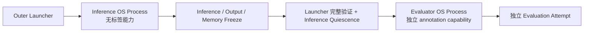

# Multiagents Training-Free Agentic VAD：修订版最小研究 MVP 执行方案

## 0. 文档状态

| 项 | 值 |
|---|---|
| 文档身份 | 非规范 `RESEARCH_MVP` 实施契约 |
| 实施状态 | `IMPLEMENTATION_READY_RESEARCH_MVP` |
| 研究声明 | `NO_RESEARCH_CLAIM`，由注册的 runtime profile 推导 |
| Schema v1 状态 | 不实现、不模拟、不关闭 G0-G4 |
| 规范主线状态 | Document 05 继续为 `DESIGN_BLOCKED`；本文件不解除该状态 |
| 原始方案来源 | attachment SHA-256 `feff250a1cf4f8bc4422cb037ee93f1c4b8ce2621167e784849c3a9867bcafa4` |
| 修订日期 | 2026-07-18 |

本文件只授权一条与 Legacy、Schema v1 都隔离的研究 MVP 代码路径。它不授权开始 `src/tfavad/` 的规范 WP0-WP12 开发，不产生 `ContractAuditV1`，不能关闭 G0-G4，也不能把 MVP 结果表述为精度提升证据。

## 1. 权威来源与优先级

实现开始前必须验证下列文件 SHA-256。任一 hash 不匹配时停止实施并报告 `MVP_DESIGN_INPUT_CHANGED`，不得自行合并新旧语义。

| 优先级 | 文件 | SHA-256 | 本 MVP 使用范围 |
|---:|---|---|---|
| 1 | `docs/engineering_handoff/01_frozen_engineering_contracts.md` | `016e2f195724c5416383d978dcf08e47340a0a61d904bcf9551db987158a1c2f` | 不可放松的理论与工程边界 |
| 2 | `docs/engineering_handoff/02_reference_algorithms.md` | `8c50156640a0680474600d37a2fd378a14274b3fcb5b24b11dd6e172ca7c6b3c` | B2 §5、B5 §7/§9、B6 §10、B4 §11 的数学算法 |
| 3 | `docs/implementation_design/02_runtime_agents_and_state_ownership_design.md` | `ac1bc47d3f879aea80ce9195efd84285fa53961fa9ed452d6c36d0e6f1885df0` | 运行顺序、B2 slot、B4 exactly-once、Evaluator 边界 |
| 4 | `docs/implementation_design/03_memory_persistence_retrieval_and_replay_design.md` | `046625d5d868566c12de0d35952240a9314342141609ec1eaf5b69595b4bd221` | Episode/Session、exact retrieval、payload firewall；其 V1 CAS/replay 不进入 MVP |
| 5 | `docs/implementation_design/04_migration_artifact_and_test_design.md` | `902ad980a43f19b820ef34bc2ae2ed42e12b7503584c0555c584f548aa5be371` | Evaluator resolver/publisher 与路径隔离原则 |
| 6 | `docs/implementation_design/05_work_package_execution_plan.md` | `514653478073f09aa943046d584df3b677a352677248a8acbd8e22eccaa70f4f` | 仅作主线背景；当前仍 `DESIGN_BLOCKED` |

若数学参考与后续修订文档冲突，按上表中更高优先级的冻结契约保留理论，再采用 Document 02/03/04 中明确标记的高优先级实现勘误。不得由工程师临场修改公式。

## 2. MVP 目标、成功含义与非目标

### 2.1 唯一研究目标

用最小、确定性、可审计的代码证明以下因果链能够从空 Memory 端到端运行：

```text
B2 多模态结构化证据
→ B5 同视频已关闭 Session + 跨视频无标签 Long-Term Case
→ B6 有界 Memory 融合
→ B4 Elastic Dual Clock Sticky Temporal Belief
```

“证明成立”仅表示：代码路径闭合、边界可被负测试推翻、相同冻结输入产生相同语义输出。它不表示模型优于 baseline，不表示统计显著，也不表示 Schema v1 已实现。

### 2.2 明确非目标

本 MVP 不实现：

- 59 项公共 Schema v1、typed MessageEnvelope v1、规范事件账本；
- accepted Memory event fsync、CAS、hash chain、并发锁、crash replay/recovery；
- Reservoir eviction 的端到端接入、ANN、Chroma/FAISS、frozen reranker；
- Optional Pass 1 或 B6 触发的 re-observation；
- 323 项 Contract Tests、ContractAudit、G0-G4、B9 Campaign、bootstrap、A-F 表；
- REPL、TUI、Dashboard；
- Legacy Memory 导入、Legacy/V1 双写、MVP Memory 原地升级为 V1。

## 3. 不可简化的边界

1. Inference 配置、命令、对象图、日志和异常中不得出现 label、annotation、ground truth 或 metric target。
2. 时间只能使用有符号 int64 微秒和左闭右开区间 `[start_us,end_us)`；禁止 float seconds 作为事实。
3. 一个成功、已接受的 Tool observation 恰好产生一个 PacketAssessment；缺失或失败不是 observation，不产生投票。
4. B5 Query/Key 只能来自当前窗口 observation-only 信息，禁止 B4 state、B6、final score、label 和 Advisory payload。
5. 当前窗口、开放 Episode、未来窗口和当前视频 Long-Term Candidate 均不可检索。
6. Session 只允许同视频、已关闭 Episode、later-window 可见，并在视频结束时失效。
7. Long-Term write 只能发生在完整、有序的 PredictionFreeze 之后，Candidate 只能从当前视频 local final B2 派生。
8. Memory 不可用或所有 retrieval view 不可用时，B6 严格走 local identity；禁止 Legacy Score、RAG、MemoryPolicy 或 fallback embedding。
9. 每个窗口只有一个 final B6 和一个 B4 commit；B4 后禁止 Gaussian smoothing。
10. Evaluator 只能由 outer launcher 在完整 inference/output/Memory freeze 校验且 inference 进程静默后启动。
11. MVP、Legacy、Schema v1 的代码入口、配置、Memory namespace、artifact root 和测试入口必须隔离。

## 4. 代码与测试落点

只允许新建以下研究路径：

```text
src/research_mvp/
  __init__.py
  cli.py
  launcher.py
  config.py
  codec.py
  ids.py
  contracts.py
  failures.py
  math/
    b2.py
    b4.py
    b6.py
    numeric.py
  evidence/
    adapters.py
    b3_lite.py
    packet_assessment.py
  memory/
    episode.py
    retrieval_key.py
    dense.py
    bm25.py
    temporal.py
    rrf.py
    retrieval.py
    snapshot.py
  runtime/
    window_runner.py
    video_runner.py
    inference_freeze.py
  artifacts/
    resolver.py
    publisher.py
    hashes.py
  evaluator/
    __init__.py
    cli.py
    metrics.py
    resolver.py
    publisher.py

tests/research_mvp/
  fixtures/
  golden/
  test_boundary_and_paths.py
  test_codec_and_ids.py
  test_b2_reference.py
  test_b3_lite.py
  test_b4_reference.py
  test_b5_retrieval.py
  test_b6_reference.py
  test_memory_snapshot_commit.py
  test_window_episode_causality.py
  test_three_video_causal_e2e.py
  test_evaluator_isolation.py
  test_reproducibility.py
```

禁止 `src/research_mvp/` 直接 import：

- `src.agents.*`；
- `src.pipelines.*`；
- `src.memory.case_store`、`session_store`、`policy`；
- Legacy Score/RAG/MemoryPolicy；
- inference 侧的 `src.eval.*`。

现有 Caption/OCR/Audio/Embedding 后端和 ROC/PR primitive 只能通过 `src/research_mvp/adapters/` 或 evaluator 内的窄 Adapter 复用。Adapter 只返回 MVP 私有不可变 DTO，不能返回旧 Store、连接、任意路径或可变内部句柄。

## 5. 私有 DTO、codec 与稳定身份

### 5.1 DTO 规则

MVP DTO 使用 `Mvp*` 名称，不使用 `*V1` 后缀。建议使用 frozen dataclass 或配置为 immutable/`extra=forbid` 的 Pydantic model。所有字段必须 JSON-compatible，不暴露数据库连接、文件对象、任意 Path 或可变 Store。

最小集合：

```text
MvpInferencePlan
MvpEvidenceObservation
MvpPacketAssessment
MvpB2Output
MvpRetrievalQuery
MvpRetrievalManifest
MvpB6Output
MvpB4Commit
MvpWindowArtifact
MvpEpisode
MvpMemorySnapshot
MvpPredictionFreeze
MvpOutputHashManifest
MvpMemoryFreeze
MvpInferenceFreeze
MvpEvaluatorLaunchPlan
MvpEvaluationReceipt
```

### 5.2 `MVP_JSON_V0`

MVP 不声称实现 Schema-v1 Canonical JSON，但必须有单一私有 hash codec：

- 输入解码使用 `object_pairs_hook` 拒绝重复 key；
- 递归拒绝 NaN、Infinity、lone surrogate、非 int64 integer；
- `-0.0` 在 hash payload 中归一为 `0.0`；
- UTF-8、`ensure_ascii=false`、无 BOM、无空白、换行不进入 payload bytes；
- object key 使用 Unicode code point 升序；
- float 由冻结的 CPython runtime serializer 输出，Python/runtime/package-file hashes 写入 provenance；
- hash 为 `sha256(MVP_JSON_V0(payload))`。

Artifact envelope metadata 中的 `attempt_id`、wall-clock、absolute path 不进入语义 payload hash。每类 payload 使用显式固定字段，不提供任意 self-field 排除参数。

### 5.3 稳定 ID

- `attempt_id` 是运行隔离 ID，不进入 Case/Window 语义身份；
- `video_id`、`window_id` 来自冻结 fixture/input manifest；
- Episode/Case ID 由 source video ID、Episode role 和 episode ordinal 确定；member window ordinals与内容由独立 payload hash保护，同一 ID 对应不同 payload hash为 `ATTEMPT_FATAL`；
- 禁止 UUID、wall-clock、文件枚举顺序、dict/set 顺序进入语义 ID；
- 两个 fresh attempt 的比较基于 payload hash，不要求 attempt envelope bytes 相同。

## 6. 进程拓扑与三个串行接受边界

### 6.1 进程拓扑



Inference 进程不能 import、构造或启动 Evaluator。参考端到端命令由 outer launcher 运行；内部仍保留独立 inference/evaluator CLI，Evaluator CLI 必须接收 launcher 在 freeze 验证后生成的 `MvpEvaluatorLaunchPlan`。

### 6.2 每窗口唯一顺序

```text
WindowInput
→ B2:base
→ B3-Lite step-000 / optional step-001
→ B2:final
→ observation-only RetrievalQuery
→ immutable MvpRetrievalManifest accepted
→ top-k payload unlock
→ final B6
→ exactly one B4 commit
→ immutable MvpWindowArtifact accepted
→ Episode feed/update/close
→ eligible Session publish
```

`MvpWindowArtifact` 接受边界是其完整 bytes 在 attempt inference root 中 no-clobber 发布并通过 hash 回读。Episode Builder 只能读取已接受 WindowArtifact 中的 final B2 ref、B4 commit、window ordinal 和 parent hashes，不能读取 B6 Advisory payload、label 或 metric。

Session 的 `visible_from_window_ordinal` 精确为：

```text
max(episode_member_window_ordinals) + 1
```

且 query 必须同时满足 same video、Episode closed、publish cursor 不晚于 query cutoff、visible ordinal 不晚于 query ordinal。Session 在视频结束后失效，绝不进入下一视频 Long-Term scope。

### 6.3 每视频唯一顺序

```text
accept final window
→ close remaining Episode
→ freeze complete ordered WindowArtifact/prediction set
→ MvpPredictionFreeze accepted
→ derive Long-Term candidates from local final B2 only
→ capacity check
→ publish exactly one video-level MVP Memory commit
→ next video
```

PredictionFreeze 前 Memory commit count 必须为 0。Episode membership/role 可以引用已接受 B4 的离散状态边界；Case 的数值摘要、RetrievalKey、support/counter atoms和 Advisory payload只能从有序 local final B2 重算。B4 连续 `z`/direction/magnitude、B6、retrieved payload、label、metric 和 Legacy object不得成为这些数值或 key 的 derivation parent。

### 6.4 运行结束与 Evaluator gate

```text
all videos terminal
→ freeze all PredictionFreeze hashes
→ publish MvpOutputHashManifest
→ publish MvpMemoryFreeze
→ publish MvpInferenceFreeze binding both
→ inference process exits and releases writers
→ outer launcher re-hashes every registered inference/Memory artifact
→ launcher publishes MvpEvaluatorLaunchPlan
→ start Evaluator OS process
```

## 7. 冻结参考运行

```text
runtime_profile = RESEARCH_MVP
research_claim_status = derived(NO_RESEARCH_CLAIM)
video_workers = 1
window_workers = 1
initial_long_term_memory = EMPTY
memory_namespace_id = attempt_id
resume = forbidden
reservoir_seed = 0
model_sampling = frozen
device_policy = PRECOMPUTED_CPU
batch_size = 1
video_order = input manifest ordinal ascending
window_order = window ordinal ascending
K = 512
k_ret = 5
B_ret = min(3*k_ret, readable_case_count)
c_RRF = 60
reranker = disabled
optional_pass_1 = disabled
```

`research_claim_status` 不是公共 V1 manifest 字段；它只能由注册 profile identity 推导并写入 MVP report/evaluation metadata。

`MvpInferencePlan` 还必须冻结：`src/research_mvp/` source-file manifest/hash、fixture/input artifact hashes、参考文档 hashes、Python executable/runtime/platform、installed package-file hashes、Adapter identity、所有数值参数与 action order。worker/device/batch、Adapter 或 raw-output artifact hash 任一变化都必须创建新的 attempt ID，且不得称为同一次 replay。

每个 reference attempt 必须使用新建且为空的 `data/agentic_memory/mvp/<attempt_id>/`。目录已存在、指向 Legacy/V1、经 casefold/path alias 冲突或通过 symlink/junction/reparse point 越界时，必须在启动 inference 前拒绝。失败 attempt 不恢复；重跑使用新的 attempt ID 和新的空 namespace。

## 8. B2、B3-Lite、B6 与 B4

### 8.1 B2

B2 完整实现参考算法 §5 E0-E4。每个 pass 使用闭合 slot：

```text
B2:base
B2:step-000
B2:step-001
B2:final
```

不存在某 step 时不得创建伪 slot；`B2:final` 必须恰好一个。一个来源的一个 observation 只贡献一个 PacketAssessment，Atom 不独立重复投票。

### 8.2 B3-Lite

1. 先接受基础视觉 observation 并构建 `B2:base`。
2. 根据缺失通道、observed 时间覆盖和可靠度缺口构造 eligible action set。
3. 动作总序固定为 `OCR < AUDIO`；从 eligible 且未调用的动作中取最小者，不再使用未冻结的“最低成本”解释。
4. 每窗口最多两个动作，每个动作最多一次。
5. 成功读取并验证 artifact 后产生一个 observation 和新的 step B2。
6. 缺失、解析失败或 hash mismatch 只产生 unavailable + ToolAudit；不产生 PacketAssessment、不产生 UNKNOWN vote、不生成 normal score。
7. 失败后可用原 accepted observations 重算 B2，但不得制造新 observation。
8. 达到闭合条件、无 eligible action 或预算耗尽后生成唯一 `B2:final`。
9. B6 不得触发 re-observation。

### 8.3 B6

B6 完整实现参考算法 §10 F0-F4。Memory disabled、empty manifest、全部 view unavailable、Memory read unavailable时，输出必须与 local B2 的理论字段逐字段 identity；audit metadata 可不同，但不得改变方向、质量、不确定性和证据内容。

Retrieval similarity、BM25 score、RRF score、rank 和 hit count 均不得直接进入 B6 作为 evidence score；B6 只读取已接受 top-k 的 Advisory payload，并保持 signed mass、bounded fusion、conflict abstain。

### 8.4 B4

B4 完整实现参考算法 §11 T0-T5，统一命名为 `Elastic Dual Clock`。物理时钟只来自 final B2 的 original observed coverage；Memory duration、case duration 和 wall-clock 不得推进该时钟。

每窗口 exactly one B4 commit。Hysteresis 只改变离散状态，不改变连续 `z`；commit 后禁止 Gaussian smoothing、第二次状态更新和后写修正。

## 9. Exact B5 检索

### 9.1 Readable scope

每个 query 固定当前 Memory snapshot hash/version、当前视频 ID、window ordinal、Session cutoff 和 Long-Term readable case set。索引或 key projection 不得包含未来 snapshot、当前视频 Long-Term Candidate 或已失效 Session。

MVP 不持久化第二套索引事实。每个 query 从已验证 snapshot 构造 capability-limited key-only in-memory view；BM25 scope统计和全部 view结果均绑定该 snapshot hash，用完即丢弃。不得读取或写入 Legacy/V1 SQLite、Chroma、FAISS、BM25或Temporal index。

### 9.2 Dense

禁止多线程 BLAS `dot/@` 作为参考结果：

```text
acc = binary64(0)
for i = 0..dimension-1:
    acc = binary64(acc + binary64(q[i] * d[i]))
```

query/case embedding 任一为空时该 case 不参加 Dense；query embedding 为空时整个 Dense view unavailable。排序为 score 降序、RetrievalKey hash raw bytes 升序、case_id normalized UTF-8 bytes 升序。

### 9.3 BM25

```text
k1 = 1.2
b = 0.75
idf(term) = ln(1 + (N-df(term)+0.5)/(df(term)+0.5))
BM25(q,d) = ordered_sum over unique normalized query terms:
  idf(term) * f(term,d)*(k1+1)
  / (f(term,d)+k1*(1-b+b*dl/avgdl))
```

tokenizer、Unicode/case normalization、token boundary、stopwords、dedup、N、df、avgdl 和 `LN_BINARY64` identity 全部绑定当前 readable snapshot。case 按 `(RetrievalKey hash,case_id)`、query term 按 normalized UTF-8 bytes 归约；每个乘、除、加和 accumulator step 显式 binary64。`N=0` 或 `avgdl=0` 时 view unavailable。

### 9.4 Temporal

Allen relations 只能由 observed int64-us half-open intervals 推导；缺 timestamp 不猜测。triples canonical sort/dedup。query triple set 为空时 view unavailable。

```text
coverage = |query_triples ∩ case_triples| / |query_triples|
```

### 9.5 RRF 与全序

```text
B_ret = min(3*k_ret, readable_case_count)
VIEW_ORDER = [DENSE, SPARSE_BM25, TEMPORAL]
rrf(case) = ordered binary64 sum by VIEW_ORDER of 1/(60+rank_view(case))
```

rank 从 1 开始。最终顺序固定为 RRF score 降序、RetrievalKey hash raw bytes 升序、case_id UTF-8 bytes 升序。不得使用文件枚举、dict/set、SQLite rowid 或完成时间破平。

### 9.6 Manifest 与 payload firewall

```text
rank key-only candidates
→ build complete MvpRetrievalManifest
→ no-clobber publish and hash-verify manifest
→ only then resolve Advisory payload for final top-k
```

ranker capability 只能看到 key、embedding、observed temporal triples、scope metadata 和 payload hash，不能读取 payload bytes。所有 view unavailable 时仍发布 `ordered_top_k=[]` 的 manifest，B6 走 identity。MVP manifest 的 no-clobber publication 是本地私有接受边界，不得称为 Schema-v1 event acceptance。

## 10. MVP Memory 唯一事实与提交

### 10.1 文件布局

```text
data/agentic_memory/mvp/<attempt_id>/
  memory_snapshot.json             # 唯一权威当前状态
  audit/
    video_commits.jsonl            # post-commit 可重建审计投影
    cases.jsonl                    # optional post-commit projection
  staging/
```

`memory_snapshot.json` 包含完整最多 K 个 Case、version、previous snapshot payload hash、最后 committed video ID、PredictionFreeze hash和 payload hash。`audit/*.jsonl` 不是事实源，缺失或写失败不回滚已提交 snapshot。

### 10.2 Genesis

启动前完成 root containment 与空目录验证，然后生成 version 0 empty snapshot。若 namespace 已存在或不为空，reference run 启动失败。MVP 不支持 resume、restore 或 warm start。

### 10.3 视频级原子提交

单一 `MvpMemoryWriter` 独占以下步骤：

```text
read and verify current complete snapshot
→ verify expected version/hash and accepted PredictionFreeze
→ derive candidates only from local final B2
→ verify resulting case_count <= 512
→ build complete next snapshot in same-filesystem staging
→ encode with MVP_JSON_V0, hash, write, flush and fsync
→ re-read and verify staging bytes/hash/version
→ os.replace(staging, memory_snapshot.json)
→ logical commit complete
→ append/flush audit projections
```

`os.replace` 成功是本 MVP 唯一逻辑提交点：

- replace 前失败：旧 snapshot 有效；禁止下一视频；
- replace 后失败：新 snapshot 有效；audit 可缺失，但不得回滚；
- Memory commit 失败：已冻结预测保留，整个 attempt 标记失败并停止；
- 不允许部分 snapshot、第二 writer、后台 writer 或同 namespace 多进程访问。

这不是 V1 的 event-fsync/CAS 模型，MVP artifact 不得导入、改名或原地转换为 V1 Memory。

### 10.4 容量

K 固定为 512。MVP-WP0 必须静态计算合成 fixture 的最大 Case 数小于等于 512；运行时每次 commit 仍必须检查。超过 K 时在 replace 前产生 `MVP_CAPACITY_EXCEEDED/ATTEMPT_FATAL`，不写 snapshot。Reservoir 纯函数可测试，但不得在本 MVP 端到端路径临时接入。

## 11. Artifact、freeze 与 Evaluator

### 11.1 目录

```text
data/agentic_outputs/mvp/<attempt_id>/
  inference/
    mvp_inference_plan.json
    predictions/<video_id>.jsonl
    window_artifacts/<video_id>/<window_id>.json
    retrieval_manifests/<video_id>/<window_id>.json
    traces/window_trace.jsonl
    traces/tool_trace.jsonl
    freezes/prediction/<video_id>.json
    freezes/mvp_output_hash_manifest.json
    freezes/mvp_memory_freeze.json
    freezes/mvp_inference_freeze.json
  evaluation/<evaluation_attempt_id>/
    mvp_evaluator_launch_plan.json
    metrics.json
    evaluation_receipt.json

data/agentic_outputs/mvp/replay_comparisons/<comparison_id>/
  comparison.json
```

新 attempt/evaluation attempt/comparison 不覆盖旧目录。Inference publisher 不能写 `evaluation/`；Evaluator publisher 不能写 `inference/` 或 Memory。

### 11.2 MVP 私有 immutable publisher

除权威 `memory_snapshot.json` 使用 §10 的 atomic replace 外，所有 immutable inference/evaluation artifact 统一由 root-bound publisher 写入。Publisher command 只含预注册 target ID 和完整 candidate bytes/hash，不接受任意 path。

参考发布算法固定为：

```text
resolve planned relative target under bound authorized root
→ reject existing final path
→ os.open(final, O_WRONLY | O_CREAT | O_EXCL)
→ write all candidate bytes
→ flush and fsync
→ close
→ reopen, hash and byte-length verify
→ mark accepted in process-local acceptance registry
```

只有最后一步成功才算 accepted。`EEXIST`、短写、fsync失败或回读不一致均为 `MVP_IMMUTABLE_PUBLISH_FAILED/ATTEMPT_FATAL`，禁止覆盖或同 attempt 重试。进程在接受前崩溃可能留下 partial orphan；由于 MVP 禁止 resume，该 attempt 直接失败，新运行使用新 attempt ID/空 root。验证器绝不能把缺少 process-local accepted record或不在 OutputHashManifest 中的 orphan 当成事实。

JSONL trace/audit 不是下游因果事实；它们只能记录已经接受的 artifact ref/hash。若计划要求它们进入 OutputHashManifest，则必须在 inference freeze 前完整 flush/fsync；失败使 attempt 不能冻结，但不得改写已接受 artifact。

### 11.3 Inference OutputHashManifest

OutputHashManifest 列出发布它之前已经冻结的全部 inference facts（包括每视频 PredictionFreeze）的相对路径、byte length、SHA-256、artifact type 和 parent payload hashes。为避免 hash 环，它明确排除自身、随后发布的 MemoryFreeze、InferenceFreeze、Evaluator launch plan 和全部 evaluation 输出；这些 freeze 间的依赖只由下一层 artifact 单向绑定。它不接受绝对路径或“自动选择最新 run”。

MemoryFreeze 绑定 exact `memory_snapshot.json` payload hash、file SHA-256、version 和 namespace ID。InferenceFreeze 绑定完整 PredictionFreeze set、OutputHashManifest 和 MemoryFreeze。

### 11.4 Evaluator launch

Outer launcher 只有在以下条件全部成立后才生成 `MvpEvaluatorLaunchPlan` 并创建 Evaluator OS process：

1. inference process 已退出且 writer handles 已释放；
2. 所有计划视频均有完整 PredictionFreeze；
3. OutputHashManifest 全量回读匹配；
4. MemoryFreeze 与当前 snapshot 匹配；
5. inference/Memory before-launch hashes 已记录；
6. annotation manifest 位于 evaluator-only authorized root。

Evaluator resolver 默认拒绝：只读 launch plan 注册的相对路径，拒绝 absolute、drive/UNC alias、`..`、symlink、junction、reparse escape；Windows path/environment key 比较大小写不敏感。

Evaluator publisher 是独立 write-only capability，只能 no-clobber 写当前 `evaluation/<evaluation_attempt_id>/` 中预注册的 `metrics.json` 和 `evaluation_receipt.json`。完成后 outer launcher 重新计算 inference/Memory hashes；任何变化均为 `EVALUATOR_BOUNDARY_VIOLATION/ATTEMPT_FATAL`。

Evaluator 只向 launcher 返回 output relative refs、hash、safe status code 和 process exit code。label、annotation path/content、metric intermediate、Python exception object和含标签日志不得返回 inference。

### 11.5 Metrics

Evaluator 只计算 ROC AUC、PR AUC。输入同时含正负类时结果必须 finite；单类别输入输出明确的 `METRIC_UNDEFINED`，不得伪造 0、0.5、1 或其他有限值。

Memory enabled/disabled smoke comparison 不设提升阈值。pair 两侧必须共享输入 manifest、窗口、Caption/OCR/Audio/Embedding/Scene artifacts和 B1/B2/B3 raw hashes；B5、B6、B4、Prediction 和 Memory 允许不同。

## 12. 合成三视频验收 fixture

### 12.1 固定身份

```text
video IDs:
  mvp-video-a-reference
  mvp-video-b-salient
  mvp-video-c-query

case IDs:
  mvp-case-a-reference-0000
  mvp-case-b-salient-0000
```

WP0 必须提交人工可读、固定 bytes 的输入 artifacts 和 `expected_retrieval.json`，不能在首次测试运行时用被测实现回填 golden。

### 12.2 语义设计

- Video A：连续 NORMAL，形成 Reference Case；synthetic embedding 主方向为 A，tokens 与 temporal triples 与 C 低相关。
- Video B：持续异常，形成 Salient Case；只有 B 的 PredictionFreeze 接受后才能进入 Long-Term；embedding、tokens、observed temporal triples均设计为与 C 高相关。
- Video C：本地证据有意保留不确定性；query key 与 B 高相关，与 A 低相关。

在 Video C 的指定 query window 上，三个可用 view 均必须把 `mvp-case-b-salient-0000` 排在 `mvp-case-a-reference-0000` 前，最终 RRF top-1 必须是 B。golden 同时冻结每个 view order、RRF order、payload hashes和最终 top-k IDs。

### 12.3 必须证明

1. Video B 运行期间无法检索自己的 Long-Term Candidate。
2. 同视频只有已关闭 Episode 且 later-window 才能作为 Session 检索。
3. Video C 能检索 Video B，且 exact view/RRF 顺序符合 golden。
4. rank 阶段 payload poison canary 不被打开；只在 manifest 接受后读取 top-k payload。
5. Memory disabled/empty/all-views-unavailable 时 B6 与 local B2 理论字段 identity。
6. Memory enabled 时 B6 变化有界、来源可追踪，rank score 不直接成为 evidence。
7. B4 对单窗尖峰保持稳定，对持续证据产生状态转移，每窗恰好一次 commit。
8. PredictionFreeze 前 Memory commit count 为 0；Video B 冻结后 Case 才对 C 可见。
9. label/annotation poison 无法进入 inference config、object graph、logs、failure或返回值。
10. 两个不同 attempt ID、各自 fresh empty Memory 的运行产生相同预测 payload hashes、retrieval orders和最终 Memory semantic payload hash。

此 fixture 证明机制闭环，不证明精度提高。

## 13. 失败语义

| 情况 | MVP code / severity | 行为 |
|---|---|---|
| inference config/环境/嵌套对象出现 label/annotation/metric target | `MVP_GROUND_TRUTH_POISON/ATTEMPT_FATAL` | 创建运行 root 和 inference process 前拒绝 |
| path absolute、`..`、alias、symlink/junction/reparse 越界 | `MVP_PATH_ESCAPE/ATTEMPT_FATAL` | open/write 前拒绝 |
| 非 int64-us 或非法半开区间 | `MVP_TIME_INVALID/ATTEMPT_FATAL` | 不接受输入 |
| Caption/OCR/Audio 缺失或解析失败 | `MVP_TOOL_UNAVAILABLE/RECOVERABLE` | 无 observation、无 PacketAssessment；继续 B3-Lite |
| 重复或乱序 window | `MVP_WINDOW_ORDER_VIOLATION/ATTEMPT_FATAL` | 停止整个 attempt；不得继续后续视频 |
| embedding 缺失 | `DENSE_UNAVAILABLE/RECOVERABLE` | 使用剩余有效 view |
| 单 view 运行失败 | `MVP_RETRIEVAL_VIEW_FAILED/RECOVERABLE` | 固定 view order 下使用剩余有效 view |
| 所有 view 不可用 | `MVP_RETRIEVAL_EMPTY/RECOVERABLE` | empty manifest；B6 identity |
| snapshot 读取/hash 失败 | `MVP_MEMORY_UNAVAILABLE/ATTEMPT_FATAL` | 当前尚未提交窗口可走 identity 以封存预测；禁止 Memory commit和下一视频 |
| Case 数将超过 512 | `MVP_CAPACITY_EXCEEDED/ATTEMPT_FATAL` | replace 前拒绝 commit |
| snapshot replace 前失败 | `MVP_MEMORY_COMMIT_FAILED/ATTEMPT_FATAL` | 旧 snapshot 有效；保留已冻结预测；停止 attempt |
| snapshot replace 后 audit projection 失败 | `MVP_MEMORY_AUDIT_INCOMPLETE/ATTEMPT_FATAL` | 新 snapshot 已提交；不得回滚；停止 attempt |
| freeze/hash 不完整 | `MVP_FREEZE_INVALID/ATTEMPT_FATAL` | Evaluator 不启动 |
| Evaluator 修改 inference/Memory | `EVALUATOR_BOUNDARY_VIOLATION/ATTEMPT_FATAL` | evaluation attempt 隔离失败；原 facts 不重写 |
| 单类别 metric | `METRIC_UNDEFINED` | 记录 undefined reason；不伪造有限值 |
| 真实资产缺失 | `ASSET_NOT_RUN` | 不影响合成 MVP；不得显示 PASS |

任何失败均禁止静默回退 Legacy Score、RAG、MemoryPolicy、旧 retrieval、旧 Memory 或 Gaussian。

## 14. 六个顺序工作包

所有工作包按 `MVP-WP0 → MVP-WP1 → MVP-WP2 → MVP-WP3 → MVP-WP4 → MVP-WP5` 顺序 merge。可并行准备纯测试/fixture，但后续包不能绕过前一包的 stop/go 验收接入主 Composition Root。

### MVP-WP0：隔离、codec、身份与合成 fixture

交付：新 package/test roots；私有 DTO/codec/IDs；config poison/path guard；三视频 fixture；golden expected retrieval；静态 forbidden-import test。

Stop/go：

- profile/root/namespace 与 Legacy、V1 不相交；
- inference config 无标签字段且 poison fail closed；
- `MVP_JSON_V0` duplicate/NaN/Infinity/lone-surrogate/int64/-0 测试通过；
- fixture 最大 Case 数可证明小于等于 512；
- expected golden 不是由被测实现运行时生成。

### MVP-WP1：纯 B2/B6/B4 数学

交付：ordered numeric helpers；B2 E0-E4；B6 F0-F4；B4 T0-T5；reference vectors。

Stop/go：

- 全部 reference vectors 通过；
- B2/B6/B4 有界且 finite；
- B6 identity 逐理论字段相等；
- Hysteresis 不改变连续 z；
- exactly-once B4 primitive 拒绝同 window 二次 commit；
- 纯数学模块无文件、网络、数据库、环境变量或 wall-clock 访问。

### MVP-WP2：Evidence Adapter 与 B3-Lite

交付：预计算 Caption/OCR/Audio/Embedding adapters；PacketAssessment；固定 OCR/AUDIO 选择器；Tool trace。

Stop/go：

- 一 accepted observation 恰好一票；
- 缺失/失败不产生票和 normal score；
- B2 slot grammar 闭合；
- 每窗最多两动作、同动作至多一次、固定输入顺序确定；
- forbidden Legacy fallback import/call canary 通过。

### MVP-WP3：Episode、exact retrieval 与单 snapshot Memory

交付：Episode/Session；RetrievalKey；Dense/BM25/Temporal/RRF；payload firewall；MVP Memory snapshot writer。

Stop/go：

- Session close/visible ordinal/current/future/self negatives 通过；
- exact view/RRF golden 与 total order 通过；
- manifest 前 payload resolver canary 失败，manifest 后仅 top-k 可读；
- Memory empty/all-view-unavailable identity 通过；
- replace 前/后 fault injection 与唯一事实语义通过；
- capacity fail-closed 通过。

### MVP-WP4：顺序 Orchestrator 与三层 freeze

交付：window/video runner；WindowArtifact acceptance；PredictionFreeze；OutputHashManifest；MemoryFreeze；InferenceFreeze。

Stop/go：

- 每窗口唯一 final B2/B6/B4/WindowArtifact；
- WindowArtifact accepted 后才更新 Episode；
- PredictionFreeze 前零 Long-Term commit；
- incomplete video 不写 Memory；
- Memory failure 后不运行下一视频；
- 三视频 causal E2E 与两个 fresh-attempt reproducibility 通过。

### MVP-WP5：Outer launcher、独立 Evaluator 与交付

交付：outer launcher；freeze verifier；Evaluator launch plan；read-only resolver；write-only publisher；ROC/PR；enabled/disabled smoke comparison。

Stop/go：

- incomplete freeze 或 inference 未静默时 Evaluator 无法启动；
- static import 和 runtime capability tests 证明双向隔离；
- path/reparse/default-deny tests 通过；
- inference/Memory before/after hashes完全相同；
- label、annotation、metric intermediate、exception object不返回 inference；
- single-class 输出 `METRIC_UNDEFINED`；
- report 只显示 profile-derived `NO_RESEARCH_CLAIM`。

## 15. 验证命令与完成定义

实现完成后至少运行：

```powershell
python -m pytest -q tests/research_mvp --basetemp=.pytest_tmp_research_mvp
python -m src.research_mvp.launcher run-synthetic --attempt-id mvp-synth-a
python -m src.research_mvp.launcher run-synthetic --attempt-id mvp-synth-b
python -m src.research_mvp.cli compare-frozen --left mvp-synth-a --right mvp-synth-b
python -m src.research_mvp.launcher run-paired-smoke --comparison-id mvp-memory-on-off
```

CLI 具体 flag 可以在 MVP-WP0 冻结，但必须保持显式 ID/manifest/root，禁止“选择最新 run”。

只有以下条件全部满足，才可报告 `RESEARCH_MVP_COMPLETE`：

- MVP-WP0-WP5 全部 stop/go 通过；
- 三视频 causal E2E、负边界和 reference tests 通过；
- 从两个 fresh empty Memory attempt 得到相同语义 payload hashes；
- Evaluator 只在三层 freeze 与 inference quiescence 后启动；
- enabled/disabled comparison 完成，但没有精度提升门槛；
- 所有输出标记 `RESEARCH_MVP`，报告 metadata 为 `NO_RESEARCH_CLAIM`；
- 未生成任何 `*V1` artifact、ContractAudit、Gate PASS 或 Legacy fallback side effect；
- `src/` 与 `tests/` 中除 `research_mvp` 新路径外没有未经批准的语义修改。

真实 mini 数据集仅是第二级 asset-conditional smoke。缺少本地模型或数据时必须报告 `ASSET_NOT_RUN`，但不阻断合成 MVP 完成。

## 16. MVP 之后的单向迁移边界

MVP 成功后可以复用：

- 经过 reference tests 的无副作用 B2/B4/B5/B6 纯函数；
- golden vectors 和合成 fixture；
- 经正式 Adapter 重新验证的原始/预计算输入；
- Supplemental 测试思想。

不得复用为 V1 事实：

- MVP DTO/artifact/manifest/hash envelope；
- MVP Memory snapshot、Case ID、commit audit；
- MVP evaluator launch plan、metrics receipt；
- MVP root、namespace 或运行身份。

进入 Schema v1 时必须在独立 `src/tfavad/`、`tests/v1/`、`data/agentic_outputs/v1/` 和 `data/agentic_memory/v1/` 中重新构造规范对象并通过相应 Contract Tests。禁止原地升级、复制改名、双写或把 MVP PASS 映射成 G0-G4 PASS。

## 17. Phase 26 评审问题关闭表

| 评审问题 | 本文件关闭位置 |
|---|---|
| per-window Prediction 直接启动 Evaluator | §6.1、§6.4、§11.4 |
| Window/B4 与 Episode 并行、缺少接受边界 | §6.2 |
| Snapshot/cases/log 三事实源 | §10：snapshot 唯一事实，audit 为 projection |
| empty Memory 未绑定 namespace | §7、§10.2 |
| exact retrieval 不足 | §9 |
| K=512 但 eviction 延后 | §10.4、§13 |
| Tool failure 产生 UNKNOWN vote 歧义 | §8.2、§13 |
| Evaluator resolver/publisher 未分权 | §11.2、§11.4 |
| claim_status 冒充 public field 风险 | §5、§7、§11.5 |
| MVP artifact 原地升级 V1 风险 | §16 |
| synthetic fixture 只断言定性结果 | §12 |
| B4 名称不统一 | §2、§8.4 |
